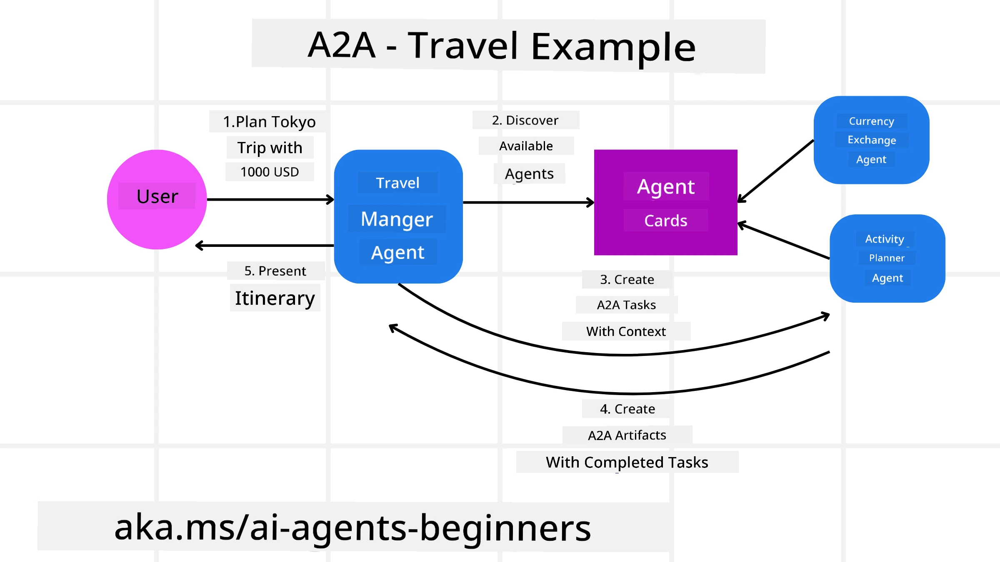
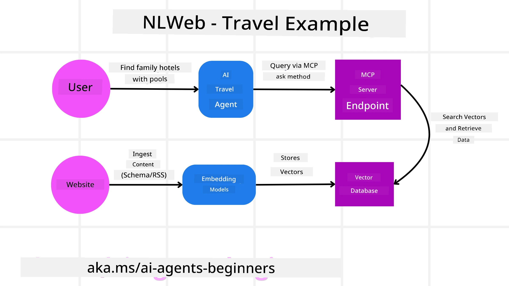

<!--
CO_OP_TRANSLATOR_METADATA:
{
  "original_hash": "aff92c6f019b4627ca9399c6e3882e17",
  "translation_date": "2025-11-11T14:20:24+00:00",
  "source_file": "11-agentic-protocols/README.md",
  "language_code": "pcm"
}
-->
# How to Use Agentic Protocols (MCP, A2A and NLWeb)

> _(Click di image wey dey up to watch di video for dis lesson)_

As AI agents dey grow, di need for protocols wey go make sure say standardization, security, and open innovation dey possible dey increase. For dis lesson, we go talk about 3 protocols wey dey try meet dis need - Model Context Protocol (MCP), Agent to Agent (A2A) and Natural Language Web (NLWeb).

## Introduction

For dis lesson, we go talk about:

• How **MCP** dey allow AI Agents access tools and data wey dey outside to complete wetin user want.

• How **A2A** dey make AI agents fit communicate and work together.

• How **NLWeb** dey bring natural language interface to any website so AI Agents fit find and interact with di content.

## Learning Goals

• **Identify** di main purpose and benefits of MCP, A2A, and NLWeb for AI agents.

• **Explain** how each protocol dey help LLMs, tools, and other agents communicate and interact.

• **Recognize** di different roles wey each protocol dey play to build complex agentic systems.

## Model Context Protocol

Di **Model Context Protocol (MCP)** na open standard wey dey provide one way wey applications fit give context and tools to LLMs. E dey act like "universal adaptor" wey connect AI Agents to different data sources and tools in one consistent way.

Make we look di parts of MCP, di benefits compared to direct API usage, and example of how AI agents fit use MCP server.

### MCP Core Components

MCP dey work with **client-server architecture** and di main parts na:

• **Hosts** na LLM applications (like code editor like VSCode) wey dey start di connection to MCP Server.

• **Clients** na di parts inside di host application wey dey keep one-to-one connection with servers.

• **Servers** na small programs wey dey show di specific things wey dem fit do.

Di protocol get three main things wey MCP Server fit do:

• **Tools**: Na di actions or functions wey AI agent fit call to do something. For example, weather service fit get "get weather" tool, or e-commerce server fit get "purchase product" tool. MCP servers dey show di name, description, and input/output schema of each tool for di capabilities list.

• **Resources**: Na read-only data or documents wey MCP server fit provide, and clients fit collect dem anytime. Examples na file contents, database records, or log files. Resources fit be text (like code or JSON) or binary (like images or PDFs).

• **Prompts**: Na templates wey dey give suggested prompts to help with more complex workflows.

### Benefits of MCP

MCP dey give AI Agents plenty benefits:

• **Dynamic Tool Discovery**: Agents fit collect list of available tools from server with description of wetin dem dey do. Dis one dey different from traditional APIs wey dey need static coding for integration, and any API change go need code update. MCP dey offer "integrate once" approach wey dey make am easy to adapt.

• **Interoperability Across LLMs**: MCP dey work with different LLMs, so e dey easy to switch core models to check performance.

• **Standardized Security**: MCP get standard authentication method wey dey make am easy to add more MCP servers. E dey simpler than managing different keys and authentication types for traditional APIs.

### MCP Example

Imagine say person wan book flight using AI assistant wey dey powered by MCP.

1. **Connection**: Di AI assistant (di MCP client) go connect to MCP server wey airline provide.

2. **Tool Discovery**: Di client go ask di airline MCP server, "Which tools you get?" Di server go reply with tools like "search flights" and "book flights".

3. **Tool Invocation**: You go tell di AI assistant, "Abeg search flight from Portland to Honolulu." Di AI assistant go use di LLM to know say e need call "search flights" tool and pass di correct parameters (origin, destination) to di MCP server.

4. **Execution and Response**: Di MCP server go act like wrapper, call di airline internal booking API, collect di flight info (e.g., JSON data), and send am back to di AI assistant.

5. **Further Interaction**: Di AI assistant go show di flight options. If you choose one flight, di assistant fit call di "book flight" tool for di same MCP server to complete di booking.

## Agent-to-Agent Protocol (A2A)

While MCP dey focus on connecting LLMs to tools, di **Agent-to-Agent (A2A) protocol** dey go further by making AI agents fit communicate and work together. A2A dey connect AI agents across different organizations, environments, and tech stacks to complete one shared task.

Make we look di parts and benefits of A2A, plus example of how e fit work for our travel application.

### A2A Core Components

A2A dey focus on making agents fit communicate and work together to complete user subtask. Each part of di protocol dey help with dis:

#### Agent Card

E dey similar to how MCP server dey share list of tools. Agent Card get:
- Di Name of di Agent.
- **Description of di general tasks** wey e dey do.
- **List of specific skills** with description to help other agents (or human users) know when and why dem go call di agent.
- **Current Endpoint URL** of di agent.
- **Version** and **capabilities** of di agent like streaming responses and push notifications.

#### Agent Executor

Di Agent Executor dey responsible for **passing di user chat context to di remote agent**, di remote agent need dis to understand di task wey e go complete. For A2A server, agent dey use e own Large Language Model (LLM) to understand di request and do di task using e own tools.

#### Artifact

When remote agent don complete di task, e go create artifact. Artifact **get di result of di agent work**, **description of wetin e complete**, and **di text context** wey e send through di protocol. After di artifact don send, di connection with di remote agent go close until e need am again.

#### Event Queue

Dis part dey handle **updates and messages**. E dey important for production to make sure say di connection between agents no go close before task complete, especially if e dey take time.

### Benefits of A2A

• **Better Collaboration**: E dey make agents from different vendors and platforms fit interact, share context, and work together, making automation easy across disconnected systems.

• **Model Selection Flexibility**: Each A2A agent fit choose di LLM wey e go use to handle e requests, so e fit use optimized or fine-tuned models per agent, unlike single LLM connection for MCP.

• **Built-in Authentication**: Authentication dey inside di A2A protocol, so e dey provide strong security for agent interactions.

### A2A Example

Make we expand di travel booking example, but dis time we go use A2A.

1. **User Request to Multi-Agent**: User go talk to "Travel Agent" A2A client/agent, like "Abeg book full trip to Honolulu for next week, including flights, hotel, and rental car".

2. **Orchestration by Travel Agent**: Di Travel Agent go collect dis complex request. E go use e LLM to reason di task and know say e need connect to other specialized agents.

3. **Inter-Agent Communication**: Di Travel Agent go use A2A protocol to connect to agents like "Airline Agent," "Hotel Agent," and "Car Rental Agent" wey different companies create.

4. **Delegated Task Execution**: Di Travel Agent go send di specific tasks to di specialized agents (e.g., "Find flights to Honolulu," "Book hotel," "Rent car"). Each specialized agent go use e own LLM and tools (fit be MCP servers) to do e part of di booking.

5. **Consolidated Response**: When all di agents don complete their tasks, di Travel Agent go join di results (flight details, hotel confirmation, car rental booking) and send one full response back to di user.

## Natural Language Web (NLWeb)

Websites don dey di main way wey people dey access information and data for internet.

Make we look di different parts of NLWeb, di benefits of NLWeb, and example of how NLWeb dey work for our travel application.

### Components of NLWeb

- **NLWeb Application (Core Service Code)**: Na di system wey dey process natural language questions. E dey connect di different parts of di platform to create response. You fit call am di **engine wey dey power di natural language features** of di website.

- **NLWeb Protocol**: Na **basic rules for natural language interaction** with website. E dey send response in JSON format (often using Schema.org). E dey create simple foundation for “AI Web,” like how HTML make am possible to share documents online.

- **MCP Server (Model Context Protocol Endpoint)**: Each NLWeb setup dey work as **MCP server**. E fit **share tools (like “ask” method) and data** with other AI systems. Dis dey make di website content and abilities dey useful for AI agents, so di site fit join di “agent ecosystem.”

- **Embedding Models**: Dis models dey **convert website content to numerical representations wey dem dey call vectors** (embeddings). Di vectors dey capture meaning wey computer fit compare and search. Dem dey store di vectors for special database, and users fit choose di embedding model wey dem wan use.

- **Vector Database (Retrieval Mechanism)**: Dis database dey **store di embeddings of di website content**. When person ask question, NLWeb go check di vector database to find di most relevant information. E dey give fast list of possible answers, ranked by similarity. NLWeb dey work with different vector storage systems like Qdrant, Snowflake, Milvus, Azure AI Search, and Elasticsearch.

### NLWeb by Example

Make we use di travel booking website again, but dis time e dey powered by NLWeb.

1. **Data Ingestion**: Di travel website product catalogs (e.g., flight listings, hotel descriptions, tour packages) go dey formatted using Schema.org or loaded via RSS feeds. NLWeb tools go collect dis structured data, create embeddings, and store dem for local or remote vector database.

2. **Natural Language Query (Human)**: User go visit di website and instead of using menus, e go type for chat interface: "Find family-friendly hotel for Honolulu wey get pool for next week".

3. **NLWeb Processing**: Di NLWeb application go collect di query. E go send di query to LLM to understand am and at di same time search di vector database for hotel listings wey match.

4. **Accurate Results**: Di LLM go help interpret di search results from di database, find di best matches based on "family-friendly," "pool," and "Honolulu" criteria, and format di response in natural language. Di response go dey based on di actual hotels from di website catalog, no be fake info.

5. **AI Agent Interaction**: Since NLWeb dey act as MCP server, external AI travel agent fit connect to di website NLWeb instance. Di AI agent fit use `ask` MCP method to query di website directly: `ask("Which vegan-friendly restaurants dey Honolulu area wey di hotel recommend?")`. Di NLWeb instance go process dis, use e restaurant info database (if e get am), and return structured JSON response.

### Get More Questions about MCP/A2A/NLWeb?

Join di [Azure AI Foundry Discord](https://aka.ms/ai-agents/discord) to meet other learners, attend office hours, and get answers to your AI Agents questions.

## Resources

- [MCP for Beginners](https://aka.ms/mcp-for-beginners)  
- [MCP Documentation](https://github.com/microsoft/semantic-kernel/tree/main/python/semantic-kernel/semantic_kernel/connectors/mcp)
- [NLWeb Repo](https://github.com/nlweb-ai/NLWeb)
- [Semantic Kernel Guides](https://learn.microsoft.com/semantic-kernel/)

---

<!-- CO-OP TRANSLATOR DISCLAIMER START -->
**Disclaimer**:  
Dis dokyument don use AI translation service [Co-op Translator](https://github.com/Azure/co-op-translator) do di translation. Even as we dey try make am accurate, abeg sabi say automated translations fit get mistake or no dey correct well. Di original dokyument wey dey im native language na di main source wey you go trust. For important information, e better make professional human translation dey use. We no go fit take blame for any misunderstanding or wrong interpretation wey fit happen because you use dis translation.
<!-- CO-OP TRANSLATOR DISCLAIMER END -->