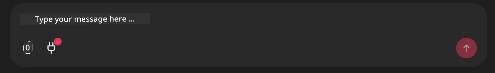

<!--
CO_OP_TRANSLATOR_METADATA:
{
  "original_hash": "9bf0395cbc541ce8db2a9699c8678dfc",
  "translation_date": "2025-11-11T14:21:41+00:00",
  "source_file": "11-agentic-protocols/code_samples/github-mcp/README.md",
  "language_code": "pcm"
}
-->
# Github MCP Server Example

## Description

Dis na demo wey dem create for AI Agents Hackathon wey Microsoft Reactor host.

Di tools dey use am recommend hackathon projects based on di user Github repos. Dem dey do am like dis:

1. **Github Agent** - E dey use Github MCP Server to collect repos and di information wey dey di repos.
2. **Hackathon Agent** - E go use di data wey Github Agent provide take think of creative hackathon project ideas based on di projects, di languages wey di user dey use, and di project tracks for di AI Agents hackathon.
3. **Events Agent** - Based on wetin di hackathon agent suggest, di events agent go recommend events wey dey relevant from di AI Agent Hackathon series.

## How to run di code

### Environment Variables

Dis demo dey use Azure Open AI Service, Semantic Kernel, di Github MCP Server, and Azure AI Search.

Make sure say you don set di correct environment variables to fit use dis tools:

```python
AZURE_OPENAI_CHAT_DEPLOYMENT_NAME=""
AZURE_OPENAI_EMBEDDING_DEPLOYMENT_NAME=""
AZURE_OPENAI_ENDPOINT=""
AZURE_OPENAI_API_KEY=""
AZURE_OPENAI_API_VERSION=""
AZURE_SEARCH_SERVICE_ENDPOINT=""
AZURE_SEARCH_API_KEY=""
``` 


## How to run di Chainlit Server

To connect di MCP server, dis demo dey use Chainlit as chat interface.

To run di server, use dis command for your terminal:

```bash
chainlit run app.py -w
```


Dis go start your Chainlit server for `localhost:8000` and e go also put di `event-descriptions.md` content inside your Azure AI Search Index.

## How to connect to di MCP Server

To connect di Github MCP Server, click di "plug" icon wey dey under di "Type your message here.." chat box:



From dia, you fit click "Connect an MCP" to add di command wey go connect di Github MCP Server:

```bash
npx -y @modelcontextprotocol/server-github --env GITHUB_PERSONAL_ACCESS_TOKEN=[YOUR PERSONAL ACCESS TOKEN]
```


Make sure say you replace "[YOUR PERSONAL ACCESS TOKEN]" with your real Personal Access Token.

After you don connect, you go see (1) next to di plug icon wey go show say e don connect. If e no show, try restart di chainlit server with `chainlit run app.py -w`.

## How to use di Demo

To start di agent workflow wey dey recommend hackathon projects, you fit type message like:

"Recommend hackathon projects for di Github user koreyspace"

Di Router Agent go check your request and decide which combination of agents (GitHub, Hackathon, and Events) go fit handle your query well. Di agents go work together to give you better recommendations based on di analysis of Github repos, project ideas, and tech events wey dey relevant.

---

<!-- CO-OP TRANSLATOR DISCLAIMER START -->
**Disclaimer**:  
Dis dokyument don use AI transleshion service [Co-op Translator](https://github.com/Azure/co-op-translator) do di transleshion. Even as we dey try make am correct, abeg make you sabi say machine transleshion fit get mistake or no dey accurate well. Di original dokyument wey dey for im native language na di one wey you go take as di correct source. For important mata, e good make you use professional human transleshion. We no go fit take blame for any misunderstanding or wrong interpretation wey fit happen because you use dis transleshion.
<!-- CO-OP TRANSLATOR DISCLAIMER END -->