<!--
CO_OP_TRANSLATOR_METADATA:
{
  "original_hash": "5cc6836626047aa055e8960c8484a7d0",
  "translation_date": "2025-11-11T14:22:01+00:00",
  "source_file": "11-agentic-protocols/code_samples/mcp-agents/README.md",
  "language_code": "pcm"
}
-->
# How to Build Agent-to-Agent Communication Systems with MCP

> TL;DR - You fit build Agent2Agent Communication on MCP? Yes!

MCP don grow well-well pass di original plan wey be "to dey give context to LLMs". Wit di new updates like [resumable streams](https://modelcontextprotocol.io/docs/concepts/transports#resumability-and-redelivery), [elicitation](https://modelcontextprotocol.io/specification/2025-06-18/client/elicitation), [sampling](https://modelcontextprotocol.io/specification/2025-06-18/client/sampling), and notifications ([progress](https://modelcontextprotocol.io/specification/2025-06-18/basic/utilities/progress) and [resources](https://modelcontextprotocol.io/specification/2025-06-18/schema#resourceupdatednotification)), MCP don strong well to help build complex agent-to-agent communication systems.

## Di Agent/Tool Misunderstanding

As developers dey try tools wey get agent-like behavior (wey fit run for long time, need extra input for middle of di work, etc.), one common mistake na to think say MCP no fit work because di early examples of di tools na just simple request-response pattern.

Dis idea no correct again. MCP don improve well-well for di past months wit features wey fit help build long-running agent-like behavior:

- **Streaming & Partial Results**: Updates wey dey show progress as di work dey go on
- **Resumability**: Clients fit reconnect and continue after dem disconnect
- **Durability**: Results no go lost even if server restart (e.g., wit resource links)
- **Multi-turn**: Fit ask for extra input during execution wit elicitation and sampling

All dis features fit join together to make complex agent-like and multi-agent applications wey dey use MCP protocol.

For dis article, we go dey call agent "tool" wey dey available for MCP server. Dis mean say one host application dey wey dey use MCP client to connect wit di MCP server and fit call di agent.

## Wetin Make MCP Tool "Agentic"?

Before we go start implementation, make we first understand wetin infrastructure we need to support long-running agents.

> We go define agent as something wey fit work by itself for long time, fit handle complex tasks wey need many interactions or adjustments based on feedback wey dey happen for di moment.

### 1. Streaming & Partial Results

Di normal request-response pattern no dey work for long-running tasks. Agents need to dey provide:

- Updates wey dey show progress as di work dey go on
- Results wey dey come small-small

**MCP Support**: Resource update notifications dey allow streaming partial results, but you go need design am well to avoid wahala wit JSON-RPC's 1:1 request/response model.

| Feature                    | Use Case                                                                                                                                                                       | MCP Support                                                                                |
| -------------------------- | ------------------------------------------------------------------------------------------------------------------------------------------------------------------------------ | ------------------------------------------------------------------------------------------ |
| Real-time Progress Updates | User request make agent migrate codebase. Di agent dey stream progress: "10% - Dey check dependencies... 25% - Dey convert TypeScript files... 50% - Dey update imports..."    | ✅ Progress notifications                                                                  |
| Partial Results            | "Generate book" task dey stream partial results, e.g., 1) Story arc outline, 2) Chapter list, 3) Each chapter as e complete. Host fit check, stop, or change direction anytime. | ✅ Notifications fit "extend" to include partial results see proposals on PR 383, 776      |

<strong>Figure 1:</strong> Dis diagram dey show how MCP agent dey stream real-time progress updates and partial results to di host application during long-running task, so user fit dey monitor di work as e dey happen.


### 2. Resumability

Agents need to handle network wahala well:

- Fit reconnect after client disconnect
- Fit continue from where e stop (message redelivery)

**MCP Support**: MCP StreamableHTTP transport dey support session resumption and message redelivery wit session IDs and last event IDs. Di server need to implement EventStore wey go allow event replays when client reconnect.  
Community proposal (PR #975) dey look into transport-agnostic resumable streams.

| Feature      | Use Case                                                                                                                                                   | MCP Support                                                                |
| ------------ | ---------------------------------------------------------------------------------------------------------------------------------------------------------- | -------------------------------------------------------------------------- |
| Resumability | Client disconnect during long-running task. When e reconnect, session go continue wit di events wey e miss replayed, e go continue from where e stop.       | ✅ StreamableHTTP transport wit session IDs, event replay, and EventStore |

```mermaid
sequenceDiagram
    participant User
    participant Host as Host App<br/>(MCP Client)
    participant Server as MCP Server<br/>(Agent Tool)
    participant Store as Event Store

    User->>Host: Start task
    Host->>Server: Call tool [session: abc123]
    Server->>Store: Save events

    Note over Host,Server: 💥 Connection lost

    Host->>Server: Reconnect [session: abc123]
    Store-->>Server: Replay events
    Server-->>Host: Catch up + continue
    Host-->>User: ✅ Complete
```

<strong>Figure 2:</strong> Dis diagram dey show how MCP's StreamableHTTP transport and event store dey make session resumption easy: if client disconnect, e fit reconnect and replay di events wey e miss, continue di task without losing progress.



### 3. Durability

Long-running agents need persistent state:

- Results no go lost even if server restart
- Status fit dey check outside di normal session
- Progress tracking across sessions

**MCP Support**: MCP dey support Resource link return type for tool calls. One way na to design tool wey go create resource and return resource link immediately. Di tool fit dey work for background and dey update di resource. Di client fit dey check di state of di resource to get partial or full results (based on wetin di server dey provide) or subscribe to di resource for update notifications.

One wahala na say to dey check resources or subscribe for updates fit use resources well-well if e dey scale. Community proposal (including #992) dey look into webhooks or triggers wey server fit use to notify di client/host application of updates.

| Feature    | Use Case                                                                                                                                        | MCP Support                                                        |
| ---------- | ----------------------------------------------------------------------------------------------------------------------------------------------- | ------------------------------------------------------------------ |
| Durability | Server crash during data migration task. Results and progress no go lost, client fit check status and continue from persistent resource.        | ✅ Resource links wit persistent storage and status notifications |

Today, di common way na to design tool wey go create resource and return resource link immediately. Di tool fit dey work for background, dey send resource notifications wey dey show progress updates or partial results, and dey update di resource content as e dey go.

```mermaid
sequenceDiagram
    participant User
    participant Host as Host App<br/>(MCP Client)
    participant Server as MCP Server<br/>(Agent Tool)
    participant DB as Persistent Storage

    User->>Host: Start task
    Host->>Server: Call tool
    Server->>DB: Create resource + updates
    Server-->>Host: 🔗 Resource link

    Note over Server: 💥 Server restart

    User->>Host: Check status
    Host->>Server: Get resource
    Server->>DB: Load state
    Server-->>Host: Current progress
    Server->>DB: Complete + notify
    Host-->>User: ✅ Complete
```

<strong>Figure 3:</strong> Dis diagram dey show how MCP agents dey use persistent resources and status notifications to make sure say long-running tasks no go lost even if server restart, so clients fit check progress and get results after failure.



### 4. Multi-Turn Interactions

Agents dey need extra input during execution:

- Human clarification or approval
- AI help for complex decisions
- Adjust parameters as e dey go

**MCP Support**: Fully supported wit sampling (for AI input) and elicitation (for human input).

| Feature                 | Use Case                                                                                                                                     | MCP Support                                           |
| ----------------------- | -------------------------------------------------------------------------------------------------------------------------------------------- | ----------------------------------------------------- |
| Multi-Turn Interactions | Travel booking agent dey ask user to confirm price, then e dey ask AI to summarize travel data before e complete di booking.                 | ✅ Elicitation for human input, sampling for AI input |

```mermaid
sequenceDiagram
    participant User
    participant Host as Host App<br/>(MCP Client)
    participant Server as MCP Server<br/>(Agent Tool)

    User->>Host: Book flight
    Host->>Server: Call travel_agent

    Server->>Host: Elicitation: "Confirm $500?"
    Note over Host: Elicitation callback (if available)
    Host->>User: 💰 Confirm price?
    User->>Host: "Yes"
    Host->>Server: Confirmed

    Server->>Host: Sampling: "Summarize data"
    Note over Host: AI callback (if available)
    Host->>Server: Report summary

    Server->>Host: ✅ Flight booked
```

<strong>Figure 4:</strong> Dis diagram dey show how MCP agents fit dey ask human input or request AI help during execution, to support complex workflows like confirmation and dynamic decision-making.



## How to Implement Long-Running Agents on MCP - Code Overview

For dis article, we get [code repository](https://github.com/victordibia/ai-tutorials/tree/main/MCP%20Agents) wey show complete implementation of long-running agents wit MCP Python SDK wey dey use StreamableHTTP transport for session resumption and message redelivery. Di implementation dey show how MCP features fit join together to make agent-like behaviors.

We implement server wit two main agent tools:

- **Travel Agent** - E dey simulate travel booking service wit price confirmation via elicitation
- **Research Agent** - E dey do research tasks wit AI-assisted summaries via sampling

Both agents dey show real-time progress updates, interactive confirmations, and full session resumption.

### Key Implementation Concepts

Di sections below dey show server-side agent implementation and client-side host handling for each feature:

#### Streaming & Progress Updates - Real-time Task Status

Streaming dey allow agents to dey give real-time progress updates during long-running tasks, so users fit dey know di status and intermediate results.

**Server Implementation (agent dey send progress notifications):**

```python
# From server/server.py - Travel agent sending progress updates
for i, step in enumerate(steps):
    await ctx.session.send_progress_notification(
        progress_token=ctx.request_id,
        progress=i * 25,
        total=100,
        message=step,
        related_request_id=str(ctx.request_id)
    )
    await anyio.sleep(2)  # Simulate work

# Alternative: Log messages for detailed step-by-step updates
await ctx.session.send_log_message(
    level="info",
    data=f"Processing step {current_step}/{steps} ({progress_percent}%)",
    logger="long_running_agent",
    related_request_id=ctx.request_id,
)
```

**Client Implementation (host dey receive progress updates):**

```python
# From client/client.py - Client handling real-time notifications
async def message_handler(message) -> None:
    if isinstance(message, types.ServerNotification):
        if isinstance(message.root, types.LoggingMessageNotification):
            console.print(f"📡 [dim]{message.root.params.data}[/dim]")
        elif isinstance(message.root, types.ProgressNotification):
            progress = message.root.params
            console.print(f"🔄 [yellow]{progress.message} ({progress.progress}/{progress.total})[/yellow]")

# Register message handler when creating session
async with ClientSession(
    read_stream, write_stream,
    message_handler=message_handler
) as session:
```

#### Elicitation - Requesting User Input

Elicitation dey allow agents to dey ask user input during execution. Dis dey important for confirmation, clarification, or approval during long-running tasks.

**Server Implementation (agent dey ask for confirmation):**

```python
# From server/server.py - Travel agent requesting price confirmation
elicit_result = await ctx.session.elicit(
    message=f"Please confirm the estimated price of $1200 for your trip to {destination}",
    requestedSchema=PriceConfirmationSchema.model_json_schema(),
    related_request_id=ctx.request_id,
)

if elicit_result and elicit_result.action == "accept":
    # Continue with booking
    logger.info(f"User confirmed price: {elicit_result.content}")
elif elicit_result and elicit_result.action == "decline":
    # Cancel the booking
    booking_cancelled = True
```

**Client Implementation (host dey provide elicitation callback):**

```python
# From client/client.py - Client handling elicitation requests
async def elicitation_callback(context, params):
    console.print(f"💬 Server is asking for confirmation:")
    console.print(f"   {params.message}")

    response = console.input("Do you accept? (y/n): ").strip().lower()

    if response in ['y', 'yes']:
        return types.ElicitResult(
            action="accept",
            content={"confirm": True, "notes": "Confirmed by user"}
        )
    else:
        return types.ElicitResult(
            action="decline",
            content={"confirm": False, "notes": "Declined by user"}
        )

# Register the callback when creating the session
async with ClientSession(
    read_stream, write_stream,
    elicitation_callback=elicitation_callback
) as session:
```

#### Sampling - Requesting AI Assistance

Sampling dey allow agents to dey ask LLM help for complex decisions or content generation during execution. Dis dey make human-AI workflows possible.

**Server Implementation (agent dey ask AI for help):**

```python
# From server/server.py - Research agent requesting AI summary
sampling_result = await ctx.session.create_message(
    messages=[
        SamplingMessage(
            role="user",
            content=TextContent(type="text", text=f"Please summarize the key findings for research on: {topic}")
        )
    ],
    max_tokens=100,
    related_request_id=ctx.request_id,
)

if sampling_result and sampling_result.content:
    if sampling_result.content.type == "text":
        sampling_summary = sampling_result.content.text
        logger.info(f"Received sampling summary: {sampling_summary}")
```

**Client Implementation (host dey provide sampling callback):**

```python
# From client/client.py - Client handling sampling requests
async def sampling_callback(context, params):
    message_text = params.messages[0].content.text if params.messages else 'No message'
    console.print(f"🧠 Server requested sampling: {message_text}")

    # In a real application, this could call an LLM API
    # For demo purposes, we provide a mock response
    mock_response = "Based on current research, MCP has evolved significantly..."

    return types.CreateMessageResult(
        role="assistant",
        content=types.TextContent(type="text", text=mock_response),
        model="interactive-client",
        stopReason="endTurn"
    )

# Register the callback when creating the session
async with ClientSession(
    read_stream, write_stream,
    sampling_callback=sampling_callback,
    elicitation_callback=elicitation_callback
) as session:
```

#### Resumability - Session Continuity Across Disconnections

Resumability dey make sure say long-running agent tasks no go stop if client disconnect, and e go continue well when e reconnect. Dis dey use event stores and resumption tokens.

**Event Store Implementation (server dey keep session state):**

```python
# From server/event_store.py - Simple in-memory event store
class SimpleEventStore(EventStore):
    def __init__(self):
        self._events: list[tuple[StreamId, EventId, JSONRPCMessage]] = []
        self._event_id_counter = 0

    async def store_event(self, stream_id: StreamId, message: JSONRPCMessage) -> EventId:
        """Store an event and return its ID."""
        self._event_id_counter += 1
        event_id = str(self._event_id_counter)
        self._events.append((stream_id, event_id, message))
        return event_id

    async def replay_events_after(self, last_event_id: EventId, send_callback: EventCallback) -> StreamId | None:
        """Replay events after the specified ID for resumption."""
        # Find events after the last known event and replay them
        for _, event_id, message in self._events[start_index:]:
            await send_callback(EventMessage(message, event_id))

# From server/server.py - Passing event store to session manager
def create_server_app(event_store: Optional[EventStore] = None) -> Starlette:
    server = ResumableServer()

    # Create session manager with event store for resumption
    session_manager = StreamableHTTPSessionManager(
        app=server,
        event_store=event_store,  # Event store enables session resumption
        json_response=False,
        security_settings=security_settings,
    )

    return Starlette(routes=[Mount("/mcp", app=session_manager.handle_request)])

# Usage: Initialize with event store
event_store = SimpleEventStore()
app = create_server_app(event_store)
```

**Client Metadata wit Resumption Token (client dey reconnect wit stored state):**

```python
# From client/client.py - Client resumption with metadata
if existing_tokens and existing_tokens.get("resumption_token"):
    # Use existing resumption token to continue where we left off
    metadata = ClientMessageMetadata(
        resumption_token=existing_tokens["resumption_token"],
    )
else:
    # Create callback to save resumption token when received
    def enhanced_callback(token: str):
        protocol_version = getattr(session, 'protocol_version', None)
        token_manager.save_tokens(session_id, token, protocol_version, command, args)

    metadata = ClientMessageMetadata(
        on_resumption_token_update=enhanced_callback,
    )

# Send request with resumption metadata
result = await session.send_request(
    types.ClientRequest(
        types.CallToolRequest(
            method="tools/call",
            params=types.CallToolRequestParams(name=command, arguments=args)
        )
    ),
    types.CallToolResult,
    metadata=metadata,
)
```

Di host application dey keep session IDs and resumption tokens locally, so e fit reconnect to di session wey dey already dey without losing progress or state.

### Code Organization

<strong>Figure 5:</strong> MCP-based agent system architecture


**Key Files:**

- **`server/server.py`** - Resumable MCP server wit travel and research agents wey dey show elicitation, sampling, and progress updates
- **`client/client.py`** - Interactive host application wit resumption support, callback handlers, and token management
- **`server/event_store.py`** - Event store implementation wey dey allow session resumption and message redelivery

## How to Extend to Multi-Agent Communication on MCP

Di implementation wey we show fit extend to multi-agent systems by making di host application smarter and bigger:

- **Intelligent Task Decomposition**: Host go break complex user requests into smaller tasks for different agents
- **Multi-Server Coordination**: Host go connect to many MCP servers, each one dey provide different agent capabilities
- **Task State Management**: Host go dey track progress across many agent tasks wey dey happen at di same time, dey handle dependencies and order
- **Resilience & Retries**: Host go dey manage failures, dey retry tasks, and dey redirect tasks if agents no dey available
- **Result Synthesis**: Host go join di outputs from many agents to make one final result wey make sense

Di host go change from simple client to smart orchestrator wey dey manage distributed agent capabilities but still dey use MCP protocol.

## Conclusion

MCP don improve wit features like resource notifications, elicitation/sampling, resumable streams, and persistent resources wey dey make agent-to-agent interactions possible but still dey simple.

## How to Start

Ready to build your own agent2agent system? Follow dis steps:

### 1. Run di Demo

```bash
# Start the server with event store for resumption
python -m server.server --port 8006

# In another terminal, run the interactive client
python -m client.client --url http://127.0.0.1:8006/mcp
```

**Commands wey dey available for interactive mode:**

- `travel_agent` - Book travel wit price confirmation via elicitation
- `research_agent` - Research topics wit AI-assisted summaries via sampling
- `list` - Show all di tools wey dey available
- `clean-tokens` - Clear resumption tokens
- `help` - Show detailed command help
- `quit` - Exit di client

### 2. Test Resumption Capabilities

- Start one long-running agent (e.g., `travel_agent`)
- Stop di client during execution (Ctrl+C)
- Start di client again - e go continue from where e stop

### 3. Explore and Extend

- **Explore di examples**: Check dis [mcp-agents](https://github.com/victordibia/ai-tutorials/tree/main/MCP%20Agents)
- **Join di community**: Join MCP discussions for GitHub
- **Experiment**: Start wit one simple long-running task and dey add streaming, resumability, and multi-agent coordination small-small

Dis dey show how MCP dey make smart agent behaviors possible but still dey simple.
Overall, MCP protocol spec dey change quick-quick; we go advise make you check di official documentation website for di latest updates - https://modelcontextprotocol.io/introduction

---

<!-- CO-OP TRANSLATOR DISCLAIMER START -->
**Disclaimer**:  
Dis dokyument don use AI translation service [Co-op Translator](https://github.com/Azure/co-op-translator) do di translation. Even as we dey try make am correct, abeg make you sabi say machine translation fit get mistake or no dey accurate well. Di original dokyument wey dey for di native language na di main source wey you go trust. For important information, e better make professional human translator check am. We no go fit take blame for any misunderstanding or wrong interpretation wey fit happen because you use dis translation.
<!-- CO-OP TRANSLATOR DISCLAIMER END -->