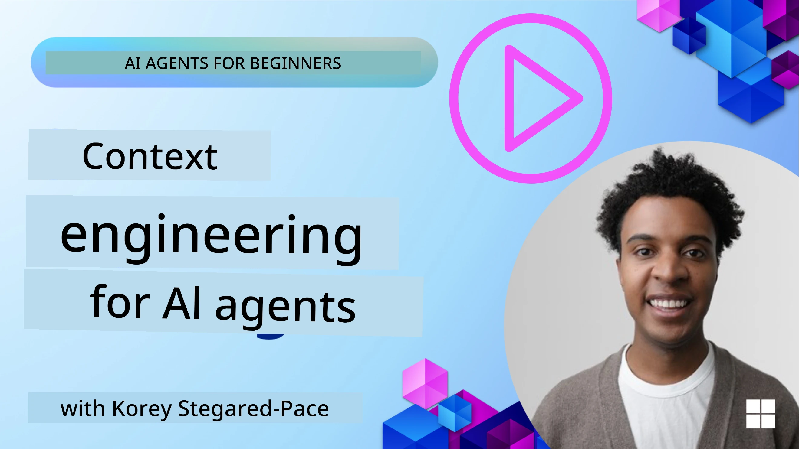
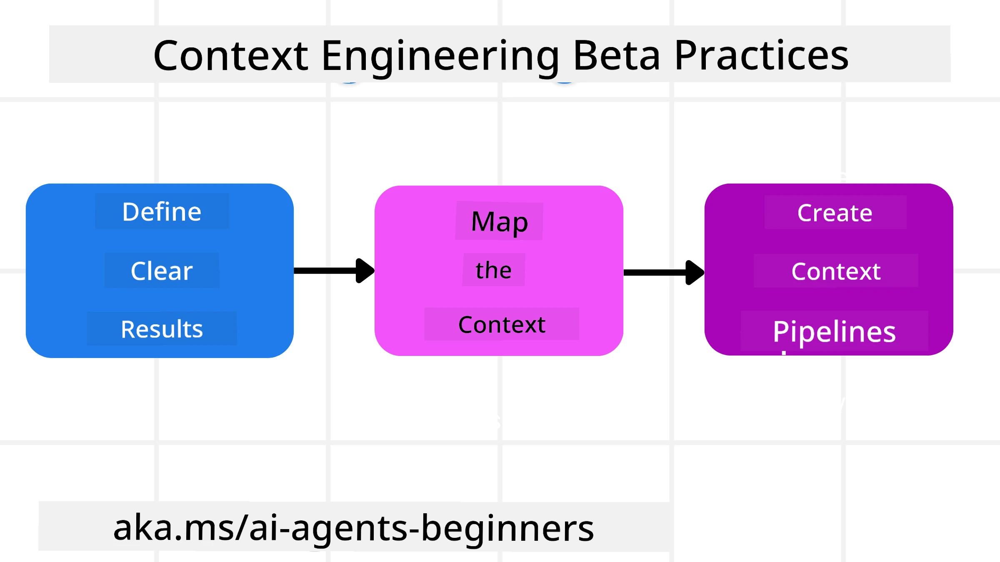

<!--
CO_OP_TRANSLATOR_METADATA:
{
  "original_hash": "cb7e50f471905ce6fdb92a30269a7a98",
  "translation_date": "2025-11-11T14:17:42+00:00",
  "source_file": "12-context-engineering/README.md",
  "language_code": "pcm"
}
-->
# Context Engineering for AI Agents

> _(Click di image wey dey up to watch di video for dis lesson)_

To sabi di complexity of di application wey you wan build AI agent for dey important to make am reliable. We need to build AI Agents wey go sabi manage information well to fit handle complex needs wey pass just prompt engineering.

For dis lesson, we go look wetin context engineering be and how e dey help to build AI agents.

## Introduction

Dis lesson go cover:

• **Wetin Context Engineering be** and why e different from prompt engineering.

• **Strategies for better Context Engineering**, like how to write, select, compress, and isolate information.

• **Common Context Wahala** wey fit spoil your AI agent and how to fix am.

## Learning Goals

After you finish dis lesson, you go sabi how to:

• **Explain wetin context engineering be** and how e different from prompt engineering.

• **Identify di main parts of context** for Large Language Model (LLM) applications.

• **Use strategies to write, select, compress, and isolate context** to make agent performance better.

• **Know di common context wahala** like poisoning, distraction, confusion, and clash, and how to stop dem.

## Wetin be Context Engineering?

For AI Agents, na context dey guide di planning wey go make AI Agent take certain actions. Context Engineering na di work wey dey make sure say di AI Agent get di correct information wey e need to complete di next step for di task. Di context window get limit for size, so as people wey dey build agent, we need to create systems and processes to manage how we go add, remove, and reduce di information wey dey di context window.

### Prompt Engineering vs Context Engineering

Prompt engineering na di work wey dey focus on one set of fixed instructions to guide di AI Agents well with rules. Context engineering na how to manage di dynamic set of information, including di first prompt, to make sure say di AI Agent get wetin e need as time dey go. Di main idea for context engineering na to make dis process dey repeatable and reliable.

### Types of Context

E dey important to remember say context no be just one thing. Di information wey di AI Agent need fit come from different sources and na our work to make sure say di agent fit access dis sources:

Di types of context wey AI agent fit need to manage include:

• **Instructions:** Dis one be like di agent "rules" – prompts, system messages, few-shot examples (to show di AI how to do something), and descriptions of tools wey e fit use. Na here prompt engineering and context engineering dey join hand.

• **Knowledge:** Dis one cover facts, information wey dem retrieve from databases, or long-term memories wey di agent don gather. E include how to use Retrieval Augmented Generation (RAG) system if di agent need access to different knowledge stores and databases.

• **Tools:** Dis na di definitions of external functions, APIs and MCP Servers wey di agent fit call, plus di feedback (results) wey e get from using dem.

• **Conversation History:** Di ongoing talk wey di agent dey do with user. As time dey go, di conversation go dey long and complex, wey go mean say e go dey take space for di context window.

• **User Preferences:** Information wey di agent don learn about wetin di user like or no like over time. Dis one fit dey stored and di agent fit use am when e dey make important decisions to help di user.

## Strategies for Effective Context Engineering

### Planning Strategies

Good context engineering dey start with good planning. Dis na how you fit begin to think about how to use di idea of context engineering:

1. **Define Clear Results** - Di results of di tasks wey AI Agents go do suppose dey clear. Answer di question - "How di world go be when di AI Agent don finish di task?" Wetin go change, di information or di response wey di user suppose get after e interact with di AI Agent.

2. **Map di Context** - After you don define di results of di AI Agent, you need to answer di question "Wetin di AI Agent need to sabi to complete dis task?". Dis go help you map di context of where di information dey.

3. **Create Context Pipelines** - Now wey you don sabi where di information dey, you need to answer di question "How di Agent go get dis information?". You fit do dis in different ways like RAG, use MCP servers and other tools.

### Practical Strategies

Planning dey important but once di information don dey enter di agent context window, we need practical strategies to manage am:

#### Managing Context

Some information go dey enter di context window automatically, but context engineering na di active work to manage dis information wey fit happen through some strategies:

1. **Agent Scratchpad**
Dis one dey allow AI Agent to take notes of di important information about di current tasks and user interactions during one session. E suppose dey outside di context window for file or runtime object wey di agent fit later retrieve during di session if e need am.

2. **Memories**
Scratchpads dey good to manage information outside di context window for one session. Memories dey allow agents to store and retrieve important information across many sessions. Dis fit include summaries, user preferences and feedback to make am better for di future.

3. **Compressing Context**
When di context window don dey full, techniques like summarization and trimming fit dey used. Dis one dey keep only di most important information or remove old messages.

4. **Multi-Agent Systems**
To develop multi-agent system na one type of context engineering because each agent get e own context window. How di context go dey shared and passed to different agents na another thing to plan when you dey build dis systems.

5. **Sandbox Environments**
If agent need to run some code or process plenty information for one document, e fit take plenty tokens to process di results. Instead of storing everything for di context window, di agent fit use sandbox environment wey go run di code and only read di results and other important information.

6. **Runtime State Objects**
Dis one dey happen when you create containers of information to manage situations wey di Agent need access to certain information. For complex task, dis go allow Agent to store di results of each subtask step by step, so di context go dey connected only to dat specific subtask.

### Example of Context Engineering

Make we say we want AI agent to **"Book me a trip to Paris."**

• Simple agent wey dey use only prompt engineering fit just reply: **"Okay, when you wan go Paris?**". E only process di direct question wey di user ask.

• Agent wey dey use di context engineering strategies wey we talk go do plenty things. Before e even reply, e system fit:

  ◦ **Check your calendar** for available dates (to retrieve real-time data).

 ◦ **Remember past travel preferences** (from long-term memory) like di airline wey you like, budget, or if you like direct flights.

 ◦ **Find available tools** for flight and hotel booking.

- Then, di reply fit be: "Hey [Your Name]! I see say you free for di first week of October. Make I check direct flights to Paris for [Preferred Airline] wey dey inside your usual budget of [Budget]?". Dis kind rich, context-aware reply dey show di power of context engineering.

## Common Context Wahala

### Context Poisoning

**Wetin e be:** When hallucination (false information wey di LLM generate) or mistake enter di context and e dey referenced again and again, e fit make di agent dey chase impossible goals or dey create nonsense strategies.

**Wetin to do:** Use **context validation** and **quarantine**. Check di information well before e enter long-term memory. If you see say e fit poison di context, start fresh context threads to stop di bad information from spreading.

**Travel Booking Example:** Your agent dey imagine say **direct flight dey from one small local airport to one far international city** wey no dey even get international flights. Dis fake flight detail go enter di context. Later, when you ask di agent to book, e go dey try find tickets for dis impossible route, wey go cause repeated errors.

**Solution:** Add step wey go **check di flight existence and routes with real-time API** _before_ di flight detail go enter di agent working context. If di check fail, di wrong information go dey "quarantined" and no go dey used again.

### Context Distraction

**Wetin e be:** When di context don big reach, di model go dey focus too much on di history wey don gather instead of using wetin e learn during training, wey fit lead to repetitive or useless actions. Models fit dey make mistake even before di context window full.

**Wetin to do:** Use **context summarization**. From time to time, compress di information wey don gather into short summaries, keep di important details and remove di extra history. Dis go help "reset" di focus.

**Travel Booking Example:** You don dey talk about different dream travel destinations for long, including di story of your backpacking trip two years ago. When you finally ask **"find me cheap flight for next month,"** di agent go dey stuck for di old, no-important details and go dey ask about your backpacking gear or past trips, instead of di current request.

**Solution:** After plenty turns or when di context don big, di agent suppose **summarize di most recent and important parts of di talk** – focus on your current travel dates and destination – and use di summary for di next LLM call, throway di less important old talk.

### Context Confusion

**Wetin e be:** When too much context, like too many tools, dey make di model dey give bad replies or dey call tools wey no dey relevant. Small models dey suffer dis one well.

**Wetin to do:** Use **tool loadout management** with RAG techniques. Store tool descriptions for vector database and select _only_ di tools wey dey relevant for di specific task. Research show say make tool selection no pass 30.

**Travel Booking Example:** Your agent get access to plenty tools: `book_flight`, `book_hotel`, `rent_car`, `find_tours`, `currency_converter`, `weather_forecast`, `restaurant_reservations`, etc. You ask, **"Wetin be di best way to waka for Paris?"** Because di tools plenty, di agent go dey confused and fit try call `book_flight` _inside_ Paris, or `rent_car` even though you like public transport, because di tool descriptions fit dey overlap or e no fit choose di best one.

**Solution:** Use **RAG for tool descriptions**. When you ask about waka for Paris, di system go dynamically bring out _only_ di tools wey dey relevant like `rent_car` or `public_transport_info` based on your question, and show di focused "loadout" of tools to di LLM.

### Context Clash

**Wetin e be:** When conflicting information dey inside di context, e go cause inconsistent reasoning or bad final replies. Dis dey happen when information dey come in stages, and di early, wrong assumptions still dey di context.

**Wetin to do:** Use **context pruning** and **offloading**. Pruning dey remove old or conflicting information as new details dey come. Offloading dey give di model separate "scratchpad" workspace to process information without making di main context scatter.

**Travel Booking Example:** You first tell your agent, **"I wan fly economy class."** Later for di talk, you change your mind and say, **"For dis trip, make we go business class."** If di two instructions still dey di context, di agent fit dey confused about which one to follow.

**Solution:** Use **context pruning**. When new instruction dey contradict old one, di old instruction go dey removed or e go dey clearly overridden for di context. Or di agent fit use **scratchpad** to settle di conflicting preferences before e decide, so di final instruction go dey clear.

## Get More Questions About Context Engineering?

Join di [Azure AI Foundry Discord](https://aka.ms/ai-agents/discord) to meet other learners, attend office hours and get answers to your AI Agents questions.

---

<!-- CO-OP TRANSLATOR DISCLAIMER START -->
**Disclaimer**:  
Dis dokyument don use AI transleshion service [Co-op Translator](https://github.com/Azure/co-op-translator) do di transleshion. Even as we dey try make am accurate, abeg make you sabi say automatik transleshion fit get mistake or no dey correct well. Di original dokyument wey dey for im native language na di one wey you go take as di main source. For important mata, e good make you use professional human transleshion. We no go fit take blame for any misunderstanding or wrong interpretation wey go happen because you use dis transleshion.
<!-- CO-OP TRANSLATOR DISCLAIMER END -->