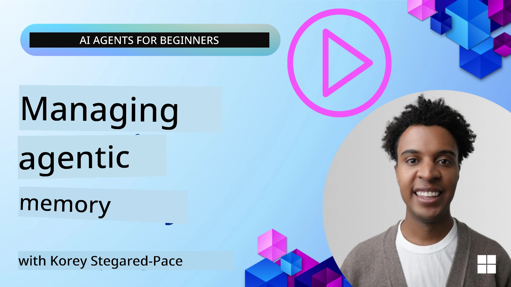

<!--
CO_OP_TRANSLATOR_METADATA:
{
  "original_hash": "a1d90991499ad697c4ad24decaf36968",
  "translation_date": "2025-12-09T13:05:30+00:00",
  "source_file": "13-agent-memory/README.md",
  "language_code": "pcm"
}
-->
# Memory for AI Agents 

Wen we dey talk about di special benefits of creating AI Agents, two main tins dey wey people dey discuss: di ability to use tools finish tasks and di ability to dey improve as time dey go. Memory na di foundation wey dey help create self-improving agent wey fit give beta experience to our users.

For dis lesson, we go look wetin memory mean for AI Agents and how we fit manage am and use am to benefit our applications.

## Introduction

Dis lesson go cover:

• **Understanding AI Agent Memory**: Wetin memory be and why e dey important for agents.

• **Implementing and Storing Memory**: Practical ways to add memory ability to your AI agents, wey go focus on short-term and long-term memory.

• **Making AI Agents Self-Improving**: How memory dey help agents learn from past interactions and dey improve as time dey go.

## Available Implementations

Dis lesson get two full notebook tutorials:

• **[13-agent-memory.ipynb](./13-agent-memory.ipynb)**: E dey use Mem0 and Azure AI Search with Semantic Kernel framework to implement memory.

• **[13-agent-memory-cognee.ipynb](./13-agent-memory-cognee.ipynb)**: E dey use structured memory with Cognee, wey dey automatically build knowledge graph backed by embeddings, dey show graph, and dey retrieve information intelligently.

## Learning Goals

After you finish dis lesson, you go sabi how to:

• **Know di different types of AI agent memory**, like working, short-term, and long-term memory, plus special types like persona and episodic memory.

• **Implement and manage short-term and long-term memory for AI agents** using di Semantic Kernel framework, wey dey use tools like Mem0, Cognee, Whiteboard memory, and dey work with Azure AI Search.

• **Understand di principles wey dey behind self-improving AI agents** and how strong memory management systems dey help agents learn and adapt better.

## Understanding AI Agent Memory

For di main level, **memory for AI agents na di way dem dey keep and remember information**. Dis information fit be details about conversation, user preferences, past actions, or even patterns wey dem don learn.

Without memory, AI applications go dey like dem no get sense, meaning say every interaction go dey start afresh. Dis one go make user experience dey boring and frustrating because di agent go dey "forget" di previous context or preferences.

### Why Memory Important?

Di intelligence of an agent dey depend well well on how e fit remember and use past information. Memory dey make agents:

• **Reflective**: E dey learn from past actions and results.

• **Interactive**: E dey keep context for ongoing conversation.

• **Proactive and Reactive**: E dey anticipate needs or respond well based on past data.

• **Autonomous**: E dey operate more independently because e dey use stored knowledge.

Di main aim of memory na to make agents dey more **reliable and capable**.

### Types of Memory

#### Working Memory

Dis one be like scratch paper wey agent dey use for one task or thought process. E dey hold di immediate information wey dem need to do di next step.

For AI agents, working memory dey capture di most important information from conversation, even if di full chat history long or dem cut am short. E dey focus on key tins like requirements, proposals, decisions, and actions.

**Working Memory Example**

For travel booking agent, working memory fit capture di user's current request, like "I wan book trip go Paris". Dis specific request go dey di agent's immediate context to guide di current interaction.

#### Short Term Memory

Dis type of memory dey keep information for di time wey one conversation or session dey happen. E dey keep di context of di current chat, so di agent fit refer back to di previous turns for di dialogue.

**Short Term Memory Example**

If user ask, "How much flight go Paris go cost?" and later talk "Wetin of accommodation for dia?", short-term memory go make di agent sabi say "dia" mean "Paris" for di same conversation.

#### Long Term Memory

Dis one na information wey dey last across many conversations or sessions. E dey help agents remember user preferences, past interactions, or general knowledge for long time. E dey important for personalization.

**Long Term Memory Example**

Long-term memory fit store say "Ben like skiing and outdoor activities, e like coffee with mountain view, and e no wan advanced ski slopes because of past injury". Dis information wey e learn from before go help di agent give personalized recommendations for future travel planning.

#### Persona Memory

Dis special type of memory dey help agent get consistent "personality" or "persona". E dey make di agent remember tins about itself or di role wey e suppose play, so di interaction go dey smooth and focused.

**Persona Memory Example**
If di travel agent na "expert ski planner," persona memory go make di agent dey act like expert, dey give answers wey match expert tone and knowledge.

#### Workflow/Episodic Memory

Dis memory dey keep di steps wey agent take for one complex task, including di ones wey work and di ones wey fail. E dey like remembering specific "episodes" or past experiences to learn from dem.

**Episodic Memory Example**

If di agent try book one flight but e no work because e no dey available, episodic memory fit record dis failure, so di agent fit try another flight or tell di user about di issue for better way next time.

#### Entity Memory

Dis one dey involve extracting and remembering specific entities (like people, places, or tins) and events from conversations. E dey help di agent build structured understanding of di key tins wey dem discuss.

**Entity Memory Example**

From conversation about past trip, di agent fit extract "Paris," "Eiffel Tower," and "dinner at Le Chat Noir restaurant" as entities. For future interaction, di agent fit remember "Le Chat Noir" and offer to book new reservation dia.

#### Structured RAG (Retrieval Augmented Generation)

Even though RAG na general technique, "Structured RAG" dey stand out as strong memory technology. E dey extract structured information from different sources (conversations, emails, images) and use am to improve precision, recall, and speed for responses. Unlike di normal RAG wey dey depend only on semantic similarity, Structured RAG dey work with di structure of di information.

**Structured RAG Example**

Instead of just matching keywords, Structured RAG fit read flight details (destination, date, time, airline) from email and store dem for structured way. Dis go allow precise queries like "Wetin be di flight wey I book go Paris on Tuesday?"

## Implementing and Storing Memory

To implement memory for AI agents, you go need systematic process of **memory management**, wey include generating, storing, retrieving, integrating, updating, and even "forgetting" (or deleting) information. Retrieval na very important part.

### Specialized Memory Tools

#### Mem0

One way to store and manage agent memory na to use tools like Mem0. Mem0 dey work as persistent memory layer, wey dey help agents remember relevant interactions, store user preferences and factual context, and learn from successes and failures over time. Di idea na to turn agents wey no get state into agents wey get state.

E dey work through **two-phase memory pipeline: extraction and update**. First, messages wey dem add to agent's thread go enter Mem0 service, wey dey use Large Language Model (LLM) to summarize conversation history and extract new memories. After dat, LLM go decide whether to add, change, or delete di memories, and store dem for hybrid data store wey fit include vector, graph, and key-value databases. Dis system dey support different memory types and fit use graph memory to manage relationships between entities.

#### Cognee

Another strong approach na **Cognee**, open-source semantic memory for AI agents wey dey turn structured and unstructured data into queryable knowledge graphs backed by embeddings. Cognee dey use **dual-store architecture** wey combine vector similarity search with graph relationships, so agents fit understand not just wetin dey similar, but how concepts dey relate.

E dey good for **hybrid retrieval** wey mix vector similarity, graph structure, and LLM reasoning - from raw chunk lookup to graph-aware question answering. Di system dey keep **living memory** wey dey grow and dey queryable as one connected graph, wey dey support both short-term session context and long-term persistent memory.

Di Cognee notebook tutorial ([13-agent-memory-cognee.ipynb](./13-agent-memory-cognee.ipynb)) dey show how to build dis unified memory layer, with practical examples of how to add different data sources, show di knowledge graph, and query with different search strategies wey fit di agent needs.

### Storing Memory with RAG

Apart from tools like Mem0, you fit use strong search services like **Azure AI Search as backend to store and retrieve memories**, especially for structured RAG.

Dis go help ground di agent's responses with your own data, so answers go dey more relevant and correct. Azure AI Search fit store user-specific travel memories, product catalogs, or any other domain-specific knowledge.

Azure AI Search dey support features like **Structured RAG**, wey dey good for extracting and retrieving structured information from big datasets like conversation histories, emails, or even images. Dis dey give "superhuman precision and recall" compared to di normal text chunking and embedding methods.

## Making AI Agents Self-Improve

One common way to make agents dey improve na to add **"knowledge agent"**. Dis separate agent dey observe di main conversation between di user and di primary agent. E dey do di following:

1. **Find valuable information**: E dey check if any part of di conversation worth to save as general knowledge or specific user preference.

2. **Extract and summarize**: E dey pick di important learning or preference from di conversation.

3. **Store in knowledge base**: E dey keep dis extracted information, usually for vector database, so e fit dey retrieve later.

4. **Add to future queries**: Wen user start new query, di knowledge agent go bring out di relevant stored information and add am to di user's prompt, so e go give di primary agent important context (like RAG).

### Optimizations for Memory

• **Latency Management**: To make sure user interaction no slow, cheaper, faster model fit dey used first to quickly check if information worth to store or retrieve, before di more complex process go happen.

• **Knowledge Base Maintenance**: For knowledge base wey dey grow, information wey people no dey use often fit dey move to "cold storage" to reduce cost.

## Got More Questions About Agent Memory?

Join di [Azure AI Foundry Discord](https://aka.ms/ai-agents/discord) to meet other learners, attend office hours, and get answers to your AI Agents questions.

---

<!-- CO-OP TRANSLATOR DISCLAIMER START -->
**Disclaimer**:  
Dis dokyument don use AI translation service [Co-op Translator](https://github.com/Azure/co-op-translator) do di translation. Even as we dey try make am correct, abeg sabi say machine translation fit get mistake or no dey accurate well. Di original dokyument for im native language na di main source wey you go fit trust. For important information, e good make professional human translation dey use. We no go fit take blame for any misunderstanding or wrong interpretation wey fit happen because you use dis translation.
<!-- CO-OP TRANSLATOR DISCLAIMER END -->