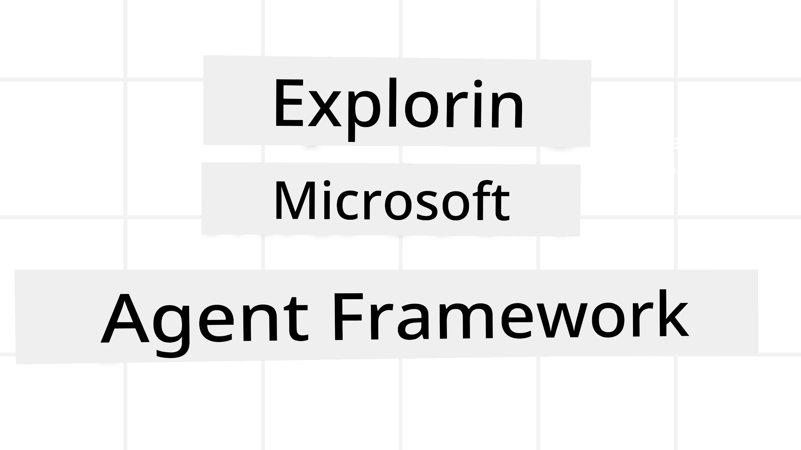
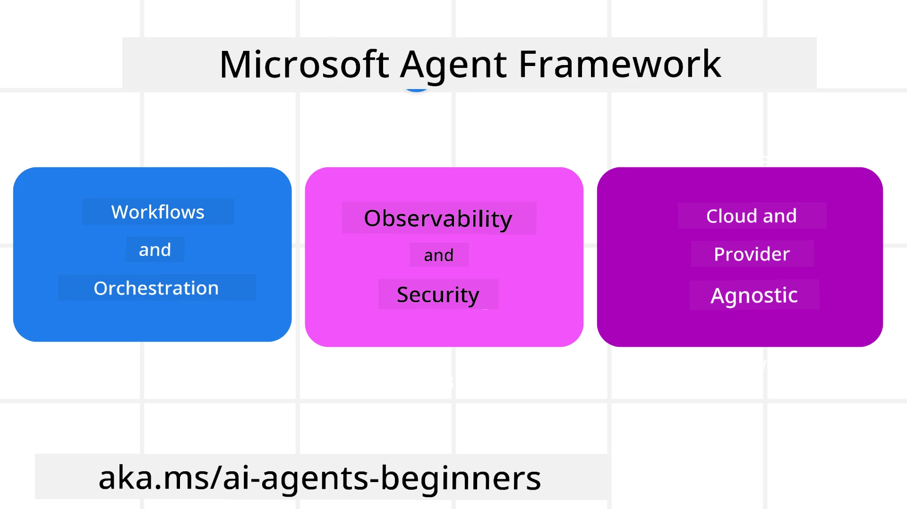

<!--
CO_OP_TRANSLATOR_METADATA:
{
  "original_hash": "19c4dab375acbc733855cc7f2f04edbc",
  "translation_date": "2025-11-11T14:10:57+00:00",
  "source_file": "14-microsoft-agent-framework/README.md",
  "language_code": "pcm"
}
-->
# Exploring Microsoft Agent Framework



### Introduction

Dis lesson go cover:

- Wetin Microsoft Agent Framework be: Di Key Features and Value  
- Di Key Concepts wey dey Microsoft Agent Framework
- How MAF take compare wit Semantic Kernel and AutoGen: Migration Guide

## Learning Goals

After you finish dis lesson, you go sabi how to:

- Build AI Agents wey fit work for production wit Microsoft Agent Framework
- Use di main features of Microsoft Agent Framework for your Agentic Use Cases
- Migrate and join di Agentic frameworks and tools wey you don already get  

## Code Samples 

Code samples for [Microsoft Agent Framework (MAF)](https://aka.ms/ai-agents-beginners/agent-framewrok) dey dis repository under `xx-python-agent-framework` and `xx-dotnet-agent-framework` files.

## Understanding Microsoft Agent Framework



[Microsoft Agent Framework (MAF)](https://aka.ms/ai-agents-beginners/agent-framewrok) dey build ontop di experience and wetin dem learn from Semantic Kernel and AutoGen. E dey flexible to handle plenty agentic use cases wey dey happen for production and research environments like:

- **Sequential Agent orchestration** for cases wey need step-by-step workflows.
- **Concurrent orchestration** for cases wey agents need finish tasks at di same time.
- **Group chat orchestration** for cases wey agents fit work together for one task.
- **Handoff Orchestration** for cases wey agents go pass di task give another agent as dem dey finish di subtasks.
- **Magnetic Orchestration** for cases wey manager agent go create and change task list and dey coordinate di subagents to finish di task.

To deliver AI Agents for Production, MAF get features like:

- **Observability** wey dey use OpenTelemetry to track every action wey di AI Agent dey do like tool invocation, orchestration steps, reasoning flows and performance monitoring through Azure AI Foundry dashboards.
- **Security** wey dey host agents directly for Azure AI Foundry wey get security controls like role-based access, private data handling and built-in content safety.
- **Durability** wey make Agent threads and workflows fit pause, resume and recover from errors so dem fit handle long processes.
- **Control** wey support human-in-the-loop workflows where tasks go need human approval.

Microsoft Agent Framework dey also focus on interoperability by:

- **Being Cloud-agnostic** - Agents fit run for containers, on-prem and for different clouds.
- **Being Provider-agnostic** - You fit create agents wit your preferred SDK like Azure OpenAI and OpenAI.
- **Integrating Open Standards** - Agents fit use protocols like Agent-to-Agent(A2A) and Model Context Protocol (MCP) to find and use other agents and tools.
- **Plugins and Connectors** - Connections fit dey made to data and memory services like Microsoft Fabric, SharePoint, Pinecone and Qdrant.

Make we see how dis features dey work for di main concepts of Microsoft Agent Framework.

## Key Concepts of Microsoft Agent Framework

### Agents


**Creating Agents**

To create agent, you go define di inference service (LLM Provider), instructions wey di AI Agent go follow, and give am `name`:

```python
agent = AzureOpenAIChatClient(credential=AzureCliCredential()).create_agent( instructions="You are good at recommending trips to customers based on their preferences.", name="TripRecommender" )
```

Di example dey use `Azure OpenAI` but you fit create agents wit other services like `Azure AI Foundry Agent Service`:

```python
AzureAIAgentClient(async_credential=credential).create_agent( name="HelperAgent", instructions="You are a helpful assistant." ) as agent
```

OpenAI `Responses`, `ChatCompletion` APIs

```python
agent = OpenAIResponsesClient().create_agent( name="WeatherBot", instructions="You are a helpful weather assistant.", )
```

```python
agent = OpenAIChatClient().create_agent( name="HelpfulAssistant", instructions="You are a helpful assistant.", )
```

or remote agents wey dey use A2A protocol:

```python
agent = A2AAgent( name=agent_card.name, description=agent_card.description, agent_card=agent_card, url="https://your-a2a-agent-host" )
```

**Running Agents**

You fit run agents wit `.run` or `.run_stream` methods for non-streaming or streaming responses.

```python
result = await agent.run("What are good places to visit in Amsterdam?")
print(result.text)
```

```python
async for update in agent.run_stream("What are the good places to visit in Amsterdam?"):
    if update.text:
        print(update.text, end="", flush=True)

```

Each agent run fit get options to change parameters like `max_tokens` wey di agent go use, `tools` wey di agent fit call, and di `model` wey di agent go use.

Dis dey useful for cases wey specific models or tools dey needed to finish user task.

**Tools**

You fit define tools when you dey define di agent:

```python
def get_attractions( location: Annotated[str, Field(description="The location to get the top tourist attractions for")], ) -> str: """Get the top tourist attractions for a given location.""" return f"The top attractions for {location} are." 


# When creating a ChatAgent directly 

agent = ChatAgent( chat_client=OpenAIChatClient(), instructions="You are a helpful assistant", tools=[get_attractions]

```

and also when you dey run di agent:

```python

result1 = await agent.run( "What's the best place to visit in Seattle?", tools=[get_attractions] # Tool provided for this run only )
```

**Agent Threads**

Agent Threads dey handle multi-turn conversations. You fit create threads by:

- Using `get_new_thread()` wey go make di thread dey saved over time
- Creating thread automatically when you dey run agent and di thread go only last for di current run.

To create thread, di code go look like dis:

```python
# Create a new thread. 
thread = agent.get_new_thread() # Run the agent with the thread. 
response = await agent.run("Hello, I am here to help you book travel. Where would you like to go?", thread=thread)

```

You fit serialize di thread to store am for later use:

```python
# Create a new thread. 
thread = agent.get_new_thread() 

# Run the agent with the thread. 

response = await agent.run("Hello, how are you?", thread=thread) 

# Serialize the thread for storage. 

serialized_thread = await thread.serialize() 

# Deserialize the thread state after loading from storage. 

resumed_thread = await agent.deserialize_thread(serialized_thread)
```

**Agent Middleware**

Agents dey interact wit tools and LLMs to finish user tasks. For some cases, we go wan execute or track wetin dey happen in-between di interactions. Agent middleware dey help us do dis:

*Function Middleware*

Dis middleware dey allow us execute action between di agent and di function/tool wey e go call. Example na when you wan log di function call.

For di code below `next` dey define if di next middleware or di actual function go dey called.

```python
async def logging_function_middleware(
    context: FunctionInvocationContext,
    next: Callable[[FunctionInvocationContext], Awaitable[None]],
) -> None:
    """Function middleware that logs function execution."""
    # Pre-processing: Log before function execution
    print(f"[Function] Calling {context.function.name}")

    # Continue to next middleware or function execution
    await next(context)

    # Post-processing: Log after function execution
    print(f"[Function] {context.function.name} completed")
```

*Chat Middleware*

Dis middleware dey allow us execute or log action between di agent and di requests wey dey go between di LLM.

E get important info like di `messages` wey dem dey send to di AI service.

```python
async def logging_chat_middleware(
    context: ChatContext,
    next: Callable[[ChatContext], Awaitable[None]],
) -> None:
    """Chat middleware that logs AI interactions."""
    # Pre-processing: Log before AI call
    print(f"[Chat] Sending {len(context.messages)} messages to AI")

    # Continue to next middleware or AI service
    await next(context)

    # Post-processing: Log after AI response
    print("[Chat] AI response received")

```

**Agent Memory**

As we don talk for di `Agentic Memory` lesson, memory na important part wey dey help di agent operate for different contexts. MAF get different types of memories:

*In-Memory Storage*

Dis na di memory wey dey stored for threads during di application runtime.

```python
# Create a new thread. 
thread = agent.get_new_thread() # Run the agent with the thread. 
response = await agent.run("Hello, I am here to help you book travel. Where would you like to go?", thread=thread)
```

*Persistent Messages*

Dis memory dey store conversation history across different sessions. E dey defined wit `chat_message_store_factory` :

```python
from agent_framework import ChatMessageStore

# Create a custom message store
def create_message_store():
    return ChatMessageStore()

agent = ChatAgent(
    chat_client=OpenAIChatClient(),
    instructions="You are a Travel assistant.",
    chat_message_store_factory=create_message_store
)

```

*Dynamic Memory*

Dis memory dey added to di context before agents dey run. Dis memories fit dey stored for external services like mem0:

```python
from agent_framework.mem0 import Mem0Provider

# Using Mem0 for advanced memory capabilities
memory_provider = Mem0Provider(
    api_key="your-mem0-api-key",
    user_id="user_123",
    application_id="my_app"
)

agent = ChatAgent(
    chat_client=OpenAIChatClient(),
    instructions="You are a helpful assistant with memory.",
    context_providers=memory_provider
)

```

**Agent Observability**

Observability dey important to build reliable and maintainable agentic systems. MAF dey use OpenTelemetry to provide tracing and meters for better observability.

```python
from agent_framework.observability import get_tracer, get_meter

tracer = get_tracer()
meter = get_meter()
with tracer.start_as_current_span("my_custom_span"):
    # do something
    pass
counter = meter.create_counter("my_custom_counter")
counter.add(1, {"key": "value"})
```

### Workflows

MAF get workflows wey be pre-defined steps to finish task and include AI agents as part of di steps.

Workflows dey made up of different components wey dey allow better control flow. Workflows dey also enable **multi-agent orchestration** and **checkpointing** to save workflow states.

Di main components of workflow na:

**Executors**

Executors dey receive input messages, do di task wey dem assign am, and produce output message. Dis dey move di workflow forward to finish di bigger task. Executors fit be AI agent or custom logic.

**Edges**

Edges dey define how messages go flow for workflow. Dem fit be:

*Direct Edges* - Simple one-to-one connections between executors:

```python
from agent_framework import WorkflowBuilder

builder = WorkflowBuilder()
builder.add_edge(source_executor, target_executor)
builder.set_start_executor(source_executor)
workflow = builder.build()
```

*Conditional Edges* - E go activate after certain condition don happen. Example na when hotel rooms no dey, executor fit suggest other options.

*Switch-case Edges* - E dey route messages to different executors based on di conditions wey dem define. Example na if travel customer get priority access, dem go handle di task through another workflow.

*Fan-out Edges* - E dey send one message to plenty targets.

*Fan-in Edges* - E dey collect plenty messages from different executors and send am to one target.

**Events**

To provide better observability for workflows, MAF get built-in events for execution like:

- `WorkflowStartedEvent`  - Workflow execution don start
- `WorkflowOutputEvent` - Workflow don produce output
- `WorkflowErrorEvent` - Workflow don meet error
- `ExecutorInvokeEvent`  - Executor don start process
- `ExecutorCompleteEvent`  -  Executor don finish process
- `RequestInfoEvent` - Request don dey issued

## Migrating From Other Frameworks (Semantic Kernel and AutoGen)

### Differences between MAF and Semantic Kernel

**Simplified Agent Creation**

Semantic Kernel dey require Kernel instance for every agent. MAF dey use simplified approach by using extensions for di main providers.

```python
agent = AzureOpenAIChatClient(credential=AzureCliCredential()).create_agent( instructions="You are good at reccomending trips to customers based on their preferences.", name="TripRecommender" )
```

**Agent Thread Creation**

Semantic Kernel dey require threads to dey created manually. For MAF, di agent dey directly assigned thread.

```python
thread = agent.get_new_thread() # Run the agent with the thread. 
```

**Tool Registration**

For Semantic Kernel, tools dey registered to di Kernel and di Kernel go dey passed to di agent. For MAF, tools dey registered directly during di agent creation process.

```python
agent = ChatAgent( chat_client=OpenAIChatClient(), instructions="You are a helpful assistant", tools=[get_attractions]
```

### Differences between MAF and AutoGen

**Teams vs Workflows**

`Teams` na di event structure for event-driven activity wit agents for AutoGen. MAF dey use `Workflows` wey dey route data to executors through graph-based architecture.

**Tool Creation**

AutoGen dey use `FunctionTool` to wrap functions wey agents go call. MAF dey use @ai_function wey dey work similar but e dey also infer di schemas automatically for each function.

**Agent Behaviour**

Agents na single-turn agents by default for AutoGen unless `max_tool_iterations` dey set to higher number. For MAF, di `ChatAgent` na multi-turn by default meaning say e go dey call tools until di user task don complete.

## Code Samples 

Code samples for Microsoft Agent Framework dey dis repository under `xx-python-agent-framework` and `xx-dotnet-agent-framework` files.

## Got More Questions About Microsoft Agent Framework?

Join di [Azure AI Foundry Discord](https://aka.ms/ai-agents/discord) to meet wit other learners, attend office hours and get your AI Agents questions answered.

---

<!-- CO-OP TRANSLATOR DISCLAIMER START -->
**Disclaimer**:  
Dis dokyument don use AI translation service [Co-op Translator](https://github.com/Azure/co-op-translator) do di translation. Even as we dey try make am correct, abeg make you sabi say machine translation fit get mistake or no dey accurate well. Di original dokyument wey dey for im native language na di main source wey you go trust. For important information, e good make professional human translation dey use. We no go fit take blame for any misunderstanding or wrong interpretation wey fit happen because you use dis translation.
<!-- CO-OP TRANSLATOR DISCLAIMER END -->