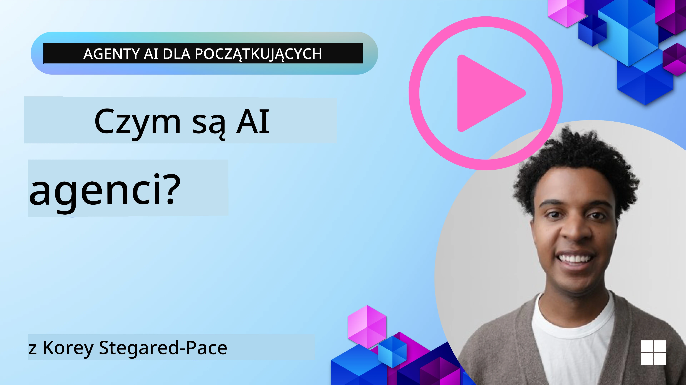
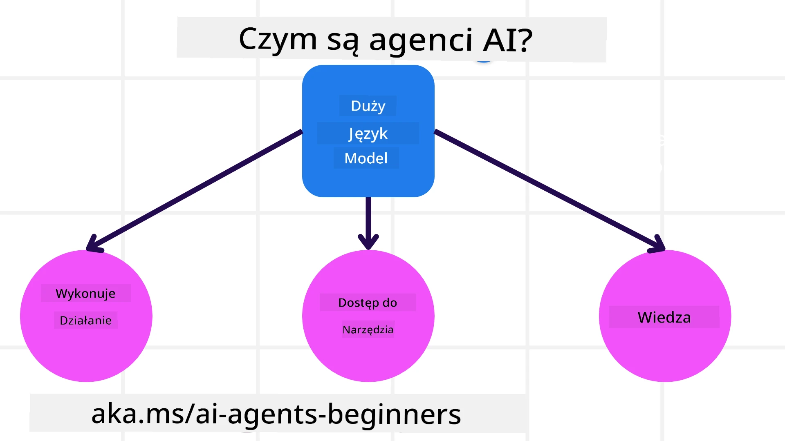
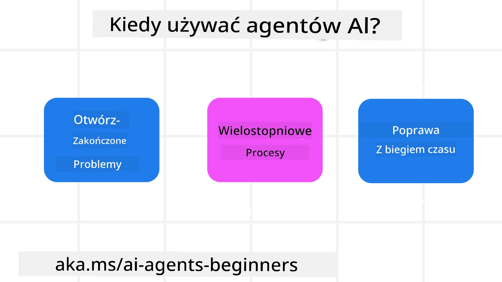

<!--
CO_OP_TRANSLATOR_METADATA:
{
  "original_hash": "cdd28bc00816d2773bb2b5968d782abc",
  "translation_date": "2025-11-11T11:13:09+00:00",
  "source_file": "01-intro-to-ai-agents/README.md",
  "language_code": "pl"
}
-->

> _(Kliknij obrazek powyżej, aby obejrzeć wideo z tej lekcji)_

# Wprowadzenie do agentów AI i ich zastosowań

Witaj w kursie "Agenci AI dla początkujących"! Ten kurs dostarcza podstawowej wiedzy oraz praktycznych przykładów budowania agentów AI.

Dołącz do <a href="https://discord.gg/kzRShWzttr" target="_blank">społeczności Azure AI na Discordzie</a>, aby spotkać innych uczących się i twórców agentów AI oraz zadać pytania dotyczące tego kursu.

Na początek kursu skupimy się na lepszym zrozumieniu, czym są agenci AI i jak można ich używać w aplikacjach i procesach, które tworzymy.

## Wprowadzenie

Ta lekcja obejmuje:

- Czym są agenci AI i jakie są ich różne typy?
- Jakie zastosowania są najlepsze dla agentów AI i jak mogą nam pomóc?
- Jakie są podstawowe elementy projektowania rozwiązań opartych na agentach?

## Cele nauki
Po ukończeniu tej lekcji będziesz w stanie:

- Zrozumieć koncepcje agentów AI i ich różnice w porównaniu z innymi rozwiązaniami AI.
- Efektywnie stosować agentów AI.
- Produktywnie projektować rozwiązania oparte na agentach dla użytkowników i klientów.

## Definicja agentów AI i ich typy

### Czym są agenci AI?

Agenci AI to **systemy**, które umożliwiają **modelom językowym dużej skali (LLM)** **wykonywanie działań**, rozszerzając ich możliwości poprzez zapewnienie im **dostępu do narzędzi** i **wiedzy**.

Rozbijmy tę definicję na mniejsze części:

- **System** - Ważne jest, aby myśleć o agentach nie jako o pojedynczym komponencie, ale jako o systemie wielu komponentów. Na podstawowym poziomie komponenty agenta AI to:
  - **Środowisko** - Zdefiniowana przestrzeń, w której działa agent AI. Na przykład, jeśli mielibyśmy agenta AI do rezerwacji podróży, środowiskiem mogłoby być system rezerwacji podróży, z którego agent korzysta, aby wykonywać zadania.
  - **Czujniki** - Środowiska zawierają informacje i dostarczają informacji zwrotnych. Agenci AI używają czujników do zbierania i interpretowania tych informacji o aktualnym stanie środowiska. W przykładzie agenta rezerwacji podróży, system rezerwacji podróży może dostarczać informacji, takich jak dostępność hoteli czy ceny lotów.
  - **Siłowniki** - Gdy agent AI otrzyma aktualny stan środowiska, dla bieżącego zadania określa, jakie działanie wykonać, aby zmienić środowisko. W przypadku agenta rezerwacji podróży może to być zarezerwowanie dostępnego pokoju dla użytkownika.

**Modele językowe dużej skali** - Koncepcja agentów istniała przed powstaniem LLM. Zaletą budowania agentów AI z LLM jest ich zdolność do interpretowania języka ludzkiego i danych. Ta zdolność pozwala LLM interpretować informacje o środowisku i definiować plan zmiany środowiska.

**Wykonywanie działań** - Poza systemami agentów AI, LLM są ograniczone do sytuacji, w których działanie polega na generowaniu treści lub informacji na podstawie zapytania użytkownika. W systemach agentów AI LLM mogą realizować zadania, interpretując prośbę użytkownika i korzystając z narzędzi dostępnych w ich środowisku.

**Dostęp do narzędzi** - To, jakie narzędzia są dostępne dla LLM, zależy od 1) środowiska, w którym działa, oraz 2) programisty agenta AI. W naszym przykładzie agenta podróży narzędzia agenta są ograniczone przez operacje dostępne w systemie rezerwacji oraz/lub programista może ograniczyć dostęp agenta do narzędzi, takich jak loty.

**Pamięć + Wiedza** - Pamięć może być krótkoterminowa w kontekście rozmowy między użytkownikiem a agentem. Długoterminowo, poza informacjami dostarczanymi przez środowisko, agenci AI mogą również pobierać wiedzę z innych systemów, usług, narzędzi, a nawet innych agentów. W przykładzie agenta podróży wiedza ta mogłaby obejmować informacje o preferencjach podróżnych użytkownika znajdujące się w bazie danych klientów.

### Różne typy agentów

Teraz, gdy mamy ogólną definicję agentów AI, przyjrzyjmy się niektórym konkretnym typom agentów i ich zastosowaniom w przypadku agenta rezerwacji podróży.

| **Typ agenta**                | **Opis**                                                                                                                       | **Przykład**                                                                                                                                                                                                                   |
| ----------------------------- | -------------------------------------------------------------------------------------------------------------------------------- | ----------------------------------------------------------------------------------------------------------------------------------------------------------------------------------------------------------------------------- |
| **Proste agenty reaktywne**   | Wykonują natychmiastowe działania na podstawie z góry określonych reguł.                                                         | Agent podróży interpretuje kontekst e-maila i przekazuje skargi dotyczące podróży do obsługi klienta.                                                                                                                          |
| **Agenty reaktywne oparte na modelu** | Wykonują działania na podstawie modelu świata i zmian w tym modelu.                                                              | Agent podróży priorytetowo traktuje trasy z istotnymi zmianami cen na podstawie dostępu do danych historycznych dotyczących cen.                                                                                                             |
| **Agenty oparte na celach**   | Tworzą plany osiągnięcia określonych celów, interpretując cel i określając działania, które do niego prowadzą.                     | Agent podróży rezerwuje podróż, określając niezbędne środki transportu (samochód, komunikacja publiczna, loty) z obecnej lokalizacji do miejsca docelowego.                                                                                |
| **Agenty oparte na użyteczności** | Uwzględniają preferencje i oceniają kompromisy numerycznie, aby określić, jak osiągnąć cele.                                               | Agent podróży maksymalizuje użyteczność, oceniając wygodę w porównaniu z kosztami podczas rezerwacji podróży.                                                                                                                                          |
| **Agenty uczące się**         | Poprawiają się z czasem, reagując na informacje zwrotne i dostosowując działania.                                                        | Agent podróży poprawia się, korzystając z opinii klientów z ankiet po podróży, aby wprowadzać zmiany w przyszłych rezerwacjach.                                                                                                               |
| **Agenty hierarchiczne**      | Zawierają wielu agentów w systemie warstwowym, gdzie agenci wyższego poziomu dzielą zadania na podzadania dla agentów niższego poziomu. | Agent podróży anuluje podróż, dzieląc zadanie na podzadania (np. anulowanie konkretnych rezerwacji) i zlecając ich wykonanie agentom niższego poziomu, którzy raportują wyniki agentowi wyższego poziomu.                                     |
| **Systemy wieloagentowe (MAS)** | Agenci wykonują zadania niezależnie, współpracując lub konkurując.                                                           | Współpraca: Wielu agentów rezerwuje konkretne usługi podróżne, takie jak hotele, loty i rozrywka. Konkurencja: Wielu agentów zarządza i rywalizuje o wspólny kalendarz rezerwacji hotelowych, aby zarezerwować klientów w hotelu. |

## Kiedy używać agentów AI

W poprzedniej sekcji użyliśmy przykładu agenta podróży, aby wyjaśnić, jak różne typy agentów mogą być używane w różnych scenariuszach rezerwacji podróży. Będziemy kontynuować korzystanie z tej aplikacji w całym kursie.

Przyjrzyjmy się typom zastosowań, w których agenci AI sprawdzają się najlepiej:

- **Problemy otwarte** - pozwalając LLM określić potrzebne kroki do wykonania zadania, ponieważ nie zawsze można je zakodować w procesie.
- **Procesy wieloetapowe** - zadania wymagające poziomu złożoności, w których agent AI musi korzystać z narzędzi lub informacji przez wiele tur, zamiast jednorazowego pobierania.  
- **Poprawa z czasem** - zadania, w których agent może się poprawiać z czasem, otrzymując informacje zwrotne od środowiska lub użytkowników, aby zapewnić lepszą użyteczność.

Więcej rozważań dotyczących używania agentów AI omówimy w lekcji "Budowanie wiarygodnych agentów AI".

## Podstawy rozwiązań opartych na agentach

### Tworzenie agentów

Pierwszym krokiem w projektowaniu systemu agenta AI jest zdefiniowanie narzędzi, działań i zachowań. W tym kursie skupiamy się na używaniu **Azure AI Agent Service** do definiowania naszych agentów. Oferuje on funkcje takie jak:

- Wybór otwartych modeli, takich jak OpenAI, Mistral i Llama
- Korzystanie z licencjonowanych danych od dostawców, takich jak Tripadvisor
- Korzystanie ze standardowych narzędzi OpenAPI 3.0

### Wzorce agentów

Komunikacja z LLM odbywa się za pomocą promptów. Ze względu na półautonomiczny charakter agentów AI, nie zawsze jest możliwe lub konieczne ręczne ponowne promptowanie LLM po zmianie w środowisku. Używamy **wzorów agentów**, które pozwalają na promptowanie LLM przez wiele kroków w bardziej skalowalny sposób.

Ten kurs jest podzielony na niektóre z obecnie popularnych wzorców agentów.

### Frameworki agentów

Frameworki agentów pozwalają programistom wdrażać wzorce agentów za pomocą kodu. Te frameworki oferują szablony, wtyczki i narzędzia do lepszej współpracy agentów AI. Te korzyści zapewniają lepszą obserwowalność i rozwiązywanie problemów w systemach agentów AI.

W tym kursie zbadamy oparty na badaniach framework AutoGen oraz gotowy do produkcji framework Agent z Semantic Kernel.

## Przykładowe kody

- Python: [Framework agenta](./code_samples/01-python-agent-framework.ipynb)
- .NET: [Framework agenta](./code_samples/01-dotnet-agent-framework.md)

## Masz więcej pytań dotyczących agentów AI?

Dołącz do [Azure AI Foundry Discord](https://aka.ms/ai-agents/discord), aby spotkać się z innymi uczącymi się, wziąć udział w godzinach konsultacji i uzyskać odpowiedzi na pytania dotyczące agentów AI.

## Poprzednia lekcja

[Konfiguracja kursu](../00-course-setup/README.md)

## Następna lekcja

[Odkrywanie frameworków agentów](../02-explore-agentic-frameworks/README.md)

---

<!-- CO-OP TRANSLATOR DISCLAIMER START -->
**Zastrzeżenie**:  
Ten dokument został przetłumaczony za pomocą usługi tłumaczenia AI [Co-op Translator](https://github.com/Azure/co-op-translator). Chociaż staramy się zapewnić dokładność, prosimy pamiętać, że automatyczne tłumaczenia mogą zawierać błędy lub nieścisłości. Oryginalny dokument w jego rodzimym języku powinien być uznawany za autorytatywne źródło. W przypadku informacji krytycznych zaleca się skorzystanie z profesjonalnego tłumaczenia przez człowieka. Nie ponosimy odpowiedzialności za jakiekolwiek nieporozumienia lub błędne interpretacje wynikające z użycia tego tłumaczenia.
<!-- CO-OP TRANSLATOR DISCLAIMER END -->