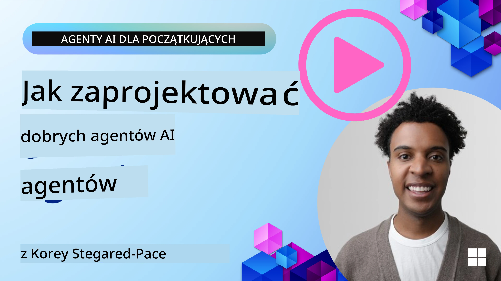
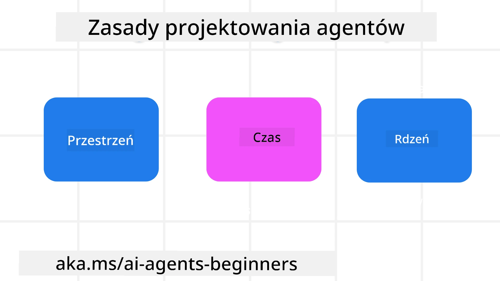

<!--
CO_OP_TRANSLATOR_METADATA:
{
  "original_hash": "d71524fe83a23829ae7a23b4031aaac8",
  "translation_date": "2025-11-13T12:22:57+00:00",
  "source_file": "03-agentic-design-patterns/README.md",
  "language_code": "pl"
}
-->

> _(Kliknij obrazek powyżej, aby obejrzeć wideo z tej lekcji)_
# Zasady projektowania agentów AI

## Wprowadzenie

Istnieje wiele sposobów myślenia o budowaniu systemów agentów AI. Biorąc pod uwagę, że niejednoznaczność jest cechą, a nie błędem w projektowaniu generatywnej AI, inżynierom czasami trudno jest ustalić, od czego zacząć. Stworzyliśmy zestaw zasad projektowania UX skoncentrowanych na człowieku, aby umożliwić deweloperom budowanie systemów agentów skoncentrowanych na kliencie, które spełniają ich potrzeby biznesowe. Te zasady projektowania nie są sztywną architekturą, lecz punktem wyjścia dla zespołów definiujących i budujących doświadczenia z agentami.

Ogólnie rzecz biorąc, agenci powinni:

- Poszerzać i skalować ludzkie możliwości (burza mózgów, rozwiązywanie problemów, automatyzacja itp.)
- Wypełniać luki w wiedzy (pomagać w szybkim zrozumieniu nowych dziedzin wiedzy, tłumaczenia itp.)
- Ułatwiać i wspierać współpracę w sposób, w jaki preferujemy pracować z innymi
- Pomagać nam stawać się lepszymi wersjami siebie (np. jako trener życiowy/zarządca zadań, pomagając w nauce regulacji emocji i umiejętności uważności, budowaniu odporności itp.)

## W tej lekcji omówimy

- Czym są zasady projektowania agentów
- Jakie wytyczne należy stosować podczas wdrażania tych zasad
- Przykłady zastosowania zasad projektowania

## Cele nauki

Po ukończeniu tej lekcji będziesz w stanie:

1. Wyjaśnić, czym są zasady projektowania agentów
2. Wyjaśnić wytyczne dotyczące stosowania zasad projektowania agentów
3. Zrozumieć, jak zbudować agenta, stosując zasady projektowania agentów

## Zasady projektowania agentów

### Agent (Przestrzeń)

To środowisko, w którym działa agent. Te zasady informują, jak projektować agentów do działania w fizycznym i cyfrowym świecie.

- **Łączenie, a nie zastępowanie** – pomagaj łączyć ludzi z innymi ludźmi, wydarzeniami i użyteczną wiedzą, aby umożliwić współpracę i budowanie relacji.
  - Agenci pomagają łączyć wydarzenia, wiedzę i ludzi.
  - Agenci zbliżają ludzi do siebie. Nie są zaprojektowani, aby zastępować lub umniejszać ludzi.
- **Łatwo dostępni, ale czasami niewidoczni** – agent działa głównie w tle i interweniuje tylko wtedy, gdy jest to istotne i odpowiednie.
  - Agent jest łatwo dostępny dla autoryzowanych użytkowników na dowolnym urządzeniu lub platformie.
  - Agent obsługuje różne tryby wejścia i wyjścia (dźwięk, głos, tekst itp.).
  - Agent może płynnie przechodzić między pierwszym planem a tłem; między proaktywnym a reaktywnym działaniem, w zależności od potrzeb użytkownika.
  - Agent może działać w niewidocznej formie, ale jego procesy w tle i współpraca z innymi agentami są przejrzyste i kontrolowane przez użytkownika.

### Agent (Czas)

To sposób, w jaki agent działa w czasie. Te zasady informują, jak projektować agentów, którzy wchodzą w interakcje z przeszłością, teraźniejszością i przyszłością.

- **Przeszłość**: Refleksja nad historią, która obejmuje zarówno stan, jak i kontekst.
  - Agent dostarcza bardziej trafne wyniki na podstawie analizy bogatszych danych historycznych, a nie tylko wydarzeń, ludzi czy stanów.
  - Agent tworzy połączenia z przeszłych wydarzeń i aktywnie odwołuje się do pamięci, aby angażować się w bieżące sytuacje.
- **Teraźniejszość**: Sugerowanie zamiast powiadamiania.
  - Agent przyjmuje kompleksowe podejście do interakcji z ludźmi. Gdy wydarzenie ma miejsce, agent wykracza poza statyczne powiadomienia lub inne formalności. Może upraszczać procesy lub dynamicznie generować wskazówki, aby skierować uwagę użytkownika w odpowiednim momencie.
  - Agent dostarcza informacje w oparciu o kontekst środowiskowy, zmiany społeczne i kulturowe oraz dostosowane do intencji użytkownika.
  - Interakcja z agentem może być stopniowa, rozwijając się w złożoności, aby wspierać użytkowników w dłuższej perspektywie.
- **Przyszłość**: Adaptacja i ewolucja.
  - Agent dostosowuje się do różnych urządzeń, platform i trybów.
  - Agent dostosowuje się do zachowań użytkownika, potrzeb w zakresie dostępności i jest w pełni personalizowalny.
  - Agent kształtuje się i ewoluuje poprzez ciągłą interakcję z użytkownikiem.

### Agent (Rdzeń)

To kluczowe elementy w rdzeniu projektu agenta.

- **Akceptuj niepewność, ale buduj zaufanie**.
  - Pewien poziom niepewności agenta jest oczekiwany. Niepewność jest kluczowym elementem projektowania agenta.
  - Zaufanie i przejrzystość są podstawowymi warstwami projektowania agenta.
  - Człowiek ma kontrolę nad tym, kiedy agent jest włączony/wyłączony, a status agenta jest zawsze wyraźnie widoczny.

## Wytyczne do wdrażania tych zasad

Podczas korzystania z powyższych zasad projektowania stosuj następujące wytyczne:

1. **Przejrzystość**: Informuj użytkownika, że AI jest zaangażowane, jak działa (w tym wcześniejsze działania) oraz jak przekazywać opinie i modyfikować system.
2. **Kontrola**: Umożliwiaj użytkownikowi personalizację, określanie preferencji i dostosowywanie systemu oraz jego atrybutów (w tym możliwość zapomnienia danych).
3. **Spójność**: Dąż do spójnych, wielomodalnych doświadczeń na różnych urządzeniach i punktach końcowych. Używaj znanych elementów UI/UX tam, gdzie to możliwe (np. ikona mikrofonu dla interakcji głosowej) i maksymalnie redukuj obciążenie poznawcze użytkownika (np. dąż do zwięzłych odpowiedzi, pomocy wizualnych i treści „Dowiedz się więcej”).

## Jak zaprojektować agenta podróży, stosując te zasady i wytyczne

Wyobraź sobie, że projektujesz agenta podróży. Oto jak możesz zastosować zasady projektowania i wytyczne:

1. **Przejrzystość** – Poinformuj użytkownika, że agent podróży jest wspierany przez AI. Podaj podstawowe instrukcje, jak zacząć (np. wiadomość „Witaj”, przykładowe zapytania). Wyraźnie udokumentuj to na stronie produktu. Pokaż listę zapytań, które użytkownik zadał w przeszłości. Wyjaśnij, jak przekazywać opinie (kciuk w górę i w dół, przycisk „Prześlij opinię” itp.). Wyraźnie określ, czy agent ma ograniczenia w zakresie użytkowania lub tematów.
2. **Kontrola** – Upewnij się, że użytkownik wie, jak modyfikować agenta po jego utworzeniu, np. za pomocą System Prompt. Umożliw użytkownikowi wybór, jak szczegółowy ma być agent, jego styl pisania oraz wszelkie ograniczenia dotyczące tematów, o których agent nie powinien mówić. Pozwól użytkownikowi przeglądać i usuwać powiązane pliki lub dane, zapytania i wcześniejsze rozmowy.
3. **Spójność** – Upewnij się, że ikony dla opcji „Udostępnij zapytanie”, dodaj plik lub zdjęcie oraz oznacz kogoś lub coś są standardowe i rozpoznawalne. Użyj ikony spinacza do papieru, aby wskazać przesyłanie/udostępnianie plików agentowi, oraz ikony obrazu, aby wskazać przesyłanie grafik.

## Przykładowe kody

- Python: [Agent Framework](./code_samples/03-python-agent-framework.ipynb)
- .NET: [Agent Framework](./code_samples/03-dotnet-agent-framework.md)

## Masz więcej pytań dotyczących wzorców projektowania agentów AI?

Dołącz do [Azure AI Foundry Discord](https://aka.ms/ai-agents/discord), aby spotkać się z innymi uczącymi się, uczestniczyć w godzinach konsultacji i uzyskać odpowiedzi na pytania dotyczące agentów AI.

## Dodatkowe zasoby

- <a href="https://openai.com" target="_blank">Praktyki zarządzania systemami agentów AI | OpenAI</a>
- <a href="https://microsoft.com" target="_blank">Projekt HAX Toolkit - Microsoft Research</a>
- <a href="https://responsibleaitoolbox.ai" target="_blank">Responsible AI Toolbox</a>

## Poprzednia lekcja

[Odkrywanie ram agentów](../02-explore-agentic-frameworks/README.md)

## Następna lekcja

[Wzorzec projektowania narzędzi](../04-tool-use/README.md)

---

<!-- CO-OP TRANSLATOR DISCLAIMER START -->
**Zastrzeżenie**:  
Ten dokument został przetłumaczony za pomocą usługi tłumaczenia AI [Co-op Translator](https://github.com/Azure/co-op-translator). Chociaż staramy się zapewnić dokładność, prosimy mieć na uwadze, że automatyczne tłumaczenia mogą zawierać błędy lub nieścisłości. Oryginalny dokument w jego rodzimym języku powinien być uznawany za wiarygodne źródło. W przypadku informacji krytycznych zaleca się skorzystanie z profesjonalnego tłumaczenia przez człowieka. Nie ponosimy odpowiedzialności za jakiekolwiek nieporozumienia lub błędne interpretacje wynikające z użycia tego tłumaczenia.
<!-- CO-OP TRANSLATOR DISCLAIMER END -->