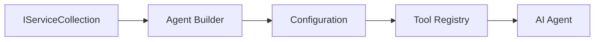

<!--
CO_OP_TRANSLATOR_METADATA:
{
  "original_hash": "bcc874e190347bd6a095aed56dc16de8",
  "translation_date": "2025-11-13T12:23:55+00:00",
  "source_file": "03-agentic-design-patterns/code_samples/03-dotnet-agent-framework.md",
  "language_code": "pl"
}
-->
# 🎨 Wzorce projektowe agentów z modelami GitHub (.NET)

## 📋 Cele nauki

Ten przykład pokazuje wzorce projektowe na poziomie przedsiębiorstwa do budowy inteligentnych agentów przy użyciu Microsoft Agent Framework w .NET z integracją modeli GitHub. Nauczysz się profesjonalnych wzorców i podejść architektonicznych, które sprawiają, że agenci są gotowi do produkcji, łatwi w utrzymaniu i skalowalni.

### Wzorce projektowe na poziomie przedsiębiorstwa

- 🏭 **Wzorzec fabryki**: Standaryzowane tworzenie agentów z użyciem wstrzykiwania zależności
- 🔧 **Wzorzec budowniczego**: Płynna konfiguracja i ustawienia agenta
- 🧵 **Wzorce bezpieczne dla wątków**: Zarządzanie równoczesnymi rozmowami
- 📋 **Wzorzec repozytorium**: Zorganizowane zarządzanie narzędziami i możliwościami

## 🎯 Korzyści architektoniczne specyficzne dla .NET

### Funkcje na poziomie przedsiębiorstwa

- **Silne typowanie**: Walidacja w czasie kompilacji i wsparcie IntelliSense
- **Wstrzykiwanie zależności**: Wbudowana integracja kontenera DI
- **Zarządzanie konfiguracją**: Wzorce IConfiguration i Options
- **Async/Await**: Pierwszorzędne wsparcie dla programowania asynchronicznego

### Wzorce gotowe do produkcji

- **Integracja logowania**: Wsparcie ILogger i strukturalnego logowania
- **Kontrole zdrowia**: Wbudowane monitorowanie i diagnostyka
- **Walidacja konfiguracji**: Silne typowanie z adnotacjami danych
- **Obsługa błędów**: Strukturalne zarządzanie wyjątkami

## 🔧 Architektura techniczna

### Kluczowe komponenty .NET

- **Microsoft.Extensions.AI**: Ujednolicone abstrakcje usług AI
- **Microsoft.Agents.AI**: Ramy orkiestracji agentów na poziomie przedsiębiorstwa
- **Integracja modeli GitHub**: Wzorce klienta API o wysokiej wydajności
- **System konfiguracji**: Integracja appsettings.json i środowiska

### Implementacja wzorców projektowych



## 🏗️ Wzorce na poziomie przedsiębiorstwa

### 1. **Wzorce kreacyjne**

- **Fabryka agentów**: Centralne tworzenie agentów z jednolitą konfiguracją
- **Wzorzec budowniczego**: Płynne API do złożonej konfiguracji agentów
- **Wzorzec singletona**: Zarządzanie wspólnymi zasobami i konfiguracją
- **Wstrzykiwanie zależności**: Luźne powiązania i możliwość testowania

### 2. **Wzorce behawioralne**

- **Wzorzec strategii**: Wymienne strategie wykonywania narzędzi
- **Wzorzec polecenia**: Enkapsulowane operacje agenta z funkcją cofania/powtarzania
- **Wzorzec obserwatora**: Zarządzanie cyklem życia agenta oparte na zdarzeniach
- **Metoda szablonowa**: Standaryzowane przepływy wykonywania agenta

### 3. **Wzorce strukturalne**

- **Wzorzec adaptera**: Warstwa integracji API modeli GitHub
- **Wzorzec dekoratora**: Rozszerzenie możliwości agenta
- **Wzorzec fasady**: Uproszczone interfejsy interakcji z agentem
- **Wzorzec proxy**: Lazy loading i caching dla wydajności

## 📚 Zasady projektowe .NET

### Zasady SOLID

- **Jedna odpowiedzialność**: Każdy komponent ma jedno jasne przeznaczenie
- **Otwarte/Zamknięte**: Rozszerzalne bez modyfikacji
- **Podstawienie Liskova**: Implementacje narzędzi oparte na interfejsach
- **Segregacja interfejsów**: Skupione, spójne interfejsy
- **Odwrócenie zależności**: Zależność od abstrakcji, nie konkretów

### Czysta architektura

- **Warstwa domeny**: Podstawowe abstrakcje agenta i narzędzi
- **Warstwa aplikacji**: Orkiestracja agentów i przepływy pracy
- **Warstwa infrastruktury**: Integracja modeli GitHub i usługi zewnętrzne
- **Warstwa prezentacji**: Interakcja z użytkownikiem i formatowanie odpowiedzi

## 🔒 Rozważania na poziomie przedsiębiorstwa

### Bezpieczeństwo

- **Zarządzanie poświadczeniami**: Bezpieczne obsługiwanie kluczy API z IConfiguration
- **Walidacja wejścia**: Silne typowanie i walidacja z adnotacjami danych
- **Sanityzacja wyjścia**: Bezpieczne przetwarzanie i filtrowanie odpowiedzi
- **Logowanie audytowe**: Kompleksowe śledzenie operacji

### Wydajność

- **Wzorce asynchroniczne**: Operacje I/O bez blokowania
- **Pula połączeń**: Efektywne zarządzanie klientem HTTP
- **Caching**: Buforowanie odpowiedzi dla poprawy wydajności
- **Zarządzanie zasobami**: Odpowiednie zwalnianie i czyszczenie zasobów

### Skalowalność

- **Bezpieczeństwo wątków**: Wsparcie dla równoczesnego wykonywania agentów
- **Pula zasobów**: Efektywne wykorzystanie zasobów
- **Zarządzanie obciążeniem**: Ograniczanie szybkości i obsługa przeciążenia
- **Monitorowanie**: Metryki wydajności i kontrole zdrowia

## 🚀 Wdrożenie produkcyjne

- **Zarządzanie konfiguracją**: Ustawienia specyficzne dla środowiska
- **Strategia logowania**: Strukturalne logowanie z identyfikatorami korelacji
- **Obsługa błędów**: Globalna obsługa wyjątków z odpowiednim odzyskiwaniem
- **Monitorowanie**: Application Insights i liczniki wydajności
- **Testowanie**: Testy jednostkowe, integracyjne i wzorce testowania obciążenia

Gotowy, aby budować inteligentnych agentów na poziomie przedsiębiorstwa z .NET? Zbudujmy coś solidnego! 🏢✨

## 🚀 Pierwsze kroki

### Wymagania wstępne

- [.NET 10 SDK](https://dotnet.microsoft.com/download/dotnet/10.0) lub nowszy
- [Token dostępu do API modeli GitHub](https://docs.github.com/github-models/github-models-at-scale/using-your-own-api-keys-in-github-models)

### Wymagane zmienne środowiskowe

```bash
# zsh/bash
export GH_TOKEN=<your_github_token>
export GH_ENDPOINT=https://models.github.ai/inference
export GH_MODEL_ID=openai/gpt-5-mini
```

```powershell
# PowerShell
$env:GH_TOKEN = "<your_github_token>"
$env:GH_ENDPOINT = "https://models.github.ai/inference"
$env:GH_MODEL_ID = "openai/gpt-5-mini"
```

### Przykładowy kod

Aby uruchomić przykład kodu,

```bash
# zsh/bash
chmod +x ./03-dotnet-agent-framework.cs
./03-dotnet-agent-framework.cs
```

Lub używając dotnet CLI:

```bash
dotnet run ./03-dotnet-agent-framework.cs
```

Zobacz [`03-dotnet-agent-framework.cs`](../../../../03-agentic-design-patterns/code_samples/03-dotnet-agent-framework.cs) dla pełnego kodu.

```csharp
#!/usr/bin/dotnet run

#:package Microsoft.Extensions.AI@10.*
#:package Microsoft.Agents.AI.OpenAI@1.*-*

using System.ClientModel;
using System.ComponentModel;

using Microsoft.Agents.AI;
using Microsoft.Extensions.AI;

using OpenAI;

// Tool Function: Random Destination Generator
// This static method will be available to the agent as a callable tool
// The [Description] attribute helps the AI understand when to use this function
// This demonstrates how to create custom tools for AI agents
[Description("Provides a random vacation destination.")]
static string GetRandomDestination()
{
    // List of popular vacation destinations around the world
    // The agent will randomly select from these options
    var destinations = new List<string>
    {
        "Paris, France",
        "Tokyo, Japan",
        "New York City, USA",
        "Sydney, Australia",
        "Rome, Italy",
        "Barcelona, Spain",
        "Cape Town, South Africa",
        "Rio de Janeiro, Brazil",
        "Bangkok, Thailand",
        "Vancouver, Canada"
    };

    // Generate random index and return selected destination
    // Uses System.Random for simple random selection
    var random = new Random();
    int index = random.Next(destinations.Count);
    return destinations[index];
}

// Extract configuration from environment variables
// Retrieve the GitHub Models API endpoint, defaults to https://models.github.ai/inference if not specified
// Retrieve the model ID, defaults to openai/gpt-5-mini if not specified
// Retrieve the GitHub token for authentication, throws exception if not specified
var github_endpoint = Environment.GetEnvironmentVariable("GH_ENDPOINT") ?? "https://models.github.ai/inference";
var github_model_id = Environment.GetEnvironmentVariable("GH_MODEL_ID") ?? "openai/gpt-5-mini";
var github_token = Environment.GetEnvironmentVariable("GH_TOKEN") ?? throw new InvalidOperationException("GH_TOKEN is not set.");

// Configure OpenAI Client Options
// Create configuration options to point to GitHub Models endpoint
// This redirects OpenAI client calls to GitHub's model inference service
var openAIOptions = new OpenAIClientOptions()
{
    Endpoint = new Uri(github_endpoint)
};

// Initialize OpenAI Client with GitHub Models Configuration
// Create OpenAI client using GitHub token for authentication
// Configure it to use GitHub Models endpoint instead of OpenAI directly
var openAIClient = new OpenAIClient(new ApiKeyCredential(github_token), openAIOptions);

// Define Agent Identity and Comprehensive Instructions
// Agent name for identification and logging purposes
var AGENT_NAME = "TravelAgent";

// Detailed instructions that define the agent's personality, capabilities, and behavior
// This system prompt shapes how the agent responds and interacts with users
var AGENT_INSTRUCTIONS = """
You are a helpful AI Agent that can help plan vacations for customers.

Important: When users specify a destination, always plan for that location. Only suggest random destinations when the user hasn't specified a preference.

When the conversation begins, introduce yourself with this message:
"Hello! I'm your TravelAgent assistant. I can help plan vacations and suggest interesting destinations for you. Here are some things you can ask me:
1. Plan a day trip to a specific location
2. Suggest a random vacation destination
3. Find destinations with specific features (beaches, mountains, historical sites, etc.)
4. Plan an alternative trip if you don't like my first suggestion

What kind of trip would you like me to help you plan today?"

Always prioritize user preferences. If they mention a specific destination like "Bali" or "Paris," focus your planning on that location rather than suggesting alternatives.
""";

// Create AI Agent with Advanced Travel Planning Capabilities
// Initialize complete agent pipeline: OpenAI client → Chat client → AI agent
// Configure agent with name, detailed instructions, and available tools
// This demonstrates the .NET agent creation pattern with full configuration
AIAgent agent = openAIClient
    .GetChatClient(github_model_id)
    .CreateAIAgent(
        name: AGENT_NAME,
        instructions: AGENT_INSTRUCTIONS,
        tools: [AIFunctionFactory.Create(GetRandomDestination)]
    );

// Create New Conversation Thread for Context Management
// Initialize a new conversation thread to maintain context across multiple interactions
// Threads enable the agent to remember previous exchanges and maintain conversational state
// This is essential for multi-turn conversations and contextual understanding
AgentThread thread = agent.GetNewThread();

// Execute Agent: First Travel Planning Request
// Run the agent with an initial request that will likely trigger the random destination tool
// The agent will analyze the request, use the GetRandomDestination tool, and create an itinerary
// Using the thread parameter maintains conversation context for subsequent interactions
await foreach (var update in agent.RunStreamingAsync("Plan me a day trip", thread))
{
    await Task.Delay(10);
    Console.Write(update);
}

Console.WriteLine();

// Execute Agent: Follow-up Request with Context Awareness
// Demonstrate contextual conversation by referencing the previous response
// The agent remembers the previous destination suggestion and will provide an alternative
// This showcases the power of conversation threads and contextual understanding in .NET agents
await foreach (var update in agent.RunStreamingAsync("I don't like that destination. Plan me another vacation.", thread))
{
    await Task.Delay(10);
    Console.Write(update);
}
```

---

<!-- CO-OP TRANSLATOR DISCLAIMER START -->
**Zastrzeżenie**:  
Ten dokument został przetłumaczony za pomocą usługi tłumaczenia AI [Co-op Translator](https://github.com/Azure/co-op-translator). Chociaż staramy się zapewnić dokładność, prosimy mieć na uwadze, że automatyczne tłumaczenia mogą zawierać błędy lub nieścisłości. Oryginalny dokument w jego rodzimym języku powinien być uznawany za wiarygodne źródło. W przypadku informacji krytycznych zaleca się skorzystanie z profesjonalnego tłumaczenia przez człowieka. Nie ponosimy odpowiedzialności za jakiekolwiek nieporozumienia lub błędne interpretacje wynikające z użycia tego tłumaczenia.
<!-- CO-OP TRANSLATOR DISCLAIMER END -->