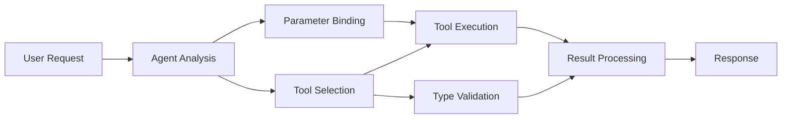

<!--
CO_OP_TRANSLATOR_METADATA:
{
  "original_hash": "91d6061e402489603f2ec8b528cae59b",
  "translation_date": "2025-11-18T17:26:06+00:00",
  "source_file": "04-tool-use/code_samples/04-dotnet-agent-framework.md",
  "language_code": "pl"
}
-->
# 🛠️ Zaawansowane wykorzystanie narzędzi z modelami GitHub (.NET)

## 📋 Cele nauki

Ten notatnik demonstruje wzorce integracji narzędzi na poziomie przedsiębiorstwa, wykorzystując Microsoft Agent Framework w .NET z modelami GitHub. Nauczysz się budować zaawansowane agenty z wieloma wyspecjalizowanymi narzędziami, korzystając z silnego typowania w C# i funkcji .NET dla przedsiębiorstw.

### Zaawansowane możliwości narzędzi, które opanujesz

- 🔧 **Architektura wielonarzędziowa**: Tworzenie agentów z wieloma wyspecjalizowanymi funkcjami
- 🎯 **Bezpieczne typowanie narzędzi**: Wykorzystanie walidacji w czasie kompilacji w C#
- 📊 **Wzorce narzędzi dla przedsiębiorstw**: Projektowanie narzędzi gotowych do produkcji i obsługa błędów
- 🔗 **Kompozycja narzędzi**: Łączenie narzędzi w złożone przepływy biznesowe

## 🎯 Korzyści z architektury narzędzi w .NET

### Funkcje narzędzi dla przedsiębiorstw

- **Walidacja w czasie kompilacji**: Silne typowanie zapewnia poprawność parametrów narzędzi
- **Wstrzykiwanie zależności**: Integracja kontenera IoC do zarządzania narzędziami
- **Wzorce Async/Await**: Wykonywanie narzędzi bez blokowania z odpowiednim zarządzaniem zasobami
- **Strukturalne logowanie**: Wbudowana integracja logowania do monitorowania wykonywania narzędzi

### Wzorce gotowe do produkcji

- **Obsługa wyjątków**: Kompleksowe zarządzanie błędami z typowanymi wyjątkami
- **Zarządzanie zasobami**: Właściwe wzorce usuwania i zarządzania pamięcią
- **Monitorowanie wydajności**: Wbudowane metryki i liczniki wydajności
- **Zarządzanie konfiguracją**: Konfiguracja z walidacją i bezpiecznym typowaniem

## 🔧 Architektura techniczna

### Kluczowe komponenty narzędzi w .NET

- **Microsoft.Extensions.AI**: Ujednolicona warstwa abstrakcji narzędzi
- **Microsoft.Agents.AI**: Orkiestracja narzędzi na poziomie przedsiębiorstwa
- **Integracja z modelami GitHub**: Wysokowydajny klient API z pulą połączeń

### Pipeline wykonywania narzędzi



## 🛠️ Kategorie i wzorce narzędzi

### 1. **Narzędzia do przetwarzania danych**

- **Walidacja danych wejściowych**: Silne typowanie z adnotacjami danych
- **Operacje transformacji**: Bezpieczna typowo konwersja i formatowanie danych
- **Logika biznesowa**: Narzędzia do obliczeń i analiz specyficznych dla domeny
- **Formatowanie wyników**: Generowanie ustrukturyzowanych odpowiedzi

### 2. **Narzędzia integracyjne**

- **Konektory API**: Integracja usług RESTful z HttpClient
- **Narzędzia bazodanowe**: Integracja z Entity Framework do dostępu do danych
- **Operacje na plikach**: Bezpieczne operacje na systemie plików z walidacją
- **Usługi zewnętrzne**: Wzorce integracji z usługami zewnętrznymi

### 3. **Narzędzia użytkowe**

- **Przetwarzanie tekstu**: Narzędzia do manipulacji i formatowania ciągów znaków
- **Operacje na datach i godzinach**: Obliczenia dat/czasów uwzględniające kulturę
- **Narzędzia matematyczne**: Precyzyjne obliczenia i operacje statystyczne
- **Narzędzia walidacyjne**: Walidacja reguł biznesowych i weryfikacja danych

Gotowy, aby budować agenty na poziomie przedsiębiorstwa z potężnymi, bezpiecznymi typowo narzędziami w .NET? Zaprojektujmy profesjonalne rozwiązania! 🏢⚡

## 🚀 Pierwsze kroki

### Wymagania wstępne

- [.NET 10 SDK](https://dotnet.microsoft.com/download/dotnet/10.0) lub nowszy
- [Token dostępu do API modeli GitHub](https://docs.github.com/github-models/github-models-at-scale/using-your-own-api-keys-in-github-models)

### Wymagane zmienne środowiskowe

```bash
# zsh/bash
export GH_TOKEN=<your_github_token>
export GH_ENDPOINT=https://models.github.ai/inference
export GH_MODEL_ID=openai/gpt-5-mini
```

```powershell
# PowerShell
$env:GH_TOKEN = "<your_github_token>"
$env:GH_ENDPOINT = "https://models.github.ai/inference"
$env:GH_MODEL_ID = "openai/gpt-5-mini"
```

### Przykładowy kod

Aby uruchomić przykład kodu,

```bash
# zsh/bash
chmod +x ./04-dotnet-agent-framework.cs
./04-dotnet-agent-framework.cs
```

Lub używając dotnet CLI:

```bash
dotnet run ./04-dotnet-agent-framework.cs
```

Zobacz [`04-dotnet-agent-framework.cs`](../../../../04-tool-use/code_samples/04-dotnet-agent-framework.cs) dla pełnego kodu.

```csharp
#!/usr/bin/dotnet run

#:package Microsoft.Extensions.AI@10.*
#:package Microsoft.Agents.AI.OpenAI@1.*-*

using System.ClientModel;
using System.ComponentModel;

using Microsoft.Agents.AI;
using Microsoft.Extensions.AI;

using OpenAI;

// Tool Function: Random Destination Generator
// This static method will be available to the agent as a callable tool
// The [Description] attribute helps the AI understand when to use this function
// This demonstrates how to create custom tools for AI agents
[Description("Provides a random vacation destination.")]
static string GetRandomDestination()
{
    // List of popular vacation destinations around the world
    // The agent will randomly select from these options
    var destinations = new List<string>
    {
        "Paris, France",
        "Tokyo, Japan",
        "New York City, USA",
        "Sydney, Australia",
        "Rome, Italy",
        "Barcelona, Spain",
        "Cape Town, South Africa",
        "Rio de Janeiro, Brazil",
        "Bangkok, Thailand",
        "Vancouver, Canada"
    };

    // Generate random index and return selected destination
    // Uses System.Random for simple random selection
    var random = new Random();
    int index = random.Next(destinations.Count);
    return destinations[index];
}

// Extract configuration from environment variables
// Retrieve the GitHub Models API endpoint, defaults to https://models.github.ai/inference if not specified
// Retrieve the model ID, defaults to openai/gpt-5-mini if not specified
// Retrieve the GitHub token for authentication, throws exception if not specified
var github_endpoint = Environment.GetEnvironmentVariable("GH_ENDPOINT") ?? "https://models.github.ai/inference";
var github_model_id = Environment.GetEnvironmentVariable("GH_MODEL_ID") ?? "openai/gpt-5-mini";
var github_token = Environment.GetEnvironmentVariable("GH_TOKEN") ?? throw new InvalidOperationException("GH_TOKEN is not set.");

// Configure OpenAI Client Options
// Create configuration options to point to GitHub Models endpoint
// This redirects OpenAI client calls to GitHub's model inference service
var openAIOptions = new OpenAIClientOptions()
{
    Endpoint = new Uri(github_endpoint)
};

// Initialize OpenAI Client with GitHub Models Configuration
// Create OpenAI client using GitHub token for authentication
// Configure it to use GitHub Models endpoint instead of OpenAI directly
var openAIClient = new OpenAIClient(new ApiKeyCredential(github_token), openAIOptions);

// Define Agent Identity and Comprehensive Instructions
// Agent name for identification and logging purposes
var AGENT_NAME = "TravelAgent";

// Detailed instructions that define the agent's personality, capabilities, and behavior
// This system prompt shapes how the agent responds and interacts with users
var AGENT_INSTRUCTIONS = """
You are a helpful AI Agent that can help plan vacations for customers.

Important: When users specify a destination, always plan for that location. Only suggest random destinations when the user hasn't specified a preference.

When the conversation begins, introduce yourself with this message:
"Hello! I'm your TravelAgent assistant. I can help plan vacations and suggest interesting destinations for you. Here are some things you can ask me:
1. Plan a day trip to a specific location
2. Suggest a random vacation destination
3. Find destinations with specific features (beaches, mountains, historical sites, etc.)
4. Plan an alternative trip if you don't like my first suggestion

What kind of trip would you like me to help you plan today?"

Always prioritize user preferences. If they mention a specific destination like "Bali" or "Paris," focus your planning on that location rather than suggesting alternatives.
""";

// Create AI Agent with Advanced Travel Planning Capabilities
// Initialize complete agent pipeline: OpenAI client → Chat client → AI agent
// Configure agent with name, detailed instructions, and available tools
// This demonstrates the .NET agent creation pattern with full configuration
AIAgent agent = openAIClient
    .GetChatClient(github_model_id)
    .CreateAIAgent(
        name: AGENT_NAME,
        instructions: AGENT_INSTRUCTIONS,
        tools: [AIFunctionFactory.Create(GetRandomDestination)]
    );

// Create New Conversation Thread for Context Management
// Initialize a new conversation thread to maintain context across multiple interactions
// Threads enable the agent to remember previous exchanges and maintain conversational state
// This is essential for multi-turn conversations and contextual understanding
AgentThread thread = agent.GetNewThread();

// Execute Agent: First Travel Planning Request
// Run the agent with an initial request that will likely trigger the random destination tool
// The agent will analyze the request, use the GetRandomDestination tool, and create an itinerary
// Using the thread parameter maintains conversation context for subsequent interactions
await foreach (var update in agent.RunStreamingAsync("Plan me a day trip", thread))
{
    await Task.Delay(10);
    Console.Write(update);
}

Console.WriteLine();

// Execute Agent: Follow-up Request with Context Awareness
// Demonstrate contextual conversation by referencing the previous response
// The agent remembers the previous destination suggestion and will provide an alternative
// This showcases the power of conversation threads and contextual understanding in .NET agents
await foreach (var update in agent.RunStreamingAsync("I don't like that destination. Plan me another vacation.", thread))
{
    await Task.Delay(10);
    Console.Write(update);
}
```

---

<!-- CO-OP TRANSLATOR DISCLAIMER START -->
**Zastrzeżenie**:  
Ten dokument został przetłumaczony za pomocą usługi tłumaczenia AI [Co-op Translator](https://github.com/Azure/co-op-translator). Chociaż staramy się zapewnić dokładność, prosimy pamiętać, że automatyczne tłumaczenia mogą zawierać błędy lub nieścisłości. Oryginalny dokument w jego rodzimym języku powinien być uznawany za wiarygodne źródło. W przypadku informacji krytycznych zaleca się skorzystanie z profesjonalnego tłumaczenia przez człowieka. Nie ponosimy odpowiedzialności za jakiekolwiek nieporozumienia lub błędne interpretacje wynikające z użycia tego tłumaczenia.
<!-- CO-OP TRANSLATOR DISCLAIMER END -->