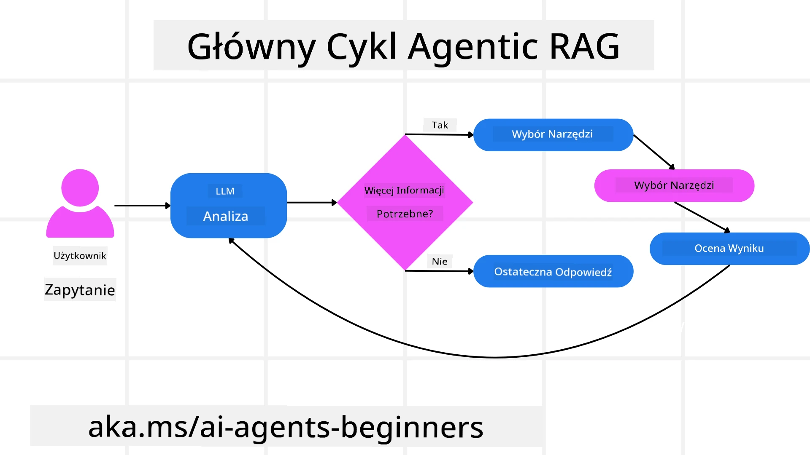
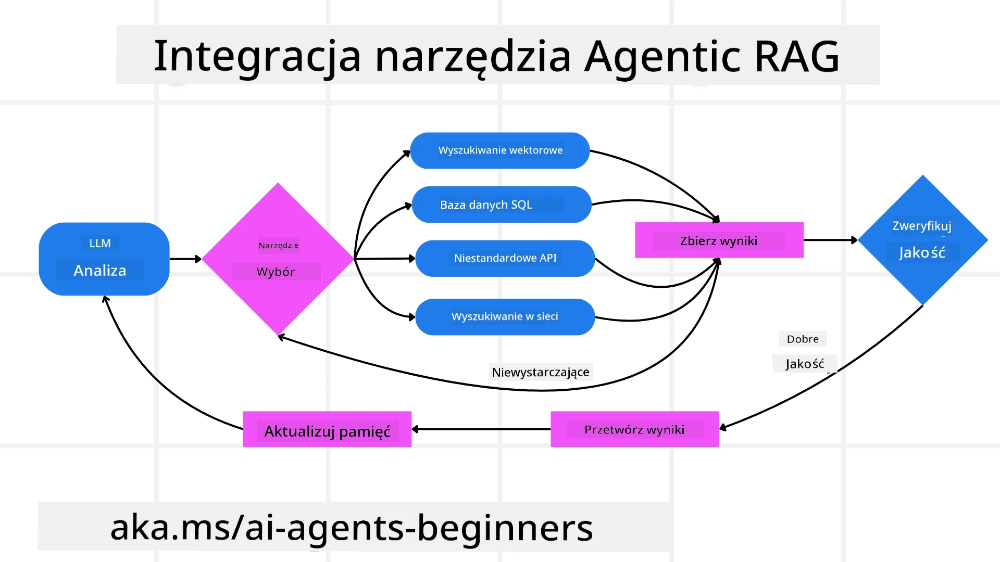
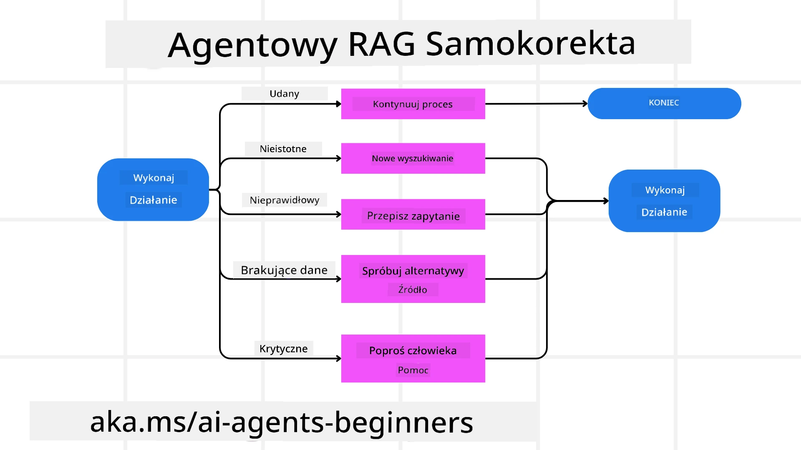
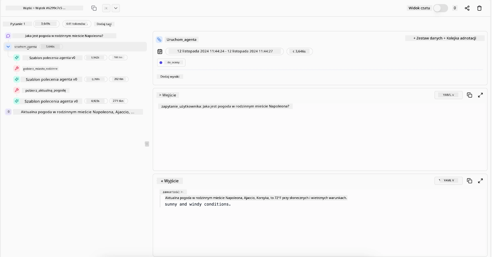

<!--
CO_OP_TRANSLATOR_METADATA:
{
  "original_hash": "0ebf6b2290db55dbf2d10cc49655523b",
  "translation_date": "2025-09-30T07:00:22+00:00",
  "source_file": "05-agentic-rag/README.md",
  "language_code": "pl"
}
-->

> _(Kliknij obrazek powyżej, aby obejrzeć wideo z tej lekcji)_

# Agentic RAG

Ta lekcja oferuje kompleksowy przegląd Agentic Retrieval-Augmented Generation (Agentic RAG), nowego paradygmatu AI, w którym duże modele językowe (LLM) autonomicznie planują kolejne kroki, jednocześnie pozyskując informacje z zewnętrznych źródeł. W przeciwieństwie do statycznych wzorców „pobierz-odczytaj”, Agentic RAG obejmuje iteracyjne wywołania LLM, przeplatane użyciem narzędzi lub funkcji oraz strukturalnymi wynikami. System ocenia rezultaty, udoskonala zapytania, w razie potrzeby korzysta z dodatkowych narzędzi i kontynuuje ten cykl, aż do osiągnięcia satysfakcjonującego rozwiązania.

## Wprowadzenie

Ta lekcja obejmuje:

- **Zrozumienie Agentic RAG:** Poznaj nowy paradygmat w AI, w którym duże modele językowe (LLM) autonomicznie planują kolejne kroki, jednocześnie pozyskując informacje z zewnętrznych źródeł danych.
- **Iteracyjny styl Maker-Checker:** Zrozum pętlę iteracyjnych wywołań LLM, przeplatanych użyciem narzędzi lub funkcji oraz strukturalnymi wynikami, zaprojektowaną w celu poprawy poprawności i obsługi błędnych zapytań.
- **Praktyczne zastosowania:** Zidentyfikuj scenariusze, w których Agentic RAG sprawdza się najlepiej, takie jak środowiska skoncentrowane na poprawności, złożone interakcje z bazami danych i rozbudowane przepływy pracy.

## Cele nauki

Po ukończeniu tej lekcji będziesz wiedzieć, jak/zrozumiesz:

- **Zrozumienie Agentic RAG:** Poznaj nowy paradygmat w AI, w którym duże modele językowe (LLM) autonomicznie planują kolejne kroki, jednocześnie pozyskując informacje z zewnętrznych źródeł danych.
- **Iteracyjny styl Maker-Checker:** Zrozum koncepcję pętli iteracyjnych wywołań LLM, przeplatanych użyciem narzędzi lub funkcji oraz strukturalnymi wynikami, zaprojektowaną w celu poprawy poprawności i obsługi błędnych zapytań.
- **Samodzielne podejmowanie decyzji:** Zrozum zdolność systemu do samodzielnego podejmowania decyzji dotyczących sposobu rozwiązywania problemów, bez polegania na z góry określonych ścieżkach.
- **Przepływ pracy:** Zrozum, jak model agentowy samodzielnie decyduje o pozyskaniu raportów o trendach rynkowych, identyfikacji danych konkurencji, korelacji wewnętrznych metryk sprzedaży, syntezie wyników i ocenie strategii.
- **Iteracyjne pętle, integracja narzędzi i pamięć:** Poznaj zależność systemu od wzorca interakcji w pętli, utrzymując stan i pamięć między krokami, aby uniknąć powtarzających się pętli i podejmować świadome decyzje.
- **Obsługa trybów awaryjnych i samokorekta:** Zbadaj mechanizmy samokorekty systemu, w tym iterację i ponowne zapytania, korzystanie z narzędzi diagnostycznych oraz powrót do nadzoru ludzkiego.
- **Granice autonomii:** Zrozum ograniczenia Agentic RAG, koncentrując się na autonomii specyficznej dla domeny, zależności od infrastruktury i przestrzeganiu zasad bezpieczeństwa.
- **Praktyczne przypadki użycia i wartość:** Zidentyfikuj scenariusze, w których Agentic RAG sprawdza się najlepiej, takie jak środowiska skoncentrowane na poprawności, złożone interakcje z bazami danych i rozbudowane przepływy pracy.
- **Zarządzanie, przejrzystość i zaufanie:** Poznaj znaczenie zarządzania i przejrzystości, w tym wyjaśnialnego rozumowania, kontroli uprzedzeń i nadzoru ludzkiego.

## Czym jest Agentic RAG?

Agentic Retrieval-Augmented Generation (Agentic RAG) to nowy paradygmat AI, w którym duże modele językowe (LLM) autonomicznie planują kolejne kroki, jednocześnie pozyskując informacje z zewnętrznych źródeł. W przeciwieństwie do statycznych wzorców „pobierz-odczytaj”, Agentic RAG obejmuje iteracyjne wywołania LLM, przeplatane użyciem narzędzi lub funkcji oraz strukturalnymi wynikami. System ocenia rezultaty, udoskonala zapytania, w razie potrzeby korzysta z dodatkowych narzędzi i kontynuuje ten cykl, aż do osiągnięcia satysfakcjonującego rozwiązania. Ten iteracyjny styl „maker-checker” poprawia poprawność, obsługuje błędne zapytania i zapewnia wysoką jakość wyników.

System aktywnie przejmuje kontrolę nad procesem rozumowania, przepisując nieudane zapytania, wybierając różne metody pozyskiwania danych i integrując wiele narzędzi—takich jak wyszukiwanie wektorowe w Azure AI Search, bazy danych SQL czy niestandardowe API—zanim sfinalizuje odpowiedź. Charakterystyczną cechą systemu agentowego jest jego zdolność do samodzielnego zarządzania procesem rozumowania. Tradycyjne implementacje RAG opierają się na z góry określonych ścieżkach, ale system agentowy autonomicznie określa sekwencję kroków na podstawie jakości znalezionych informacji.

## Definicja Agentic Retrieval-Augmented Generation (Agentic RAG)

Agentic Retrieval-Augmented Generation (Agentic RAG) to nowy paradygmat w rozwoju AI, w którym LLM nie tylko pozyskują informacje z zewnętrznych źródeł danych, ale także autonomicznie planują kolejne kroki. W przeciwieństwie do statycznych wzorców „pobierz-odczytaj” czy starannie zaprojektowanych sekwencji podpowiedzi, Agentic RAG obejmuje pętlę iteracyjnych wywołań LLM, przeplatanych użyciem narzędzi lub funkcji oraz strukturalnymi wynikami. Na każdym etapie system ocenia uzyskane rezultaty, decyduje, czy udoskonalić zapytania, korzysta z dodatkowych narzędzi w razie potrzeby i kontynuuje ten cykl, aż do osiągnięcia satysfakcjonującego rozwiązania.

Ten iteracyjny styl „maker-checker” został zaprojektowany w celu poprawy poprawności, obsługi błędnych zapytań do baz danych strukturalnych (np. NL2SQL) i zapewnienia zrównoważonych, wysokiej jakości wyników. Zamiast polegać wyłącznie na starannie zaprojektowanych łańcuchach podpowiedzi, system aktywnie przejmuje kontrolę nad procesem rozumowania. Może przepisywać nieudane zapytania, wybierać różne metody pozyskiwania danych i integrować wiele narzędzi—takich jak wyszukiwanie wektorowe w Azure AI Search, bazy danych SQL czy niestandardowe API—zanim sfinalizuje odpowiedź. To eliminuje potrzebę stosowania zbyt skomplikowanych frameworków orkiestracyjnych. Zamiast tego stosunkowo prosta pętla „wywołanie LLM → użycie narzędzia → wywołanie LLM → …” może generować zaawansowane i dobrze ugruntowane wyniki.

## Samodzielne podejmowanie decyzji

Charakterystyczną cechą, która czyni system „agentowym”, jest jego zdolność do samodzielnego zarządzania procesem rozumowania. Tradycyjne implementacje RAG często zależą od ludzi, którzy z góry definiują ścieżkę dla modelu: łańcuch myśli, który określa, co pozyskać i kiedy. 
Jednak gdy system jest naprawdę agentowy, samodzielnie decyduje, jak podejść do problemu. Nie wykonuje tylko skryptu; autonomicznie określa sekwencję kroków na podstawie jakości znalezionych informacji. 
Na przykład, jeśli zostanie poproszony o stworzenie strategii wprowadzenia produktu na rynek, nie polega wyłącznie na podpowiedzi, która określa cały proces badawczy i decyzyjny. Zamiast tego model agentowy samodzielnie decyduje o:

1. Pozyskaniu aktualnych raportów o trendach rynkowych za pomocą Bing Web Grounding.
2. Identyfikacji odpowiednich danych konkurencji za pomocą Azure AI Search.
3. Korelacji historycznych wewnętrznych metryk sprzedaży za pomocą Azure SQL Database.
4. Syntezie wyników w spójną strategię za pomocą Azure OpenAI Service.
5. Oceny strategii pod kątem luk lub niespójności, co może wymagać kolejnej rundy pozyskiwania danych.

Wszystkie te kroki—udoskonalanie zapytań, wybór źródeł, iteracja aż do „zadowolenia” z odpowiedzi—są podejmowane przez model, a nie z góry zaplanowane przez człowieka.

## Iteracyjne pętle, integracja narzędzi i pamięć

System agentowy opiera się na wzorcu interakcji w pętli:

- **Pierwsze wywołanie:** Cel użytkownika (tzw. podpowiedź użytkownika) jest przedstawiany LLM.
- **Wywołanie narzędzia:** Jeśli model identyfikuje brakujące informacje lub niejasne instrukcje, wybiera narzędzie lub metodę pozyskiwania danych—np. zapytanie do bazy danych wektorowej (np. Azure AI Search Hybrid search nad prywatnymi danymi) lub strukturalne wywołanie SQL—aby uzyskać więcej kontekstu.
- **Ocena i udoskonalenie:** Po przeanalizowaniu zwróconych danych model decyduje, czy informacje są wystarczające. Jeśli nie, udoskonala zapytanie, próbuje innego narzędzia lub dostosowuje swoje podejście.
- **Powtarzanie aż do zadowolenia:** Ten cykl trwa, aż model uzna, że ma wystarczającą jasność i dowody, aby dostarczyć ostateczną, dobrze uzasadnioną odpowiedź.
- **Pamięć i stan:** Ponieważ system utrzymuje stan i pamięć między krokami, może przypominać sobie wcześniejsze próby i ich wyniki, unikając powtarzających się pętli i podejmując bardziej świadome decyzje w miarę postępu.

Z czasem tworzy to poczucie ewoluującego zrozumienia, umożliwiając modelowi nawigację w złożonych, wieloetapowych zadaniach bez konieczności ciągłej interwencji człowieka lub przekształcania podpowiedzi.

## Obsługa trybów awaryjnych i samokorekta

Autonomia Agentic RAG obejmuje również solidne mechanizmy samokorekty. Gdy system napotyka przeszkody—takie jak pozyskiwanie nieistotnych dokumentów lub błędne zapytania—może:

- **Iterować i ponownie zapytać:** Zamiast zwracać odpowiedzi o niskiej wartości, model próbuje nowych strategii wyszukiwania, przepisuje zapytania do bazy danych lub analizuje alternatywne zestawy danych.
- **Korzystać z narzędzi diagnostycznych:** System może wywoływać dodatkowe funkcje zaprojektowane w celu pomocy w debugowaniu kroków rozumowania lub potwierdzaniu poprawności pozyskanych danych. Narzędzia takie jak Azure AI Tracing będą ważne dla zapewnienia solidnej obserwowalności i monitorowania.
- **Powrót do nadzoru ludzkiego:** W scenariuszach o wysokim ryzyku lub powtarzających się niepowodzeniach model może oznaczyć niepewność i poprosić o wskazówki od człowieka. Po udzieleniu przez człowieka korekty model może uwzględnić tę lekcję w przyszłości.

To iteracyjne i dynamiczne podejście pozwala modelowi na ciągłe doskonalenie, zapewniając, że nie jest to system jednorazowy, ale taki, który uczy się na swoich błędach w trakcie sesji.

## Granice autonomii

Pomimo swojej autonomii w ramach zadania, Agentic RAG nie jest analogiczny do sztucznej inteligencji ogólnej. Jego „agentowe” możliwości są ograniczone do narzędzi, źródeł danych i polityk dostarczonych przez ludzkich deweloperów. Nie może wymyślać własnych narzędzi ani wychodzić poza granice domeny, które zostały ustalone. Zamiast tego doskonale radzi sobie z dynamicznym zarządzaniem dostępnymi zasobami.

Kluczowe różnice w stosunku do bardziej zaawansowanych form AI obejmują:

1. **Autonomia specyficzna dla domeny:** Systemy Agentic RAG koncentrują się na osiąganiu celów zdefiniowanych przez użytkownika w znanej domenie, stosując strategie takie jak przepisywanie zapytań czy wybór narzędzi w celu poprawy wyników.
2. **Zależność od infrastruktury:** Możliwości systemu zależą od narzędzi i danych zintegrowanych przez deweloperów. Nie może przekroczyć tych granic bez interwencji człowieka.
3. **Przestrzeganie zasad bezpieczeństwa:** Wytyczne etyczne, zasady zgodności i polityki biznesowe pozostają bardzo ważne. Wolność agenta jest zawsze ograniczona przez środki bezpieczeństwa i mechanizmy nadzoru (miejmy nadzieję?).

## Praktyczne przypadki użycia i wartość

Agentic RAG sprawdza się w scenariuszach wymagających iteracyjnego doskonalenia i precyzji:

1. **Środowiska skoncentrowane na poprawności:** W kontrolach zgodności, analizach regulacyjnych czy badaniach prawnych model agentowy może wielokrotnie weryfikować fakty, konsultować się z wieloma źródłami i przepisywać zapytania, aż do uzyskania dokładnie sprawdzonej odpowiedzi.
2. **Złożone interakcje z bazami danych:** W przypadku pracy z danymi strukturalnymi, gdzie zapytania często mogą się nie powieść lub wymagać dostosowania, system może autonomicznie udoskonalać zapytania za pomocą Azure SQL lub Microsoft Fabric OneLake, zapewniając, że ostateczne pozyskanie danych odpowiada intencji użytkownika.
3. **Rozbudowane przepływy pracy:** Dłuższe sesje mogą ewoluować w miarę pojawiania się nowych informacji. Agentic RAG może stale uwzględniać nowe dane, zmieniając strategie w miarę zdobywania wiedzy o przestrzeni problemowej.

## Zarządzanie, przejrzystość i zaufanie

W miarę jak te systemy stają się bardziej autonomiczne w swoim rozumowaniu, zarządzanie i przejrzystość są kluczowe:

- **Wyjaśnialne rozumowanie:** Model może dostarczyć ścieżkę audytu zapytań, które wykonał, źródeł, które skonsultował, i kroków rozumowania, które podjął, aby dojść do wniosku. Narzędzia takie jak Azure AI Content Safety oraz Azure AI Tracing / GenAIOps mogą pomóc w utrzymaniu przejrzystości i minimalizowaniu ryzyka.
- **Kontrola uprzedzeń i zrównoważone pozyskiwanie:** Deweloperzy mogą dostosować strategie pozyskiwania danych, aby zapewnić uwzględnienie zrównoważonych, reprezentatywnych źródeł danych, oraz regularnie audytować wyniki w celu wykrycia uprzedzeń lub zniekształconych wzorców, korzystając z niestandardowych modeli dla zaawansowanych organizacji zajmujących się nauką o danych za pomocą Azure Machine Learning.
- **Nadzór ludzki i zgodność:** W przypadku zadań wrażliwych nadzór ludzki pozostaje niezbędny. Agentic RAG nie zastępuje ludzkiego osądu w decyzjach o wysokiej stawce—wspiera go, dostarczając bardziej dokładnie sprawdzone opcje.

Posiadanie narzędzi, które zapewniają jasny zapis działań, jest niezbędne. Bez nich debugowanie procesu wieloetapowego może być bardzo trudne. Zobacz poniższy przykład od Literal AI (firma stojąca za Chainlit) dla uruchomienia agenta:

## Podsumowanie

Agentic RAG reprezentuje naturalną ewolucję w sposobie, w jaki systemy AI radzą sobie ze
- <a href="https://ragaboutit.com/agentic-rag-a-complete-guide-to-agent-based-retrieval-augmented-generation/" target="_blank">Agentic RAG: Kompletny przewodnik po generacji wspomaganej wyszukiwaniem opartym na agentach – Aktualności z generacji RAG</a>
- <a href="https://huggingface.co/learn/cookbook/agent_rag" target="_blank">Agentic RAG: przyspiesz swoją RAG dzięki reformulacji zapytań i samodzielnemu wyszukiwaniu! Hugging Face Open-Source AI Cookbook</a>
- <a href="https://youtu.be/aQ4yQXeB1Ss?si=2HUqBzHoeB5tR04U" target="_blank">Dodawanie warstw agentowych do RAG</a>
- <a href="https://www.youtube.com/watch?v=zeAyuLc_f3Q&t=244s" target="_blank">Przyszłość asystentów wiedzy: Jerry Liu</a>
- <a href="https://www.youtube.com/watch?v=AOSjiXP1jmQ" target="_blank">Jak budować systemy Agentic RAG</a>
- <a href="https://ignite.microsoft.com/sessions/BRK102?source=sessions" target="_blank">Wykorzystanie usługi Azure AI Foundry Agent do skalowania agentów AI</a>

### Prace naukowe

- <a href="https://arxiv.org/abs/2303.17651" target="_blank">2303.17651 Self-Refine: Iteracyjne doskonalenie z samodzielnym sprzężeniem zwrotnym</a>
- <a href="https://arxiv.org/abs/2303.11366" target="_blank">2303.11366 Reflexion: Agenci językowi z werbalnym uczeniem wzmacniającym</a>
- <a href="https://arxiv.org/abs/2305.11738" target="_blank">2305.11738 CRITIC: Duże modele językowe mogą się samodzielnie poprawiać dzięki interaktywnej krytyce narzędziowej</a>
- <a href="https://arxiv.org/abs/2501.09136" target="_blank">2501.09136 Agentic Retrieval-Augmented Generation: Przegląd Agentic RAG</a>

## Poprzednia lekcja

[Wzorzec projektowy użycia narzędzi](../04-tool-use/README.md)

## Następna lekcja

[Budowanie wiarygodnych agentów AI](../06-building-trustworthy-agents/README.md)

---

**Zastrzeżenie**:  
Ten dokument został przetłumaczony za pomocą usługi tłumaczenia AI [Co-op Translator](https://github.com/Azure/co-op-translator). Chociaż dokładamy wszelkich starań, aby tłumaczenie było precyzyjne, prosimy pamiętać, że automatyczne tłumaczenia mogą zawierać błędy lub nieścisłości. Oryginalny dokument w jego języku źródłowym powinien być uznawany za autorytatywne źródło. W przypadku informacji krytycznych zaleca się skorzystanie z profesjonalnego tłumaczenia przez człowieka. Nie ponosimy odpowiedzialności za jakiekolwiek nieporozumienia lub błędne interpretacje wynikające z użycia tego tłumaczenia.