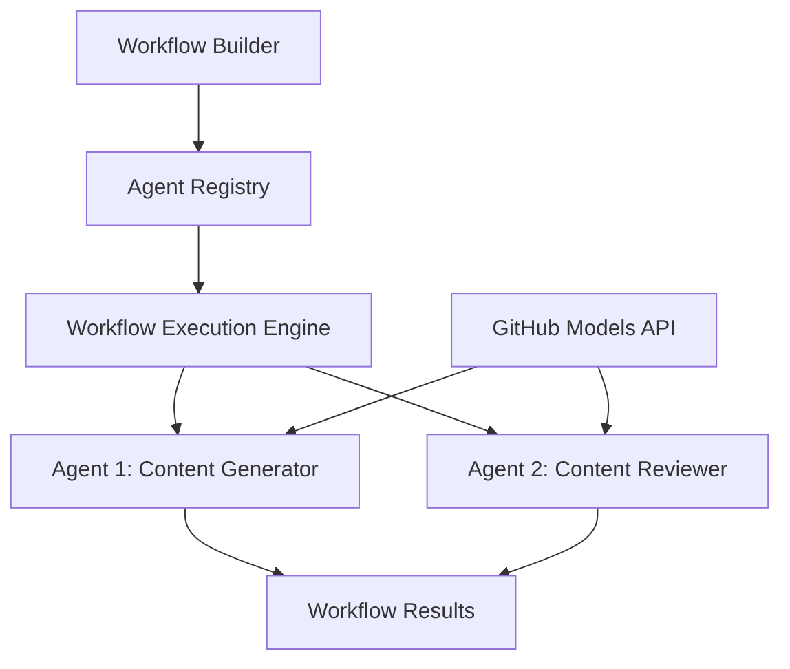

<!--
CO_OP_TRANSLATOR_METADATA:
{
  "original_hash": "034158688d0a45aae06dcbb21b0da5ae",
  "translation_date": "2025-11-11T12:48:46+00:00",
  "source_file": "08-multi-agent/code_samples/workflows-agent-framework/dotNET/01.dotnet-agent-framework-workflow-ghmodel-basic.md",
  "language_code": "pl"
}
-->
# 🔄 Podstawowe przepływy pracy agentów z modelami GitHub (.NET)

## 📋 Samouczek orkiestracji przepływu pracy

Ten notatnik pokazuje, jak budować zaawansowane **przepływy pracy agentów** za pomocą Microsoft Agent Framework dla .NET i modeli GitHub. Nauczysz się tworzyć wieloetapowe procesy biznesowe, w których agenci AI współpracują, aby realizować złożone zadania poprzez uporządkowane wzorce orkiestracji.

## 🎯 Cele nauki

### 🏗️ **Podstawy architektury przepływu pracy**
- **Budowanie przepływu pracy**: Projektowanie i orkiestracja złożonych wieloetapowych procesów AI
- **Koordynacja agentów**: Współpraca wielu wyspecjalizowanych agentów w ramach przepływów pracy
- **Integracja modeli GitHub**: Wykorzystanie usługi inferencji modeli AI GitHub w przepływach pracy
- **Projektowanie wizualne przepływu pracy**: Tworzenie i wizualizacja struktur przepływu pracy dla lepszego zrozumienia

### 🔄 **Wzorce orkiestracji procesów**
- **Przetwarzanie sekwencyjne**: Łączenie zadań agentów w logicznej kolejności
- **Zarządzanie stanem**: Utrzymywanie kontekstu i przepływu danych między etapami przepływu pracy
- **Obsługa błędów**: Implementacja odporności na błędy i odzyskiwanie w przepływie pracy
- **Optymalizacja wydajności**: Projektowanie efektywnych przepływów pracy dla operacji na skalę przedsiębiorstwa

### 🏢 **Zastosowania przepływów pracy w przedsiębiorstwach**
- **Automatyzacja procesów biznesowych**: Automatyzacja złożonych przepływów organizacyjnych
- **Pipeline produkcji treści**: Przepływy redakcyjne z etapami przeglądu i zatwierdzania
- **Automatyzacja obsługi klienta**: Wieloetapowe rozwiązywanie zapytań klientów
- **Przepływy przetwarzania danych**: ETL z transformacją wspieraną przez AI

## ⚙️ Wymagania wstępne i konfiguracja

### 📦 **Wymagane pakiety NuGet**

Demonstracja przepływu pracy wykorzystuje kilka kluczowych pakietów .NET:

```xml
<!-- Core AI Framework -->
<PackageReference Include="Microsoft.Extensions.AI" Version="9.9.0" />

<!-- Agent Framework (Local Development) -->
<!-- Microsoft.Agents.AI.dll - Core agent abstractions -->
<!-- Microsoft.Agents.AI.OpenAI.dll - OpenAI/GitHub Models integration -->

<!-- Configuration and Environment -->
<PackageReference Include="DotNetEnv" Version="3.1.1" />
```

### 🔑 **Konfiguracja modeli GitHub**

**Konfiguracja środowiska (.env file):**
```env
GITHUB_TOKEN=your_github_personal_access_token
GITHUB_ENDPOINT=https://models.inference.ai.azure.com
GITHUB_MODEL_ID=gpt-4o-mini
```

**Dostęp do modeli GitHub:**
1. Zarejestruj się w GitHub Models (obecnie w wersji preview)
2. Wygeneruj osobisty token dostępu z uprawnieniami do modeli
3. Skonfiguruj zmienne środowiskowe zgodnie z powyższym opisem

### 🏗️ **Przegląd architektury przepływu pracy**



**Kluczowe komponenty:**
- **WorkflowBuilder**: Główny silnik orkiestracji do projektowania przepływów pracy
- **AIAgent**: Indywidualni wyspecjalizowani agenci z określonymi możliwościami
- **GitHub Models Client**: Integracja usługi inferencji modeli AI
- **Execution Context**: Zarządza stanem i przepływem danych między etapami przepływu pracy

## 🎨 **Wzorce projektowania przepływów pracy w przedsiębiorstwach**

### 📝 **Przepływ produkcji treści**
```
User Request → Content Generation → Quality Review → Final Output
```

### 🔍 **Pipeline przetwarzania dokumentów**
```
Document Input → Analysis → Extraction → Validation → Structured Output
```

### 💼 **Przepływ pracy Business Intelligence**
```
Data Collection → Processing → Analysis → Report Generation → Distribution
```

### 🤝 **Automatyzacja obsługi klienta**
```
Customer Inquiry → Classification → Processing → Response Generation → Follow-up
```

## 🏢 **Korzyści dla przedsiębiorstw**

### 🎯 **Niezawodność i skalowalność**
- **Deterministyczne wykonanie**: Spójne, powtarzalne wyniki przepływu pracy
- **Odzyskiwanie błędów**: Łagodne radzenie sobie z awariami na dowolnym etapie przepływu pracy
- **Monitorowanie wydajności**: Śledzenie metryk wykonania i możliwości optymalizacji
- **Zarządzanie zasobami**: Efektywne przydzielanie i wykorzystanie zasobów modeli AI

### 🔒 **Bezpieczeństwo i zgodność**
- **Bezpieczne uwierzytelnianie**: Uwierzytelnianie oparte na tokenach GitHub dla dostępu do API
- **Ścieżki audytu**: Pełne logowanie wykonania przepływu pracy i punktów decyzyjnych
- **Kontrola dostępu**: Granularne uprawnienia do wykonania i monitorowania przepływu pracy
- **Prywatność danych**: Bezpieczne przetwarzanie wrażliwych informacji w przepływach pracy

### 📊 **Obserwowalność i zarządzanie**
- **Projektowanie wizualne przepływu pracy**: Jasne przedstawienie przepływów procesów i zależności
- **Monitorowanie wykonania**: Śledzenie w czasie rzeczywistym postępu i wydajności przepływu pracy
- **Raportowanie błędów**: Szczegółowa analiza błędów i możliwości debugowania
- **Analiza wydajności**: Metryki do optymalizacji i planowania pojemności

Zbudujmy Twój pierwszy przepływ pracy AI gotowy dla przedsiębiorstwa! 🚀

## 💻 Uruchamianie kodu

Pełna implementacja jest dostępna w `01.dotnet-agent-framework-workflow-ghmodel-basic.cs`. Ten plik pokazuje:

1. **Konfiguracja środowiska** - Ładowanie poświadczeń modeli GitHub z pliku `.env`
2. **Konfiguracja klienta OpenAI** - Konfigurowanie klienta do korzystania z punktu końcowego modeli GitHub
3. **Tworzenie agentów** - Definiowanie wyspecjalizowanych agentów (Front Desk i Concierge)
4. **Budowanie przepływu pracy** - Tworzenie przepływu pracy z wieloma agentami i przetwarzaniem sekwencyjnym
5. **Wykonanie przepływu pracy** - Uruchamianie przepływu pracy z wynikami strumieniowymi

### 🚀 Uruchamianie przykładu

```bash
# Make the script executable (Unix/Linux/macOS)
chmod +x 01.dotnet-agent-framework-workflow-ghmodel-basic.cs

# Run the workflow
./01.dotnet-agent-framework-workflow-ghmodel-basic.cs
```

Lub na Windows:
```powershell
dotnet run 01.dotnet-agent-framework-workflow-ghmodel-basic.cs
```

### 📝 Oczekiwany wynik

Przepływ pracy:
1. Przyjmie Twoje zapytanie dotyczące celu podróży ("Chciałbym pojechać do Paryża")
2. Agent Front Desk przedstawi wstępną rekomendację
3. Agent Concierge przeanalizuje i udoskonali rekomendację
4. Ostateczny wynik wyświetli pełny strumień rozmowy

### 🔧 Dostosowanie

Możesz dostosować przepływ pracy poprzez:
- Modyfikację instrukcji agentów, aby zmienić ich zachowanie
- Dodanie większej liczby agentów, aby stworzyć złożone wieloetapowe przepływy pracy
- Zmianę wiadomości użytkownika, aby przetestować różne scenariusze
- Dostosowanie krawędzi przepływu pracy, aby stworzyć różne wzorce wykonania

---

<!-- CO-OP TRANSLATOR DISCLAIMER START -->
**Zastrzeżenie**:  
Ten dokument został przetłumaczony za pomocą usługi tłumaczenia AI [Co-op Translator](https://github.com/Azure/co-op-translator). Chociaż staramy się zapewnić dokładność, prosimy pamiętać, że automatyczne tłumaczenia mogą zawierać błędy lub nieścisłości. Oryginalny dokument w jego rodzimym języku powinien być uznawany za autorytatywne źródło. W przypadku informacji krytycznych zaleca się skorzystanie z profesjonalnego tłumaczenia przez człowieka. Nie ponosimy odpowiedzialności za jakiekolwiek nieporozumienia lub błędne interpretacje wynikające z użycia tego tłumaczenia.
<!-- CO-OP TRANSLATOR DISCLAIMER END -->