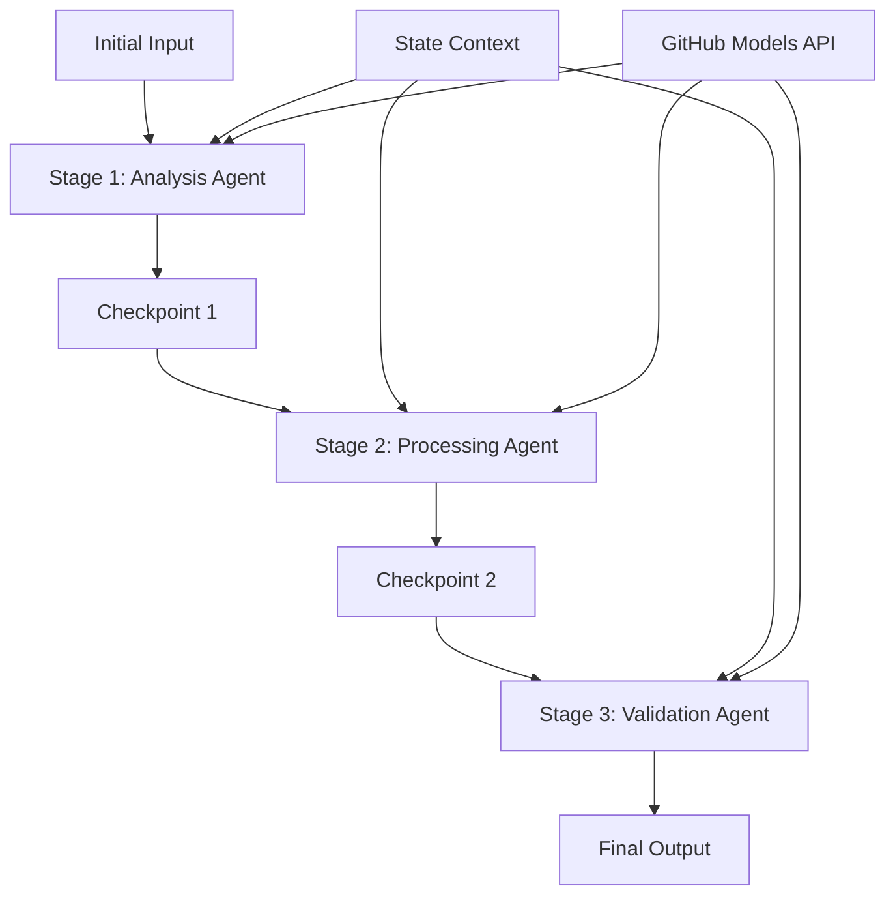

<!--
CO_OP_TRANSLATOR_METADATA:
{
  "original_hash": "1be9c8dcbd79a02d33d2c138684c1394",
  "translation_date": "2025-11-11T13:51:26+00:00",
  "source_file": "08-multi-agent/code_samples/workflows-agent-framework/dotNET/02.dotnet-agent-framework-workflow-ghmodel-sequential.md",
  "language_code": "pl"
}
-->
# ⏩ Sekwencyjne przepływy pracy agentów z modelami GitHub (.NET)

## 📋 Zaawansowany poradnik przetwarzania sekwencyjnego

Ten notebook pokazuje **wzorce przepływu pracy sekwencyjnej** przy użyciu Microsoft Agent Framework dla .NET i modeli GitHub. Nauczysz się budować zaawansowane, krok po kroku, potoki przetwarzania, w których agenci wykonują zadania w określonej kolejności, a każdy etap opiera się na wynikach poprzedniego.

## 🎯 Cele nauki

### 🔄 **Architektura przetwarzania sekwencyjnego**
- **Projektowanie liniowego przepływu pracy**: Tworzenie potoków przetwarzania krok po kroku z wyraźnymi zależnościami
- **Zarządzanie stanem**: Utrzymanie kontekstu i przepływu danych między etapami przepływu pracy
- **Integracja z modelami GitHub**: Wykorzystanie modeli AI GitHub w wieloetapowych przepływach pracy .NET
- **Wzorce potoków dla przedsiębiorstw**: Budowanie gotowych do produkcji systemów przetwarzania sekwencyjnego

### 🏗️ **Zaawansowane wzorce sekwencyjne**
- **Przetwarzanie etapowe**: Wdrażanie punktów walidacji między etapami przepływu pracy
- **Zachowanie kontekstu**: Utrzymanie stanu i zgromadzonej wiedzy na wszystkich etapach
- **Propagacja błędów**: Radzenie sobie z awariami w łańcuchach przetwarzania sekwencyjnego
- **Optymalizacja wydajności**: Efektywne wykonanie sekwencyjne przy minimalnym obciążeniu

### 🏢 **Aplikacje sekwencyjne dla przedsiębiorstw**
- **Potok przetwarzania dokumentów**: Wieloetapowa analiza, transformacja i walidacja dokumentów
- **Przepływy pracy kontroli jakości**: Sekwencyjny przegląd, walidacja i procesy zatwierdzania
- **Potok produkcji treści**: Badania → Pisanie → Edycja → Przegląd → Publikacja
- **Automatyzacja procesów biznesowych**: Wieloetapowe przepływy pracy biznesowej z wyraźnymi zależnościami etapów

## ⚙️ Wymagania wstępne i konfiguracja

### 📦 **Wymagane pakiety NuGet**

Niezbędne pakiety dla sekwencyjnych przepływów pracy .NET:

```xml
<!-- Core AI Framework -->
<PackageReference Include="Microsoft.Extensions.AI" Version="9.9.0" />

<!-- Client Model Abstractions -->
<PackageReference Include="System.ClientModel" Version="1.6.1.0" />

<!-- Azure Identity and Async LINQ Support -->
<PackageReference Include="Azure.Identity" Version="1.15.0" />
<PackageReference Include="System.Linq.Async" Version="6.0.3" />

<!-- Local Agent Framework References -->
<!-- Microsoft.Agents.AI.dll - Core agent abstractions -->
<!-- Microsoft.Agents.AI.OpenAI.dll - GitHub Models integration -->
```

### 🔑 **Konfiguracja modeli GitHub**

**Konfiguracja środowiska (.env file):**
```env
GITHUB_TOKEN=your_github_personal_access_token
GITHUB_ENDPOINT=https://models.inference.ai.azure.com
GITHUB_MODEL_ID=gpt-4o-mini
```

**Zarządzanie konfiguracją:**
```csharp
// Load environment variables securely
Env.Load("../../../.env");
var githubToken = Environment.GetEnvironmentVariable("GITHUB_TOKEN");
var githubEndpoint = Environment.GetEnvironmentVariable("GITHUB_ENDPOINT");
var modelId = Environment.GetEnvironmentVariable("GITHUB_MODEL_ID");
```

### 🏗️ **Architektura przepływu pracy sekwencyjnego**



**Kluczowe komponenty:**
- **Agenci sekwencyjni**: Specjalizowani agenci dla każdego etapu przetwarzania
- **Kontekst stanu**: Utrzymuje zgromadzone dane i decyzje między etapami
- **Punkty kontrolne**: Punkty walidacji między etapami zapewniające jakość i spójność
- **Klient modeli GitHub**: Spójny dostęp do modeli AI na wszystkich etapach przepływu pracy

## 🎨 **Wzorce projektowania przepływu pracy sekwencyjnego**

### 📝 **Potok przetwarzania dokumentów**
```
Raw Document → Content Extraction → Analysis → Validation → Structured Output
```

### 🎯 **Przepływ produkcji treści**
```
Brief/Requirements → Research → Content Creation → Review → Final Polish
```

### 🔍 **Potok kontroli jakości**
```
Initial Review → Technical Validation → Compliance Check → Final Approval
```

### 💼 **Przepływ pracy analityki biznesowej**
```
Data Collection → Processing → Analysis → Report Generation → Distribution
```

## 🏢 **Korzyści sekwencyjne dla przedsiębiorstw**

### 🎯 **Niezawodność i jakość**
- **Deterministyczne przetwarzanie**: Spójne, powtarzalne wyniki dzięki ustrukturyzowanym etapom
- **Bramki jakości**: Punkty walidacji zapewniają jakość na każdym etapie
- **Izolacja błędów**: Problemy na jednym etapie nie wpływają na kolejne
- **Ścieżki audytu**: Pełne śledzenie decyzji i transformacji na każdym etapie

### 📈 **Skalowalność i wydajność**
- **Modularny projekt**: Każdy etap można optymalizować niezależnie
- **Zarządzanie zasobami**: Efektywne wykorzystanie zasobów modeli AI na etapach
- **Optymalizacja stanu**: Minimalny transfer stanu między etapami dla optymalnej wydajności
- **Grupy etapów równoległych**: Wiele sekwencyjnych przepływów pracy może działać równolegle

### 🔒 **Bezpieczeństwo i zgodność**
- **Bezpieczeństwo na poziomie etapów**: Różne polityki bezpieczeństwa dla różnych etapów przetwarzania
- **Walidacja danych**: Zapewnienie integralności danych i zgodności na każdym punkcie kontrolnym
- **Kontrola dostępu**: Granularne uprawnienia dla różnych etapów przepływu pracy
- **Zgodność regulacyjna**: Spełnianie wymagań regulacyjnych dzięki ustrukturyzowanemu przetwarzaniu

### 📊 **Monitorowanie i analityka**
- **Metryki na poziomie etapów**: Monitorowanie wydajności dla każdego etapu przepływu pracy
- **Identyfikacja wąskich gardeł**: Identyfikacja i optymalizacja wolnych etapów
- **Metryki jakości**: Śledzenie jakości i wskaźników sukcesu na każdym etapie
- **Optymalizacja procesów**: Ciągłe doskonalenie na podstawie analityki etapowej

Budujmy solidne sekwencyjne potoki przetwarzania AI! 🚀

## 💻 Uruchamianie kodu

Kompletna implementacja jest dostępna w pliku `02.dotnet-agent-framework-workflow-ghmodel-sequential.cs`. Ten plik pokazuje **trzystopniowy przepływ analizy mebli**:

1. **Etap 1 - Agent sprzedaży**: Analizuje obrazy mebli i przedstawia sugestie zakupowe
2. **Etap 2 - Agent cenowy**: Dostarcza szczegółowe analizy cenowe i opcje budżetowe
3. **Etap 3 - Agent ofertowy**: Generuje profesjonalny dokument oferty w formacie Markdown

### 🏗️ **Architektura przepływu pracy**

```
Image Input → Sales Analysis → Price Estimation → Quote Generation → Final Output
```

Każdy agent:
- Otrzymuje wynik z poprzedniego etapu jako kontekst
- Rozwija poprzednią analizę dzięki specjalistycznej wiedzy
- Utrzymuje ciągłość przepływu pracy poprzez zarządzanie stanem

### 🚀 Uruchamianie przykładu

**Wymagania wstępne:**
- Umieść obraz mebli w `../imgs/home.png` (lub zaktualizuj zmienną `imgPath`)
- Skonfiguruj plik `.env` z poświadczeniami modeli GitHub

```bash
# Make the script executable (Unix/Linux/macOS)
chmod +x 02.dotnet-agent-framework-workflow-ghmodel-sequential.cs

# Run the sequential workflow
./02.dotnet-agent-framework-workflow-ghmodel-sequential.cs
```

Lub na Windows:
```powershell
dotnet run 02.dotnet-agent-framework-workflow-ghmodel-sequential.cs
```

### 📝 Oczekiwany wynik

Przepływ pracy:
1. **Agent sprzedaży**: Identyfikuje elementy mebli na obrazie i przedstawia rekomendacje
2. **Agent cenowy**: Dodaje szczegółową analizę cenową z poziomami budżetowymi i rekomendacjami zakupowymi
3. **Agent ofertowy**: Generuje sformatowany dokument oferty z całą zsyntetyzowaną informacją

Końcowy wynik to kompleksowa, profesjonalna oferta meblowa oparta na analizie obrazu.

### 🔧 Opcje dostosowania

**Modyfikacja zachowania agenta:**
```csharp
// Adjust agent instructions to change their focus
const string SalesAgentInstructions = "Your custom instructions...";
```

**Zmiana przepływu sekwencyjnego:**
```csharp
// Add or reorder workflow stages
var workflow = new WorkflowBuilder(salesagent)
    .AddEdge(salesagent, priceagent)
    .AddEdge(priceagent, quoteagent)
    .AddEdge(quoteagent, newAgent)  // Add another stage
    .Build();
```

**Użycie innego wejścia:**
```csharp
// Process text instead of images
ChatMessage userMessage = new ChatMessage(ChatRole.User, [
    new TextContent("Analyze pricing for a modern living room set")
]);
```

### 🎯 Zastosowania w rzeczywistości

Ten wzorzec sekwencyjny idealnie nadaje się do:
- **E-commerce**: Analiza produktów → Wycenianie → Generowanie ofert
- **Nieruchomości**: Analiza nieruchomości → Wycena → Tworzenie ogłoszeń
- **Ubezpieczenia**: Analiza roszczeń → Ocena → Generowanie ofert
- **Tworzenie treści**: Badania → Pisanie → Edycja → Publikacja

### 🔍 Zrozumienie przepływu stanu

Każdy agent w sekwencji otrzymuje:
- **Oryginalne wejście**: Początkową wiadomość użytkownika (obraz + tekst)
- **Wyniki poprzednich agentów**: Wszystkie odpowiedzi poprzednich agentów w historii rozmowy
- **Zgromadzony kontekst**: Kompletny stan utrzymywany przez cały przepływ pracy

To umożliwia zaawansowane wieloetapowe przetwarzanie, w którym każdy agent opiera się na kompleksowym kontekście z wszystkich poprzednich etapów.

---

<!-- CO-OP TRANSLATOR DISCLAIMER START -->
**Zastrzeżenie**:  
Ten dokument został przetłumaczony za pomocą usługi tłumaczenia AI [Co-op Translator](https://github.com/Azure/co-op-translator). Chociaż staramy się zapewnić dokładność, prosimy pamiętać, że automatyczne tłumaczenia mogą zawierać błędy lub nieścisłości. Oryginalny dokument w jego rodzimym języku powinien być uznawany za wiarygodne źródło. W przypadku informacji krytycznych zaleca się skorzystanie z profesjonalnego tłumaczenia przez człowieka. Nie ponosimy odpowiedzialności za jakiekolwiek nieporozumienia lub błędne interpretacje wynikające z użycia tego tłumaczenia.
<!-- CO-OP TRANSLATOR DISCLAIMER END -->