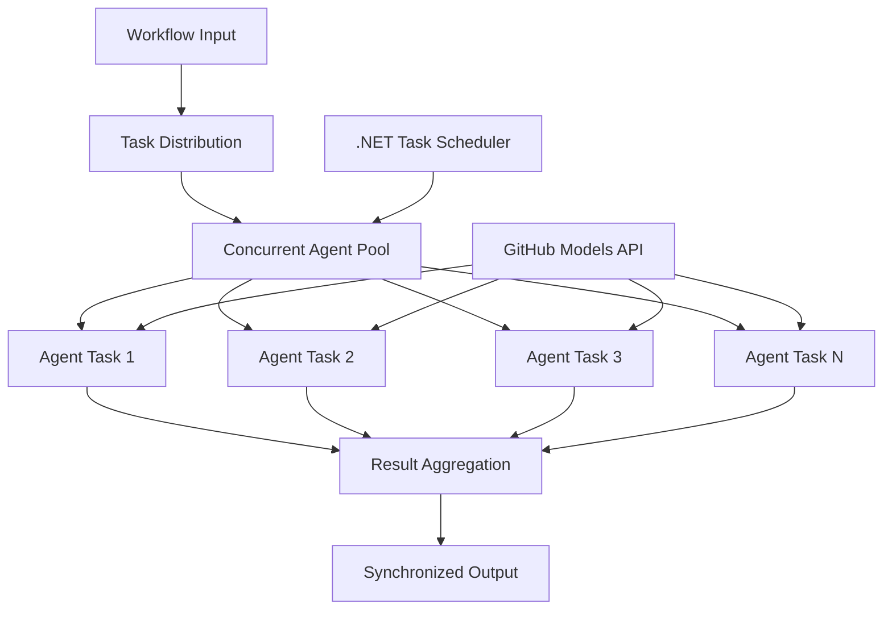

<!--
CO_OP_TRANSLATOR_METADATA:
{
  "original_hash": "b9c6e32c9b5f2fed20b6916984440d88",
  "translation_date": "2025-11-11T13:18:05+00:00",
  "source_file": "08-multi-agent/code_samples/workflows-agent-framework/dotNET/03.dotnet-agent-framework-workflow-ghmodel-concurrent.md",
  "language_code": "pl"
}
-->
# ⚡ Równoczesne przepływy pracy agentów z modelami GitHub (.NET)

## 📋 Samouczek wysokowydajnego przetwarzania równoległego

Ten notebook demonstruje **wzorce przepływów pracy równoczesnych** przy użyciu Microsoft Agent Framework dla .NET i modeli GitHub. Nauczysz się budować wysokowydajne przepływy pracy przetwarzania równoległego, które maksymalizują przepustowość poprzez jednoczesne uruchamianie wielu agentów AI, zachowując jednocześnie koordynację i spójność danych.

## 🎯 Cele nauki

### 🚀 **Podstawy przetwarzania równoczesnego**
- **Równoczesne uruchamianie agentów**: Uruchamiaj wielu agentów AI jednocześnie dla maksymalnej wydajności
- **Wzorce Async/Await**: Wykorzystaj model programowania asynchronicznego .NET dla efektywnej równoczesności
- **Integracja z modelami GitHub**: Koordynuj wiele równoczesnych wywołań usługi inferencji modeli AI GitHub
- **Zarządzanie zasobami**: Efektywnie zarządzaj zasobami modeli AI w operacjach równoczesnych

### 🏗️ **Zaawansowana architektura równoczesności**
- **Równoległość oparta na zadaniach**: Wykorzystaj bibliotekę Task Parallel Library .NET dla optymalnego wykonania równoczesnego
- **Wzorce synchronizacji**: Koordynuj równoczesnych agentów, unikając konfliktów wyścigowych
- **Równoważenie obciążenia**: Efektywnie rozdzielaj pracę na dostępne możliwości przetwarzania równoczesnego
- **Odporność na błędy**: Radź sobie z awariami pojedynczych agentów bez zatrzymywania całego przepływu pracy

### 🏢 **Równoczesne aplikacje dla przedsiębiorstw**
- **Przetwarzanie dokumentów o dużej objętości**: Przetwarzaj wiele dokumentów jednocześnie
- **Analiza treści w czasie rzeczywistym**: Równoczesna analiza strumieni danych przychodzących
- **Optymalizacja przetwarzania wsadowego**: Maksymalizuj przepustowość dla operacji przetwarzania danych na dużą skalę
- **Analiza wielomodalna**: Równoczesne przetwarzanie różnych typów i formatów treści

## ⚙️ Wymagania wstępne i konfiguracja

### 📦 **Wymagane pakiety NuGet**

Niezbędne pakiety dla wysokowydajnych przepływów pracy równoczesnych:

```xml
<!-- Core AI Framework with Async Support -->
<PackageReference Include="Microsoft.Extensions.AI" Version="9.9.0" />

<!-- Client Model Abstractions for API Communication -->
<PackageReference Include="System.ClientModel" Version="1.6.1.0" />

<!-- Azure Identity and Async LINQ for Advanced Operations -->
<PackageReference Include="Azure.Identity" Version="1.15.0" />
<PackageReference Include="System.Linq.Async" Version="6.0.3" />

<!-- Local Agent Framework References -->
<!-- Microsoft.Agents.AI.dll - Core agent abstractions with async support -->
<!-- Microsoft.Agents.AI.OpenAI.dll - GitHub Models integration with concurrency -->
```

### 🔑 **Konfiguracja modeli GitHub**

**Konfiguracja środowiska (.env file):**
```env
GITHUB_TOKEN=your_github_personal_access_token
GITHUB_ENDPOINT=https://models.inference.ai.azure.com
GITHUB_MODEL_ID=gpt-4o-mini
```

**Uwagi dotyczące przetwarzania równoczesnego:**
```csharp
// Configure for concurrent operations
var clientOptions = new OpenAIClientOptions()
{
    Endpoint = new Uri(githubEndpoint),
    // Configure connection pooling for concurrent requests
    NetworkTimeout = TimeSpan.FromMinutes(5)
};
```

### 🏗️ **Architektura przepływu pracy równoczesnego**



**Kluczowe komponenty:**
- **Task Parallel Library**: Wbudowane wsparcie .NET dla operacji równoczesnych
- **Pula agentów**: Wiele instancji agentów dla przetwarzania równoległego
- **Agregacja wyników**: Koordynacja i łączenie wyników równoczesnych agentów
- **Punkty synchronizacji**: Zapewnienie spójności danych w operacjach równoczesnych

## 🎨 **Wzorce projektowe przepływu pracy równoczesnego**

### 🔍 **Równoległe badania i analiza**
```
Research Topic → Concurrent Research Agents → Result Synthesis → Final Report
```

### 📊 **Przetwarzanie danych z wielu źródeł**
```
Data Sources → Parallel Processing Agents → Data Integration → Unified Output
```

### 🎭 **Pipeline generowania treści**
```
Content Requirements → Concurrent Content Generators → Quality Review → Final Content
```

### 🔄 **Przetwarzanie Fan-Out/Fan-In**
```
Single Input → Multiple Concurrent Processors → Result Aggregation → Single Output
```

## 🏢 **Korzyści z wydajności w przedsiębiorstwach**

### ⚡ **Przepustowość i skalowalność**
- **Liniowa skalowalność wydajności**: Dodaj więcej równoczesnych agentów, aby zwiększyć przepustowość
- **Wykorzystanie zasobów**: Maksymalna efektywność dostępnej pojemności modelu AI
- **Skrócony czas przetwarzania**: Znaczące skrócenie czasu dzięki wykonaniu równoległemu
- **Elastyczna skalowalność**: Dynamiczne dostosowanie liczby równoczesnych agentów w zależności od obciążenia

### 🛡️ **Niezawodność i odporność**
- **Izolacja błędów**: Awaria pojedynczego agenta nie wpływa na inne operacje równoczesne
- **Łagodna degradacja**: System działa dalej z ograniczoną pojemnością agentów
- **Odzyskiwanie błędów**: Automatyczne mechanizmy ponownego uruchamiania dla nieudanych operacji równoczesnych
- **Rozdział obciążenia**: Równomierne rozdzielenie pracy na dostępnych agentów

### 📊 **Monitorowanie wydajności**
- **Metryki wykonania równoczesnego**: Śledź wydajność wszystkich operacji równoległych
- **Analiza wykorzystania zasobów**: Monitoruj użycie CPU, pamięci i sieci
- **Analiza przepustowości**: Mierz korzyści wydajnościowe wynikające z przetwarzania równoczesnego
- **Wykrywanie wąskich gardeł**: Identyfikuj i rozwiązuj ograniczenia wydajności

### 🔧 **Rozwój i operacje**
- **Model programowania asynchronicznego**: Wykorzystaj dojrzałe wzorce async/await w .NET
- **Koordynacja zadań**: Wbudowane zarządzanie zadaniami i możliwości koordynacji
- **Obsługa wyjątków**: Kompleksowa obsługa błędów dla operacji równoczesnych
- **Wsparcie debugowania**: Narzędzia debugowania Visual Studio dla przepływów pracy równoczesnych

Budujmy wysokowydajne równoczesne przepływy pracy AI z .NET! 🚀

## 💻 Uruchamianie kodu

Kompletna implementacja jest dostępna w `03.dotnet-agent-framework-workflow-ghmodel-concurrent.cs`. Ten plik demonstruje **przepływ pracy Fan-Out/Fan-In** dla planowania podróży:

### 🏗️ **Architektura przepływu pracy**

```
User Request → ConcurrentStartExecutor → [Researcher Agent || Planner Agent] → ConcurrentAggregationExecutor → Final Output
```

**Kluczowe komponenty:**

1. **ConcurrentStartExecutor**: Rozsyła żądanie użytkownika do wszystkich agentów jednocześnie
2. **Researcher Agent**: Równocześnie analizuje miejsca docelowe i atrakcje
3. **Planner Agent**: Tworzy szczegółowe plany podróży równocześnie
4. **ConcurrentAggregationExecutor**: Zbiera i łączy wyniki od obu agentów

### 🎯 **Wzorzec Fan-Out/Fan-In**

Ten przepływ pracy demonstruje klasyczny wzorzec **Fan-Out/Fan-In**:
- **Fan-Out**: Jedna wiadomość wejściowa jest rozsyłana do wielu agentów jednocześnie
- **Przetwarzanie równoczesne**: Wielu agentów pracuje równolegle nad tym samym zadaniem
- **Fan-In**: Wyniki od wszystkich agentów są zbierane i agregowane w jeden wynik

### 🚀 Uruchamianie przykładu

```bash
# Make the script executable (Unix/Linux/macOS)
chmod +x 03.dotnet-agent-framework-workflow-ghmodel-concurrent.cs

# Run the concurrent workflow
./03.dotnet-agent-framework-workflow-ghmodel-concurrent.cs
```

Lub na Windows:
```powershell
dotnet run 03.dotnet-agent-framework-workflow-ghmodel-concurrent.cs
```

### 📝 Oczekiwany wynik

Przepływ pracy:
1. **Rozsyła żądanie**: Wysyła "Zaplanuj podróż do Seattle w grudniu" do obu agentów
2. **Przetwarzanie równoczesne**: Oba agenty pracują jednocześnie:
   - Researcher identyfikuje atrakcje i szczegóły
   - Planner tworzy harmonogram i logistykę
3. **Agregacja**: Łączy odpowiedzi obu agentów w kompleksowy wynik
4. **Wyświetla wyniki**: Pokazuje zintegrowany plan podróży ze wszystkimi informacjami

### 🔧 Opcje dostosowania

**Dodaj więcej równoczesnych agentów:**
```csharp
// Create additional specialized agents
AIAgent budgetAgent = openAIClient.GetChatClient(github_model_id).CreateAIAgent(
    name: "Budget-Agent", instructions: "Calculate travel costs...");

// Add to fan-out
var workflow = new WorkflowBuilder(startExecutor)
    .AddFanOutEdge(startExecutor, targets: [researcherAgent, plannerAgent, budgetAgent])
    .AddFanInEdge(aggregationExecutor, sources: [researcherAgent, plannerAgent, budgetAgent])
    .WithOutputFrom(aggregationExecutor)
    .Build();

// Update aggregation count
if (this._messages.Count == 3) { ... }
```

**Zmodyfikuj instrukcje dla agentów:**
```csharp
const string ResearcherAgentInstructions = "Your custom instructions for research...";
const string PlanAgentInstructions = "Your custom instructions for planning...";
```

**Zmień zadanie:**
```csharp
StreamingRun run = await InProcessExecution.StreamAsync(
    workflow, 
    "Plan a European vacation for 2 weeks in summer"
);
```

### 🎯 Zastosowania w rzeczywistości

Ten wzorzec równoczesny jest idealny dla:
- **Tworzenia treści**: Wielu autorów jednocześnie tworzących różne sekcje
- **Przeglądu kodu**: Wielu recenzentów analizujących kod z różnych perspektyw
- **Badania rynku**: Równoległa analiza różnych segmentów rynku
- **Przetwarzania dokumentów**: Równoczesne wydobywanie, analiza i walidacja
- **Analizy wieloperspektywicznej**: Uzyskiwanie różnorodnych punktów widzenia na ten sam temat

### 🔍 Zrozumienie niestandardowych wykonawców

**ConcurrentStartExecutor:**
- Implementuje `IMessageHandler<string>` do akceptacji danych wejściowych w formie tekstu
- Rozsyła wiadomości do wszystkich podłączonych agentów
- Wysyła `TurnToken`, aby uruchomić przetwarzanie równoczesne

**ConcurrentAggregationExecutor:**
- Implementuje `IMessageHandler<ChatMessage>` do odbioru odpowiedzi agentów
- Zbiera wiadomości w sposób bezpieczny dla wątków
- Agreguje, gdy wszystkie oczekiwane odpowiedzi dotrą
- Zwraca ostateczny wynik za pomocą `context.YieldOutputAsync()`

### ⚡ Korzyści wydajnościowe

**Równoczesne vs sekwencyjne:**
- Sekwencyjne: Agent1 (30s) → Agent2 (30s) = **60 sekund łącznie**
- Równoczesne: Agent1 (30s) || Agent2 (30s) = **30 sekund łącznie**

**Poprawa przepustowości**: Do N× szybciej dla N równoczesnych agentów (w zależności od obciążenia i zasobów)

### 🛡️ Obsługa błędów

Przepływ pracy radzi sobie z awariami pojedynczych agentów:
- Jeśli jeden agent zawiedzie, inni kontynuują przetwarzanie
- Agregator może zaimplementować logikę timeoutu
- Można zwrócić częściowe wyniki, jeśli to konieczne

### 📊 Zaawansowane funkcje

**Dynamiczna liczba agentów:**
Zmodyfikuj logikę agregacji, aby obsługiwać zmienną liczbę agentów:

```csharp
private int _expectedAgentCount;
private readonly List<ChatMessage> _messages = [];

public async ValueTask HandleAsync(ChatMessage message, IWorkflowContext context)
{
    this._messages.Add(message);
    if (this._messages.Count == _expectedAgentCount)
    {
        // Process aggregation
    }
}
```

Ten wzorzec przepływu pracy równoczesnego jest kluczowy dla budowy wysokowydajnych, skalowalnych systemów agentów AI!

---

<!-- CO-OP TRANSLATOR DISCLAIMER START -->
**Zastrzeżenie**:  
Ten dokument został przetłumaczony za pomocą usługi tłumaczenia AI [Co-op Translator](https://github.com/Azure/co-op-translator). Chociaż staramy się zapewnić dokładność, prosimy pamiętać, że automatyczne tłumaczenia mogą zawierać błędy lub nieścisłości. Oryginalny dokument w jego rodzimym języku powinien być uznawany za autorytatywne źródło. W przypadku informacji krytycznych zaleca się skorzystanie z profesjonalnego tłumaczenia przez człowieka. Nie ponosimy odpowiedzialności za jakiekolwiek nieporozumienia lub błędne interpretacje wynikające z użycia tego tłumaczenia.
<!-- CO-OP TRANSLATOR DISCLAIMER END -->