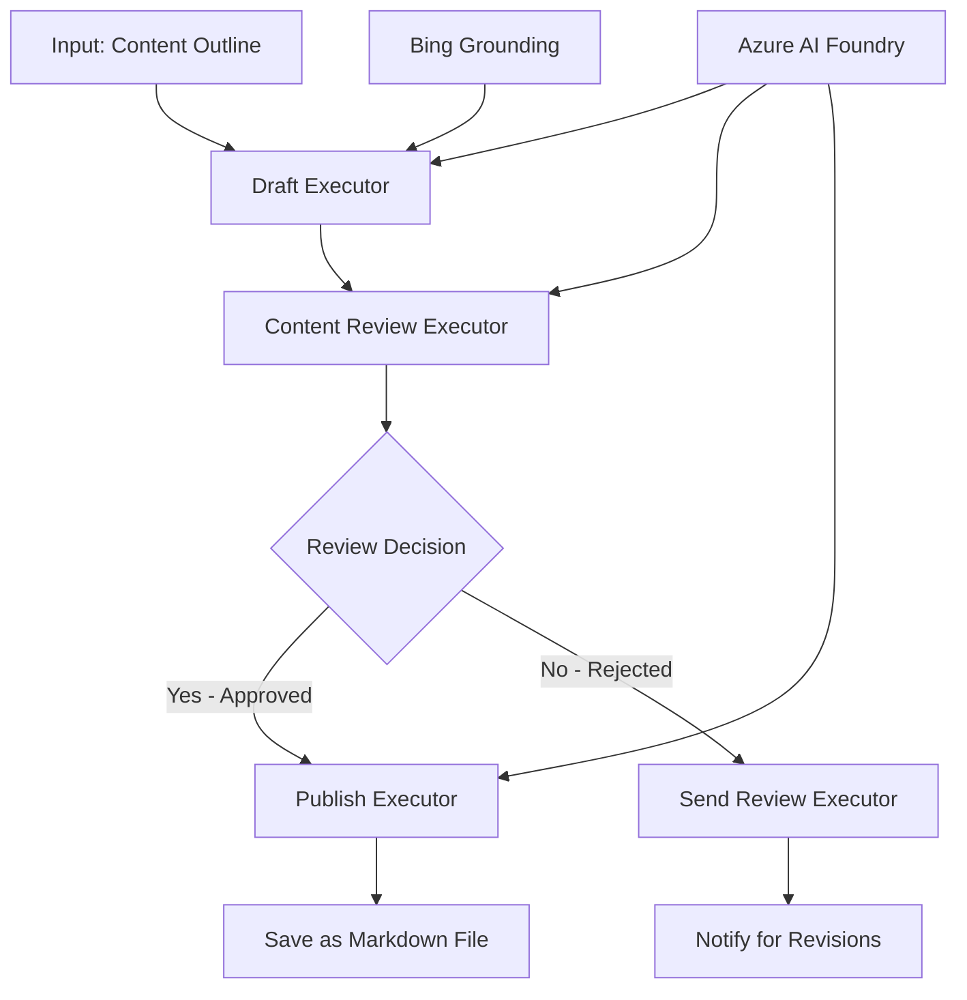

<!--
CO_OP_TRANSLATOR_METADATA:
{
  "original_hash": "8abd335151cee553293b637ee3d80d10",
  "translation_date": "2025-11-11T12:14:55+00:00",
  "source_file": "08-multi-agent/code_samples/workflows-agent-framework/dotNET/04.dotnet-agent-framework-workflow-aifoundry-condition.md",
  "language_code": "pl"
}
-->
# 🔀 Warunkowe przepływy pracy agentów z Azure AI Foundry (.NET)

## 📋 Samouczek inteligentnych przepływów pracy opartych na decyzjach

Ten notebook pokazuje **wzorce warunkowych przepływów pracy** z wykorzystaniem Azure AI Foundry i Microsoft Agent Framework dla .NET. Nauczysz się tworzyć zaawansowane, oparte na decyzjach przepływy pracy, które inteligentnie kierują procesy na podstawie analizy AI, reguł biznesowych i dynamicznych warunków, zapewniając automatyzację na poziomie korporacyjnym.

## 🎯 Cele nauki

### 🧠 **Architektura inteligentnych decyzji**
- **Implementacja logiki warunkowej**: Tworzenie złożonych drzew decyzyjnych z wieloma punktami rozgałęzienia
- **Routing oparty na AI**: Wykorzystanie modeli Azure AI Foundry do podejmowania inteligentnych decyzji dotyczących kierowania
- **Dynamiczna adaptacja przepływu pracy**: Modyfikowanie zachowania przepływu pracy na podstawie analizy w czasie rzeczywistym i warunków
- **Integracja reguł biznesowych**: Włączanie logiki biznesowej i wymagań zgodności do przepływów pracy

### 🔀 **Zaawansowane wzorce warunkowe**
- **Podejmowanie decyzji na podstawie wielu kryteriów**: Ocena wielu czynników przy podejmowaniu decyzji o kierowaniu
- **Przetwarzanie świadome kontekstu**: Podejmowanie decyzji na podstawie zgromadzonego kontekstu i historii przepływu pracy
- **Adaptacyjna modyfikacja przepływu pracy**: Dynamiczne dostosowywanie ścieżek przetwarzania na podstawie warunków w czasie rzeczywistym
- **Integracja silnika reguł**: Implementacja zaawansowanych silników reguł biznesowych w przepływach pracy

### 🏢 **Warunkowe zastosowania korporacyjne**
- **Klasyfikacja i kierowanie dokumentów**: Automatyczna klasyfikacja i kierowanie dokumentów do odpowiednich przepływów pracy
- **Triaging obsługi klienta**: Inteligentne kierowanie zapytań klientów do wyspecjalizowanych zespołów obsługi
- **Przetwarzanie zgodności i ryzyka**: Zastosowanie różnych procesów walidacji i przeglądu na podstawie oceny ryzyka
- **Przepływy pracy kontroli jakości**: Kierowanie treści przez odpowiednie procesy przeglądu na podstawie metryk jakości

## ⚙️ Wymagania wstępne i konfiguracja

### 📦 **Wymagane pakiety NuGet**

Zaawansowane pakiety do przetwarzania warunkowych przepływów pracy:

```xml
<!-- Core AI Framework -->
<PackageReference Include="Microsoft.Extensions.AI" Version="9.9.0" />

<!-- Azure AI Agents with Persistent State -->
<PackageReference Include="Azure.AI.Agents.Persistent" Version="1.2.0-beta.5" />

<!-- Azure Identity and Utilities -->
<PackageReference Include="Azure.Identity" Version="1.15.0" />
<PackageReference Include="System.Linq.Async" Version="6.0.3" />
<PackageReference Include="DotNetEnv" Version="3.1.1" />

<!-- Local Workflow Framework References -->
<!-- Microsoft.Agents.Workflows.dll - Advanced workflow orchestration -->
<!-- Microsoft.Agents.AI.AzureAI.dll - Azure AI Foundry integration -->
<!-- Microsoft.Agents.AI.dll - Core agent abstractions -->
```

### 🔑 **Konfiguracja Azure AI Foundry**

**Wymagane zasoby Azure:**
- Workspace Azure AI Foundry z modelami przetwarzania warunkowego
- Subskrypcja Azure z odpowiednimi limitami obliczeniowymi i uprawnieniami
- Wdrożone modele AI do podejmowania decyzji i analizy treści
- (Opcjonalnie) Połączenie Bing Search API dla funkcji uziemienia

**Konfiguracja środowiska (.env file):**
```env
# Azure AI Foundry Configuration
AZURE_AI_PROJECT_ENDPOINT=https://your-project.cognitiveservices.azure.com/
BING_CONNECTION_ID=your-bing-connection-id
```

**Konfiguracja uwierzytelniania:**
```csharp
// Azure CLI or Managed Identity authentication
using Azure.Identity;
var credential = new AzureCliCredential();

// Load environment configuration
DotNetEnv.Env.Load("../../../.env");
```

### 🏗️ **Architektura warunkowego przepływu pracy**



**Kluczowe komponenty:**
- **Draft Executor**: Agent AI tworzący wstępne wersje treści na podstawie zarysów
- **Content Review Executor**: Agent AI oceniający jakość i zgodność wstępnych wersji
- **Conditional Routing**: Logika decyzyjna kierująca na podstawie wyników przeglądu
- **Publish/Review Paths**: Oddzielne ścieżki przetwarzania dla zatwierdzonych i odrzuconych treści
- **State Management**: Utrzymuje kontekst treści i przeglądu w całym przepływie pracy

## 🎨 **Wzorce projektowe warunkowych przepływów pracy**

### 📋 **Produkcja treści z bramkami jakości**
```
Outline → Draft Creation → Quality Review → {Approve: Publish | Reject: Revise}
```

### 🎯 **Przetwarzanie dokumentów oparte na ryzyku**
```
Document → Risk Assessment → {Low: Standard | High: Enhanced Review}
```

### 🔍 **Inteligentne kierowanie obsługi klienta**
```
Customer Query → Analysis → {Simple: FAQ Bot | Complex: Human Agent}
```

### 💼 **Przepływy pracy oparte na zgodności**
```
Content → Compliance Check → {Pass: Publish | Fail: Legal Review}
```

## 🏢 **Korzyści z warunkowych zastosowań korporacyjnych**

### 🎯 **Inteligentna automatyzacja**
- **Inteligentne podejmowanie decyzji**: Decyzje dotyczące kierowania oparte na analizie treści i kontekstu
- **Adaptacyjne przetwarzanie**: Przepływy pracy automatycznie dostosowujące się do zmieniających się warunków
- **Egzekwowanie reguł biznesowych**: Automatyczne stosowanie złożonej logiki biznesowej i polityk
- **Routing świadomy kontekstu**: Decyzje oparte na pełnej historii przepływu pracy i zgromadzonym kontekście

### 📈 **Doskonalenie operacyjne**
- **Optymalizacja alokacji zasobów**: Kierowanie pracy do najbardziej odpowiednich specjalistów i procesów
- **Zmniejszenie interwencji manualnej**: Automatyczne podejmowanie decyzji minimalizuje potrzebę ręcznego kierowania
- **Szybsze czasy rozwiązywania**: Bezpośrednie kierowanie do odpowiednich ekspertów i możliwości przetwarzania
- **Spójne stosowanie**: Jednolite stosowanie reguł biznesowych i kryteriów decyzyjnych

### 🛡️ **Zarządzanie ryzykiem i zgodnością**
- **Automatyczna ocena ryzyka**: Ocena ryzyka treści i sytuacji oparta na AI
- **Egzekwowanie zgodności**: Automatyczne kierowanie przez wymagane procesy regulacyjne
- **Zastosowanie protokołów bezpieczeństwa**: Zwiększone środki bezpieczeństwa stosowane na podstawie oceny ryzyka
- **Utrzymanie ścieżki audytu**: Pełna dokumentacja decyzji dotyczących kierowania i ich uzasadnienia

### 📊 **Analiza i ciągłe doskonalenie**
- **Analiza decyzji**: Śledzenie skuteczności i dokładności decyzji dotyczących kierowania
- **Rozpoznawanie wzorców**: Identyfikacja trendów i wzorców w decyzjach dotyczących kierowania w czasie
- **Optymalizacja wydajności**: Ciągłe doskonalenie kryteriów decyzyjnych i efektywności kierowania
- **Inteligencja biznesowa**: Wgląd w charakterystykę treści i wymagania dotyczące przetwarzania

### 🔧 **Doskonalenie techniczne**
- **Utrzymanie stanu**: Utrzymanie złożonego stanu w całym wykonaniu przepływu pracy
- **Skalowalna architektura**: Obsługa wymagań dotyczących przetwarzania warunkowego na dużą skalę
- **Możliwości integracji**: Bezproblemowa integracja z istniejącymi systemami i procesami biznesowymi
- **Monitorowanie i obserwowalność**: Kompleksowe śledzenie wydajności przepływu pracy i decyzji

Budujmy inteligentne, oparte na decyzjach przepływy pracy dla przedsiębiorstw z .NET! 🚀

## 💻 Uruchamianie kodu

Pełna implementacja jest dostępna w `04.dotnet-agent-framework-workflow-aifoundry-condition.cs`. Demonstruje ona **przepływ pracy produkcji treści z bramkami jakości**:

### 🏗️ **Architektura przepływu pracy**

```
Content Outline → Draft Creation → Quality Review → Conditional Routing:
                                                      ├─ Approved (>200 words) → Publish
                                                      └─ Rejected (<200 words) → Review Notification
```

**Agenci w przepływie pracy:**
1. **Evangelist Agent**: Tworzy wstępne wersje samouczków na podstawie zarysów z uziemieniem Bing
2. **Content Reviewer Agent**: Ocena jakości wstępnych wersji (liczba słów, kompletność)
3. **Publisher Agent**: Zapisuje zatwierdzone treści jako pliki Markdown z datą

**Wykonawcy niestandardowi:**
1. **DraftExecutor**: Orkiestruje tworzenie wstępnych wersji
2. **ContentReviewExecutor**: Przeprowadza ocenę jakości
3. **PublishExecutor**: Obsługuje publikację zatwierdzonych treści
4. **SendReviewExecutor**: Zarządza powiadomieniami o odrzuconych treściach

### 🚀 Uruchamianie przykładu

**Wymagania wstępne:**
- Skonfigurowany workspace Azure AI Foundry
- Uwierzytelnienie Azure CLI (`az login`)
- (Opcjonalnie) Połączenie Bing Search dla uziemienia

```bash
# Make the script executable (Unix/Linux/macOS)
chmod +x 04.dotnet-agent-framework-workflow-aifoundry-condition.cs

# Run the conditional workflow
./04.dotnet-agent-framework-workflow-aifoundry-condition.cs
```

Lub na Windows:
```powershell
dotnet run 04.dotnet-agent-framework-workflow-aifoundry-condition.cs
```

### 📝 Oczekiwany wynik

Przepływ pracy:
1. **Tworzy agentów**: Inicjalizuje trzech wyspecjalizowanych agentów Azure AI Foundry
2. **Generuje wstępną wersję**: Agent Evangelist tworzy wstępną wersję samouczka na podstawie zarysu
3. **Przegląda treść**: Content Reviewer ocenia jakość wstępnej wersji
4. **Warunkowe kierowanie**:
   - **Jeśli zatwierdzone (>200 słów)**: Wykonawca publikacji zapisuje jako plik Markdown
   - **Jeśli odrzucone (<200 słów)**: Wysyła powiadomienie o przeglądzie
5. **Wyświetla wyniki**: Pokazuje końcowy wynik przepływu pracy

### 🔧 Opcje dostosowywania

**Modyfikacja kryteriów przeglądu:**
```csharp
const string ContentReviewerInstructions = @"
You are a content reviewer...
1. Check if content is more than 500 words (instead of 200)
2. Verify technical accuracy
3. Ensure proper formatting
...";
```

**Dodanie więcej ścieżek warunkowych:**
```csharp
var workflow = new WorkflowBuilder(draftExecutor)
    .AddEdge(draftExecutor, contentReviewerExecutor)
    .AddEdge(contentReviewerExecutor, publishExecutor, condition: GetCondition("Excellent"))
    .AddEdge(contentReviewerExecutor, editExecutor, condition: GetCondition("Good"))
    .AddEdge(contentReviewerExecutor, sendReviewerExecutor, condition: GetCondition("Poor"))
    .Build();
```

**Zmiana wymagań dotyczących treści:**
```csharp
string OUTLINE_Content = @"
# Your Custom Topic
## Section 1
https://your-reference-url
## Section 2
...
";
```

### 🎯 Zastosowania w rzeczywistości

Ten wzorzec warunkowego przepływu pracy idealnie nadaje się do:
- **Systemów zarządzania treścią**: Zautomatyzowane przepływy redakcyjne z bramkami jakości
- **Przetwarzania dokumentów**: Kierowanie dokumentów na podstawie klasyfikacji i zgodności
- **Obsługi klienta**: Inteligentne kierowanie zgłoszeń na podstawie złożoności i pilności
- **Przeglądu prawnego**: Kierowanie umów na podstawie oceny ryzyka i wartości
- **Procesów HR**: Kierowanie aplikacji przez odpowiednie przepływy weryfikacyjne

### 🔍 Zrozumienie logiki warunkowej

**Funkcja warunkowa:**
```csharp
public Func<object?, bool> GetCondition(string expectedResult) =>
    reviewResult => reviewResult is ReviewResult review && review.Result == expectedResult;
```

Ta funkcja tworzy predykat, który:
1. Sprawdza, czy wynik jest typu `ReviewResult`
2. Porównuje właściwość `Result` z oczekiwaną wartością
3. Zwraca true/false, aby określić kierowanie

**Krawędzie przepływu pracy z warunkami:**
```csharp
.AddEdge(contentReviewerExecutor, publishExecutor, condition: GetCondition("Yes"))
.AddEdge(contentReviewerExecutor, sendReviewerExecutor, condition: GetCondition("No"))
```

### 📊 Zaawansowane funkcje

**Walidacja schematu JSON:**
Przepływ pracy wykorzystuje schematy JSON do zapewnienia strukturalnych odpowiedzi:

```csharp
// Define response structure
public class ReviewResult
{
    [JsonPropertyName("review_result")]
    public string Result { get; set; } = string.Empty;
    
    [JsonPropertyName("reason")]
    public string Reason { get; set; } = string.Empty;
    
    [JsonPropertyName("draft_content")]
    public string DraftContent { get; set; } = string.Empty;
}

// Apply to agent
ResponseFormat = ChatResponseFormat.ForJsonSchema(
    AIJsonUtilities.CreateJsonSchema(typeof(ReviewResult)), 
    "ReviewResult", 
    "Review Result From DraftContent"
)
```

**Integracja uziemienia Bing:**
Agent Evangelist wykorzystuje uziemienie Bing do uzyskiwania informacji w czasie rzeczywistym:

```csharp
var bingGroundingConfig = new BingGroundingSearchConfiguration(bing_conn_id);
BingGroundingToolDefinition bingGroundingTool = new(
    new BingGroundingSearchToolParameters([bingGroundingConfig])
);
```

To umożliwia agentowi śledzenie URL-i w zarysie i wyodrębnianie aktualnych informacji.

### 🛡️ Obsługa błędów

Przepływ pracy zawiera solidną obsługę błędów dla odrzuconych treści:
- Niepowodzenia przeglądu uruchamiają alternatywną ścieżkę
- Powiadomienia dostarczają jasnych powodów odrzucenia
- Treść jest zachowywana do poprawy

### 🔄 Rozszerzanie przepływu pracy

**Dodanie pętli poprawy:**
Stwórz pętlę opinii, która automatycznie ponownie tworzy treść:

```csharp
.AddEdge(contentReviewerExecutor, publishExecutor, condition: GetCondition("Yes"))
.AddEdge(contentReviewerExecutor, draftExecutor, condition: GetCondition("No")) // Loop back
```

**Implementacja wielopoziomowego przeglądu:**
Dodaj wiele etapów przeglądu z różnymi kryteriami:

```csharp
.AddEdge(draftExecutor, technicalReviewer)
.AddEdge(technicalReviewer, editorialReviewer, condition: GetCondition("TechPass"))
.AddEdge(editorialReviewer, publishExecutor, condition: GetCondition("EditPass"))
```

Ten wzorzec warunkowego przepływu pracy stanowi podstawę do budowy zaawansowanych, inteligentnych systemów automatyzacji korporacyjnej! 🚀

---

<!-- CO-OP TRANSLATOR DISCLAIMER START -->
**Zastrzeżenie**:  
Ten dokument został przetłumaczony za pomocą usługi tłumaczenia AI [Co-op Translator](https://github.com/Azure/co-op-translator). Chociaż staramy się zapewnić dokładność, prosimy pamiętać, że automatyczne tłumaczenia mogą zawierać błędy lub nieścisłości. Oryginalny dokument w jego rodzimym języku powinien być uznawany za wiarygodne źródło. W przypadku informacji krytycznych zaleca się skorzystanie z profesjonalnego tłumaczenia przez człowieka. Nie ponosimy odpowiedzialności za jakiekolwiek nieporozumienia lub błędne interpretacje wynikające z użycia tego tłumaczenia.
<!-- CO-OP TRANSLATOR DISCLAIMER END -->