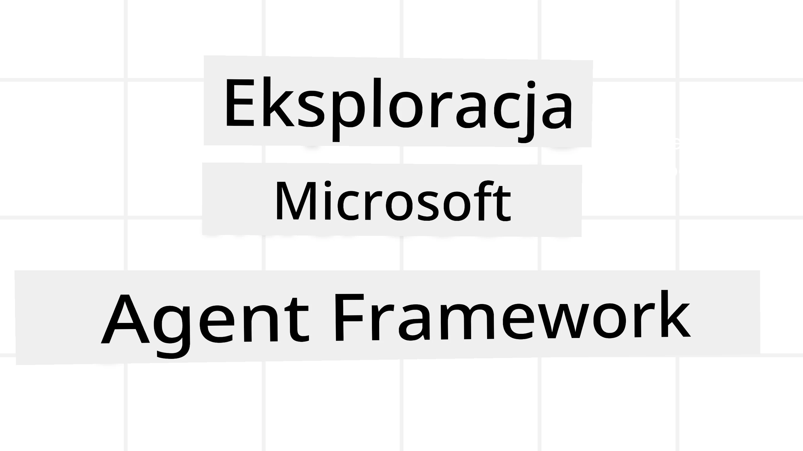
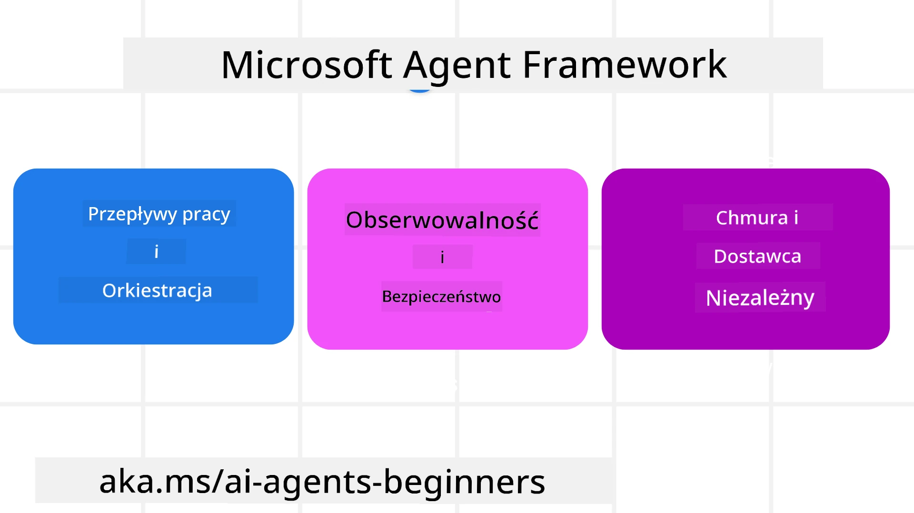
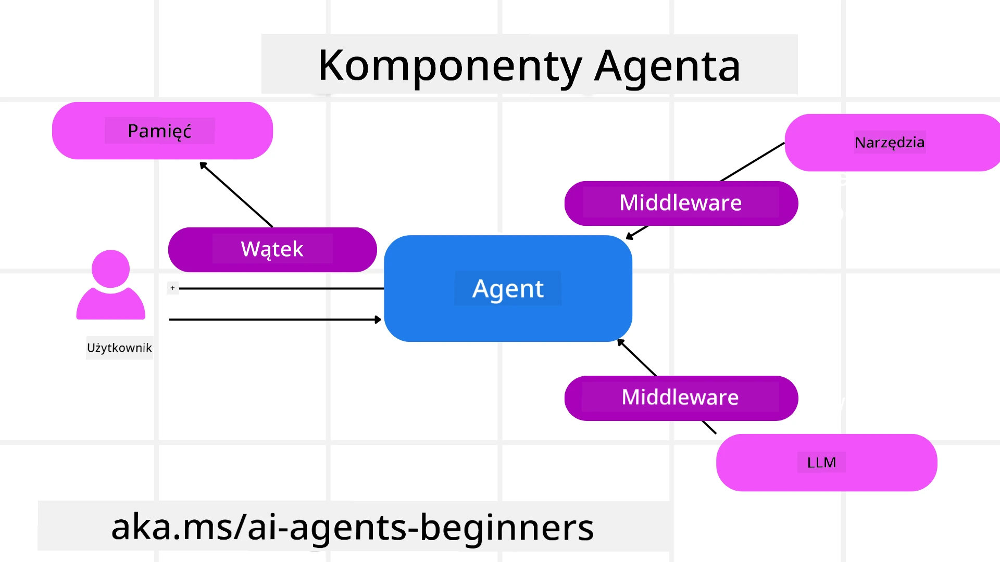

<!--
CO_OP_TRANSLATOR_METADATA:
{
  "original_hash": "19c4dab375acbc733855cc7f2f04edbc",
  "translation_date": "2025-10-01T20:38:36+00:00",
  "source_file": "14-microsoft-agent-framework/README.md",
  "language_code": "pl"
}
-->
# Eksploracja Microsoft Agent Framework



### Wprowadzenie

Ta lekcja obejmuje:

- Zrozumienie Microsoft Agent Framework: Kluczowe funkcje i wartość  
- Eksploracja kluczowych koncepcji Microsoft Agent Framework
- Porównanie MAF z Semantic Kernel i AutoGen: Przewodnik migracji

## Cele nauki

Po ukończeniu tej lekcji będziesz wiedzieć, jak:

- Tworzyć gotowe do produkcji agenty AI za pomocą Microsoft Agent Framework
- Zastosować kluczowe funkcje Microsoft Agent Framework do swoich przypadków użycia agentów
- Migrować i integrować istniejące frameworki i narzędzia agentów  

## Przykłady kodu 

Przykłady kodu dla [Microsoft Agent Framework (MAF)](https://aka.ms/ai-agents-beginners/agent-framewrok) można znaleźć w tym repozytorium w plikach `xx-python-agent-framework` i `xx-dotnet-agent-framework`.

## Zrozumienie Microsoft Agent Framework



[Microsoft Agent Framework (MAF)](https://aka.ms/ai-agents-beginners/agent-framewrok) opiera się na doświadczeniach i wnioskach z Semantic Kernel i AutoGen. Oferuje elastyczność w obsłudze szerokiej gamy przypadków użycia agentów zarówno w środowiskach produkcyjnych, jak i badawczych, w tym:

- **Sekwencyjna orkiestracja agentów** w scenariuszach, gdzie wymagane są krok po kroku przepływy pracy.
- **Równoczesna orkiestracja** w scenariuszach, gdzie agenty muszą wykonywać zadania jednocześnie.
- **Orkiestracja czatu grupowego** w scenariuszach, gdzie agenty mogą współpracować nad jednym zadaniem.
- **Przekazywanie zadań** w scenariuszach, gdzie agenty przekazują zadanie jeden drugiemu po ukończeniu podzadań.
- **Magnetyczna orkiestracja** w scenariuszach, gdzie agent zarządzający tworzy i modyfikuje listę zadań oraz koordynuje podagentów w celu ukończenia zadania.

Aby dostarczać agenty AI w produkcji, MAF zawiera również funkcje takie jak:

- **Obserwowalność** dzięki wykorzystaniu OpenTelemetry, gdzie każda akcja agenta AI, w tym wywołania narzędzi, kroki orkiestracji, przepływy rozumowania i monitorowanie wydajności, jest widoczna na pulpitach Azure AI Foundry.
- **Bezpieczeństwo** dzięki natywnemu hostowaniu agentów na Azure AI Foundry, które obejmuje kontrolę bezpieczeństwa, taką jak dostęp oparty na rolach, obsługa danych prywatnych i wbudowane zabezpieczenia treści.
- **Trwałość** dzięki możliwości wstrzymywania, wznawiania i odzyskiwania wątków agentów i przepływów pracy, co umożliwia dłuższe procesy.
- **Kontrola** dzięki wsparciu dla przepływów pracy z udziałem człowieka, gdzie zadania wymagają zatwierdzenia przez człowieka.

Microsoft Agent Framework koncentruje się również na interoperacyjności poprzez:

- **Niezależność od chmury** - Agenty mogą działać w kontenerach, lokalnie i w różnych chmurach.
- **Niezależność od dostawcy** - Agenty mogą być tworzone za pomocą preferowanego SDK, w tym Azure OpenAI i OpenAI.
- **Integrację otwartych standardów** - Agenty mogą korzystać z protokołów takich jak Agent-to-Agent (A2A) i Model Context Protocol (MCP) do odkrywania i używania innych agentów i narzędzi.
- **Wtyczki i konektory** - Możliwość połączenia z usługami danych i pamięci, takimi jak Microsoft Fabric, SharePoint, Pinecone i Qdrant.

Przyjrzyjmy się, jak te funkcje są stosowane w niektórych kluczowych koncepcjach Microsoft Agent Framework.

## Kluczowe koncepcje Microsoft Agent Framework

### Agenty



**Tworzenie agentów**

Tworzenie agentów odbywa się poprzez zdefiniowanie usługi inferencji (dostawcy LLM), zestawu instrukcji dla agenta AI oraz przypisanie `nazwy`:

```python
agent = AzureOpenAIChatClient(credential=AzureCliCredential()).create_agent( instructions="You are good at recommending trips to customers based on their preferences.", name="TripRecommender" )
```

Powyższy przykład używa `Azure OpenAI`, ale agenty mogą być tworzone za pomocą różnych usług, w tym `Azure AI Foundry Agent Service`:

```python
AzureAIAgentClient(async_credential=credential).create_agent( name="HelperAgent", instructions="You are a helpful assistant." ) as agent
```

OpenAI `Responses`, `ChatCompletion` APIs

```python
agent = OpenAIResponsesClient().create_agent( name="WeatherBot", instructions="You are a helpful weather assistant.", )
```

```python
agent = OpenAIChatClient().create_agent( name="HelpfulAssistant", instructions="You are a helpful assistant.", )
```

lub zdalnych agentów za pomocą protokołu A2A:

```python
agent = A2AAgent( name=agent_card.name, description=agent_card.description, agent_card=agent_card, url="https://your-a2a-agent-host" )
```

**Uruchamianie agentów**

Agenty są uruchamiane za pomocą metod `.run` lub `.run_stream` dla odpowiedzi niestreamowanych lub streamowanych.

```python
result = await agent.run("What are good places to visit in Amsterdam?")
print(result.text)
```

```python
async for update in agent.run_stream("What are the good places to visit in Amsterdam?"):
    if update.text:
        print(update.text, end="", flush=True)

```

Każde uruchomienie agenta może również zawierać opcje dostosowania parametrów, takich jak `max_tokens` używane przez agenta, `narzędzia`, które agent może wywoływać, a nawet sam `model` używany przez agenta.

Jest to przydatne w przypadkach, gdy do wykonania zadania użytkownika wymagane są konkretne modele lub narzędzia.

**Narzędzia**

Narzędzia mogą być definiowane zarówno podczas definiowania agenta:

```python
def get_attractions( location: Annotated[str, Field(description="The location to get the top tourist attractions for")], ) -> str: """Get the top tourist attractions for a given location.""" return f"The top attractions for {location} are." 


# When creating a ChatAgent directly 

agent = ChatAgent( chat_client=OpenAIChatClient(), instructions="You are a helpful assistant", tools=[get_attractions]

```

jak i podczas uruchamiania agenta:

```python

result1 = await agent.run( "What's the best place to visit in Seattle?", tools=[get_attractions] # Tool provided for this run only )
```

**Wątki agentów**

Wątki agentów są używane do obsługi rozmów wieloetapowych. Wątki można tworzyć na dwa sposoby:

- Używając `get_new_thread()`, co umożliwia zapisanie wątku na później.
- Automatyczne tworzenie wątku podczas uruchamiania agenta, gdzie wątek trwa tylko podczas bieżącego uruchomienia.

Aby utworzyć wątek, kod wygląda tak:

```python
# Create a new thread. 
thread = agent.get_new_thread() # Run the agent with the thread. 
response = await agent.run("Hello, I am here to help you book travel. Where would you like to go?", thread=thread)

```

Następnie można serializować wątek, aby przechowywać go do późniejszego użycia:

```python
# Create a new thread. 
thread = agent.get_new_thread() 

# Run the agent with the thread. 

response = await agent.run("Hello, how are you?", thread=thread) 

# Serialize the thread for storage. 

serialized_thread = await thread.serialize() 

# Deserialize the thread state after loading from storage. 

resumed_thread = await agent.deserialize_thread(serialized_thread)
```

**Middleware agenta**

Agenty współdziałają z narzędziami i LLM, aby wykonać zadania użytkownika. W niektórych scenariuszach chcemy wykonać lub śledzić działania pomiędzy tymi interakcjami. Middleware agenta umożliwia nam to poprzez:

*Middleware funkcji*

Ten middleware pozwala na wykonanie akcji pomiędzy agentem a funkcją/narzędziem, które będzie wywoływane. Przykładem użycia może być logowanie wywołania funkcji.

W poniższym kodzie `next` definiuje, czy powinien być wywołany następny middleware czy rzeczywista funkcja.

```python
async def logging_function_middleware(
    context: FunctionInvocationContext,
    next: Callable[[FunctionInvocationContext], Awaitable[None]],
) -> None:
    """Function middleware that logs function execution."""
    # Pre-processing: Log before function execution
    print(f"[Function] Calling {context.function.name}")

    # Continue to next middleware or function execution
    await next(context)

    # Post-processing: Log after function execution
    print(f"[Function] {context.function.name} completed")
```

*Middleware czatu*

Ten middleware pozwala na wykonanie lub logowanie akcji pomiędzy agentem a żądaniami do LLM.

Zawiera ważne informacje, takie jak `messages`, które są wysyłane do usługi AI.

```python
async def logging_chat_middleware(
    context: ChatContext,
    next: Callable[[ChatContext], Awaitable[None]],
) -> None:
    """Chat middleware that logs AI interactions."""
    # Pre-processing: Log before AI call
    print(f"[Chat] Sending {len(context.messages)} messages to AI")

    # Continue to next middleware or AI service
    await next(context)

    # Post-processing: Log after AI response
    print("[Chat] AI response received")

```

**Pamięć agenta**

Jak omówiono w lekcji `Agentic Memory`, pamięć jest ważnym elementem umożliwiającym agentowi działanie w różnych kontekstach. MAF oferuje kilka różnych typów pamięci:

*Pamięć w aplikacji*

Jest to pamięć przechowywana w wątkach podczas działania aplikacji.

```python
# Create a new thread. 
thread = agent.get_new_thread() # Run the agent with the thread. 
response = await agent.run("Hello, I am here to help you book travel. Where would you like to go?", thread=thread)
```

*Trwałe wiadomości*

Ta pamięć jest używana do przechowywania historii rozmów między różnymi sesjami. Jest definiowana za pomocą `chat_message_store_factory`:

```python
from agent_framework import ChatMessageStore

# Create a custom message store
def create_message_store():
    return ChatMessageStore()

agent = ChatAgent(
    chat_client=OpenAIChatClient(),
    instructions="You are a Travel assistant.",
    chat_message_store_factory=create_message_store
)

```

*Dynamiczna pamięć*

Ta pamięć jest dodawana do kontekstu przed uruchomieniem agentów. Może być przechowywana w zewnętrznych usługach, takich jak mem0:

```python
from agent_framework.mem0 import Mem0Provider

# Using Mem0 for advanced memory capabilities
memory_provider = Mem0Provider(
    api_key="your-mem0-api-key",
    user_id="user_123",
    application_id="my_app"
)

agent = ChatAgent(
    chat_client=OpenAIChatClient(),
    instructions="You are a helpful assistant with memory.",
    context_providers=memory_provider
)

```

**Obserwowalność agenta**

Obserwowalność jest kluczowa dla budowania niezawodnych i łatwych w utrzymaniu systemów agentów. MAF integruje się z OpenTelemetry, aby zapewnić śledzenie i mierniki dla lepszej obserwowalności.

```python
from agent_framework.observability import get_tracer, get_meter

tracer = get_tracer()
meter = get_meter()
with tracer.start_as_current_span("my_custom_span"):
    # do something
    pass
counter = meter.create_counter("my_custom_counter")
counter.add(1, {"key": "value"})
```

### Przepływy pracy

MAF oferuje przepływy pracy, które są predefiniowanymi krokami do wykonania zadania i obejmują agenty AI jako komponenty tych kroków.

Przepływy pracy składają się z różnych komponentów, które umożliwiają lepszą kontrolę przepływu. Przepływy pracy umożliwiają również **orkiestrację wielu agentów** oraz **checkpointing**, aby zapisać stan przepływu pracy.

Główne komponenty przepływu pracy to:

**Wykonawcy**

Wykonawcy otrzymują wiadomości wejściowe, wykonują przypisane zadania, a następnie generują wiadomości wyjściowe. To przesuwa przepływ pracy w kierunku ukończenia większego zadania. Wykonawcy mogą być agentami AI lub niestandardową logiką.

**Krawędzie**

Krawędzie są używane do definiowania przepływu wiadomości w przepływie pracy. Mogą być:

*Krawędzie bezpośrednie* - Proste połączenia jeden-do-jeden między wykonawcami:

```python
from agent_framework import WorkflowBuilder

builder = WorkflowBuilder()
builder.add_edge(source_executor, target_executor)
builder.set_start_executor(source_executor)
workflow = builder.build()
```

*Krawędzie warunkowe* - Aktywowane po spełnieniu określonego warunku. Na przykład, gdy pokoje hotelowe są niedostępne, wykonawca może zasugerować inne opcje.

*Krawędzie switch-case* - Kierują wiadomości do różnych wykonawców na podstawie zdefiniowanych warunków. Na przykład, jeśli klient podróży ma priorytetowy dostęp, jego zadania będą obsługiwane przez inny przepływ pracy.

*Krawędzie fan-out* - Wysyłają jedną wiadomość do wielu celów.

*Krawędzie fan-in* - Zbierają wiele wiadomości od różnych wykonawców i wysyłają do jednego celu.

**Zdarzenia**

Aby zapewnić lepszą obserwowalność przepływów pracy, MAF oferuje wbudowane zdarzenia dla wykonania, w tym:

- `WorkflowStartedEvent`  - Rozpoczęcie wykonania przepływu pracy
- `WorkflowOutputEvent` - Przepływ pracy generuje wynik
- `WorkflowErrorEvent` - Przepływ pracy napotyka błąd
- `ExecutorInvokeEvent`  - Wykonawca rozpoczyna przetwarzanie
- `ExecutorCompleteEvent`  - Wykonawca kończy przetwarzanie
- `RequestInfoEvent` - Wydanie żądania

## Migracja z innych frameworków (Semantic Kernel i AutoGen)

### Różnice między MAF a Semantic Kernel

**Uproszczone tworzenie agentów**

Semantic Kernel wymaga utworzenia instancji Kernel dla każdego agenta. MAF stosuje uproszczone podejście, używając rozszerzeń dla głównych dostawców.

```python
agent = AzureOpenAIChatClient(credential=AzureCliCredential()).create_agent( instructions="You are good at reccomending trips to customers based on their preferences.", name="TripRecommender" )
```

**Tworzenie wątków agentów**

Semantic Kernel wymaga ręcznego tworzenia wątków. W MAF wątek jest bezpośrednio przypisany do agenta.

```python
thread = agent.get_new_thread() # Run the agent with the thread. 
```

**Rejestracja narzędzi**

W Semantic Kernel narzędzia są rejestrowane w Kernel, a Kernel jest następnie przekazywany do agenta. W MAF narzędzia są rejestrowane bezpośrednio podczas procesu tworzenia agenta.

```python
agent = ChatAgent( chat_client=OpenAIChatClient(), instructions="You are a helpful assistant", tools=[get_attractions]
```

### Różnice między MAF a AutoGen

**Zespoły vs Przepływy pracy**

`Teams` to struktura zdarzeń dla działań opartych na zdarzeniach z agentami w AutoGen. MAF używa `Workflows`, które kierują dane do wykonawców za pomocą architektury opartej na grafach.

**Tworzenie narzędzi**

AutoGen używa `FunctionTool` do opakowywania funkcji, które agenty mogą wywoływać. MAF używa @ai_function, który działa podobnie, ale automatycznie wnioskuje schematy dla każdej funkcji.

**Zachowanie agentów**

Agenty są domyślnie agentami jednoetapowymi w AutoGen, chyba że `max_tool_iterations` jest ustawione na wyższą wartość. W MAF `ChatAgent` jest domyślnie agentem wieloetapowym, co oznacza, że będzie kontynuował wywoływanie narzędzi, aż zadanie użytkownika zostanie ukończone.

## Przykłady kodu 

Przykłady kodu dla Microsoft Agent Framework można znaleźć w tym repozytorium w plikach `xx-python-agent-framework` i `xx-dotnet-agent-framework`.

## Masz więcej pytań dotyczących Microsoft Agent Framework?

Dołącz do [Azure AI Foundry Discord](https://aka.ms/ai-agents/discord), aby spotkać się z innymi uczącymi się, uczestniczyć w godzinach konsultacji i uzyskać odpowiedzi na pytania dotyczące agentów AI.

---

**Zastrzeżenie**:  
Ten dokument został przetłumaczony za pomocą usługi tłumaczenia AI [Co-op Translator](https://github.com/Azure/co-op-translator). Chociaż dokładamy wszelkich starań, aby tłumaczenie było precyzyjne, prosimy pamiętać, że automatyczne tłumaczenia mogą zawierać błędy lub nieścisłości. Oryginalny dokument w jego rodzimym języku powinien być uznawany za źródło autorytatywne. W przypadku informacji krytycznych zaleca się skorzystanie z profesjonalnego tłumaczenia przez człowieka. Nie ponosimy odpowiedzialności za jakiekolwiek nieporozumienia lub błędne interpretacje wynikające z użycia tego tłumaczenia.