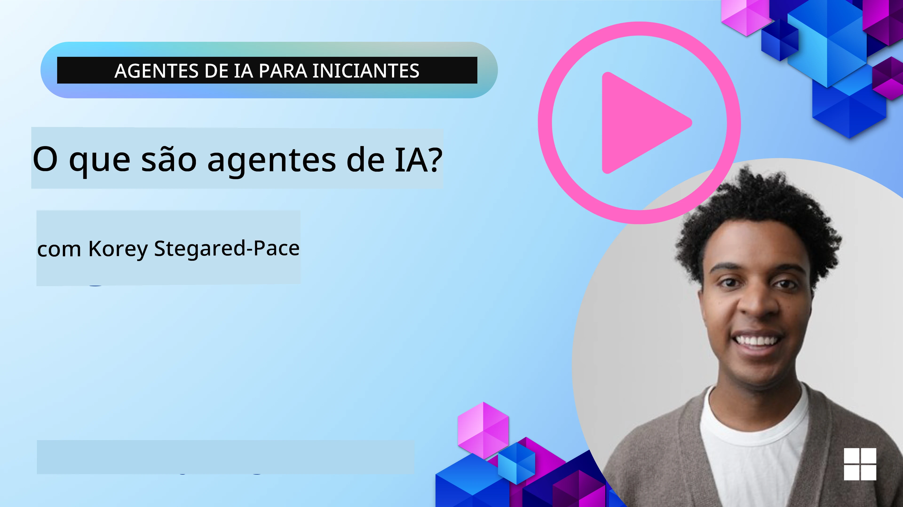
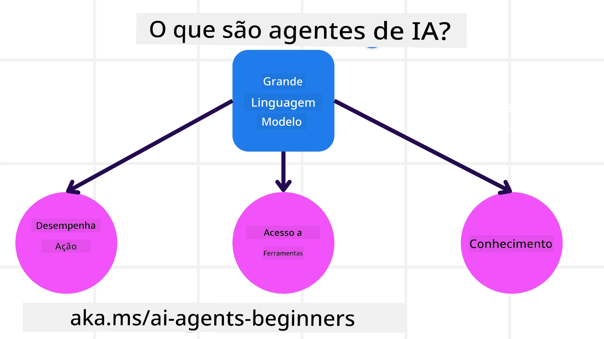
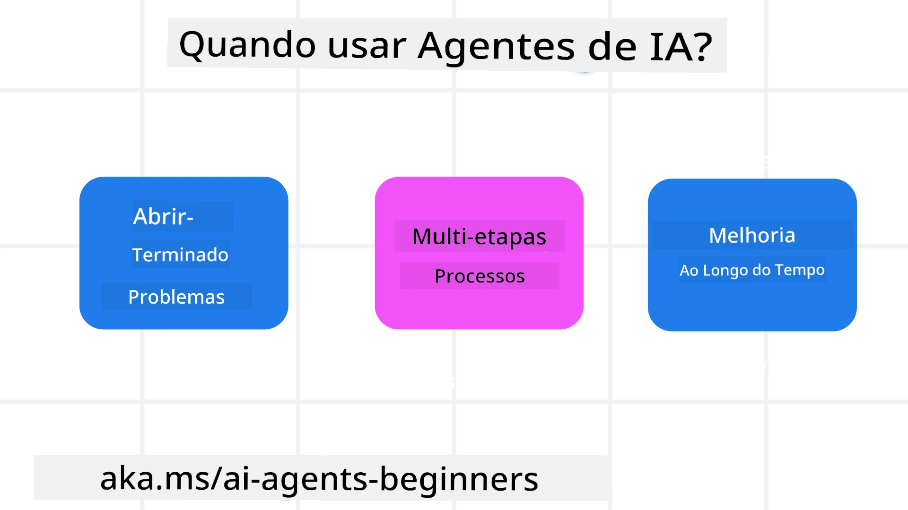

<!--
CO_OP_TRANSLATOR_METADATA:
{
  "original_hash": "cdd28bc00816d2773bb2b5968d782abc",
  "translation_date": "2025-11-11T11:09:48+00:00",
  "source_file": "01-intro-to-ai-agents/README.md",
  "language_code": "pt"
}
-->

> _(Clique na imagem acima para assistir ao vídeo desta lição)_

# Introdução a Agentes de IA e Casos de Uso de Agentes

Bem-vindo ao curso "Agentes de IA para Iniciantes"! Este curso oferece conhecimentos fundamentais e exemplos práticos para construir Agentes de IA.

Junte-se à <a href="https://discord.gg/kzRShWzttr" target="_blank">Comunidade Azure AI no Discord</a> para conhecer outros aprendizes e criadores de Agentes de IA e tirar quaisquer dúvidas que tenha sobre este curso.

Para começar este curso, vamos primeiro entender melhor o que são Agentes de IA e como podemos utilizá-los nas aplicações e fluxos de trabalho que desenvolvemos.

## Introdução

Esta lição aborda:

- O que são Agentes de IA e quais são os diferentes tipos de agentes?
- Quais casos de uso são mais adequados para Agentes de IA e como podem ajudar-nos?
- Quais são alguns dos blocos básicos ao projetar Soluções Agênticas?

## Objetivos de Aprendizagem
Após concluir esta lição, deverá ser capaz de:

- Compreender os conceitos de Agentes de IA e como diferem de outras soluções de IA.
- Aplicar Agentes de IA de forma mais eficiente.
- Projetar soluções agênticas produtivamente para utilizadores e clientes.

## Definindo Agentes de IA e Tipos de Agentes de IA

### O que são Agentes de IA?

Agentes de IA são **sistemas** que permitem que **Modelos de Linguagem de Grande Escala (LLMs)** **executem ações**, ampliando suas capacidades ao dar aos LLMs **acesso a ferramentas** e **conhecimento**.

Vamos dividir esta definição em partes menores:

- **Sistema** - É importante pensar nos agentes não apenas como um único componente, mas como um sistema composto por vários componentes. No nível básico, os componentes de um Agente de IA são:
  - **Ambiente** - O espaço definido onde o Agente de IA está a operar. Por exemplo, se tivermos um agente de reserva de viagens, o ambiente pode ser o sistema de reservas de viagens que o agente utiliza para realizar tarefas.
  - **Sensores** - Os ambientes possuem informações e fornecem feedback. Os Agentes de IA utilizam sensores para recolher e interpretar essas informações sobre o estado atual do ambiente. No exemplo do Agente de Reserva de Viagens, o sistema de reservas pode fornecer informações como disponibilidade de hotéis ou preços de voos.
  - **Atuadores** - Após o Agente de IA receber o estado atual do ambiente, para a tarefa em questão, o agente determina qual ação realizar para alterar o ambiente. No caso do agente de reserva de viagens, pode ser reservar um quarto disponível para o utilizador.

**Modelos de Linguagem de Grande Escala** - O conceito de agentes existia antes da criação dos LLMs. A vantagem de construir Agentes de IA com LLMs é a sua capacidade de interpretar linguagem humana e dados. Essa habilidade permite que os LLMs interpretem informações do ambiente e definam um plano para alterar o ambiente.

**Executar Ações** - Fora dos sistemas de Agentes de IA, os LLMs estão limitados a situações em que a ação é gerar conteúdo ou informações com base no pedido do utilizador. Dentro dos sistemas de Agentes de IA, os LLMs podem realizar tarefas interpretando o pedido do utilizador e utilizando ferramentas disponíveis no seu ambiente.

**Acesso a Ferramentas** - As ferramentas às quais o LLM tem acesso são definidas por 1) o ambiente em que está a operar e 2) o desenvolvedor do Agente de IA. No exemplo do agente de viagens, as ferramentas do agente são limitadas pelas operações disponíveis no sistema de reservas e/ou o desenvolvedor pode limitar o acesso do agente às ferramentas de voos.

**Memória+Conhecimento** - A memória pode ser de curto prazo no contexto da conversa entre o utilizador e o agente. A longo prazo, fora das informações fornecidas pelo ambiente, os Agentes de IA também podem recuperar conhecimento de outros sistemas, serviços, ferramentas e até outros agentes. No exemplo do agente de viagens, esse conhecimento pode ser as preferências de viagem do utilizador armazenadas numa base de dados de clientes.

### Os diferentes tipos de agentes

Agora que temos uma definição geral de Agentes de IA, vamos analisar alguns tipos específicos de agentes e como seriam aplicados a um agente de reserva de viagens.

| **Tipo de Agente**            | **Descrição**                                                                                                                       | **Exemplo**                                                                                                                                                                                                                   |
| ----------------------------- | ------------------------------------------------------------------------------------------------------------------------------------- | ----------------------------------------------------------------------------------------------------------------------------------------------------------------------------------------------------------------------------- |
| **Agentes de Reflexo Simples** | Executam ações imediatas com base em regras predefinidas.                                                                             | O agente de viagens interpreta o contexto do email e encaminha reclamações de viagem para o serviço de atendimento ao cliente.                                                                                               |
| **Agentes Baseados em Modelo** | Executam ações com base num modelo do mundo e alterações nesse modelo.                                                               | O agente de viagens prioriza rotas com alterações significativas de preço com base no acesso a dados históricos de preços.                                                                                                   |
| **Agentes Baseados em Objetivos** | Criam planos para alcançar objetivos específicos, interpretando o objetivo e determinando ações para alcançá-lo.                        | O agente de viagens reserva uma viagem determinando os arranjos necessários (carro, transporte público, voos) do local atual até o destino.                                                                                  |
| **Agentes Baseados em Utilidade** | Consideram preferências e avaliam compensações numericamente para determinar como alcançar objetivos.                                | O agente de viagens maximiza a utilidade ao avaliar conveniência versus custo ao reservar viagens.                                                                                                                           |
| **Agentes de Aprendizagem**    | Melhoram ao longo do tempo, respondendo ao feedback e ajustando ações conforme necessário.                                           | O agente de viagens melhora utilizando o feedback dos clientes de pesquisas pós-viagem para fazer ajustes em reservas futuras.                                                                                               |
| **Agentes Hierárquicos**       | Apresentam múltiplos agentes num sistema hierárquico, com agentes de nível superior dividindo tarefas em subtarefas para agentes de nível inferior completarem. | O agente de viagens cancela uma viagem dividindo a tarefa em subtarefas (por exemplo, cancelar reservas específicas) e tendo agentes de nível inferior a completá-las, reportando ao agente de nível superior.                  |
| **Sistemas Multiagentes (MAS)** | Agentes completam tarefas de forma independente, cooperativa ou competitiva.                                                        | Cooperativo: Múltiplos agentes reservam serviços específicos de viagem, como hotéis, voos e entretenimento. Competitivo: Múltiplos agentes gerem e competem por um calendário de reservas de hotel compartilhado para acomodar clientes. |

## Quando Usar Agentes de IA

Na seção anterior, utilizámos o caso de uso do Agente de Viagens para explicar como os diferentes tipos de agentes podem ser usados em diferentes cenários de reserva de viagens. Continuaremos a usar esta aplicação ao longo do curso.

Vamos analisar os tipos de casos de uso para os quais os Agentes de IA são mais adequados:

- **Problemas Abertos** - permitindo que o LLM determine os passos necessários para completar uma tarefa, pois nem sempre é possível codificar isso num fluxo de trabalho.
- **Processos de Múltiplas Etapas** - tarefas que requerem um nível de complexidade em que o Agente de IA precisa usar ferramentas ou informações ao longo de várias interações, em vez de uma única recuperação.
- **Melhoria ao Longo do Tempo** - tarefas em que o agente pode melhorar ao longo do tempo ao receber feedback do ambiente ou dos utilizadores para oferecer melhor utilidade.

Abordamos mais considerações sobre o uso de Agentes de IA na lição Construindo Agentes de IA Confiáveis.

## Fundamentos de Soluções Agênticas

### Desenvolvimento de Agentes

O primeiro passo ao projetar um sistema de Agente de IA é definir as ferramentas, ações e comportamentos. Neste curso, focamos no uso do **Azure AI Agent Service** para definir os nossos Agentes. Ele oferece recursos como:

- Seleção de Modelos Abertos, como OpenAI, Mistral e Llama
- Uso de Dados Licenciados através de fornecedores como Tripadvisor
- Uso de ferramentas padronizadas OpenAPI 3.0

### Padrões Agênticos

A comunicação com LLMs é feita através de prompts. Dada a natureza semi-autónoma dos Agentes de IA, nem sempre é possível ou necessário reconfigurar manualmente o LLM após uma alteração no ambiente. Utilizamos **Padrões Agênticos** que permitem configurar o LLM ao longo de várias etapas de forma mais escalável.

Este curso está dividido em alguns dos padrões agênticos populares atualmente.

### Frameworks Agênticos

Frameworks Agênticos permitem que os desenvolvedores implementem padrões agênticos através de código. Esses frameworks oferecem templates, plugins e ferramentas para melhor colaboração entre Agentes de IA. Esses benefícios proporcionam melhores capacidades de observação e resolução de problemas em sistemas de Agentes de IA.

Neste curso, exploraremos o framework AutoGen, orientado por pesquisa, e o framework de produção Agent do Semantic Kernel.

## Exemplos de Código

- Python: [Framework de Agentes](./code_samples/01-python-agent-framework.ipynb)
- .NET: [Framework de Agentes](./code_samples/01-dotnet-agent-framework.md)

## Tem Mais Perguntas sobre Agentes de IA?

Junte-se ao [Azure AI Foundry Discord](https://aka.ms/ai-agents/discord) para conhecer outros aprendizes, participar de horários de atendimento e tirar suas dúvidas sobre Agentes de IA.

## Lição Anterior

[Configuração do Curso](../00-course-setup/README.md)

## Próxima Lição

[Explorando Frameworks Agênticos](../02-explore-agentic-frameworks/README.md)

---

<!-- CO-OP TRANSLATOR DISCLAIMER START -->
**Aviso**:  
Este documento foi traduzido utilizando o serviço de tradução por IA [Co-op Translator](https://github.com/Azure/co-op-translator). Embora nos esforcemos pela precisão, esteja ciente de que traduções automáticas podem conter erros ou imprecisões. O documento original na sua língua nativa deve ser considerado a fonte autoritária. Para informações críticas, recomenda-se uma tradução profissional realizada por humanos. Não nos responsabilizamos por quaisquer mal-entendidos ou interpretações incorretas decorrentes do uso desta tradução.
<!-- CO-OP TRANSLATOR DISCLAIMER END -->