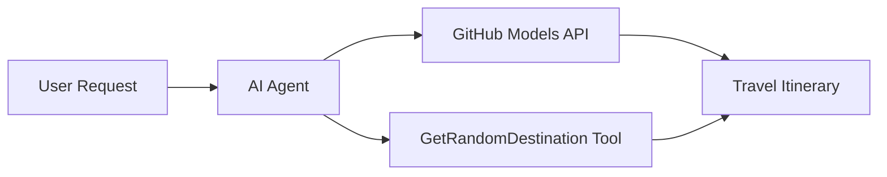

<!--
CO_OP_TRANSLATOR_METADATA:
{
  "original_hash": "5f351412e934f0833c8c821a0a60efaf",
  "translation_date": "2025-11-13T12:09:32+00:00",
  "source_file": "01-intro-to-ai-agents/code_samples/01-dotnet-agent-framework.md",
  "language_code": "pt"
}
-->
# 🌍 Agente de Viagens com Microsoft Agent Framework (.NET)

## 📋 Visão Geral do Cenário

Este exemplo demonstra como criar um agente inteligente de planeamento de viagens utilizando o Microsoft Agent Framework para .NET. O agente pode gerar automaticamente itinerários personalizados para viagens de um dia em destinos aleatórios ao redor do mundo.

### Principais Capacidades:

- 🎲 **Seleção Aleatória de Destinos**: Utiliza uma ferramenta personalizada para escolher locais de férias
- 🗺️ **Planeamento Inteligente de Viagens**: Cria itinerários detalhados dia a dia
- 🔄 **Streaming em Tempo Real**: Suporta respostas imediatas e em fluxo contínuo
- 🛠️ **Integração de Ferramentas Personalizadas**: Demonstra como expandir as capacidades do agente

## 🔧 Arquitetura Técnica

### Tecnologias Principais

- **Microsoft Agent Framework**: Implementação mais recente em .NET para desenvolvimento de agentes de IA
- **Integração com Modelos do GitHub**: Utiliza o serviço de inferência de modelos de IA do GitHub
- **Compatibilidade com API OpenAI**: Aproveita bibliotecas cliente da OpenAI com endpoints personalizados
- **Configuração Segura**: Gestão de chaves API baseada em ambiente

### Componentes Principais

1. **AIAgent**: O orquestrador principal do agente que gere o fluxo de conversação
2. **Ferramentas Personalizadas**: Função `GetRandomDestination()` disponível para o agente
3. **Cliente de Chat**: Interface de conversação suportada por Modelos do GitHub
4. **Suporte a Streaming**: Capacidades de geração de respostas em tempo real

### Padrão de Integração



## 🚀 Começar

### Pré-requisitos

- [.NET 10 SDK](https://dotnet.microsoft.com/download/dotnet/10.0) ou superior
- [Token de acesso à API de Modelos do GitHub](https://docs.github.com/github-models/github-models-at-scale/using-your-own-api-keys-in-github-models)

### Variáveis de Ambiente Necessárias

```bash
# zsh/bash
export GH_TOKEN=<your_github_token>
export GH_ENDPOINT=https://models.github.ai/inference
export GH_MODEL_ID=openai/gpt-5-mini
```

```powershell
# PowerShell
$env:GH_TOKEN = "<your_github_token>"
$env:GH_ENDPOINT = "https://models.github.ai/inference"
$env:GH_MODEL_ID = "openai/gpt-5-mini"
```

### Código de Exemplo

Para executar o exemplo de código,

```bash
# zsh/bash
chmod +x ./01-dotnet-agent-framework.cs
./01-dotnet-agent-framework.cs
```

Ou utilizando o CLI do dotnet:

```bash
dotnet run ./01-dotnet-agent-framework.cs
```

Consulte [`01-dotnet-agent-framework.cs`](../../../../01-intro-to-ai-agents/code_samples/01-dotnet-agent-framework.cs) para o código completo.

```csharp
#!/usr/bin/dotnet run

#:package Microsoft.Extensions.AI@9.*
#:package Microsoft.Agents.AI.OpenAI@1.*-*

using System.ClientModel;
using System.ComponentModel;

using Microsoft.Agents.AI;
using Microsoft.Extensions.AI;

using OpenAI;

// Tool Function: Random Destination Generator
// This static method will be available to the agent as a callable tool
// The [Description] attribute helps the AI understand when to use this function
// This demonstrates how to create custom tools for AI agents
[Description("Provides a random vacation destination.")]
static string GetRandomDestination()
{
    // List of popular vacation destinations around the world
    // The agent will randomly select from these options
    var destinations = new List<string>
    {
        "Paris, France",
        "Tokyo, Japan",
        "New York City, USA",
        "Sydney, Australia",
        "Rome, Italy",
        "Barcelona, Spain",
        "Cape Town, South Africa",
        "Rio de Janeiro, Brazil",
        "Bangkok, Thailand",
        "Vancouver, Canada"
    };

    // Generate random index and return selected destination
    // Uses System.Random for simple random selection
    var random = new Random();
    int index = random.Next(destinations.Count);
    return destinations[index];
}

// Extract configuration from environment variables
// Retrieve the GitHub Models API endpoint, defaults to https://models.github.ai/inference if not specified
// Retrieve the model ID, defaults to openai/gpt-5-mini if not specified
// Retrieve the GitHub token for authentication, throws exception if not specified
var github_endpoint = Environment.GetEnvironmentVariable("GH_ENDPOINT") ?? "https://models.github.ai/inference";
var github_model_id = Environment.GetEnvironmentVariable("GH_MODEL_ID") ?? "openai/gpt-5-mini";
var github_token = Environment.GetEnvironmentVariable("GH_TOKEN") ?? throw new InvalidOperationException("GH_TOKEN is not set.");

// Configure OpenAI Client Options
// Create configuration options to point to GitHub Models endpoint
// This redirects OpenAI client calls to GitHub's model inference service
var openAIOptions = new OpenAIClientOptions()
{
    Endpoint = new Uri(github_endpoint)
};

// Initialize OpenAI Client with GitHub Models Configuration
// Create OpenAI client using GitHub token for authentication
// Configure it to use GitHub Models endpoint instead of OpenAI directly
var openAIClient = new OpenAIClient(new ApiKeyCredential(github_token), openAIOptions);

// Create AI Agent with Travel Planning Capabilities
// Initialize OpenAI client, get chat client for specified model, and create AI agent
// Configure agent with travel planning instructions and random destination tool
// The agent can now plan trips using the GetRandomDestination function
AIAgent agent = openAIClient
    .GetChatClient(github_model_id)
    .CreateAIAgent(
        instructions: "You are a helpful AI Agent that can help plan vacations for customers at random destinations",
        tools: [AIFunctionFactory.Create(GetRandomDestination)]
    );

// Execute Agent: Plan a Day Trip
// Run the agent with streaming enabled for real-time response display
// Shows the agent's thinking and response as it generates the content
// Provides better user experience with immediate feedback
await foreach (var update in agent.RunStreamingAsync("Plan me a day trip"))
{
    await Task.Delay(10);
    Console.Write(update);
}
```

## 🎓 Principais Aprendizados

1. **Arquitetura de Agentes**: O Microsoft Agent Framework oferece uma abordagem limpa e segura para criar agentes de IA em .NET
2. **Integração de Ferramentas**: Funções decoradas com atributos `[Description]` tornam-se ferramentas disponíveis para o agente
3. **Gestão de Configuração**: Variáveis de ambiente e gestão segura de credenciais seguem as melhores práticas do .NET
4. **Compatibilidade com OpenAI**: A integração com Modelos do GitHub funciona perfeitamente através de APIs compatíveis com OpenAI

## 🔗 Recursos Adicionais

- [Documentação do Microsoft Agent Framework](https://learn.microsoft.com/agent-framework)
- [Marketplace de Modelos do GitHub](https://github.com/marketplace?type=models)
- [Microsoft.Extensions.AI](https://learn.microsoft.com/dotnet/ai/microsoft-extensions-ai)
- [.NET Single File Apps](https://devblogs.microsoft.com/dotnet/announcing-dotnet-run-app)

---

<!-- CO-OP TRANSLATOR DISCLAIMER START -->
**Aviso Legal**:  
Este documento foi traduzido utilizando o serviço de tradução por IA [Co-op Translator](https://github.com/Azure/co-op-translator). Embora nos esforcemos para garantir a precisão, esteja ciente de que traduções automáticas podem conter erros ou imprecisões. O documento original no seu idioma nativo deve ser considerado a fonte autoritária. Para informações críticas, recomenda-se uma tradução profissional humana. Não nos responsabilizamos por quaisquer mal-entendidos ou interpretações incorretas resultantes do uso desta tradução.
<!-- CO-OP TRANSLATOR DISCLAIMER END -->