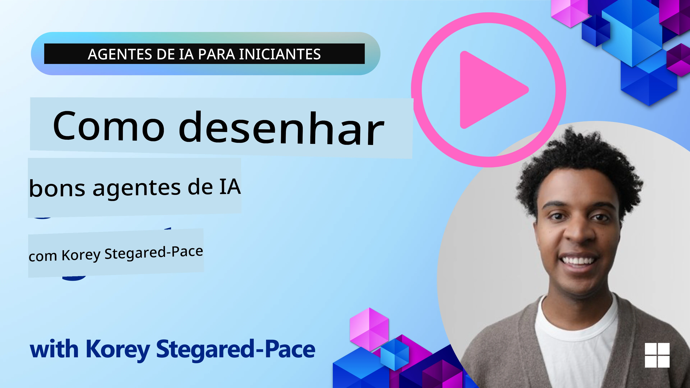
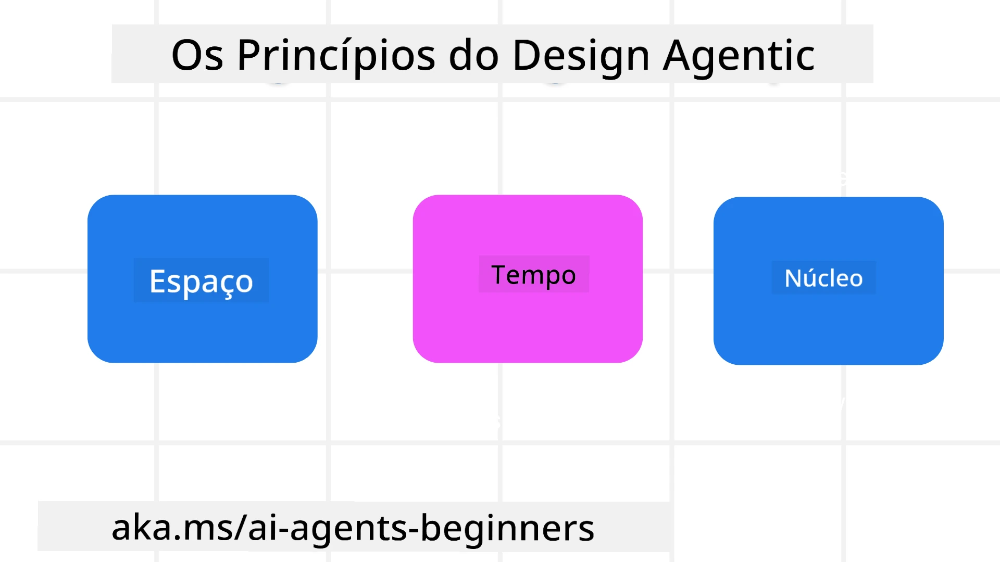

<!--
CO_OP_TRANSLATOR_METADATA:
{
  "original_hash": "d71524fe83a23829ae7a23b4031aaac8",
  "translation_date": "2025-11-13T12:11:35+00:00",
  "source_file": "03-agentic-design-patterns/README.md",
  "language_code": "pt"
}
-->

> _(Clique na imagem acima para assistir ao vídeo desta lição)_
# Princípios de Design de Agentes de IA

## Introdução

Existem muitas formas de pensar na construção de Sistemas de Agentes de IA. Dado que a ambiguidade é uma característica e não um defeito no design de IA Generativa, às vezes é difícil para os engenheiros saberem por onde começar. Criámos um conjunto de Princípios de Design UX centrados no ser humano para permitir que os desenvolvedores construam sistemas de agentes centrados no cliente para atender às suas necessidades empresariais. Estes princípios de design não são uma arquitetura prescritiva, mas sim um ponto de partida para equipas que estão a definir e a construir experiências com agentes.

De forma geral, os agentes devem:

- Ampliar e escalar as capacidades humanas (brainstorming, resolução de problemas, automação, etc.)
- Preencher lacunas de conhecimento (atualizar-me sobre domínios de conhecimento, tradução, etc.)
- Facilitar e apoiar a colaboração nas formas como preferimos trabalhar com outros
- Tornar-nos melhores versões de nós mesmos (por exemplo, coach de vida/gestor de tarefas, ajudar-nos a aprender habilidades de regulação emocional e mindfulness, construir resiliência, etc.)

## Esta Lição Abrangerá

- O que são os Princípios de Design de Agentes
- Quais são algumas diretrizes a seguir ao implementar esses princípios de design
- Exemplos de utilização dos princípios de design

## Objetivos de Aprendizagem

Após completar esta lição, será capaz de:

1. Explicar o que são os Princípios de Design de Agentes
2. Explicar as diretrizes para usar os Princípios de Design de Agentes
3. Compreender como construir um agente usando os Princípios de Design de Agentes

## Os Princípios de Design de Agentes

### Agente (Espaço)

Este é o ambiente no qual o agente opera. Estes princípios informam como projetamos agentes para interagir em mundos físicos e digitais.

- **Conectar, não substituir** – ajudar a conectar pessoas a outras pessoas, eventos e conhecimento acionável para permitir colaboração e conexão.
- Os agentes ajudam a conectar eventos, conhecimento e pessoas.
- Os agentes aproximam as pessoas. Não são projetados para substituir ou diminuir as pessoas.
- **Facilmente acessível, mas ocasionalmente invisível** – o agente opera principalmente em segundo plano e só nos alerta quando é relevante e apropriado.
  - O agente é facilmente descoberto e acessível para utilizadores autorizados em qualquer dispositivo ou plataforma.
  - O agente suporta entradas e saídas multimodais (som, voz, texto, etc.).
  - O agente pode transitar perfeitamente entre primeiro plano e segundo plano; entre proativo e reativo, dependendo da perceção das necessidades do utilizador.
  - O agente pode operar de forma invisível, mas o caminho do processo em segundo plano e a colaboração com outros agentes são transparentes e controláveis pelo utilizador.

### Agente (Tempo)

Este é o modo como o agente opera ao longo do tempo. Estes princípios informam como projetamos agentes que interagem entre passado, presente e futuro.

- **Passado**: Refletir sobre a história que inclui estado e contexto.
  - O agente fornece resultados mais relevantes com base na análise de dados históricos mais ricos, além do evento, pessoas ou estados.
  - O agente cria conexões a partir de eventos passados e reflete ativamente sobre a memória para interagir com situações atuais.
- **Agora**: Alertar mais do que notificar.
  - O agente incorpora uma abordagem abrangente para interagir com pessoas. Quando um evento ocorre, o agente vai além de notificações estáticas ou outras formalidades estáticas. O agente pode simplificar fluxos ou gerar dinamicamente pistas para direcionar a atenção do utilizador no momento certo.
  - O agente entrega informações com base no ambiente contextual, mudanças sociais e culturais e adaptadas à intenção do utilizador.
  - A interação com o agente pode ser gradual, evoluindo/crescendo em complexidade para capacitar os utilizadores a longo prazo.
- **Futuro**: Adaptar e evoluir.
  - O agente adapta-se a vários dispositivos, plataformas e modalidades.
  - O agente adapta-se ao comportamento do utilizador, necessidades de acessibilidade e é livremente personalizável.
  - O agente é moldado e evolui através da interação contínua com o utilizador.

### Agente (Núcleo)

Estes são os elementos-chave no núcleo do design de um agente.

- **Aceitar a incerteza, mas estabelecer confiança**.
  - Um certo nível de incerteza do agente é esperado. A incerteza é um elemento-chave do design de agentes.
  - Confiança e transparência são camadas fundamentais do design de agentes.
  - Os humanos têm controlo sobre quando o agente está ligado/desligado e o estado do agente é claramente visível em todos os momentos.

## As Diretrizes para Implementar Estes Princípios

Ao usar os princípios de design anteriores, siga as seguintes diretrizes:

1. **Transparência**: Informe o utilizador que a IA está envolvida, como funciona (incluindo ações passadas) e como dar feedback e modificar o sistema.
2. **Controlo**: Permita que o utilizador personalize, especifique preferências e personalize, e tenha controlo sobre o sistema e seus atributos (incluindo a capacidade de esquecer).
3. **Consistência**: Procure experiências consistentes e multimodais em dispositivos e pontos de acesso. Use elementos familiares de UI/UX sempre que possível (por exemplo, ícone de microfone para interação por voz) e reduza ao máximo a carga cognitiva do cliente (por exemplo, respostas concisas, recursos visuais e conteúdo "Saiba Mais").

## Como Projetar um Agente de Viagens Usando Estes Princípios e Diretrizes

Imagine que está a projetar um Agente de Viagens, aqui está como poderia pensar em usar os Princípios de Design e Diretrizes:

1. **Transparência** – Informe o utilizador que o Agente de Viagens é um agente habilitado por IA. Forneça algumas instruções básicas sobre como começar (por exemplo, uma mensagem de "Olá", exemplos de prompts). Documente isso claramente na página do produto. Mostre a lista de prompts que o utilizador pediu no passado. Torne claro como dar feedback (polegar para cima e para baixo, botão Enviar Feedback, etc.). Articule claramente se o agente tem restrições de uso ou tópicos.
2. **Controlo** – Certifique-se de que está claro como o utilizador pode modificar o agente após ele ter sido criado, com coisas como o Prompt do Sistema. Permita que o utilizador escolha o quão detalhado o agente deve ser, o seu estilo de escrita e quaisquer restrições sobre o que o agente não deve falar. Permita que o utilizador visualize e exclua quaisquer ficheiros ou dados associados, prompts e conversas anteriores.
3. **Consistência** – Certifique-se de que os ícones para Partilhar Prompt, adicionar um ficheiro ou foto e marcar alguém ou algo são padrão e reconhecíveis. Use o ícone de clipe de papel para indicar upload/partilha de ficheiros com o agente e um ícone de imagem para indicar upload de gráficos.

## Exemplos de Código

- Python: [Framework de Agente](./code_samples/03-python-agent-framework.ipynb)
- .NET: [Framework de Agente](./code_samples/03-dotnet-agent-framework.md)

## Tem Mais Perguntas sobre Padrões de Design de Agentes de IA?

Junte-se ao [Discord do Azure AI Foundry](https://aka.ms/ai-agents/discord) para encontrar outros aprendizes, participar em horas de atendimento e obter respostas às suas perguntas sobre Agentes de IA.

## Recursos Adicionais

- <a href="https://openai.com" target="_blank">Práticas para Governar Sistemas de IA Agentic | OpenAI</a>
- <a href="https://microsoft.com" target="_blank">Projeto HAX Toolkit - Microsoft Research</a>
- <a href="https://responsibleaitoolbox.ai" target="_blank">Responsible AI Toolbox</a>

## Lição Anterior

[Explorando Frameworks de Agentes](../02-explore-agentic-frameworks/README.md)

## Próxima Lição

[Padrão de Design de Uso de Ferramentas](../04-tool-use/README.md)

---

<!-- CO-OP TRANSLATOR DISCLAIMER START -->
**Aviso Legal**:  
Este documento foi traduzido utilizando o serviço de tradução por IA [Co-op Translator](https://github.com/Azure/co-op-translator). Embora nos esforcemos para garantir a precisão, esteja ciente de que traduções automáticas podem conter erros ou imprecisões. O documento original no seu idioma nativo deve ser considerado a fonte autoritária. Para informações críticas, recomenda-se uma tradução profissional humana. Não nos responsabilizamos por quaisquer mal-entendidos ou interpretações incorretas resultantes do uso desta tradução.
<!-- CO-OP TRANSLATOR DISCLAIMER END -->