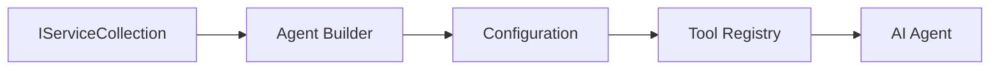

<!--
CO_OP_TRANSLATOR_METADATA:
{
  "original_hash": "bcc874e190347bd6a095aed56dc16de8",
  "translation_date": "2025-11-13T12:12:14+00:00",
  "source_file": "03-agentic-design-patterns/code_samples/03-dotnet-agent-framework.md",
  "language_code": "pt"
}
-->
# 🎨 Padrões de Design Agentes com Modelos GitHub (.NET)

## 📋 Objetivos de Aprendizagem

Este exemplo demonstra padrões de design de nível empresarial para construir agentes inteligentes utilizando o Microsoft Agent Framework em .NET com integração de Modelos GitHub. Aprenderá padrões profissionais e abordagens arquiteturais que tornam os agentes prontos para produção, fáceis de manter e escaláveis.

### Padrões de Design Empresarial

- 🏭 **Padrão Factory**: Criação padronizada de agentes com injeção de dependência
- 🔧 **Padrão Builder**: Configuração e configuração fluente de agentes
- 🧵 **Padrões Thread-Safe**: Gestão de conversas concorrentes
- 📋 **Padrão Repository**: Gestão organizada de ferramentas e capacidades

## 🎯 Benefícios Arquiteturais Específicos do .NET

### Funcionalidades Empresariais

- **Tipagem Forte**: Validação em tempo de compilação e suporte IntelliSense
- **Injeção de Dependência**: Integração com contêiner DI embutido
- **Gestão de Configuração**: Padrões IConfiguration e Options
- **Async/Await**: Suporte de primeira classe para programação assíncrona

### Padrões Prontos para Produção

- **Integração de Logging**: Suporte ILogger e logging estruturado
- **Verificações de Saúde**: Monitorização e diagnósticos embutidos
- **Validação de Configuração**: Tipagem forte com anotações de dados
- **Gestão de Erros**: Gestão estruturada de exceções

## 🔧 Arquitetura Técnica

### Componentes Centrais do .NET

- **Microsoft.Extensions.AI**: Abstrações unificadas de serviços de IA
- **Microsoft.Agents.AI**: Framework de orquestração de agentes empresariais
- **Integração com Modelos GitHub**: Padrões de cliente API de alto desempenho
- **Sistema de Configuração**: Integração com appsettings.json e ambiente

### Implementação de Padrões de Design



## 🏗️ Padrões Empresariais Demonstrados

### 1. **Padrões de Criação**

- **Factory de Agentes**: Criação centralizada de agentes com configuração consistente
- **Padrão Builder**: API fluente para configuração complexa de agentes
- **Padrão Singleton**: Gestão de recursos e configuração compartilhada
- **Injeção de Dependência**: Acoplamento solto e testabilidade

### 2. **Padrões Comportamentais**

- **Padrão Strategy**: Estratégias intercambiáveis de execução de ferramentas
- **Padrão Command**: Operações encapsuladas de agentes com undo/redo
- **Padrão Observer**: Gestão de ciclo de vida de agentes orientada a eventos
- **Template Method**: Fluxos de execução padronizados de agentes

### 3. **Padrões Estruturais**

- **Padrão Adapter**: Camada de integração da API de Modelos GitHub
- **Padrão Decorator**: Melhoria das capacidades dos agentes
- **Padrão Facade**: Interfaces simplificadas de interação com agentes
- **Padrão Proxy**: Carregamento preguiçoso e caching para desempenho

## 📚 Princípios de Design do .NET

### Princípios SOLID

- **Responsabilidade Única**: Cada componente tem um propósito claro
- **Aberto/Fechado**: Extensível sem modificação
- **Substituição de Liskov**: Implementações de ferramentas baseadas em interfaces
- **Segregação de Interfaces**: Interfaces focadas e coesas
- **Inversão de Dependência**: Dependência de abstrações, não de concretizações

### Arquitetura Limpa

- **Camada de Domínio**: Abstrações centrais de agentes e ferramentas
- **Camada de Aplicação**: Orquestração e fluxos de trabalho de agentes
- **Camada de Infraestrutura**: Integração com Modelos GitHub e serviços externos
- **Camada de Apresentação**: Interação com o utilizador e formatação de respostas

## 🔒 Considerações Empresariais

### Segurança

- **Gestão de Credenciais**: Manipulação segura de chaves API com IConfiguration
- **Validação de Entrada**: Tipagem forte e validação com anotações de dados
- **Sanitização de Saída**: Processamento e filtragem segura de respostas
- **Logging de Auditoria**: Rastreamento abrangente de operações

### Desempenho

- **Padrões Assíncronos**: Operações de I/O não bloqueantes
- **Pooling de Conexões**: Gestão eficiente de clientes HTTP
- **Caching**: Caching de respostas para melhorar o desempenho
- **Gestão de Recursos**: Padrões adequados de descarte e limpeza

### Escalabilidade

- **Segurança de Threads**: Suporte para execução concorrente de agentes
- **Pooling de Recursos**: Utilização eficiente de recursos
- **Gestão de Carga**: Limitação de taxa e gestão de pressão
- **Monitorização**: Métricas de desempenho e verificações de saúde

## 🚀 Implementação em Produção

- **Gestão de Configuração**: Configurações específicas de ambiente
- **Estratégia de Logging**: Logging estruturado com IDs de correlação
- **Gestão de Erros**: Gestão global de exceções com recuperação adequada
- **Monitorização**: Insights de aplicação e contadores de desempenho
- **Testes**: Padrões de testes unitários, de integração e de carga

Pronto para construir agentes inteligentes de nível empresarial com .NET? Vamos arquitetar algo robusto! 🏢✨

## 🚀 Primeiros Passos

### Pré-requisitos

- [.NET 10 SDK](https://dotnet.microsoft.com/download/dotnet/10.0) ou superior
- [Token de acesso à API de Modelos GitHub](https://docs.github.com/github-models/github-models-at-scale/using-your-own-api-keys-in-github-models)

### Variáveis de Ambiente Necessárias

```bash
# zsh/bash
export GH_TOKEN=<your_github_token>
export GH_ENDPOINT=https://models.github.ai/inference
export GH_MODEL_ID=openai/gpt-5-mini
```

```powershell
# PowerShell
$env:GH_TOKEN = "<your_github_token>"
$env:GH_ENDPOINT = "https://models.github.ai/inference"
$env:GH_MODEL_ID = "openai/gpt-5-mini"
```

### Código de Exemplo

Para executar o exemplo de código,

```bash
# zsh/bash
chmod +x ./03-dotnet-agent-framework.cs
./03-dotnet-agent-framework.cs
```

Ou utilizando o CLI do dotnet:

```bash
dotnet run ./03-dotnet-agent-framework.cs
```

Veja [`03-dotnet-agent-framework.cs`](../../../../03-agentic-design-patterns/code_samples/03-dotnet-agent-framework.cs) para o código completo.

```csharp
#!/usr/bin/dotnet run

#:package Microsoft.Extensions.AI@10.*
#:package Microsoft.Agents.AI.OpenAI@1.*-*

using System.ClientModel;
using System.ComponentModel;

using Microsoft.Agents.AI;
using Microsoft.Extensions.AI;

using OpenAI;

// Tool Function: Random Destination Generator
// This static method will be available to the agent as a callable tool
// The [Description] attribute helps the AI understand when to use this function
// This demonstrates how to create custom tools for AI agents
[Description("Provides a random vacation destination.")]
static string GetRandomDestination()
{
    // List of popular vacation destinations around the world
    // The agent will randomly select from these options
    var destinations = new List<string>
    {
        "Paris, France",
        "Tokyo, Japan",
        "New York City, USA",
        "Sydney, Australia",
        "Rome, Italy",
        "Barcelona, Spain",
        "Cape Town, South Africa",
        "Rio de Janeiro, Brazil",
        "Bangkok, Thailand",
        "Vancouver, Canada"
    };

    // Generate random index and return selected destination
    // Uses System.Random for simple random selection
    var random = new Random();
    int index = random.Next(destinations.Count);
    return destinations[index];
}

// Extract configuration from environment variables
// Retrieve the GitHub Models API endpoint, defaults to https://models.github.ai/inference if not specified
// Retrieve the model ID, defaults to openai/gpt-5-mini if not specified
// Retrieve the GitHub token for authentication, throws exception if not specified
var github_endpoint = Environment.GetEnvironmentVariable("GH_ENDPOINT") ?? "https://models.github.ai/inference";
var github_model_id = Environment.GetEnvironmentVariable("GH_MODEL_ID") ?? "openai/gpt-5-mini";
var github_token = Environment.GetEnvironmentVariable("GH_TOKEN") ?? throw new InvalidOperationException("GH_TOKEN is not set.");

// Configure OpenAI Client Options
// Create configuration options to point to GitHub Models endpoint
// This redirects OpenAI client calls to GitHub's model inference service
var openAIOptions = new OpenAIClientOptions()
{
    Endpoint = new Uri(github_endpoint)
};

// Initialize OpenAI Client with GitHub Models Configuration
// Create OpenAI client using GitHub token for authentication
// Configure it to use GitHub Models endpoint instead of OpenAI directly
var openAIClient = new OpenAIClient(new ApiKeyCredential(github_token), openAIOptions);

// Define Agent Identity and Comprehensive Instructions
// Agent name for identification and logging purposes
var AGENT_NAME = "TravelAgent";

// Detailed instructions that define the agent's personality, capabilities, and behavior
// This system prompt shapes how the agent responds and interacts with users
var AGENT_INSTRUCTIONS = """
You are a helpful AI Agent that can help plan vacations for customers.

Important: When users specify a destination, always plan for that location. Only suggest random destinations when the user hasn't specified a preference.

When the conversation begins, introduce yourself with this message:
"Hello! I'm your TravelAgent assistant. I can help plan vacations and suggest interesting destinations for you. Here are some things you can ask me:
1. Plan a day trip to a specific location
2. Suggest a random vacation destination
3. Find destinations with specific features (beaches, mountains, historical sites, etc.)
4. Plan an alternative trip if you don't like my first suggestion

What kind of trip would you like me to help you plan today?"

Always prioritize user preferences. If they mention a specific destination like "Bali" or "Paris," focus your planning on that location rather than suggesting alternatives.
""";

// Create AI Agent with Advanced Travel Planning Capabilities
// Initialize complete agent pipeline: OpenAI client → Chat client → AI agent
// Configure agent with name, detailed instructions, and available tools
// This demonstrates the .NET agent creation pattern with full configuration
AIAgent agent = openAIClient
    .GetChatClient(github_model_id)
    .CreateAIAgent(
        name: AGENT_NAME,
        instructions: AGENT_INSTRUCTIONS,
        tools: [AIFunctionFactory.Create(GetRandomDestination)]
    );

// Create New Conversation Thread for Context Management
// Initialize a new conversation thread to maintain context across multiple interactions
// Threads enable the agent to remember previous exchanges and maintain conversational state
// This is essential for multi-turn conversations and contextual understanding
AgentThread thread = agent.GetNewThread();

// Execute Agent: First Travel Planning Request
// Run the agent with an initial request that will likely trigger the random destination tool
// The agent will analyze the request, use the GetRandomDestination tool, and create an itinerary
// Using the thread parameter maintains conversation context for subsequent interactions
await foreach (var update in agent.RunStreamingAsync("Plan me a day trip", thread))
{
    await Task.Delay(10);
    Console.Write(update);
}

Console.WriteLine();

// Execute Agent: Follow-up Request with Context Awareness
// Demonstrate contextual conversation by referencing the previous response
// The agent remembers the previous destination suggestion and will provide an alternative
// This showcases the power of conversation threads and contextual understanding in .NET agents
await foreach (var update in agent.RunStreamingAsync("I don't like that destination. Plan me another vacation.", thread))
{
    await Task.Delay(10);
    Console.Write(update);
}
```

---

<!-- CO-OP TRANSLATOR DISCLAIMER START -->
**Aviso Legal**:  
Este documento foi traduzido utilizando o serviço de tradução por IA [Co-op Translator](https://github.com/Azure/co-op-translator). Embora nos esforcemos para garantir a precisão, esteja ciente de que traduções automáticas podem conter erros ou imprecisões. O documento original no seu idioma nativo deve ser considerado a fonte autoritária. Para informações críticas, recomenda-se uma tradução profissional humana. Não nos responsabilizamos por quaisquer mal-entendidos ou interpretações incorretas resultantes do uso desta tradução.
<!-- CO-OP TRANSLATOR DISCLAIMER END -->