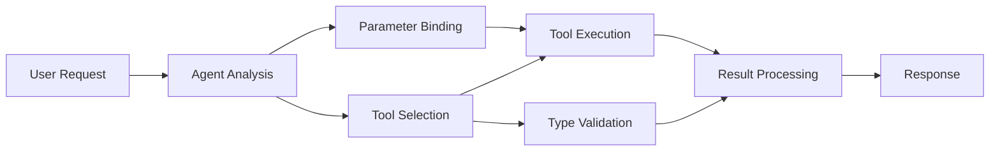

<!--
CO_OP_TRANSLATOR_METADATA:
{
  "original_hash": "91d6061e402489603f2ec8b528cae59b",
  "translation_date": "2025-11-18T17:19:15+00:00",
  "source_file": "04-tool-use/code_samples/04-dotnet-agent-framework.md",
  "language_code": "pt"
}
-->
# 🛠️ Utilização Avançada de Ferramentas com Modelos GitHub (.NET)

## 📋 Objetivos de Aprendizagem

Este notebook demonstra padrões de integração de ferramentas de nível empresarial utilizando o Microsoft Agent Framework em .NET com Modelos GitHub. Vais aprender a construir agentes sofisticados com múltiplas ferramentas especializadas, aproveitando a tipagem forte do C# e as funcionalidades empresariais do .NET.

### Capacidades Avançadas de Ferramentas que Vais Dominar

- 🔧 **Arquitetura Multi-Ferramenta**: Construção de agentes com múltiplas capacidades especializadas
- 🎯 **Execução de Ferramentas com Tipagem Segura**: Aproveitamento da validação em tempo de compilação do C#
- 📊 **Padrões de Ferramentas Empresariais**: Design de ferramentas pronto para produção e gestão de erros
- 🔗 **Composição de Ferramentas**: Combinação de ferramentas para fluxos de trabalho empresariais complexos

## 🎯 Benefícios da Arquitetura de Ferramentas em .NET

### Funcionalidades Empresariais de Ferramentas

- **Validação em Tempo de Compilação**: A tipagem forte garante a correção dos parâmetros das ferramentas
- **Injeção de Dependências**: Integração com contêiner IoC para gestão de ferramentas
- **Padrões Async/Await**: Execução de ferramentas não bloqueante com gestão adequada de recursos
- **Registo Estruturado**: Integração de registo incorporado para monitorização da execução de ferramentas

### Padrões Prontos para Produção

- **Gestão de Exceções**: Gestão abrangente de erros com exceções tipadas
- **Gestão de Recursos**: Padrões adequados de eliminação e gestão de memória
- **Monitorização de Desempenho**: Métricas incorporadas e contadores de desempenho
- **Gestão de Configuração**: Configuração com tipagem segura e validação

## 🔧 Arquitetura Técnica

### Componentes Centrais de Ferramentas em .NET

- **Microsoft.Extensions.AI**: Camada de abstração unificada para ferramentas
- **Microsoft.Agents.AI**: Orquestração de ferramentas de nível empresarial
- **Integração com Modelos GitHub**: Cliente API de alto desempenho com pooling de conexões

### Pipeline de Execução de Ferramentas



## 🛠️ Categorias e Padrões de Ferramentas

### 1. **Ferramentas de Processamento de Dados**

- **Validação de Entrada**: Tipagem forte com anotações de dados
- **Operações de Transformação**: Conversão e formatação de dados com tipagem segura
- **Lógica de Negócio**: Ferramentas de cálculo e análise específicas do domínio
- **Formatação de Saída**: Geração de respostas estruturadas

### 2. **Ferramentas de Integração**

- **Conectores de API**: Integração com serviços RESTful utilizando HttpClient
- **Ferramentas de Base de Dados**: Integração com Entity Framework para acesso a dados
- **Operações de Ficheiros**: Operações seguras no sistema de ficheiros com validação
- **Serviços Externos**: Padrões de integração com serviços de terceiros

### 3. **Ferramentas Utilitárias**

- **Processamento de Texto**: Manipulação e formatação de strings
- **Operações de Data/Hora**: Cálculos de data/hora sensíveis à cultura
- **Ferramentas Matemáticas**: Cálculos de precisão e operações estatísticas
- **Ferramentas de Validação**: Validação de regras de negócio e verificação de dados

Pronto para construir agentes de nível empresarial com capacidades de ferramentas poderosas e com tipagem segura em .NET? Vamos arquitetar soluções de nível profissional! 🏢⚡

## 🚀 Começar

### Pré-requisitos

- [.NET 10 SDK](https://dotnet.microsoft.com/download/dotnet/10.0) ou superior
- [Token de acesso à API dos Modelos GitHub](https://docs.github.com/github-models/github-models-at-scale/using-your-own-api-keys-in-github-models)

### Variáveis de Ambiente Necessárias

```bash
# zsh/bash
export GH_TOKEN=<your_github_token>
export GH_ENDPOINT=https://models.github.ai/inference
export GH_MODEL_ID=openai/gpt-5-mini
```

```powershell
# PowerShell
$env:GH_TOKEN = "<your_github_token>"
$env:GH_ENDPOINT = "https://models.github.ai/inference"
$env:GH_MODEL_ID = "openai/gpt-5-mini"
```

### Código de Exemplo

Para executar o exemplo de código,

```bash
# zsh/bash
chmod +x ./04-dotnet-agent-framework.cs
./04-dotnet-agent-framework.cs
```

Ou utilizando a CLI do dotnet:

```bash
dotnet run ./04-dotnet-agent-framework.cs
```

Consulta [`04-dotnet-agent-framework.cs`](../../../../04-tool-use/code_samples/04-dotnet-agent-framework.cs) para o código completo.

```csharp
#!/usr/bin/dotnet run

#:package Microsoft.Extensions.AI@10.*
#:package Microsoft.Agents.AI.OpenAI@1.*-*

using System.ClientModel;
using System.ComponentModel;

using Microsoft.Agents.AI;
using Microsoft.Extensions.AI;

using OpenAI;

// Tool Function: Random Destination Generator
// This static method will be available to the agent as a callable tool
// The [Description] attribute helps the AI understand when to use this function
// This demonstrates how to create custom tools for AI agents
[Description("Provides a random vacation destination.")]
static string GetRandomDestination()
{
    // List of popular vacation destinations around the world
    // The agent will randomly select from these options
    var destinations = new List<string>
    {
        "Paris, France",
        "Tokyo, Japan",
        "New York City, USA",
        "Sydney, Australia",
        "Rome, Italy",
        "Barcelona, Spain",
        "Cape Town, South Africa",
        "Rio de Janeiro, Brazil",
        "Bangkok, Thailand",
        "Vancouver, Canada"
    };

    // Generate random index and return selected destination
    // Uses System.Random for simple random selection
    var random = new Random();
    int index = random.Next(destinations.Count);
    return destinations[index];
}

// Extract configuration from environment variables
// Retrieve the GitHub Models API endpoint, defaults to https://models.github.ai/inference if not specified
// Retrieve the model ID, defaults to openai/gpt-5-mini if not specified
// Retrieve the GitHub token for authentication, throws exception if not specified
var github_endpoint = Environment.GetEnvironmentVariable("GH_ENDPOINT") ?? "https://models.github.ai/inference";
var github_model_id = Environment.GetEnvironmentVariable("GH_MODEL_ID") ?? "openai/gpt-5-mini";
var github_token = Environment.GetEnvironmentVariable("GH_TOKEN") ?? throw new InvalidOperationException("GH_TOKEN is not set.");

// Configure OpenAI Client Options
// Create configuration options to point to GitHub Models endpoint
// This redirects OpenAI client calls to GitHub's model inference service
var openAIOptions = new OpenAIClientOptions()
{
    Endpoint = new Uri(github_endpoint)
};

// Initialize OpenAI Client with GitHub Models Configuration
// Create OpenAI client using GitHub token for authentication
// Configure it to use GitHub Models endpoint instead of OpenAI directly
var openAIClient = new OpenAIClient(new ApiKeyCredential(github_token), openAIOptions);

// Define Agent Identity and Comprehensive Instructions
// Agent name for identification and logging purposes
var AGENT_NAME = "TravelAgent";

// Detailed instructions that define the agent's personality, capabilities, and behavior
// This system prompt shapes how the agent responds and interacts with users
var AGENT_INSTRUCTIONS = """
You are a helpful AI Agent that can help plan vacations for customers.

Important: When users specify a destination, always plan for that location. Only suggest random destinations when the user hasn't specified a preference.

When the conversation begins, introduce yourself with this message:
"Hello! I'm your TravelAgent assistant. I can help plan vacations and suggest interesting destinations for you. Here are some things you can ask me:
1. Plan a day trip to a specific location
2. Suggest a random vacation destination
3. Find destinations with specific features (beaches, mountains, historical sites, etc.)
4. Plan an alternative trip if you don't like my first suggestion

What kind of trip would you like me to help you plan today?"

Always prioritize user preferences. If they mention a specific destination like "Bali" or "Paris," focus your planning on that location rather than suggesting alternatives.
""";

// Create AI Agent with Advanced Travel Planning Capabilities
// Initialize complete agent pipeline: OpenAI client → Chat client → AI agent
// Configure agent with name, detailed instructions, and available tools
// This demonstrates the .NET agent creation pattern with full configuration
AIAgent agent = openAIClient
    .GetChatClient(github_model_id)
    .CreateAIAgent(
        name: AGENT_NAME,
        instructions: AGENT_INSTRUCTIONS,
        tools: [AIFunctionFactory.Create(GetRandomDestination)]
    );

// Create New Conversation Thread for Context Management
// Initialize a new conversation thread to maintain context across multiple interactions
// Threads enable the agent to remember previous exchanges and maintain conversational state
// This is essential for multi-turn conversations and contextual understanding
AgentThread thread = agent.GetNewThread();

// Execute Agent: First Travel Planning Request
// Run the agent with an initial request that will likely trigger the random destination tool
// The agent will analyze the request, use the GetRandomDestination tool, and create an itinerary
// Using the thread parameter maintains conversation context for subsequent interactions
await foreach (var update in agent.RunStreamingAsync("Plan me a day trip", thread))
{
    await Task.Delay(10);
    Console.Write(update);
}

Console.WriteLine();

// Execute Agent: Follow-up Request with Context Awareness
// Demonstrate contextual conversation by referencing the previous response
// The agent remembers the previous destination suggestion and will provide an alternative
// This showcases the power of conversation threads and contextual understanding in .NET agents
await foreach (var update in agent.RunStreamingAsync("I don't like that destination. Plan me another vacation.", thread))
{
    await Task.Delay(10);
    Console.Write(update);
}
```

---

<!-- CO-OP TRANSLATOR DISCLAIMER START -->
**Aviso Legal**:  
Este documento foi traduzido utilizando o serviço de tradução por IA [Co-op Translator](https://github.com/Azure/co-op-translator). Embora nos esforcemos pela precisão, esteja ciente de que traduções automáticas podem conter erros ou imprecisões. O documento original na sua língua nativa deve ser considerado a fonte autoritária. Para informações críticas, recomenda-se uma tradução profissional humana. Não nos responsabilizamos por quaisquer mal-entendidos ou interpretações incorretas decorrentes do uso desta tradução.
<!-- CO-OP TRANSLATOR DISCLAIMER END -->