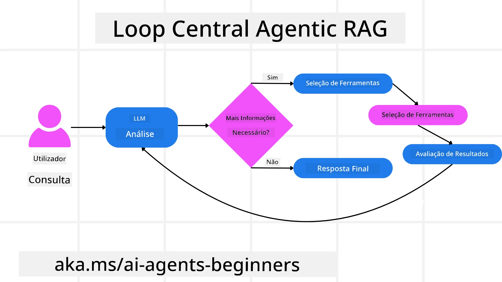
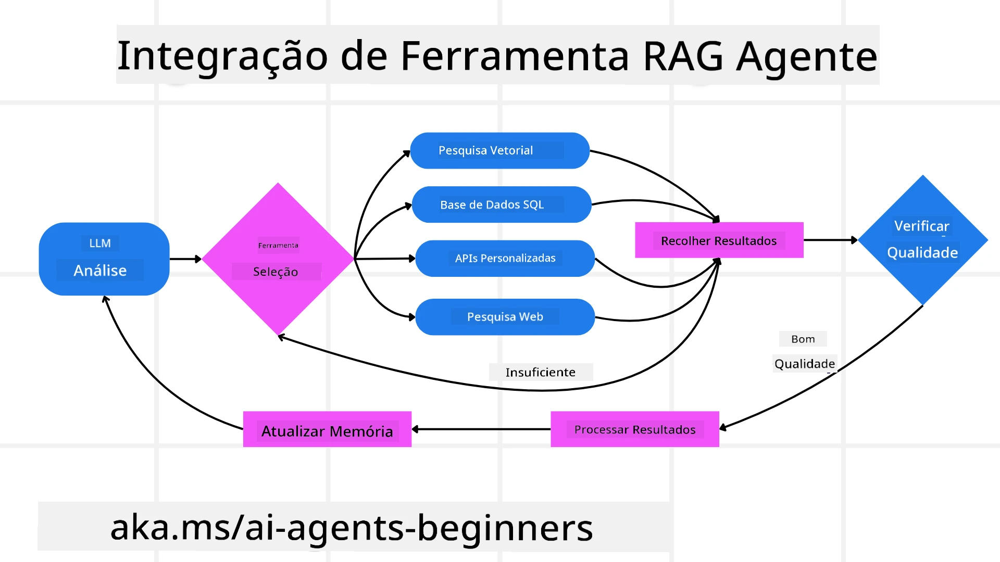
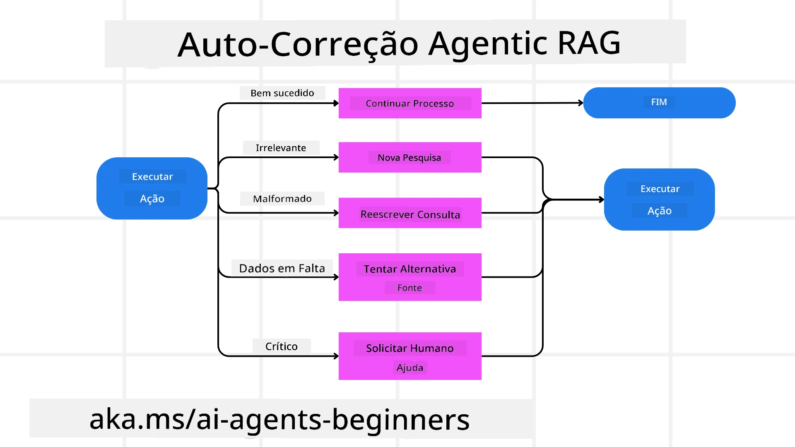
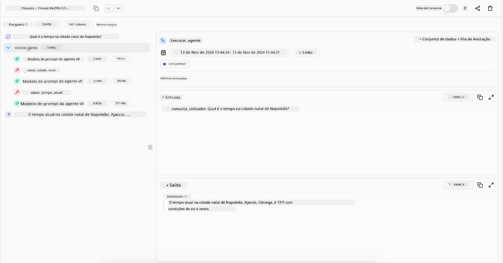

<!--
CO_OP_TRANSLATOR_METADATA:
{
  "original_hash": "0ebf6b2290db55dbf2d10cc49655523b",
  "translation_date": "2025-09-30T06:53:03+00:00",
  "source_file": "05-agentic-rag/README.md",
  "language_code": "pt"
}
-->

> _(Clique na imagem acima para ver o vídeo desta lição)_

# Agentic RAG

Esta lição oferece uma visão abrangente sobre o Agentic Retrieval-Augmented Generation (Agentic RAG), um paradigma emergente de IA onde modelos de linguagem de grande escala (LLMs) planeiam autonomamente os seus próximos passos enquanto obtêm informações de fontes externas. Diferentemente dos padrões estáticos de recuperação e leitura, o Agentic RAG envolve chamadas iterativas ao LLM, intercaladas com chamadas a ferramentas ou funções e saídas estruturadas. O sistema avalia os resultados, refina as consultas, invoca ferramentas adicionais, se necessário, e continua este ciclo até alcançar uma solução satisfatória.

## Introdução

Esta lição abordará:

- **Compreender o Agentic RAG:** Aprenda sobre o paradigma emergente em IA onde modelos de linguagem de grande escala (LLMs) planeiam autonomamente os seus próximos passos enquanto obtêm informações de fontes de dados externas.
- **Entender o Estilo Iterativo Maker-Checker:** Compreenda o ciclo de chamadas iterativas ao LLM, intercaladas com chamadas a ferramentas ou funções e saídas estruturadas, projetado para melhorar a precisão e lidar com consultas malformadas.
- **Explorar Aplicações Práticas:** Identifique cenários onde o Agentic RAG se destaca, como ambientes com foco na precisão, interações complexas com bases de dados e fluxos de trabalho prolongados.

## Objetivos de Aprendizagem

Após concluir esta lição, saberá como/compreenderá:

- **Compreender o Agentic RAG:** Aprenda sobre o paradigma emergente em IA onde modelos de linguagem de grande escala (LLMs) planeiam autonomamente os seus próximos passos enquanto obtêm informações de fontes de dados externas.
- **Estilo Iterativo Maker-Checker:** Entenda o conceito de um ciclo de chamadas iterativas ao LLM, intercaladas com chamadas a ferramentas ou funções e saídas estruturadas, projetado para melhorar a precisão e lidar com consultas malformadas.
- **Assumir o Processo de Raciocínio:** Compreenda a capacidade do sistema de assumir o seu processo de raciocínio, tomando decisões sobre como abordar problemas sem depender de caminhos pré-definidos.
- **Fluxo de Trabalho:** Entenda como um modelo agentic decide de forma independente recuperar relatórios de tendências de mercado, identificar dados de concorrentes, correlacionar métricas internas de vendas, sintetizar conclusões e avaliar a estratégia.
- **Ciclos Iterativos, Integração de Ferramentas e Memória:** Aprenda sobre a dependência do sistema em padrões de interação em loop, mantendo estado e memória entre os passos para evitar loops repetitivos e tomar decisões informadas.
- **Lidar com Modos de Falha e Autocorreção:** Explore os mecanismos robustos de autocorreção do sistema, incluindo iteração e novas consultas, uso de ferramentas de diagnóstico e recurso à supervisão humana.
- **Limites da Autonomia:** Compreenda as limitações do Agentic RAG, focando na autonomia específica do domínio, dependência de infraestrutura e respeito por limites de segurança.
- **Casos de Uso Práticos e Valor:** Identifique cenários onde o Agentic RAG se destaca, como ambientes com foco na precisão, interações complexas com bases de dados e fluxos de trabalho prolongados.
- **Governança, Transparência e Confiança:** Aprenda sobre a importância da governança e transparência, incluindo raciocínio explicável, controlo de viés e supervisão humana.

## O que é o Agentic RAG?

Agentic Retrieval-Augmented Generation (Agentic RAG) é um paradigma emergente de IA onde modelos de linguagem de grande escala (LLMs) planeiam autonomamente os seus próximos passos enquanto obtêm informações de fontes externas. Diferentemente dos padrões estáticos de recuperação e leitura, o Agentic RAG envolve chamadas iterativas ao LLM, intercaladas com chamadas a ferramentas ou funções e saídas estruturadas. O sistema avalia os resultados, refina as consultas, invoca ferramentas adicionais, se necessário, e continua este ciclo até alcançar uma solução satisfatória. Este estilo iterativo “maker-checker” melhora a precisão, lida com consultas malformadas e garante resultados de alta qualidade.

O sistema assume ativamente o seu processo de raciocínio, reescrevendo consultas falhadas, escolhendo diferentes métodos de recuperação e integrando várias ferramentas—como pesquisa vetorial no Azure AI Search, bases de dados SQL ou APIs personalizadas—antes de finalizar a sua resposta. A qualidade distintiva de um sistema agentic é a sua capacidade de assumir o seu processo de raciocínio. Implementações tradicionais de RAG dependem de caminhos pré-definidos, mas um sistema agentic determina autonomamente a sequência de passos com base na qualidade da informação que encontra.

## Definição de Agentic Retrieval-Augmented Generation (Agentic RAG)

Agentic Retrieval-Augmented Generation (Agentic RAG) é um paradigma emergente no desenvolvimento de IA onde os LLMs não apenas obtêm informações de fontes de dados externas, mas também planeiam autonomamente os seus próximos passos. Diferentemente dos padrões estáticos de recuperação e leitura ou sequências de prompts cuidadosamente roteirizadas, o Agentic RAG envolve um ciclo de chamadas iterativas ao LLM, intercaladas com chamadas a ferramentas ou funções e saídas estruturadas. A cada etapa, o sistema avalia os resultados obtidos, decide se deve refinar as consultas, invoca ferramentas adicionais, se necessário, e continua este ciclo até alcançar uma solução satisfatória.

Este estilo iterativo “maker-checker” é projetado para melhorar a precisão, lidar com consultas malformadas para bases de dados estruturadas (por exemplo, NL2SQL) e garantir resultados equilibrados e de alta qualidade. Em vez de depender exclusivamente de cadeias de prompts cuidadosamente projetadas, o sistema assume ativamente o seu processo de raciocínio. Pode reescrever consultas que falham, escolher diferentes métodos de recuperação e integrar várias ferramentas—como pesquisa vetorial no Azure AI Search, bases de dados SQL ou APIs personalizadas—antes de finalizar a sua resposta. Isso elimina a necessidade de frameworks de orquestração excessivamente complexos. Em vez disso, um loop relativamente simples de “chamada ao LLM → uso de ferramenta → chamada ao LLM → …” pode gerar saídas sofisticadas e bem fundamentadas.

## Assumir o Processo de Raciocínio

A qualidade distintiva que torna um sistema “agentic” é a sua capacidade de assumir o seu processo de raciocínio. Implementações tradicionais de RAG frequentemente dependem de humanos para pré-definir um caminho para o modelo: uma cadeia de raciocínio que delineia o que recuperar e quando. Mas quando um sistema é verdadeiramente agentic, decide internamente como abordar o problema. Não está apenas a executar um script; está a determinar autonomamente a sequência de passos com base na qualidade da informação que encontra. 

Por exemplo, se for solicitado a criar uma estratégia de lançamento de produto, não depende apenas de um prompt que descreve todo o fluxo de trabalho de pesquisa e tomada de decisão. Em vez disso, o modelo agentic decide de forma independente:

1. Recuperar relatórios de tendências de mercado atuais usando Bing Web Grounding.
2. Identificar dados relevantes de concorrentes usando Azure AI Search.
3. Correlacionar métricas internas de vendas históricas usando Azure SQL Database.
4. Sintetizar as conclusões numa estratégia coesa orquestrada via Azure OpenAI Service.
5. Avaliar a estratégia em busca de lacunas ou inconsistências, iniciando outra rodada de recuperação, se necessário.

Todos estes passos—refinar consultas, escolher fontes, iterar até estar “satisfeito” com a resposta—são decididos pelo modelo, não pré-roteirizados por um humano.

## Ciclos Iterativos, Integração de Ferramentas e Memória

Um sistema agentic depende de um padrão de interação em loop:

- **Chamada Inicial:** O objetivo do utilizador (ou seja, o prompt do utilizador) é apresentado ao LLM.
- **Invocação de Ferramentas:** Se o modelo identificar informações em falta ou instruções ambíguas, seleciona uma ferramenta ou método de recuperação—como uma consulta a uma base de dados vetorial (por exemplo, Azure AI Search Hybrid search sobre dados privados) ou uma chamada SQL estruturada—para obter mais contexto.
- **Avaliação e Refinamento:** Após rever os dados retornados, o modelo decide se as informações são suficientes. Caso contrário, refina a consulta, tenta uma ferramenta diferente ou ajusta a sua abordagem.
- **Repetir Até Estar Satisfeito:** Este ciclo continua até o modelo determinar que tem clareza e evidências suficientes para entregar uma resposta final bem fundamentada.
- **Memória e Estado:** Como o sistema mantém estado e memória entre os passos, pode recordar tentativas anteriores e os seus resultados, evitando loops repetitivos e tomando decisões mais informadas à medida que avança.

Com o tempo, isso cria uma sensação de compreensão evolutiva, permitindo que o modelo navegue por tarefas complexas e de múltiplos passos sem exigir que um humano intervenha constantemente ou reformule o prompt.

## Lidar com Modos de Falha e Autocorreção

A autonomia do Agentic RAG também envolve mecanismos robustos de autocorreção. Quando o sistema encontra obstáculos—como recuperar documentos irrelevantes ou enfrentar consultas malformadas—pode:

- **Iterar e Fazer Novas Consultas:** Em vez de retornar respostas de baixo valor, o modelo tenta novas estratégias de pesquisa, reescreve consultas de bases de dados ou analisa conjuntos de dados alternativos.
- **Usar Ferramentas de Diagnóstico:** O sistema pode invocar funções adicionais projetadas para ajudá-lo a depurar os passos de raciocínio ou confirmar a correção dos dados recuperados. Ferramentas como Azure AI Tracing serão importantes para permitir observabilidade e monitorização robustas.
- **Recorrer à Supervisão Humana:** Para cenários de alto risco ou falhas repetidas, o modelo pode sinalizar incertezas e solicitar orientação humana. Uma vez que o humano fornece feedback corretivo, o modelo pode incorporar essa lição no futuro.

Esta abordagem iterativa e dinâmica permite que o modelo melhore continuamente, garantindo que não é apenas um sistema de tentativa única, mas um que aprende com os seus erros durante uma sessão específica.

## Limites da Autonomia

Apesar da sua autonomia dentro de uma tarefa, o Agentic RAG não é análogo à Inteligência Artificial Geral. As suas capacidades “agentic” estão confinadas às ferramentas, fontes de dados e políticas fornecidas pelos desenvolvedores humanos. Não pode inventar as suas próprias ferramentas ou ultrapassar os limites do domínio que foram definidos. Em vez disso, destaca-se na orquestração dinâmica dos recursos disponíveis.

Diferenças-chave em relação a formas mais avançadas de IA incluem:

1. **Autonomia Específica do Domínio:** Sistemas Agentic RAG estão focados em alcançar objetivos definidos pelo utilizador dentro de um domínio conhecido, empregando estratégias como reescrita de consultas ou seleção de ferramentas para melhorar os resultados.
2. **Dependência de Infraestrutura:** As capacidades do sistema dependem das ferramentas e dados integrados pelos desenvolvedores. Não pode ultrapassar esses limites sem intervenção humana.
3. **Respeito pelos Limites de Segurança:** Diretrizes éticas, regras de conformidade e políticas empresariais continuam a ser muito importantes. A liberdade do agente está sempre limitada por medidas de segurança e mecanismos de supervisão (espera-se).

## Casos de Uso Práticos e Valor

O Agentic RAG destaca-se em cenários que exigem refinamento iterativo e precisão:

1. **Ambientes com Foco na Precisão:** Em verificações de conformidade, análises regulatórias ou pesquisas legais, o modelo agentic pode verificar repetidamente os factos, consultar várias fontes e reescrever consultas até produzir uma resposta minuciosamente verificada.
2. **Interações Complexas com Bases de Dados:** Ao lidar com dados estruturados onde as consultas podem frequentemente falhar ou precisar de ajustes, o sistema pode refinar autonomamente as suas consultas usando Azure SQL ou Microsoft Fabric OneLake, garantindo que a recuperação final esteja alinhada com a intenção do utilizador.
3. **Fluxos de Trabalho Prolongados:** Sessões mais longas podem evoluir à medida que novas informações surgem. O Agentic RAG pode incorporar continuamente novos dados, ajustando estratégias à medida que aprende mais sobre o espaço do problema.

## Governança, Transparência e Confiança

À medida que estes sistemas se tornam mais autónomos no seu raciocínio, a governança e a transparência são cruciais:

- **Raciocínio Explicável:** O modelo pode fornecer um registo auditável das consultas que realizou, das fontes que consultou e dos passos de raciocínio que tomou para chegar à sua conclusão. Ferramentas como Azure AI Content Safety e Azure AI Tracing / GenAIOps podem ajudar a manter a transparência e mitigar riscos.
- **Controlo de Viés e Recuperação Equilibrada:** Os desenvolvedores podem ajustar estratégias de recuperação para garantir que fontes de dados equilibradas e representativas sejam consideradas, e auditar regularmente as saídas para detectar viés ou padrões distorcidos usando modelos personalizados para organizações avançadas de ciência de dados com Azure Machine Learning.
- **Supervisão Humana e Conformidade:** Para tarefas sensíveis, a revisão humana continua essencial. O Agentic RAG não substitui o julgamento humano em decisões de alto risco—ele complementa-o ao fornecer opções mais minuciosamente verificadas.

Ter ferramentas que fornecem um registo claro das ações é essencial. Sem elas, depurar um processo de múltiplos passos pode ser muito difícil. Veja o exemplo seguinte da Literal AI (empresa por trás do Chainlit) para uma execução de agente:

## Conclusão

O Agentic RAG representa uma evolução natural na forma como os sistemas de IA lidam com tarefas complexas e intensivas em dados. Ao adotar um padrão de interação em loop, selecionar ferramentas autonomamente e refinar consultas até alcançar um resultado de alta qualidade, o sistema vai além da execução estática de prompts, tornando-se um tomador de decisões mais adaptável e consciente do contexto. Embora ainda limitado por infraestruturas e diretrizes éticas definidas por humanos, estas capacidades agentic permitem interações de IA mais ricas, dinâmicas e, em última análise, mais úteis para empresas e utilizadores finais.

### Tem Mais Perguntas sobre Agentic RAG?

Junte-se ao [Discord do Azure AI Foundry](https://aka.ms/ai-agents/discord) para interagir com outros aprendizes, participar em horas de atendimento e obter respostas às suas perguntas sobre AI Agents.

## Recursos Adicionais

- <a href="https://learn.microsoft.com/training/modules/use-own-data-azure-openai" target="_blank">Implementar Retrieval Augmented Generation (RAG) com Azure OpenAI Service: Aprenda a usar os seus próprios dados com o Azure OpenAI Service. Este módulo do Microsoft Learn oferece um guia abrangente sobre como implementar RAG</a>
- <a href="https://learn.microsoft.com/azure/ai-studio/concepts/evaluation-approach-gen-ai" target="_blank">Avaliação de aplicações de IA generativa com Azure AI Foundry: Este artigo aborda a avaliação e comparação de modelos em conjuntos de dados públicos, incluindo aplicações de IA agentic e arquiteturas RAG</a>
- <a href="https://weaviate.io/blog/what-is-agentic-rag" target="_blank">O que é Agentic RAG | Weaviate</a>
- <a href="https://ragaboutit.com/agentic-rag-a-complete-guide-to-agent-based-retrieval-augmented-generation/" target="_blank">Agentic RAG: Um Guia Completo para Geração Aumentada por Recuperação Baseada em Agentes – Notícias da geração RAG</a>
- <a href="https://huggingface.co/learn/cookbook/agent_rag" target="_blank">Agentic RAG: impulsione o seu RAG com reformulação de consultas e auto-consulta! Hugging Face Open-Source AI Cookbook</a>
- <a href="https://youtu.be/aQ4yQXeB1Ss?si=2HUqBzHoeB5tR04U" target="_blank">Adicionando Camadas Agentic ao RAG</a>
- <a href="https://www.youtube.com/watch?v=zeAyuLc_f3Q&t=244s" target="_blank">O Futuro dos Assistentes de Conhecimento: Jerry Liu</a>
- <a href="https://www.youtube.com/watch?v=AOSjiXP1jmQ" target="_blank">Como Construir Sistemas Agentic RAG</a>
- <a href="https://ignite.microsoft.com/sessions/BRK102?source=sessions" target="_blank">Usando o Serviço de Agentes Azure AI Foundry para escalar os seus agentes de IA</a>

### Artigos Académicos

- <a href="https://arxiv.org/abs/2303.17651" target="_blank">2303.17651 Self-Refine: Refinamento Iterativo com Auto-Feedback</a>
- <a href="https://arxiv.org/abs/2303.11366" target="_blank">2303.11366 Reflexion: Agentes de Linguagem com Aprendizagem por Reforço Verbal</a>
- <a href="https://arxiv.org/abs/2305.11738" target="_blank">2305.11738 CRITIC: Grandes Modelos de Linguagem Podem Auto-Corrigir com Críticas Interativas com Ferramentas</a>
- <a href="https://arxiv.org/abs/2501.09136" target="_blank">2501.09136 Agentic Retrieval-Augmented Generation: Uma Revisão sobre Agentic RAG</a>

## Aula Anterior

[Modelo de Design para Uso de Ferramentas](../04-tool-use/README.md)

## Próxima Aula

[Construindo Agentes de IA Confiáveis](../06-building-trustworthy-agents/README.md)

---

**Aviso Legal**:  
Este documento foi traduzido utilizando o serviço de tradução por IA [Co-op Translator](https://github.com/Azure/co-op-translator). Embora nos esforcemos para garantir a precisão, é importante notar que traduções automáticas podem conter erros ou imprecisões. O documento original na sua língua nativa deve ser considerado a fonte autoritária. Para informações críticas, recomenda-se uma tradução profissional realizada por humanos. Não nos responsabilizamos por quaisquer mal-entendidos ou interpretações incorretas decorrentes da utilização desta tradução.