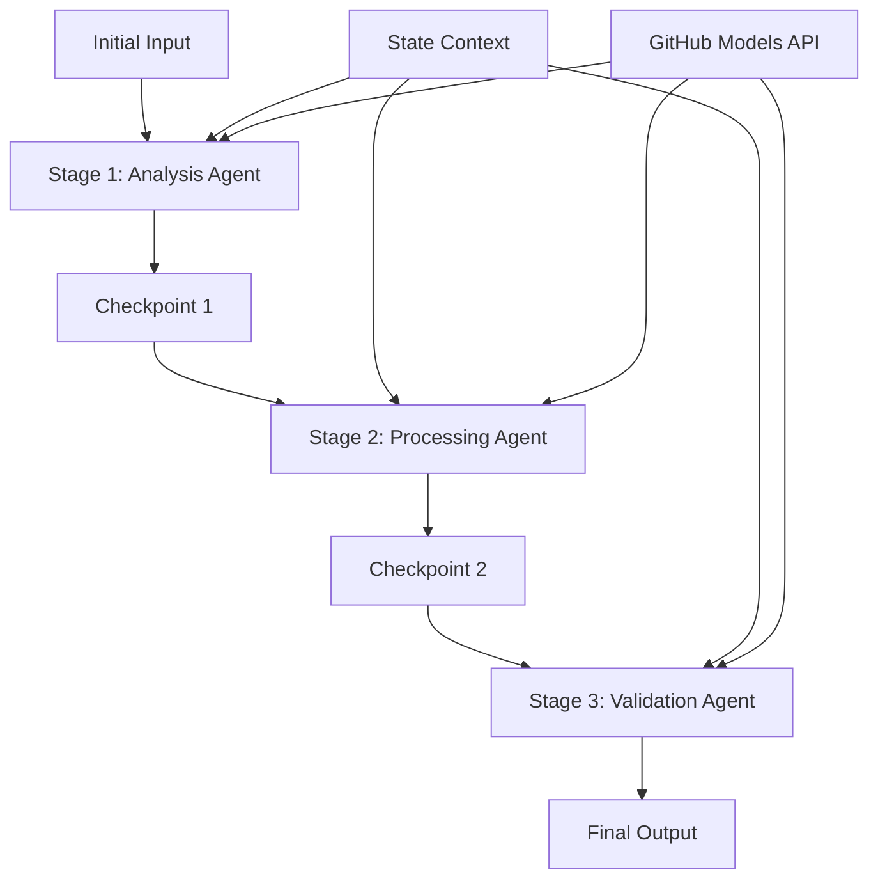

<!--
CO_OP_TRANSLATOR_METADATA:
{
  "original_hash": "1be9c8dcbd79a02d33d2c138684c1394",
  "translation_date": "2025-11-11T13:49:48+00:00",
  "source_file": "08-multi-agent/code_samples/workflows-agent-framework/dotNET/02.dotnet-agent-framework-workflow-ghmodel-sequential.md",
  "language_code": "pt"
}
-->
# ⏩ Fluxos de Trabalho Sequenciais com Modelos GitHub (.NET)

## 📋 Tutorial Avançado de Processamento Sequencial

Este notebook demonstra **padrões de fluxos de trabalho sequenciais** utilizando o Microsoft Agent Framework para .NET e Modelos GitHub. Aprenderá a construir pipelines de processamento sofisticados, passo a passo, onde os agentes executam numa ordem específica, com cada etapa baseando-se nos resultados da etapa anterior.

## 🎯 Objetivos de Aprendizagem

### 🔄 **Arquitetura de Processamento Sequencial**
- **Design de Fluxo de Trabalho Linear**: Criar pipelines de processamento passo a passo com dependências claras
- **Gestão de Estado**: Manter o contexto e o fluxo de dados entre as etapas do fluxo de trabalho sequencial
- **Integração com Modelos GitHub**: Utilizar os modelos de IA do GitHub em fluxos de trabalho .NET multi-etapas
- **Padrões de Pipeline Empresarial**: Construir sistemas de processamento sequencial prontos para produção

### 🏗️ **Padrões Avançados de Sequência**
- **Processamento em Etapas**: Implementar pontos de validação entre as etapas do fluxo de trabalho
- **Preservação de Contexto**: Manter o estado e o conhecimento acumulado em todas as etapas
- **Propagação de Erros**: Lidar com falhas de forma eficiente em cadeias de processamento sequenciais
- **Otimização de Desempenho**: Execução sequencial eficiente com o mínimo de sobrecarga

### 🏢 **Aplicações Sequenciais Empresariais**
- **Pipeline de Processamento de Documentos**: Análise, transformação e validação de documentos em várias etapas
- **Fluxos de Trabalho de Garantia de Qualidade**: Revisão, validação e processos de aprovação sequenciais
- **Pipeline de Produção de Conteúdo**: Pesquisa → Escrita → Edição → Revisão → Publicação
- **Automação de Processos Empresariais**: Fluxos de trabalho empresariais multi-etapas com dependências claras entre etapas

## ⚙️ Pré-requisitos e Configuração

### 📦 **Pacotes NuGet Necessários**

Pacotes essenciais para fluxos de trabalho sequenciais em .NET:

```xml
<!-- Core AI Framework -->
<PackageReference Include="Microsoft.Extensions.AI" Version="9.9.0" />

<!-- Client Model Abstractions -->
<PackageReference Include="System.ClientModel" Version="1.6.1.0" />

<!-- Azure Identity and Async LINQ Support -->
<PackageReference Include="Azure.Identity" Version="1.15.0" />
<PackageReference Include="System.Linq.Async" Version="6.0.3" />

<!-- Local Agent Framework References -->
<!-- Microsoft.Agents.AI.dll - Core agent abstractions -->
<!-- Microsoft.Agents.AI.OpenAI.dll - GitHub Models integration -->
```

### 🔑 **Configuração dos Modelos GitHub**

**Configuração do Ambiente (.env file):**
```env
GITHUB_TOKEN=your_github_personal_access_token
GITHUB_ENDPOINT=https://models.inference.ai.azure.com
GITHUB_MODEL_ID=gpt-4o-mini
```

**Gestão de Configuração:**
```csharp
// Load environment variables securely
Env.Load("../../../.env");
var githubToken = Environment.GetEnvironmentVariable("GITHUB_TOKEN");
var githubEndpoint = Environment.GetEnvironmentVariable("GITHUB_ENDPOINT");
var modelId = Environment.GetEnvironmentVariable("GITHUB_MODEL_ID");
```

### 🏗️ **Arquitetura de Fluxo de Trabalho Sequencial**



**Componentes Principais:**
- **Agentes Sequenciais**: Agentes especializados para cada etapa de processamento
- **Contexto de Estado**: Mantém os dados acumulados e decisões entre as etapas
- **Pontos de Verificação**: Pontos de validação entre etapas para garantir qualidade e consistência
- **Cliente de Modelos GitHub**: Acesso consistente aos modelos de IA em todas as etapas do fluxo de trabalho

## 🎨 **Padrões de Design de Fluxo de Trabalho Sequencial**

### 📝 **Pipeline de Processamento de Documentos**
```
Raw Document → Content Extraction → Analysis → Validation → Structured Output
```

### 🎯 **Fluxo de Trabalho de Criação de Conteúdo**
```
Brief/Requirements → Research → Content Creation → Review → Final Polish
```

### 🔍 **Pipeline de Garantia de Qualidade**
```
Initial Review → Technical Validation → Compliance Check → Final Approval
```

### 💼 **Fluxo de Trabalho de Inteligência Empresarial**
```
Data Collection → Processing → Analysis → Report Generation → Distribution
```

## 🏢 **Benefícios Sequenciais Empresariais**

### 🎯 **Confiabilidade e Qualidade**
- **Processamento Determinístico**: Resultados consistentes e repetíveis através de etapas estruturadas
- **Portas de Qualidade**: Pontos de validação garantem qualidade em cada etapa
- **Isolamento de Erros**: Problemas numa etapa não se propagam para etapas subsequentes
- **Rastreabilidade**: Registo completo de decisões e transformações em cada etapa

### 📈 **Escalabilidade e Desempenho**
- **Design Modular**: Cada etapa pode ser otimizada de forma independente
- **Gestão de Recursos**: Alocação eficiente de recursos de modelos de IA entre etapas
- **Otimização de Estado**: Transferência mínima de estado entre etapas para desempenho ideal
- **Grupos de Etapas Paralelas**: Múltiplos fluxos de trabalho sequenciais podem ser executados em paralelo

### 🔒 **Segurança e Conformidade**
- **Segurança por Etapa**: Políticas de segurança diferentes para diferentes etapas de processamento
- **Validação de Dados**: Garantir integridade e conformidade dos dados em cada ponto de verificação
- **Controlo de Acesso**: Permissões granulares para diferentes etapas do fluxo de trabalho
- **Conformidade Regulamentar**: Cumprir requisitos regulatórios através de processamento estruturado

### 📊 **Monitorização e Análise**
- **Métricas por Etapa**: Monitorização de desempenho para cada etapa do fluxo de trabalho
- **Identificação de Gargalos**: Identificar e otimizar etapas lentas
- **Métricas de Qualidade**: Acompanhar qualidade e taxas de sucesso em cada etapa
- **Otimização de Processos**: Melhoria contínua baseada em análises por etapa

Vamos construir pipelines robustos de processamento de IA sequencial! 🚀

## 💻 Executando o Código

A implementação completa está disponível em `02.dotnet-agent-framework-workflow-ghmodel-sequential.cs`. Este ficheiro demonstra um **fluxo de trabalho de análise de móveis em três etapas**:

1. **Etapa 1 - Agente de Vendas**: Analisa imagens de móveis e fornece sugestões de compra
2. **Etapa 2 - Agente de Preços**: Fornece análises detalhadas de preços e opções de orçamento
3. **Etapa 3 - Agente de Orçamento**: Gera um documento de orçamento profissional em formato Markdown

### 🏗️ **Arquitetura do Fluxo de Trabalho**

```
Image Input → Sales Analysis → Price Estimation → Quote Generation → Final Output
```

Cada agente:
- Recebe o resultado da etapa anterior como contexto
- Baseia-se na análise anterior com especialização específica
- Mantém a continuidade do fluxo de trabalho através da gestão de estado

### 🚀 Executando o Exemplo

**Pré-requisitos:**
- Coloque uma imagem de móveis em `../imgs/home.png` (ou atualize a variável `imgPath`)
- Configure o seu ficheiro `.env` com as credenciais dos Modelos GitHub

```bash
# Make the script executable (Unix/Linux/macOS)
chmod +x 02.dotnet-agent-framework-workflow-ghmodel-sequential.cs

# Run the sequential workflow
./02.dotnet-agent-framework-workflow-ghmodel-sequential.cs
```

Ou no Windows:
```powershell
dotnet run 02.dotnet-agent-framework-workflow-ghmodel-sequential.cs
```

### 📝 Resultado Esperado

O fluxo de trabalho irá:
1. **Agente de Vendas**: Identificar itens de móveis na imagem e fornecer recomendações
2. **Agente de Preços**: Adicionar análise detalhada de preços com níveis de orçamento e recomendações de compra
3. **Agente de Orçamento**: Gerar um documento de orçamento formatado com todas as informações sintetizadas

O resultado final será um orçamento de móveis abrangente e profissional baseado na análise da imagem.

### 🔧 Opções de Personalização

**Modificar Comportamento do Agente:**
```csharp
// Adjust agent instructions to change their focus
const string SalesAgentInstructions = "Your custom instructions...";
```

**Alterar Fluxo Sequencial:**
```csharp
// Add or reorder workflow stages
var workflow = new WorkflowBuilder(salesagent)
    .AddEdge(salesagent, priceagent)
    .AddEdge(priceagent, quoteagent)
    .AddEdge(quoteagent, newAgent)  // Add another stage
    .Build();
```

**Usar Entrada Diferente:**
```csharp
// Process text instead of images
ChatMessage userMessage = new ChatMessage(ChatRole.User, [
    new TextContent("Analyze pricing for a modern living room set")
]);
```

### 🎯 Aplicações Reais

Este padrão sequencial é ideal para:
- **E-commerce**: Análise de produtos → Preços → Geração de orçamento
- **Imobiliário**: Análise de propriedades → Avaliação → Criação de listagem
- **Seguros**: Análise de sinistros → Avaliação → Geração de orçamento
- **Criação de Conteúdo**: Pesquisa → Escrita → Edição → Publicação

### 🔍 Compreendendo o Fluxo de Estado

Cada agente na sequência recebe:
- **Entrada Original**: A mensagem inicial do utilizador (imagem + texto)
- **Saídas dos Agentes Anteriores**: Todas as respostas anteriores dos agentes no histórico da conversa
- **Contexto Acumulado**: Estado completo mantido ao longo do fluxo de trabalho

Isso permite um processamento sofisticado em várias etapas, onde cada agente se baseia num contexto abrangente de todas as etapas anteriores.

---

<!-- CO-OP TRANSLATOR DISCLAIMER START -->
**Aviso**:  
Este documento foi traduzido utilizando o serviço de tradução por IA [Co-op Translator](https://github.com/Azure/co-op-translator). Embora nos esforcemos pela precisão, esteja ciente de que traduções automáticas podem conter erros ou imprecisões. O documento original na sua língua nativa deve ser considerado a fonte autoritária. Para informações críticas, recomenda-se uma tradução profissional realizada por humanos. Não nos responsabilizamos por quaisquer mal-entendidos ou interpretações incorretas decorrentes do uso desta tradução.
<!-- CO-OP TRANSLATOR DISCLAIMER END -->