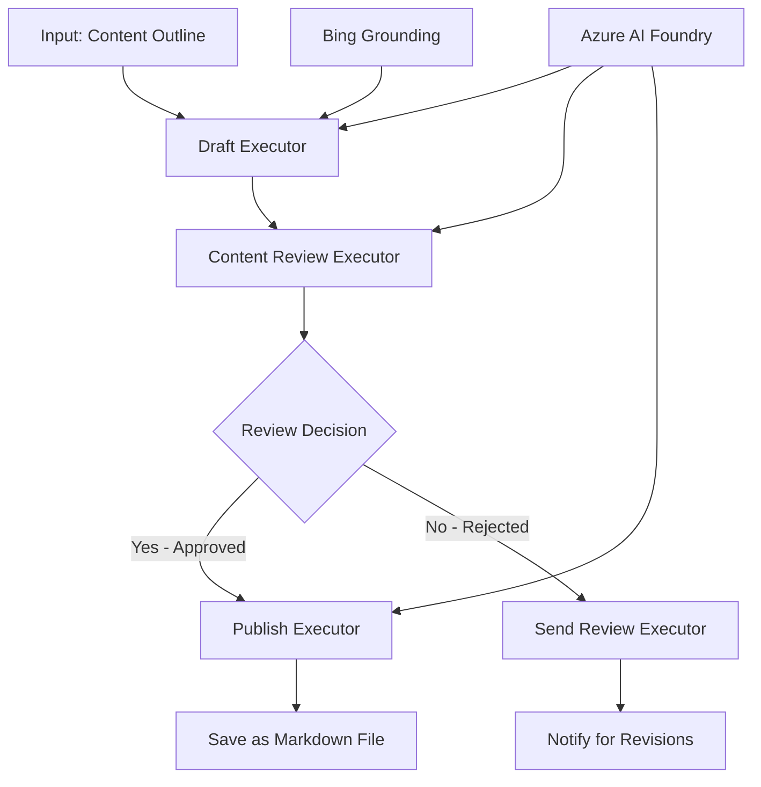

<!--
CO_OP_TRANSLATOR_METADATA:
{
  "original_hash": "8abd335151cee553293b637ee3d80d10",
  "translation_date": "2025-11-11T12:12:53+00:00",
  "source_file": "08-multi-agent/code_samples/workflows-agent-framework/dotNET/04.dotnet-agent-framework-workflow-aifoundry-condition.md",
  "language_code": "pt"
}
-->
# 🔀 Fluxos de Trabalho Condicionais com Azure AI Foundry (.NET)

## 📋 Tutorial de Fluxo de Trabalho Baseado em Decisões Inteligentes

Este notebook demonstra **padrões de fluxo de trabalho condicionais** usando Azure AI Foundry e o Microsoft Agent Framework para .NET. Aprenderá a construir fluxos de trabalho sofisticados, orientados por decisões, que encaminham o processamento de forma inteligente com base em análises de IA, regras de negócio e condições dinâmicas para automação de nível empresarial.

## 🎯 Objetivos de Aprendizagem

### 🧠 **Arquitetura de Decisão Inteligente**
- **Implementação de Lógica Condicional**: Construir árvores de decisão complexas com múltiplos pontos de ramificação
- **Encaminhamento Inteligente com IA**: Utilizar modelos do Azure AI Foundry para tomar decisões de encaminhamento inteligentes
- **Adaptação Dinâmica do Fluxo de Trabalho**: Modificar o comportamento do fluxo de trabalho com base em análises e condições em tempo de execução
- **Integração de Regras Empresariais**: Incorporar lógica de negócios e requisitos de conformidade nos fluxos de trabalho

### 🔀 **Padrões Condicionais Avançados**
- **Tomada de Decisão com Múltiplos Critérios**: Avaliar múltiplos fatores para decisões de encaminhamento
- **Processamento Contextual**: Tomar decisões com base no contexto acumulado e no histórico do fluxo de trabalho
- **Modificação Adaptativa do Fluxo de Trabalho**: Ajustar dinamicamente os caminhos de processamento com base em condições em tempo real
- **Integração de Motor de Regras**: Implementar motores de regras empresariais sofisticados nos fluxos de trabalho

### 🏢 **Aplicações Condicionais Empresariais**
- **Classificação e Encaminhamento de Documentos**: Classificar e encaminhar documentos automaticamente para fluxos de trabalho apropriados
- **Triagem de Atendimento ao Cliente**: Encaminhamento inteligente de consultas de clientes para equipas especializadas
- **Processamento de Conformidade e Risco**: Aplicar diferentes processos de validação e revisão com base na avaliação de risco
- **Fluxos de Trabalho de Garantia de Qualidade**: Encaminhar conteúdo através de processos de revisão apropriados com base em métricas de qualidade

## ⚙️ Pré-requisitos e Configuração

### 📦 **Pacotes NuGet Necessários**

Pacotes avançados para processamento de fluxos de trabalho condicionais:

```xml
<!-- Core AI Framework -->
<PackageReference Include="Microsoft.Extensions.AI" Version="9.9.0" />

<!-- Azure AI Agents with Persistent State -->
<PackageReference Include="Azure.AI.Agents.Persistent" Version="1.2.0-beta.5" />

<!-- Azure Identity and Utilities -->
<PackageReference Include="Azure.Identity" Version="1.15.0" />
<PackageReference Include="System.Linq.Async" Version="6.0.3" />
<PackageReference Include="DotNetEnv" Version="3.1.1" />

<!-- Local Workflow Framework References -->
<!-- Microsoft.Agents.Workflows.dll - Advanced workflow orchestration -->
<!-- Microsoft.Agents.AI.AzureAI.dll - Azure AI Foundry integration -->
<!-- Microsoft.Agents.AI.dll - Core agent abstractions -->
```

### 🔑 **Configuração do Azure AI Foundry**

**Recursos Necessários do Azure:**
- Espaço de trabalho do Azure AI Foundry com modelos de processamento condicional
- Subscrição do Azure com quotas de computação e permissões adequadas
- Modelos de IA implantados para tomada de decisão e análise de conteúdo
- (Opcional) Conexão com a API de Pesquisa Bing para capacidades de grounding

**Configuração do Ambiente (.env file):**
```env
# Azure AI Foundry Configuration
AZURE_AI_PROJECT_ENDPOINT=https://your-project.cognitiveservices.azure.com/
BING_CONNECTION_ID=your-bing-connection-id
```

**Configuração de Autenticação:**
```csharp
// Azure CLI or Managed Identity authentication
using Azure.Identity;
var credential = new AzureCliCredential();

// Load environment configuration
DotNetEnv.Env.Load("../../../.env");
```

### 🏗️ **Arquitetura de Fluxo de Trabalho Condicional**



**Componentes Principais:**
- **Draft Executor**: Agente de IA que cria rascunhos iniciais de conteúdo a partir de esboços
- **Content Review Executor**: Agente de IA que avalia a qualidade e conformidade dos rascunhos
- **Encaminhamento Condicional**: Lógica de decisão que encaminha com base nos resultados da revisão
- **Caminhos de Publicação/Revisão**: Caminhos de processamento separados para conteúdo aprovado vs rejeitado
- **Gestão de Estado**: Mantém o contexto de conteúdo e revisão ao longo do fluxo de trabalho

## 🎨 **Padrões de Design de Fluxo de Trabalho Condicional**

### 📋 **Produção de Conteúdo com Portões de Qualidade**
```
Outline → Draft Creation → Quality Review → {Approve: Publish | Reject: Revise}
```

### 🎯 **Processamento de Documentos Baseado em Risco**
```
Document → Risk Assessment → {Low: Standard | High: Enhanced Review}
```

### 🔍 **Encaminhamento Inteligente de Atendimento ao Cliente**
```
Customer Query → Analysis → {Simple: FAQ Bot | Complex: Human Agent}
```

### 💼 **Fluxos de Trabalho Orientados por Conformidade**
```
Content → Compliance Check → {Pass: Publish | Fail: Legal Review}
```

## 🏢 **Benefícios Condicionais Empresariais**

### 🎯 **Automação Inteligente**
- **Tomada de Decisão Inteligente**: Decisões de encaminhamento orientadas por IA com base na análise de conteúdo e contexto
- **Processamento Adaptativo**: Fluxos de trabalho que se ajustam automaticamente com base em condições variáveis
- **Aplicação de Regras Empresariais**: Aplicação automática de lógica de negócios e políticas complexas
- **Encaminhamento Contextual**: Decisões baseadas no histórico completo do fluxo de trabalho e contexto acumulado

### 📈 **Excelência Operacional**
- **Alocação Otimizada de Recursos**: Encaminhar trabalho para os especialistas e processos mais adequados
- **Redução de Intervenção Manual**: A tomada de decisão automatizada minimiza a necessidade de encaminhamento humano
- **Tempos de Resolução Mais Rápidos**: Encaminhamento direto para capacidades de especialização e processamento apropriadas
- **Aplicação Consistente**: Aplicação uniforme de regras de negócios e critérios de decisão

### 🛡️ **Gestão de Risco e Conformidade**
- **Avaliação Automática de Risco**: Avaliação orientada por IA dos níveis de risco de conteúdo e situações
- **Aplicação de Conformidade**: Encaminhamento automático através de processos regulatórios necessários
- **Aplicação de Protocolos de Segurança**: Medidas de segurança aprimoradas aplicadas com base na avaliação de risco
- **Manutenção de Trilhas de Auditoria**: Documentação completa das decisões de encaminhamento e justificativas

### 📊 **Análise e Melhoria Contínua**
- **Análise de Decisões**: Acompanhar a eficácia e precisão das decisões de encaminhamento
- **Reconhecimento de Padrões**: Identificar tendências e padrões nas decisões de encaminhamento ao longo do tempo
- **Otimização de Desempenho**: Melhoria contínua dos critérios de decisão e eficiência de encaminhamento
- **Inteligência Empresarial**: Insights sobre características de conteúdo e requisitos de processamento

### 🔧 **Excelência Técnica**
- **Gestão Persistente de Estado**: Manter estados complexos ao longo da execução do fluxo de trabalho
- **Arquitetura Escalável**: Lidar com requisitos de processamento condicional de alto volume
- **Capacidades de Integração**: Integração perfeita com sistemas e processos empresariais existentes
- **Monitorização e Observabilidade**: Rastreamento abrangente do desempenho e decisões do fluxo de trabalho

Vamos construir fluxos de trabalho empresariais inteligentes e orientados por decisões com .NET! 🚀

## 💻 Executando o Código

A implementação completa está disponível em `04.dotnet-agent-framework-workflow-aifoundry-condition.cs`. Este demonstra um **fluxo de trabalho de produção de conteúdo com portões de qualidade**:

### 🏗️ **Arquitetura do Fluxo de Trabalho**

```
Content Outline → Draft Creation → Quality Review → Conditional Routing:
                                                      ├─ Approved (>200 words) → Publish
                                                      └─ Rejected (<200 words) → Review Notification
```

**Agentes no Fluxo de Trabalho:**
1. **Evangelist Agent**: Cria rascunhos de tutoriais a partir de esboços com grounding do Bing
2. **Content Reviewer Agent**: Avalia a qualidade do rascunho (contagem de palavras, completude)
3. **Publisher Agent**: Salva conteúdo aprovado como ficheiros Markdown com carimbo de data/hora

**Executores Personalizados:**
1. **DraftExecutor**: Orquestra a criação de rascunhos
2. **ContentReviewExecutor**: Realiza avaliação de qualidade
3. **PublishExecutor**: Lida com a publicação de conteúdo aprovado
4. **SendReviewExecutor**: Gerencia notificações de conteúdo rejeitado

### 🚀 Executando o Exemplo

**Pré-requisitos:**
- Espaço de trabalho do Azure AI Foundry configurado
- Autenticação do Azure CLI (`az login`)
- (Opcional) Conexão com Pesquisa Bing para grounding

```bash
# Make the script executable (Unix/Linux/macOS)
chmod +x 04.dotnet-agent-framework-workflow-aifoundry-condition.cs

# Run the conditional workflow
./04.dotnet-agent-framework-workflow-aifoundry-condition.cs
```

Ou no Windows:
```powershell
dotnet run 04.dotnet-agent-framework-workflow-aifoundry-condition.cs
```

### 📝 Resultado Esperado

O fluxo de trabalho irá:
1. **Criar Agentes**: Inicializar três agentes especializados do Azure AI Foundry
2. **Gerar Rascunho**: O agente Evangelist cria um rascunho de tutorial a partir de um esboço
3. **Revisar Conteúdo**: O Content Reviewer avalia a qualidade do rascunho
4. **Encaminhamento Condicional**:
   - **Se aprovado (>200 palavras)**: O executor Publish salva como ficheiro Markdown
   - **Se rejeitado (<200 palavras)**: O executor SendReview envia notificação de revisão
5. **Exibir Resultados**: Mostrar o resultado final do fluxo de trabalho

### 🔧 Opções de Personalização

**Modificar Critérios de Revisão:**
```csharp
const string ContentReviewerInstructions = @"
You are a content reviewer...
1. Check if content is more than 500 words (instead of 200)
2. Verify technical accuracy
3. Ensure proper formatting
...";
```

**Adicionar Mais Caminhos Condicionais:**
```csharp
var workflow = new WorkflowBuilder(draftExecutor)
    .AddEdge(draftExecutor, contentReviewerExecutor)
    .AddEdge(contentReviewerExecutor, publishExecutor, condition: GetCondition("Excellent"))
    .AddEdge(contentReviewerExecutor, editExecutor, condition: GetCondition("Good"))
    .AddEdge(contentReviewerExecutor, sendReviewerExecutor, condition: GetCondition("Poor"))
    .Build();
```

**Alterar Requisitos de Conteúdo:**
```csharp
string OUTLINE_Content = @"
# Your Custom Topic
## Section 1
https://your-reference-url
## Section 2
...
";
```

### 🎯 Aplicações no Mundo Real

Este padrão de fluxo de trabalho condicional é ideal para:
- **Sistemas de Gestão de Conteúdo**: Fluxos editoriais automatizados com portões de qualidade
- **Processamento de Documentos**: Encaminhar documentos com base em classificação e conformidade
- **Suporte ao Cliente**: Encaminhamento inteligente de tickets com base em complexidade e urgência
- **Revisão Jurídica**: Encaminhar contratos com base em avaliação de risco e valor
- **Processos de RH**: Encaminhar candidaturas através de fluxos de triagem apropriados

### 🔍 Compreendendo a Lógica Condicional

**Função de Condição:**
```csharp
public Func<object?, bool> GetCondition(string expectedResult) =>
    reviewResult => reviewResult is ReviewResult review && review.Result == expectedResult;
```

Esta função cria um predicado que:
1. Verifica se o resultado é do tipo `ReviewResult`
2. Compara a propriedade `Result` com o valor esperado
3. Retorna verdadeiro/falso para determinar o encaminhamento

**Arestas do Fluxo de Trabalho com Condições:**
```csharp
.AddEdge(contentReviewerExecutor, publishExecutor, condition: GetCondition("Yes"))
.AddEdge(contentReviewerExecutor, sendReviewerExecutor, condition: GetCondition("No"))
```

### 📊 Funcionalidades Avançadas

**Validação de Esquema JSON:**
O fluxo de trabalho utiliza esquemas JSON para garantir respostas estruturadas:

```csharp
// Define response structure
public class ReviewResult
{
    [JsonPropertyName("review_result")]
    public string Result { get; set; } = string.Empty;
    
    [JsonPropertyName("reason")]
    public string Reason { get; set; } = string.Empty;
    
    [JsonPropertyName("draft_content")]
    public string DraftContent { get; set; } = string.Empty;
}

// Apply to agent
ResponseFormat = ChatResponseFormat.ForJsonSchema(
    AIJsonUtilities.CreateJsonSchema(typeof(ReviewResult)), 
    "ReviewResult", 
    "Review Result From DraftContent"
)
```

**Integração com Grounding do Bing:**
O agente Evangelist utiliza grounding do Bing para acessar informações em tempo real:

```csharp
var bingGroundingConfig = new BingGroundingSearchConfiguration(bing_conn_id);
BingGroundingToolDefinition bingGroundingTool = new(
    new BingGroundingSearchToolParameters([bingGroundingConfig])
);
```

Isso permite que o agente siga URLs no esboço e extraia informações atuais.

### 🛡️ Tratamento de Erros

O fluxo de trabalho inclui tratamento robusto de erros para conteúdo rejeitado:
- Falhas na revisão acionam o caminho alternativo
- Notificações fornecem razões claras para rejeição
- O conteúdo é preservado para revisão

### 🔄 Expandindo o Fluxo de Trabalho

**Adicionar um Ciclo de Revisão:**
Criar um loop de feedback que reescreva automaticamente o conteúdo:

```csharp
.AddEdge(contentReviewerExecutor, publishExecutor, condition: GetCondition("Yes"))
.AddEdge(contentReviewerExecutor, draftExecutor, condition: GetCondition("No")) // Loop back
```

**Implementar Revisão em Múltiplos Níveis:**
Adicionar múltiplos estágios de revisão com critérios diferentes:

```csharp
.AddEdge(draftExecutor, technicalReviewer)
.AddEdge(technicalReviewer, editorialReviewer, condition: GetCondition("TechPass"))
.AddEdge(editorialReviewer, publishExecutor, condition: GetCondition("EditPass"))
```

Este padrão de fluxo de trabalho condicional fornece a base para construir sistemas de automação empresarial sofisticados e inteligentes! 🚀

---

<!-- CO-OP TRANSLATOR DISCLAIMER START -->
**Aviso Legal**:  
Este documento foi traduzido utilizando o serviço de tradução por IA [Co-op Translator](https://github.com/Azure/co-op-translator). Embora nos esforcemos pela precisão, esteja ciente de que traduções automáticas podem conter erros ou imprecisões. O documento original na sua língua nativa deve ser considerado a fonte autoritária. Para informações críticas, recomenda-se uma tradução profissional realizada por humanos. Não nos responsabilizamos por quaisquer mal-entendidos ou interpretações incorretas decorrentes do uso desta tradução.
<!-- CO-OP TRANSLATOR DISCLAIMER END -->