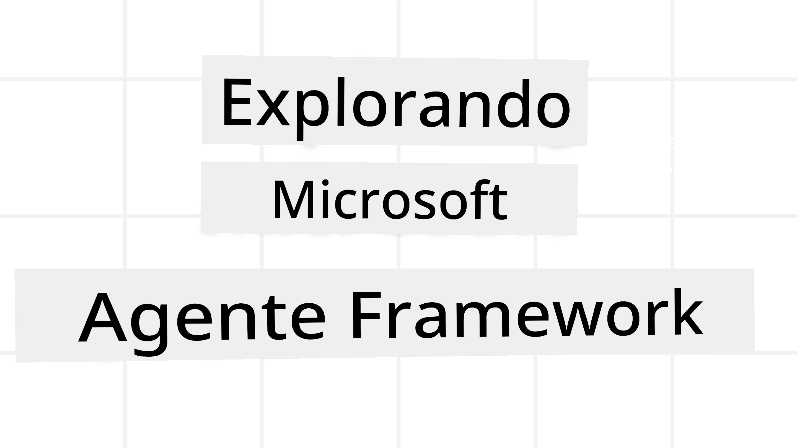
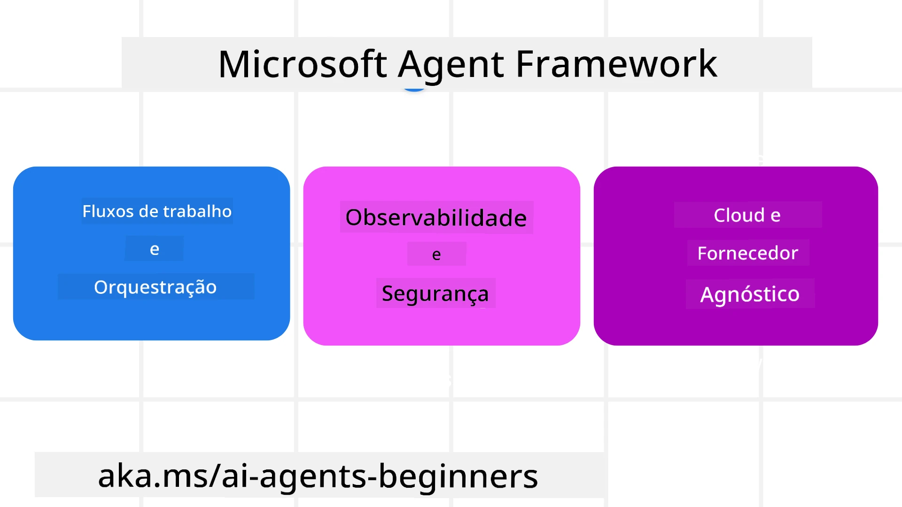
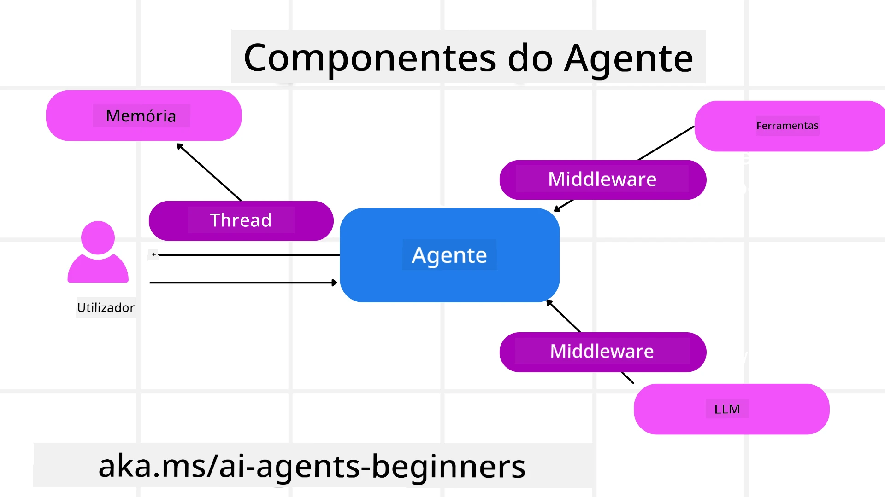

<!--
CO_OP_TRANSLATOR_METADATA:
{
  "original_hash": "19c4dab375acbc733855cc7f2f04edbc",
  "translation_date": "2025-10-01T20:39:12+00:00",
  "source_file": "14-microsoft-agent-framework/README.md",
  "language_code": "pt"
}
-->
# Explorar o Microsoft Agent Framework



### Introdução

Esta lição irá abordar:

- Compreender o Microsoft Agent Framework: Principais Funcionalidades e Valor  
- Explorar os Conceitos Fundamentais do Microsoft Agent Framework
- Comparar o MAF com o Semantic Kernel e AutoGen: Guia de Migração

## Objetivos de Aprendizagem

Após completar esta lição, saberá como:

- Construir Agentes de IA Prontos para Produção utilizando o Microsoft Agent Framework
- Aplicar as funcionalidades principais do Microsoft Agent Framework aos seus Casos de Uso Agentic
- Migrar e integrar frameworks e ferramentas agentic existentes  

## Exemplos de Código 

Os exemplos de código para o [Microsoft Agent Framework (MAF)](https://aka.ms/ai-agents-beginners/agent-framewrok) podem ser encontrados neste repositório nos ficheiros `xx-python-agent-framework` e `xx-dotnet-agent-framework`.

## Compreender o Microsoft Agent Framework



O [Microsoft Agent Framework (MAF)](https://aka.ms/ai-agents-beginners/agent-framewrok) baseia-se na experiência e aprendizagens do Semantic Kernel e AutoGen. Oferece flexibilidade para abordar a ampla variedade de casos de uso agentic observados em ambientes de produção e investigação, incluindo:

- **Orquestração Sequencial de Agentes** em cenários onde são necessários fluxos de trabalho passo a passo.
- **Orquestração Concorrente** em cenários onde os agentes precisam de completar tarefas ao mesmo tempo.
- **Orquestração de Chat em Grupo** em cenários onde os agentes podem colaborar numa única tarefa.
- **Orquestração de Transferência** em cenários onde os agentes transferem a tarefa entre si à medida que os subtarefas são concluídas.
- **Orquestração Magnética** em cenários onde um agente gestor cria e modifica uma lista de tarefas e coordena os subagentes para completar a tarefa.

Para entregar Agentes de IA em Produção, o MAF também inclui funcionalidades para:

- **Observabilidade** através do uso de OpenTelemetry, onde cada ação do Agente de IA, incluindo invocação de ferramentas, passos de orquestração, fluxos de raciocínio e monitorização de desempenho, é rastreada através de dashboards do Azure AI Foundry.
- **Segurança** ao hospedar agentes nativamente no Azure AI Foundry, que inclui controlos de segurança como acesso baseado em funções, tratamento de dados privados e segurança de conteúdo integrada.
- **Durabilidade** já que os threads e fluxos de trabalho dos agentes podem pausar, retomar e recuperar de erros, permitindo processos de longa duração.
- **Controlo** com suporte para fluxos de trabalho com intervenção humana, onde as tarefas são marcadas como necessitando de aprovação humana.

O Microsoft Agent Framework também se foca em ser interoperável ao:

- **Ser independente da Cloud** - Os agentes podem ser executados em containers, on-premises e em várias clouds diferentes.
- **Ser independente do fornecedor** - Os agentes podem ser criados através do SDK preferido, incluindo Azure OpenAI e OpenAI.
- **Integrar padrões abertos** - Os agentes podem utilizar protocolos como Agent-to-Agent (A2A) e Model Context Protocol (MCP) para descobrir e usar outros agentes e ferramentas.
- **Plugins e Conectores** - Conexões podem ser feitas com serviços de dados e memória como Microsoft Fabric, SharePoint, Pinecone e Qdrant.

Vamos ver como estas funcionalidades são aplicadas a alguns dos conceitos fundamentais do Microsoft Agent Framework.

## Conceitos Fundamentais do Microsoft Agent Framework

### Agentes



**Criar Agentes**

A criação de agentes é feita definindo o serviço de inferência (fornecedor de LLM), um conjunto de instruções para o Agente de IA seguir e um `nome` atribuído:

```python
agent = AzureOpenAIChatClient(credential=AzureCliCredential()).create_agent( instructions="You are good at recommending trips to customers based on their preferences.", name="TripRecommender" )
```

O exemplo acima utiliza o `Azure OpenAI`, mas os agentes podem ser criados utilizando uma variedade de serviços, incluindo o `Azure AI Foundry Agent Service`:

```python
AzureAIAgentClient(async_credential=credential).create_agent( name="HelperAgent", instructions="You are a helpful assistant." ) as agent
```

APIs de `Responses` e `ChatCompletion` do OpenAI

```python
agent = OpenAIResponsesClient().create_agent( name="WeatherBot", instructions="You are a helpful weather assistant.", )
```

```python
agent = OpenAIChatClient().create_agent( name="HelpfulAssistant", instructions="You are a helpful assistant.", )
```

ou agentes remotos utilizando o protocolo A2A:

```python
agent = A2AAgent( name=agent_card.name, description=agent_card.description, agent_card=agent_card, url="https://your-a2a-agent-host" )
```

**Executar Agentes**

Os agentes são executados utilizando os métodos `.run` ou `.run_stream` para respostas não-streaming ou streaming.

```python
result = await agent.run("What are good places to visit in Amsterdam?")
print(result.text)
```

```python
async for update in agent.run_stream("What are the good places to visit in Amsterdam?"):
    if update.text:
        print(update.text, end="", flush=True)

```

Cada execução de agente também pode ter opções para personalizar parâmetros como `max_tokens` utilizados pelo agente, `tools` que o agente pode chamar e até mesmo o próprio `model` utilizado pelo agente.

Isto é útil em casos onde modelos ou ferramentas específicas são necessárias para completar a tarefa do utilizador.

**Ferramentas**

As ferramentas podem ser definidas tanto ao definir o agente:

```python
def get_attractions( location: Annotated[str, Field(description="The location to get the top tourist attractions for")], ) -> str: """Get the top tourist attractions for a given location.""" return f"The top attractions for {location} are." 


# When creating a ChatAgent directly 

agent = ChatAgent( chat_client=OpenAIChatClient(), instructions="You are a helpful assistant", tools=[get_attractions]

```

como ao executar o agente:

```python

result1 = await agent.run( "What's the best place to visit in Seattle?", tools=[get_attractions] # Tool provided for this run only )
```

**Threads de Agentes**

Os Threads de Agentes são utilizados para lidar com conversas de múltiplas interações. Os threads podem ser criados de duas formas:

- Utilizando `get_new_thread()`, que permite que o thread seja guardado ao longo do tempo.
- Criando automaticamente um thread ao executar um agente, com o thread a durar apenas durante a execução atual.

Para criar um thread, o código é assim:

```python
# Create a new thread. 
thread = agent.get_new_thread() # Run the agent with the thread. 
response = await agent.run("Hello, I am here to help you book travel. Where would you like to go?", thread=thread)

```

Pode então serializar o thread para ser armazenado para uso posterior:

```python
# Create a new thread. 
thread = agent.get_new_thread() 

# Run the agent with the thread. 

response = await agent.run("Hello, how are you?", thread=thread) 

# Serialize the thread for storage. 

serialized_thread = await thread.serialize() 

# Deserialize the thread state after loading from storage. 

resumed_thread = await agent.deserialize_thread(serialized_thread)
```

**Middleware de Agentes**

Os agentes interagem com ferramentas e LLMs para completar as tarefas dos utilizadores. Em certos cenários, queremos executar ou rastrear ações entre estas interações. O middleware de agentes permite-nos fazer isso através de:

*Middleware de Função*

Este middleware permite-nos executar uma ação entre o agente e uma função/ferramenta que ele irá chamar. Um exemplo de quando isto seria utilizado é quando se pretende fazer algum registo na chamada da função.

No código abaixo, `next` define se o próximo middleware ou a função real deve ser chamado.

```python
async def logging_function_middleware(
    context: FunctionInvocationContext,
    next: Callable[[FunctionInvocationContext], Awaitable[None]],
) -> None:
    """Function middleware that logs function execution."""
    # Pre-processing: Log before function execution
    print(f"[Function] Calling {context.function.name}")

    # Continue to next middleware or function execution
    await next(context)

    # Post-processing: Log after function execution
    print(f"[Function] {context.function.name} completed")
```

*Middleware de Chat*

Este middleware permite-nos executar ou registar uma ação entre o agente e os pedidos entre o LLM.

Isto contém informações importantes como as `messages` que estão a ser enviadas para o serviço de IA.

```python
async def logging_chat_middleware(
    context: ChatContext,
    next: Callable[[ChatContext], Awaitable[None]],
) -> None:
    """Chat middleware that logs AI interactions."""
    # Pre-processing: Log before AI call
    print(f"[Chat] Sending {len(context.messages)} messages to AI")

    # Continue to next middleware or AI service
    await next(context)

    # Post-processing: Log after AI response
    print("[Chat] AI response received")

```

**Memória de Agentes**

Como abordado na lição `Agentic Memory`, a memória é um elemento importante para permitir que o agente opere em diferentes contextos. O MAF oferece vários tipos de memórias:

*Armazenamento em Memória*

Esta é a memória armazenada em threads durante o tempo de execução da aplicação.

```python
# Create a new thread. 
thread = agent.get_new_thread() # Run the agent with the thread. 
response = await agent.run("Hello, I am here to help you book travel. Where would you like to go?", thread=thread)
```

*Mensagens Persistentes*

Esta memória é utilizada ao armazenar o histórico de conversação entre diferentes sessões. É definida utilizando o `chat_message_store_factory`:

```python
from agent_framework import ChatMessageStore

# Create a custom message store
def create_message_store():
    return ChatMessageStore()

agent = ChatAgent(
    chat_client=OpenAIChatClient(),
    instructions="You are a Travel assistant.",
    chat_message_store_factory=create_message_store
)

```

*Memória Dinâmica*

Esta memória é adicionada ao contexto antes de os agentes serem executados. Estas memórias podem ser armazenadas em serviços externos como mem0:

```python
from agent_framework.mem0 import Mem0Provider

# Using Mem0 for advanced memory capabilities
memory_provider = Mem0Provider(
    api_key="your-mem0-api-key",
    user_id="user_123",
    application_id="my_app"
)

agent = ChatAgent(
    chat_client=OpenAIChatClient(),
    instructions="You are a helpful assistant with memory.",
    context_providers=memory_provider
)

```

**Observabilidade de Agentes**

A observabilidade é importante para construir sistemas agentic fiáveis e sustentáveis. O MAF integra-se com o OpenTelemetry para fornecer rastreamento e medidores para melhor observabilidade.

```python
from agent_framework.observability import get_tracer, get_meter

tracer = get_tracer()
meter = get_meter()
with tracer.start_as_current_span("my_custom_span"):
    # do something
    pass
counter = meter.create_counter("my_custom_counter")
counter.add(1, {"key": "value"})
```

### Fluxos de Trabalho

O MAF oferece fluxos de trabalho que são passos pré-definidos para completar uma tarefa e incluem agentes de IA como componentes nesses passos.

Os fluxos de trabalho são compostos por diferentes componentes que permitem um melhor controlo de fluxo. Os fluxos de trabalho também permitem **orquestração de múltiplos agentes** e **checkpointing** para guardar estados de fluxo de trabalho.

Os componentes principais de um fluxo de trabalho são:

**Executores**

Os executores recebem mensagens de entrada, realizam as tarefas atribuídas e produzem uma mensagem de saída. Isto move o fluxo de trabalho em direção à conclusão da tarefa maior. Os executores podem ser agentes de IA ou lógica personalizada.

**Edges**

Os edges são utilizados para definir o fluxo de mensagens num fluxo de trabalho. Estes podem ser:

*Edges Diretos* - Conexões simples de um para um entre executores:

```python
from agent_framework import WorkflowBuilder

builder = WorkflowBuilder()
builder.add_edge(source_executor, target_executor)
builder.set_start_executor(source_executor)
workflow = builder.build()
```

*Edges Condicionais* - Ativados após uma certa condição ser cumprida. Por exemplo, quando quartos de hotel não estão disponíveis, um executor pode sugerir outras opções.

*Edges Switch-case* - Roteiam mensagens para diferentes executores com base em condições definidas. Por exemplo, se um cliente de viagens tiver acesso prioritário, as suas tarefas serão tratadas através de outro fluxo de trabalho.

*Edges Fan-out* - Enviam uma mensagem para múltiplos destinos.

*Edges Fan-in* - Recolhem múltiplas mensagens de diferentes executores e enviam para um único destino.

**Eventos**

Para proporcionar melhor observabilidade nos fluxos de trabalho, o MAF oferece eventos integrados para execução, incluindo:

- `WorkflowStartedEvent`  - Execução do fluxo de trabalho começa
- `WorkflowOutputEvent` - Fluxo de trabalho produz uma saída
- `WorkflowErrorEvent` - Fluxo de trabalho encontra um erro
- `ExecutorInvokeEvent`  - Executor começa a processar
- `ExecutorCompleteEvent`  - Executor termina o processamento
- `RequestInfoEvent` - Um pedido é emitido

## Migrar de Outros Frameworks (Semantic Kernel e AutoGen)

### Diferenças entre MAF e Semantic Kernel

**Criação Simplificada de Agentes**

O Semantic Kernel depende da criação de uma instância de Kernel para cada agente. O MAF utiliza uma abordagem simplificada através de extensões para os principais fornecedores.

```python
agent = AzureOpenAIChatClient(credential=AzureCliCredential()).create_agent( instructions="You are good at reccomending trips to customers based on their preferences.", name="TripRecommender" )
```

**Criação de Threads de Agentes**

O Semantic Kernel requer que os threads sejam criados manualmente. No MAF, o agente é diretamente atribuído a um thread.

```python
thread = agent.get_new_thread() # Run the agent with the thread. 
```

**Registo de Ferramentas**

No Semantic Kernel, as ferramentas são registadas no Kernel e o Kernel é então passado para o agente. No MAF, as ferramentas são registadas diretamente durante o processo de criação do agente.

```python
agent = ChatAgent( chat_client=OpenAIChatClient(), instructions="You are a helpful assistant", tools=[get_attractions]
```

### Diferenças entre MAF e AutoGen

**Equipas vs Fluxos de Trabalho**

`Teams` são a estrutura de eventos para atividades orientadas por eventos com agentes no AutoGen. O MAF utiliza `Workflows` que roteiam dados para executores através de uma arquitetura baseada em grafos.

**Criação de Ferramentas**

O AutoGen utiliza `FunctionTool` para encapsular funções que os agentes podem chamar. O MAF utiliza @ai_function, que opera de forma semelhante, mas também infere automaticamente os esquemas para cada função.

**Comportamento de Agentes**

Os agentes são agentes de uma única interação por padrão no AutoGen, a menos que `max_tool_iterations` seja definido para um valor superior. No MAF, o `ChatAgent` é multi-interação por padrão, o que significa que continuará a chamar ferramentas até que a tarefa do utilizador esteja concluída.

## Exemplos de Código 

Os exemplos de código para o Microsoft Agent Framework podem ser encontrados neste repositório nos ficheiros `xx-python-agent-framework` e `xx-dotnet-agent-framework`.

## Tem Mais Perguntas Sobre o Microsoft Agent Framework?

Junte-se ao [Discord do Azure AI Foundry](https://aka.ms/ai-agents/discord) para interagir com outros aprendizes, participar em horas de atendimento e obter respostas às suas perguntas sobre Agentes de IA.

---

**Aviso Legal**:  
Este documento foi traduzido utilizando o serviço de tradução por IA [Co-op Translator](https://github.com/Azure/co-op-translator). Embora nos esforcemos pela precisão, esteja ciente de que traduções automáticas podem conter erros ou imprecisões. O documento original na sua língua nativa deve ser considerado a fonte autoritária. Para informações críticas, recomenda-se uma tradução profissional realizada por humanos. Não nos responsabilizamos por quaisquer mal-entendidos ou interpretações incorretas decorrentes do uso desta tradução.