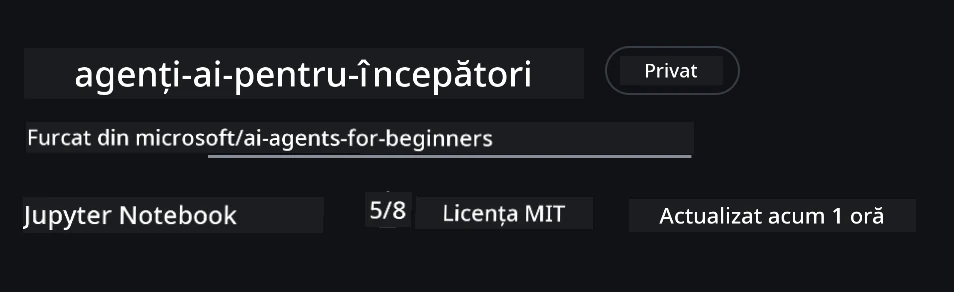
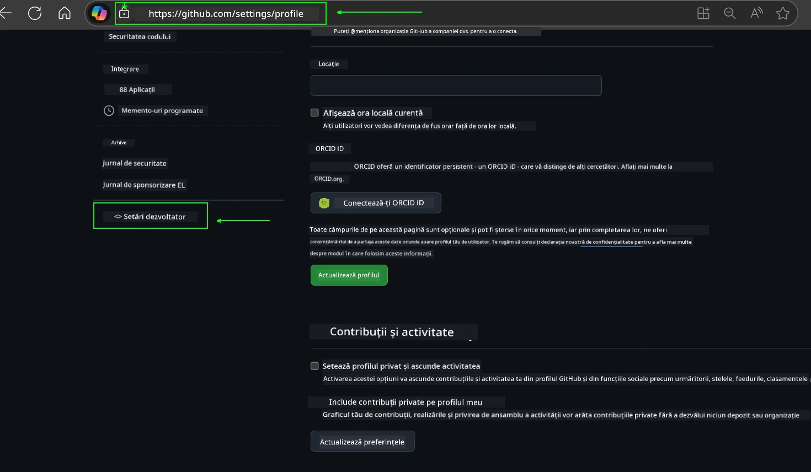
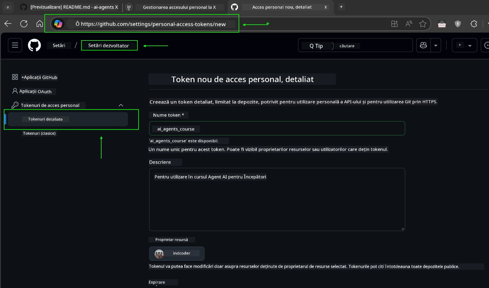
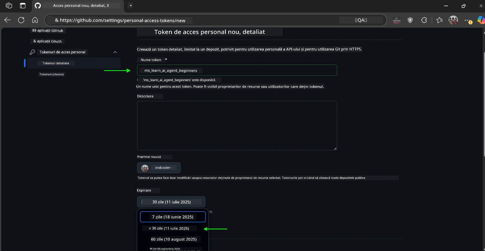
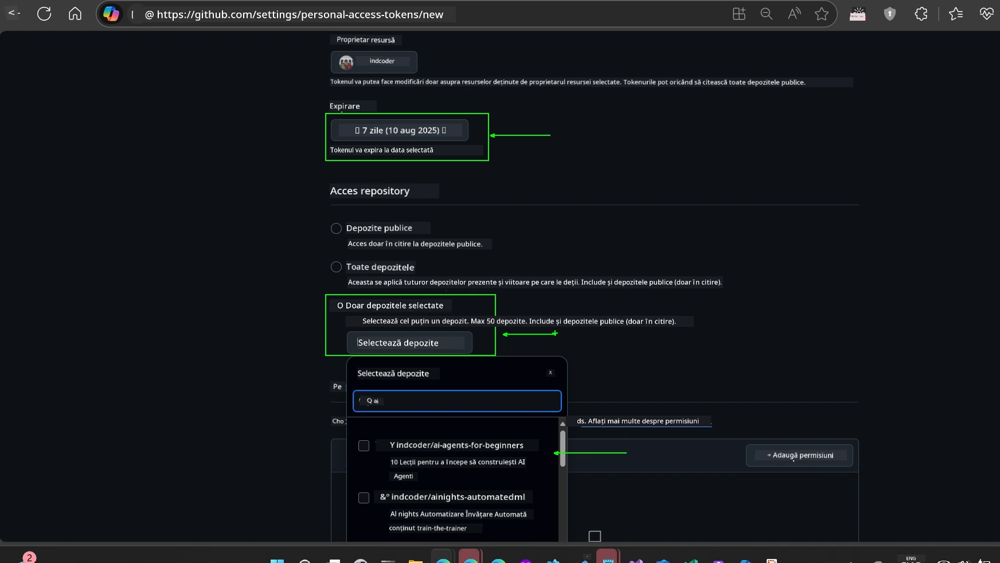
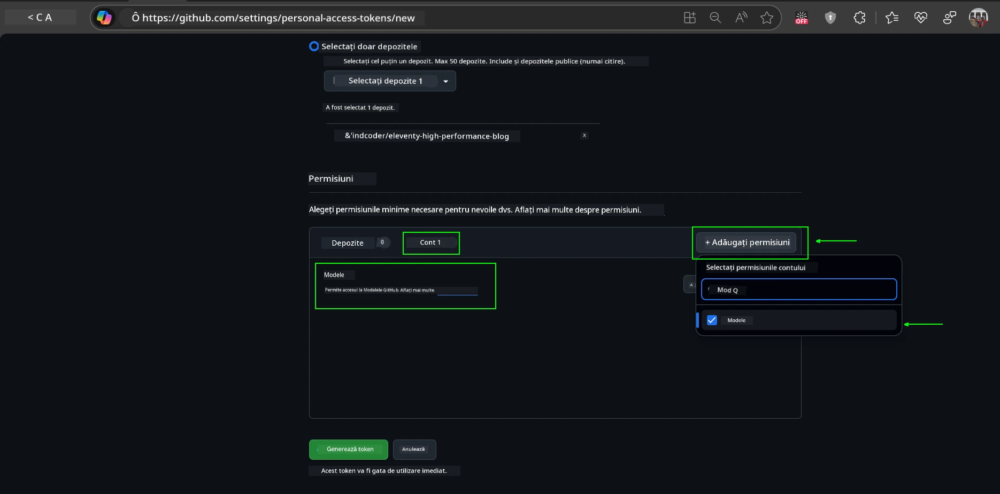
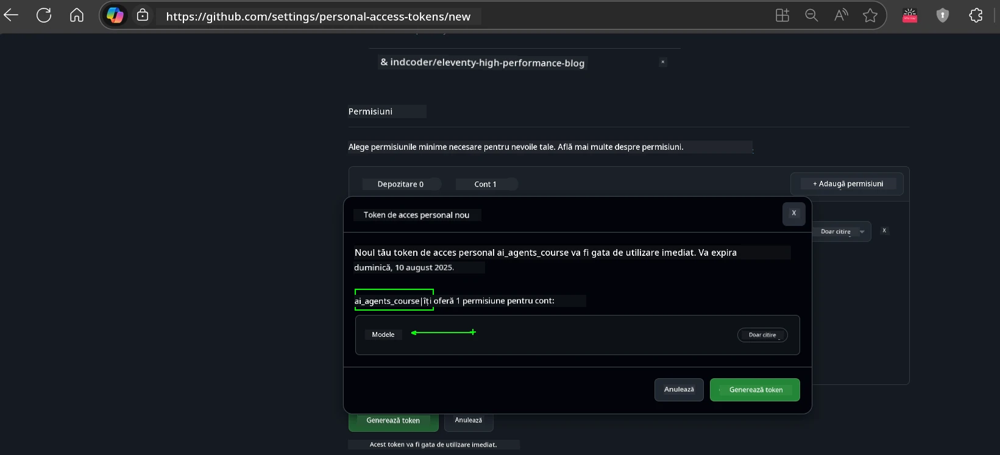
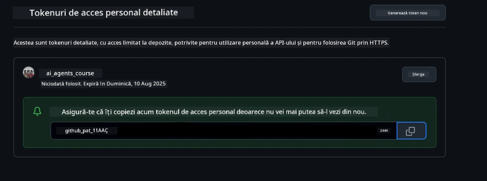
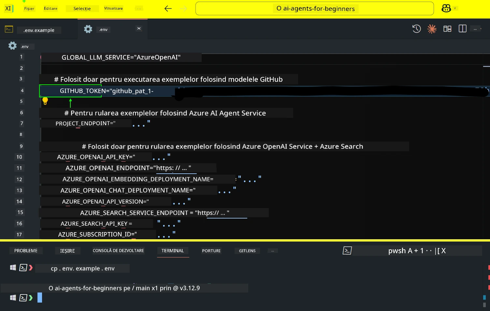
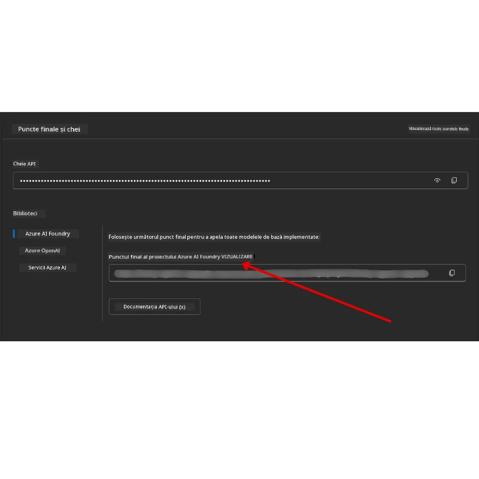

<!--
CO_OP_TRANSLATOR_METADATA:
{
  "original_hash": "63b1a8f6e840df15934935b728e569f0",
  "translation_date": "2025-12-03T14:57:12+00:00",
  "source_file": "00-course-setup/README.md",
  "language_code": "ro"
}
-->
# Configurarea Cursului

## Introducere

Această lecție va acoperi modul de rulare a exemplelor de cod din acest curs.

## Alătură-te altor cursanți și obține ajutor

Înainte de a începe clonarea depozitului tău, alătură-te canalului [AI Agents For Beginners Discord](https://aka.ms/ai-agents/discord) pentru a primi ajutor cu configurarea, pentru orice întrebări legate de curs sau pentru a te conecta cu alți cursanți.

## Clonează sau Fork-uiește acest depozit

Pentru a începe, te rugăm să clonezi sau să fork-uiești depozitul GitHub. Acest lucru va crea propria ta versiune a materialului de curs, astfel încât să poți rula, testa și ajusta codul!

Acest lucru poate fi realizat făcând clic pe linkul pentru <a href="https://github.com/microsoft/ai-agents-for-beginners/fork" target="_blank">fork-ul depozitului</a>

Acum ar trebui să ai propria ta versiune fork-uită a acestui curs la următorul link:



### Clone superficial (recomandat pentru workshop-uri / Codespaces)

  >Depozitul complet poate fi mare (~3 GB) atunci când descarci istoricul complet și toate fișierele. Dacă participi doar la workshop sau ai nevoie doar de câteva foldere de lecții, un clone superficial (sau un clone parțial) evită cea mai mare parte a acestei descărcări prin trunchierea istoricului și/sau sărirea blob-urilor.

#### Clone rapid superficial — istoric minim, toate fișierele

Înlocuiește `<your-username>` în comenzile de mai jos cu URL-ul fork-ului tău (sau URL-ul upstream dacă preferi).

Pentru a clona doar istoricul ultimului commit (descărcare mică):

```bash|powershell
git clone --depth 1 https://github.com/<your-username>/ai-agents-for-beginners.git
```

Pentru a clona o anumită ramură:

```bash|powershell
git clone --depth 1 --branch <branch-name> https://github.com/<your-username>/ai-agents-for-beginners.git
```

#### Clone parțial (sparse) — blob-uri minime + doar folderele selectate

Aceasta folosește clone parțial și sparse-checkout (necesită Git 2.25+ și Git modern recomandat cu suport pentru clone parțial):

```bash|powershell
git clone --depth 1 --filter=blob:none --sparse https://github.com/<your-username>/ai-agents-for-beginners.git
```

Accesează folderul depozitului:

```bash|powershell
cd ai-agents-for-beginners
```

Apoi specifică ce foldere dorești (exemplul de mai jos arată două foldere):

```bash|powershell
git sparse-checkout set 00-course-setup 01-intro-to-ai-agents
```

După clonare și verificarea fișierelor, dacă ai nevoie doar de fișiere și vrei să eliberezi spațiu (fără istoric git), te rugăm să ștergi metadatele depozitului (💀ireversibil — vei pierde toate funcționalitățile Git: fără commit-uri, pull-uri, push-uri sau acces la istoric).

```bash
# zsh/bash
rm -rf .git
```

```powershell
# PowerShell
Remove-Item -Recurse -Force .git
```

#### Utilizarea GitHub Codespaces (recomandat pentru a evita descărcările mari locale)

- Creează un nou Codespace pentru acest depozit prin [interfața GitHub](https://github.com/codespaces).  

- În terminalul noului Codespace creat, rulează una dintre comenzile de clonare superficială/sparse de mai sus pentru a aduce doar folderele de lecții de care ai nevoie în spațiul de lucru Codespace.
- Opțional: după clonare în Codespaces, elimină .git pentru a recupera spațiu suplimentar (vezi comenzile de eliminare de mai sus).
- Notă: Dacă preferi să deschizi depozitul direct în Codespaces (fără o clonare suplimentară), fii conștient că Codespaces va construi mediul devcontainer și poate totuși să provisioneze mai mult decât ai nevoie. Clonarea unei copii superficiale într-un Codespace proaspăt îți oferă mai mult control asupra utilizării discului.

#### Sfaturi

- Înlocuiește întotdeauna URL-ul clone-ului cu fork-ul tău dacă dorești să editezi/commit.
- Dacă ulterior ai nevoie de mai mult istoric sau fișiere, le poți aduce sau ajusta sparse-checkout pentru a include foldere suplimentare.

## Rularea Codului

Acest curs oferă o serie de Jupyter Notebooks pe care le poți rula pentru a obține experiență practică în construirea agenților AI.

Exemplele de cod folosesc fie:

**Necesită cont GitHub - Gratuit**:

1) Semantic Kernel Agent Framework + GitHub Models Marketplace. Etichetat ca (semantic-kernel.ipynb)
2) AutoGen Framework + GitHub Models Marketplace. Etichetat ca (autogen.ipynb)

**Necesită abonament Azure**:

3) Azure AI Foundry + Azure AI Agent Service. Etichetat ca (azureaiagent.ipynb)

Te încurajăm să încerci toate cele trei tipuri de exemple pentru a vedea care funcționează cel mai bine pentru tine.

Oricare opțiune alegi, aceasta va determina ce pași de configurare trebuie să urmezi mai jos:

## Cerințe

- Python 3.12+
  - **NOTE**: Dacă nu ai instalat Python3.12, asigură-te că îl instalezi. Apoi creează venv-ul folosind python3.12 pentru a te asigura că versiunile corecte sunt instalate din fișierul requirements.txt.
  
    >Exemplu

    Creează directorul Python venv:

    ```bash|powershell
    python -m venv venv
    ```

    Apoi activează mediul venv pentru:

    ```bash
    # zsh/bash
    source venv/bin/activate
    ```
  
    ```dos
    # Command Prompt for Windows
    venv\Scripts\activate
    ```

- .NET 10+: Pentru codurile de exemplu care folosesc .NET, asigură-te că instalezi [.NET 10 SDK](https://dotnet.microsoft.com/download/dotnet/10.0) sau o versiune ulterioară. Apoi, verifică versiunea SDK .NET instalată:

    ```bash|powershell
    dotnet --list-sdks
    ```

- Un cont GitHub - Pentru acces la GitHub Models Marketplace
- Abonament Azure - Pentru acces la Azure AI Foundry
- Cont Azure AI Foundry - Pentru acces la Azure AI Agent Service

Am inclus un fișier `requirements.txt` în rădăcina acestui depozit care conține toate pachetele Python necesare pentru a rula exemplele de cod.

Le poți instala rulând următoarea comandă în terminalul tău la rădăcina depozitului:

```bash|powershell
pip install -r requirements.txt
```

Recomandăm crearea unui mediu virtual Python pentru a evita conflictele și problemele.

## Configurarea VSCode

Asigură-te că folosești versiunea corectă de Python în VSCode.


## Configurare pentru exemplele care folosesc modele GitHub 

### Pasul 1: Obține token-ul personal de acces GitHub (PAT)

Acest curs utilizează GitHub Models Marketplace, oferind acces gratuit la modele de limbaj mare (LLMs) pe care le vei folosi pentru a construi agenți AI.

Pentru a folosi modelele GitHub, va trebui să creezi un [token personal de acces GitHub](https://docs.github.com/en/authentication/keeping-your-account-and-data-secure/managing-your-personal-access-tokens).

Acest lucru poate fi realizat accesând <a href="https://github.com/settings/personal-access-tokens" target="_blank">setările token-urilor personale de acces</a> din contul tău GitHub.

Te rugăm să urmezi [Principiul Privilegiului Minim](https://docs.github.com/en/get-started/learning-to-code/storing-your-secrets-safely) atunci când creezi token-ul. Acest lucru înseamnă că ar trebui să oferi token-ului doar permisiunile necesare pentru a rula exemplele de cod din acest curs.

1. Selectează opțiunea `Fine-grained tokens` din partea stângă a ecranului navigând la **Developer settings**

   

   Apoi selectează `Generate new token`.

   

2. Introdu un nume descriptiv pentru token-ul tău care reflectă scopul său, făcându-l ușor de identificat mai târziu.

    🔐 Recomandare pentru durata token-ului

    Durată recomandată: 30 de zile
    Pentru o postură mai sigură, poți opta pentru o perioadă mai scurtă—cum ar fi 7 zile 🛡️
    Este o modalitate excelentă de a-ți seta un obiectiv personal și de a finaliza cursul în timp ce momentumul tău de învățare este ridicat 🚀.

    

3. Limitează domeniul token-ului la fork-ul acestui depozit.

    

4. Restricționează permisiunile token-ului: Sub **Permissions**, fă clic pe fila **Account** și apasă butonul "+ Add permissions". Va apărea un dropdown. Te rugăm să cauți **Models** și să bifezi caseta pentru aceasta.

    

5. Verifică permisiunile necesare înainte de a genera token-ul. 

6. Înainte de a genera token-ul, asigură-te că ești pregătit să stochezi token-ul într-un loc sigur, cum ar fi un seif de manager de parole, deoarece nu va fi afișat din nou după ce îl creezi. 

Copiază noul token pe care tocmai l-ai creat. Acum îl vei adăuga în fișierul `.env` inclus în acest curs.

### Pasul 2: Creează fișierul `.env`

Pentru a crea fișierul `.env`, rulează următoarea comandă în terminalul tău.

```bash
# zsh/bash
cp .env.example .env
```

```powershell
# PowerShell
Copy-Item .env.example .env
```

Aceasta va copia fișierul exemplu și va crea un `.env` în directorul tău, unde vei completa valorile pentru variabilele de mediu.

Cu token-ul copiat, deschide fișierul `.env` în editorul tău de text preferat și lipește token-ul în câmpul `GITHUB_TOKEN`.



Acum ar trebui să poți rula exemplele de cod din acest curs.

## Configurare pentru exemplele care folosesc Azure AI Foundry și Azure AI Agent Service

### Pasul 1: Obține punctul de acces al proiectului Azure

Urmează pașii pentru crearea unui hub și proiect în Azure AI Foundry găsiți aici: [Prezentare generală a resurselor hub](https://learn.microsoft.com/azure/ai-foundry/concepts/ai-resources)

După ce ai creat proiectul, va trebui să obții șirul de conexiune pentru proiectul tău.

Acest lucru poate fi realizat accesând pagina **Overview** a proiectului tău în portalul Azure AI Foundry.



### Pasul 2: Creează fișierul `.env`

Pentru a crea fișierul `.env`, rulează următoarea comandă în terminalul tău.

```bash
# zsh/bash
cp .env.example .env
```

```powershell
# PowerShell
Copy-Item .env.example .env
```

Aceasta va copia fișierul exemplu și va crea un `.env` în directorul tău, unde vei completa valorile pentru variabilele de mediu.

Cu token-ul copiat, deschide fișierul `.env` în editorul tău de text preferat și lipește token-ul în câmpul `PROJECT_ENDPOINT`.

### Pasul 3: Autentifică-te în Azure

Ca o bună practică de securitate, vom folosi [autentificarea fără cheie](https://learn.microsoft.com/azure/developer/ai/keyless-connections?tabs=csharp%2Cazure-cli?WT.mc_id=academic-105485-koreyst) pentru a ne autentifica în Azure OpenAI cu Microsoft Entra ID. 

Apoi, deschide un terminal și rulează `az login --use-device-code` pentru a te autentifica în contul tău Azure.

După ce te-ai autentificat, selectează abonamentul tău în terminal.

## Variabile suplimentare de mediu - Azure Search și Azure OpenAI 

Pentru lecția Agentic RAG - Lecția 5 - există exemple care folosesc Azure Search și Azure OpenAI.

Dacă dorești să rulezi aceste exemple, va trebui să adaugi următoarele variabile de mediu în fișierul `.env`:

### Pagina de prezentare generală (Proiect)

- `AZURE_SUBSCRIPTION_ID` - Verifică **Detaliile proiectului** pe pagina **Overview** a proiectului tău.

- `AZURE_AI_PROJECT_NAME` - Uită-te în partea de sus a paginii **Overview** pentru proiectul tău.

- `AZURE_OPENAI_SERVICE` - Găsește acest lucru în fila **Included capabilities** pentru **Azure OpenAI Service** pe pagina **Overview**.

### Centrul de management

- `AZURE_OPENAI_RESOURCE_GROUP` - Accesează **Proprietățile proiectului** pe pagina **Overview** a **Centrului de management**.

- `GLOBAL_LLM_SERVICE` - Sub **Resurse conectate**, găsește numele conexiunii **Azure AI Services**. Dacă nu este listat, verifică **portalul Azure** sub grupul tău de resurse pentru numele resursei AI Services.

### Pagina de modele + puncte de acces

- `AZURE_OPENAI_EMBEDDING_DEPLOYMENT_NAME` - Selectează modelul tău de embedding (ex. `text-embedding-ada-002`) și notează **Deployment name** din detaliile modelului.

- `AZURE_OPENAI_CHAT_DEPLOYMENT_NAME` - Selectează modelul tău de chat (ex. `gpt-4o-mini`) și notează **Deployment name** din detaliile modelului.

### Portalul Azure

- `AZURE_OPENAI_ENDPOINT` - Caută **Azure AI services**, fă clic pe el, apoi accesează **Resource Management**, **Keys and Endpoint**, derulează în jos la "Azure OpenAI endpoints" și copiază cel care spune "Language APIs".

- `AZURE_OPENAI_API_KEY` - De pe același ecran, copiază KEY 1 sau KEY 2.

- `AZURE_SEARCH_SERVICE_ENDPOINT` - Găsește resursa ta **Azure AI Search**, fă clic pe ea și vezi **Overview**.

- `AZURE_SEARCH_API_KEY` - Apoi accesează **Settings** și apoi **Keys** pentru a copia cheia principală sau secundară de administrator.

### Pagina externă

- `AZURE_OPENAI_API_VERSION` - Vizitează pagina [API version lifecycle](https://learn.microsoft.com/azure/ai-services/openai/api-version-deprecation#latest-ga-api-release) sub **Latest GA API release**.

### Configurarea autentificării fără cheie

În loc să codificăm credențialele, vom folosi o conexiune fără cheie cu Azure OpenAI. Pentru a face acest lucru, vom importa `DefaultAzureCredential` și ulterior vom apela funcția `DefaultAzureCredential` pentru a obține credențialul.

```python
# Python
from azure.identity import DefaultAzureCredential, InteractiveBrowserCredential
```

## Blocaj undeva?
Dacă întâmpinați probleme în rularea acestei configurații, intrați pe <a href="https://discord.gg/kzRShWzttr" target="_blank">Discord-ul Comunității Azure AI</a> sau <a href="https://github.com/microsoft/ai-agents-for-beginners/issues?WT.mc_id=academic-105485-koreyst" target="_blank">creați un issue</a>.

## Lecția următoare

Acum sunteți pregătit să rulați codul pentru acest curs. Învățare plăcută despre lumea Agenților AI!

[Introducere în Agenții AI și Cazuri de Utilizare a Agenților](../01-intro-to-ai-agents/README.md)

---

<!-- CO-OP TRANSLATOR DISCLAIMER START -->
**Declinarea responsabilității**:  
Acest document a fost tradus folosind serviciul de traducere AI [Co-op Translator](https://github.com/Azure/co-op-translator). Deși ne străduim să asigurăm acuratețea, vă rugăm să rețineți că traducerile automate pot conține erori sau inexactități. Documentul original în limba sa nativă ar trebui considerat sursa autoritară. Pentru informații critice, se recomandă traducerea profesională realizată de un specialist uman. Nu ne asumăm răspunderea pentru eventualele neînțelegeri sau interpretări greșite care pot apărea din utilizarea acestei traduceri.
<!-- CO-OP TRANSLATOR DISCLAIMER END -->