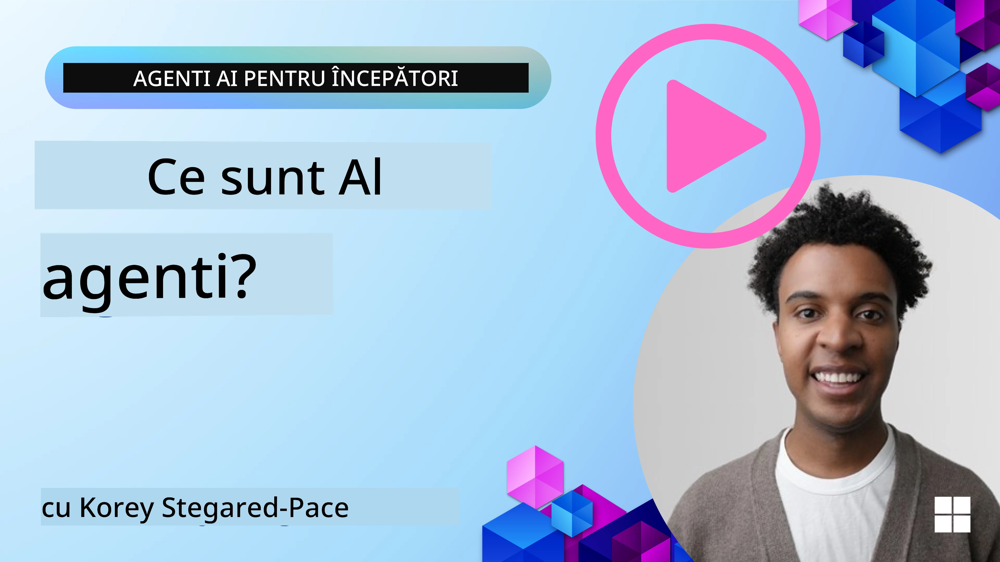
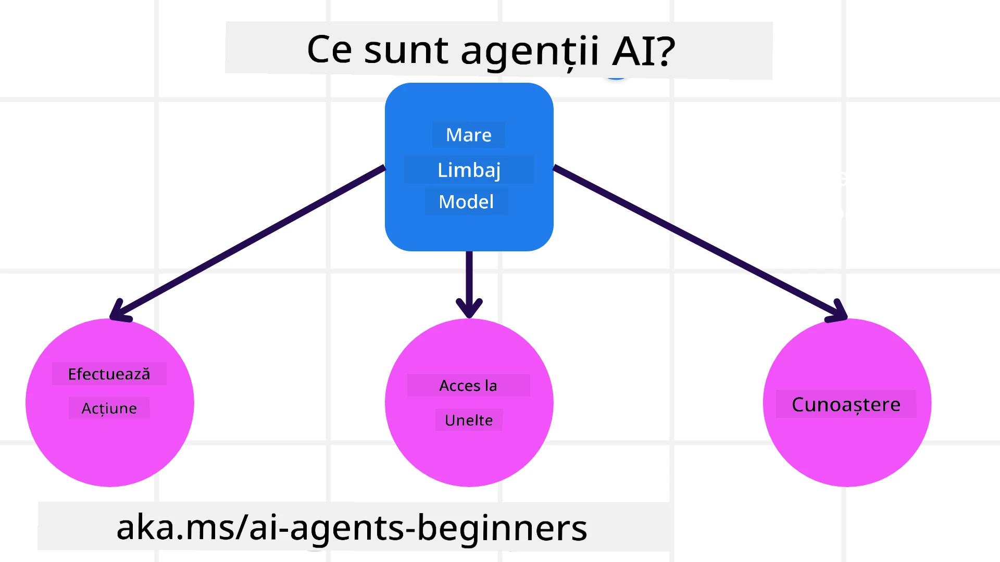
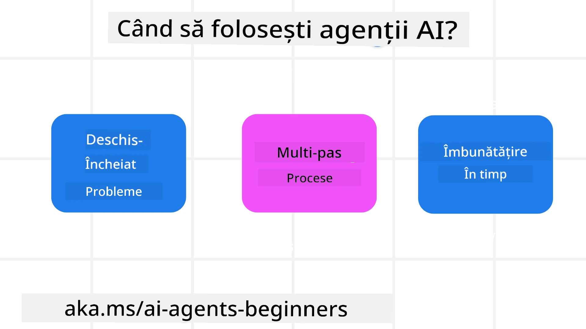

<!--
CO_OP_TRANSLATOR_METADATA:
{
  "original_hash": "cdd28bc00816d2773bb2b5968d782abc",
  "translation_date": "2025-11-11T11:37:44+00:00",
  "source_file": "01-intro-to-ai-agents/README.md",
  "language_code": "ro"
}
-->

> _(Click pe imaginea de mai sus pentru a viziona videoclipul acestei lecții)_

# Introducere în Agenții AI și Utilizările lor

Bun venit la cursul "Agenți AI pentru Începători"! Acest curs oferă cunoștințe fundamentale și exemple aplicate pentru construirea Agenților AI.

Alăturați-vă <a href="https://discord.gg/kzRShWzttr" target="_blank">Comunității Azure AI pe Discord</a> pentru a întâlni alți cursanți și creatori de Agenți AI și pentru a pune întrebări legate de acest curs.

Pentru a începe acest curs, vom începe prin a înțelege mai bine ce sunt Agenții AI și cum îi putem folosi în aplicațiile și fluxurile de lucru pe care le construim.

## Introducere

Această lecție acoperă:

- Ce sunt Agenții AI și care sunt diferitele tipuri de agenți?
- Care sunt cele mai potrivite utilizări pentru Agenții AI și cum ne pot ajuta?
- Care sunt unele dintre elementele de bază atunci când proiectăm soluții bazate pe agenți?

## Obiective de Învățare
După finalizarea acestei lecții, ar trebui să puteți:

- Înțelege conceptele Agenților AI și cum diferă de alte soluții AI.
- Aplica Agenții AI în mod eficient.
- Proiecta soluții bazate pe agenți într-un mod productiv pentru utilizatori și clienți.

## Definirea Agenților AI și Tipurile de Agenți AI

### Ce sunt Agenții AI?

Agenții AI sunt **sisteme** care permit **Modele de Limbaj Extins (LLMs)** să **efectueze acțiuni** prin extinderea capacităților lor, oferindu-le **acces la instrumente** și **cunoștințe**.

Să descompunem această definiție în părți mai mici:

- **Sistem** - Este important să considerăm agenții nu doar ca un singur component, ci ca un sistem format din mai multe componente. La nivel de bază, componentele unui Agent AI sunt:
  - **Mediu** - Spațiul definit în care Agentul AI operează. De exemplu, dacă avem un agent AI pentru rezervări de călătorii, mediul ar putea fi sistemul de rezervări pe care agentul îl folosește pentru a îndeplini sarcini.
  - **Senzori** - Mediile au informații și oferă feedback. Agenții AI folosesc senzori pentru a colecta și interpreta aceste informații despre starea curentă a mediului. În exemplul agentului de rezervări de călătorii, sistemul de rezervări poate oferi informații precum disponibilitatea hotelurilor sau prețurile zborurilor.
  - **Actuatori** - Odată ce Agentul AI primește starea curentă a mediului, pentru sarcina curentă, agentul determină ce acțiune să efectueze pentru a schimba mediul. Pentru agentul de rezervări de călătorii, aceasta ar putea fi rezervarea unei camere disponibile pentru utilizator.

**Modele de Limbaj Extins** - Conceptul de agenți a existat înainte de crearea LLM-urilor. Avantajul construirii Agenților AI cu LLM-uri este capacitatea lor de a interpreta limbajul uman și datele. Această abilitate permite LLM-urilor să interpreteze informațiile din mediu și să definească un plan pentru a schimba mediul.

**Efectuarea Acțiunilor** - În afara sistemelor de Agenți AI, LLM-urile sunt limitate la situații în care acțiunea este generarea de conținut sau informații bazate pe cererea utilizatorului. În interiorul sistemelor de Agenți AI, LLM-urile pot îndeplini sarcini interpretând cererea utilizatorului și folosind instrumentele disponibile în mediul lor.

**Acces la Instrumente** - Ce instrumente are acces LLM-ul este definit de 1) mediul în care operează și 2) dezvoltatorul Agentului AI. În exemplul nostru cu agentul de călătorii, instrumentele agentului sunt limitate de operațiunile disponibile în sistemul de rezervări și/sau dezvoltatorul poate limita accesul agentului la instrumente precum zborurile.

**Memorie+Cunoștințe** - Memoria poate fi pe termen scurt în contextul conversației dintre utilizator și agent. Pe termen lung, în afara informațiilor furnizate de mediu, Agenții AI pot, de asemenea, să recupereze cunoștințe din alte sisteme, servicii, instrumente și chiar alți agenți. În exemplul agentului de călătorii, aceste cunoștințe ar putea fi informațiile despre preferințele de călătorie ale utilizatorului aflate într-o bază de date a clienților.

### Diferitele tipuri de agenți

Acum că avem o definiție generală a Agenților AI, să analizăm câteva tipuri specifice de agenți și cum ar fi aplicate unui agent AI pentru rezervări de călătorii.

| **Tip de Agent**              | **Descriere**                                                                                                                       | **Exemplu**                                                                                                                                                                                                                   |
| ----------------------------- | ------------------------------------------------------------------------------------------------------------------------------------- | ----------------------------------------------------------------------------------------------------------------------------------------------------------------------------------------------------------------------------- |
| **Agenți Reflex Simpli**      | Efectuează acțiuni imediate bazate pe reguli predefinite.                                                                             | Agentul de călătorii interpretează contextul unui e-mail și redirecționează plângerile legate de călătorii către serviciul pentru clienți.                                                                                      |
| **Agenți Reflex Bazat pe Model** | Efectuează acțiuni bazate pe un model al lumii și schimbările acestuia.                                                              | Agentul de călătorii prioritizează rutele cu modificări semnificative ale prețurilor bazate pe accesul la datele istorice ale prețurilor.                                                                                      |
| **Agenți Bazat pe Obiective** | Creează planuri pentru a atinge obiective specifice prin interpretarea obiectivului și determinarea acțiunilor necesare pentru a-l atinge. | Agentul de călătorii rezervă o călătorie determinând aranjamentele necesare (mașină, transport public, zboruri) de la locația curentă la destinație.                                                                            |
| **Agenți Bazat pe Utilitate** | Ia în considerare preferințele și evaluează compromisurile numeric pentru a determina cum să atingă obiectivele.                       | Agentul de călătorii maximizează utilitatea evaluând conveniența vs. costul atunci când rezervă călătoria.                                                                                                                     |
| **Agenți de Învățare**        | Se îmbunătățesc în timp, răspunzând la feedback și ajustând acțiunile în consecință.                                                  | Agentul de călătorii se îmbunătățește folosind feedback-ul clienților din sondajele post-călătorie pentru a face ajustări la rezervările viitoare.                                                                              |
| **Agenți Ierarhici**          | Prezintă mai mulți agenți într-un sistem ierarhic, în care agenții de nivel superior împart sarcinile în subtasks pentru agenții de nivel inferior. | Agentul de călătorii anulează o călătorie împărțind sarcina în subtasks (de exemplu, anularea rezervărilor specifice) și având agenții de nivel inferior să le finalizeze, raportând înapoi agentului de nivel superior.             |
| **Sisteme Multi-Agent (MAS)** | Agenții îndeplinesc sarcini independent, fie cooperativ, fie competitiv.                                                             | Cooperativ: Mai mulți agenți rezervă servicii de călătorie specifice, cum ar fi hoteluri, zboruri și divertisment. Competitiv: Mai mulți agenți gestionează și concurează pentru un calendar comun de rezervări hoteliere pentru a rezerva clienți în hotel. |

## Când să folosești Agenți AI

În secțiunea anterioară, am folosit cazul de utilizare al Agentului de Călătorii pentru a explica cum pot fi folosite diferitele tipuri de agenți în diverse scenarii de rezervare de călătorii. Vom continua să folosim această aplicație pe parcursul cursului.

Să analizăm tipurile de cazuri de utilizare pentru care Agenții AI sunt cel mai potriviți:

- **Probleme Deschise** - permit LLM-ului să determine pașii necesari pentru a finaliza o sarcină, deoarece nu pot fi întotdeauna codificați într-un flux de lucru.
- **Procese Multi-Pas** - sarcini care necesită un nivel de complexitate în care Agentul AI trebuie să folosească instrumente sau informații pe parcursul mai multor etape, în loc de o singură recuperare.
- **Îmbunătățire în Timp** - sarcini în care agentul se poate îmbunătăți în timp, primind feedback fie din mediul său, fie de la utilizatori, pentru a oferi o utilitate mai bună.

Acoperim mai multe considerații privind utilizarea Agenților AI în lecția Construirea Agenților AI de Încredere.

## Bazele Soluțiilor Bazate pe Agenți

### Dezvoltarea Agenților

Primul pas în proiectarea unui sistem de Agent AI este definirea instrumentelor, acțiunilor și comportamentelor. În acest curs, ne concentrăm pe utilizarea **Serviciului Azure AI Agent** pentru a defini Agenții noștri. Acesta oferă funcții precum:

- Selecția de Modele Deschise, cum ar fi OpenAI, Mistral și Llama
- Utilizarea Datelor Licențiate prin furnizori precum Tripadvisor
- Utilizarea instrumentelor standardizate OpenAPI 3.0

### Modele Bazate pe Agenți

Comunicarea cu LLM-urile se face prin prompturi. Având în vedere natura semi-autonomă a Agenților AI, nu este întotdeauna posibil sau necesar să repromptăm manual LLM-ul după o schimbare în mediu. Folosim **Modele Bazate pe Agenți** care ne permit să promptăm LLM-ul pe parcursul mai multor etape într-un mod mai scalabil.

Acest curs este împărțit în unele dintre modelele bazate pe agenți populare în prezent.

### Framework-uri Bazate pe Agenți

Framework-urile bazate pe agenți permit dezvoltatorilor să implementeze modele bazate pe agenți prin cod. Aceste framework-uri oferă șabloane, pluginuri și instrumente pentru o mai bună colaborare între Agenții AI. Aceste beneficii oferă abilități pentru o mai bună observabilitate și depanare a sistemelor de Agenți AI.

În acest curs, vom explora framework-ul AutoGen bazat pe cercetare și framework-ul Agent pregătit pentru producție din Semantic Kernel.

## Exemple de Cod

- Python: [Framework-ul Agent](./code_samples/01-python-agent-framework.ipynb)
- .NET: [Framework-ul Agent](./code_samples/01-dotnet-agent-framework.md)

## Ai mai multe întrebări despre Agenții AI?

Alătură-te [Azure AI Foundry Discord](https://aka.ms/ai-agents/discord) pentru a întâlni alți cursanți, a participa la ore de consultanță și a obține răspunsuri la întrebările tale despre Agenții AI.

## Lecția Anterioară

[Configurarea Cursului](../00-course-setup/README.md)

## Lecția Următoare

[Explorarea Framework-urilor Bazate pe Agenți](../02-explore-agentic-frameworks/README.md)

---

<!-- CO-OP TRANSLATOR DISCLAIMER START -->
**Declinare de responsabilitate**:  
Acest document a fost tradus folosind serviciul de traducere AI [Co-op Translator](https://github.com/Azure/co-op-translator). Deși ne străduim să asigurăm acuratețea, vă rugăm să fiți conștienți că traducerile automate pot conține erori sau inexactități. Documentul original în limba sa maternă ar trebui considerat sursa autoritară. Pentru informații critice, se recomandă traducerea profesională realizată de oameni. Nu ne asumăm responsabilitatea pentru neînțelegerile sau interpretările greșite care pot apărea din utilizarea acestei traduceri.
<!-- CO-OP TRANSLATOR DISCLAIMER END -->