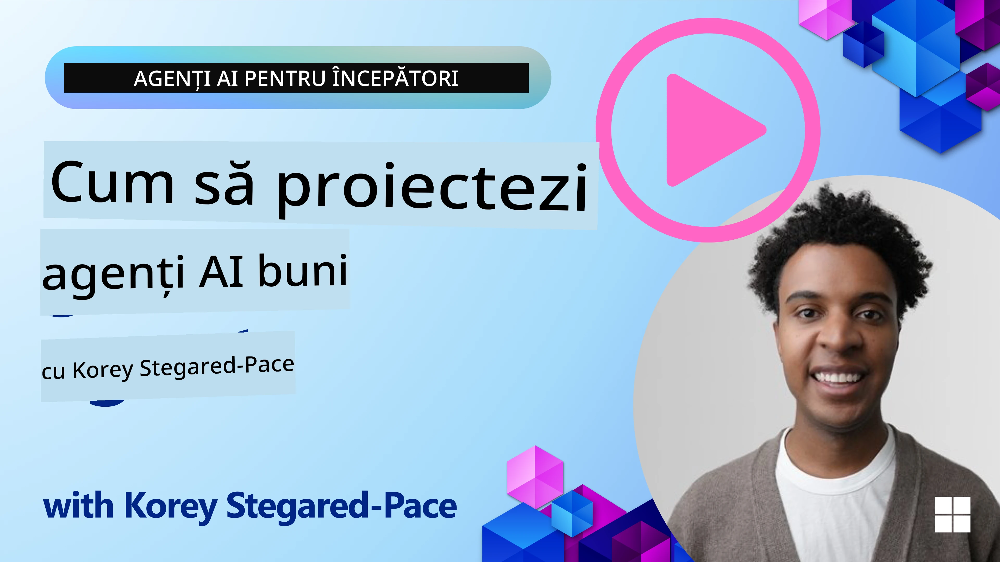
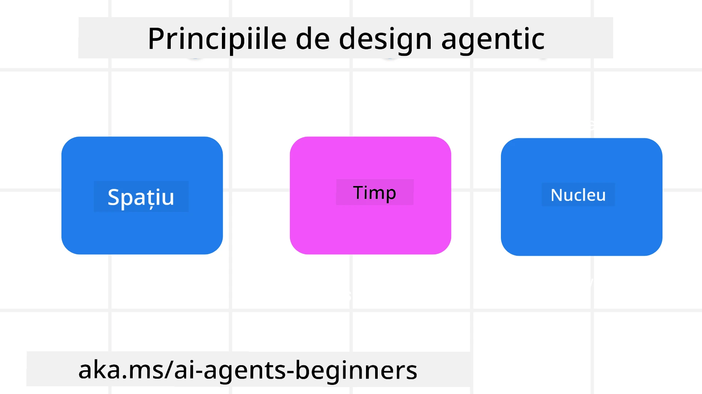

<!--
CO_OP_TRANSLATOR_METADATA:
{
  "original_hash": "d71524fe83a23829ae7a23b4031aaac8",
  "translation_date": "2025-11-13T14:02:54+00:00",
  "source_file": "03-agentic-design-patterns/README.md",
  "language_code": "ro"
}
-->

> _(Faceți clic pe imaginea de mai sus pentru a viziona videoclipul acestei lecții)_
# Principii de Design pentru Agenți AI

## Introducere

Există multe moduri de a gândi construirea Sistemelor Agentice AI. Având în vedere că ambiguitatea este o caracteristică și nu un defect în designul AI Generativ, uneori este dificil pentru ingineri să știe de unde să înceapă. Am creat un set de Principii de Design UX centrate pe oameni pentru a permite dezvoltatorilor să construiască sisteme agentice centrate pe client, care să răspundă nevoilor lor de afaceri. Aceste principii de design nu reprezintă o arhitectură prescriptivă, ci mai degrabă un punct de plecare pentru echipele care definesc și dezvoltă experiențe cu agenți.

În general, agenții ar trebui să:

- Extindă și scaleze capacitățile umane (brainstorming, rezolvarea problemelor, automatizare etc.)
- Completeze lacunele de cunoștințe (aducerea la zi în domenii de cunoștințe, traducere etc.)
- Faciliteze și sprijine colaborarea în modurile în care preferăm să lucrăm cu alții
- Ne facă versiuni mai bune ale noastre (de exemplu, antrenor de viață/manager de sarcini, ajutându-ne să învățăm abilități de reglare emoțională și mindfulness, construind reziliență etc.)

## Această lecție va acoperi

- Ce sunt Principiile de Design Agentic
- Care sunt câteva linii directoare de urmat în implementarea acestor principii de design
- Exemple de utilizare a principiilor de design

## Obiective de învățare

După finalizarea acestei lecții, veți putea:

1. Explica ce sunt Principiile de Design Agentic
2. Explica liniile directoare pentru utilizarea Principiilor de Design Agentic
3. Înțelege cum să construiți un agent folosind Principiile de Design Agentic

## Principiile de Design Agentic

### Agent (Spațiu)

Acesta este mediul în care agentul operează. Aceste principii informează modul în care proiectăm agenți pentru a interacționa în lumi fizice și digitale.

- **Conectare, nu colapsare** – ajută la conectarea oamenilor cu alți oameni, evenimente și cunoștințe acționabile pentru a permite colaborarea și conexiunea.
- Agenții ajută la conectarea evenimentelor, cunoștințelor și oamenilor.
- Agenții aduc oamenii mai aproape unii de alții. Nu sunt proiectați să înlocuiască sau să minimalizeze oamenii.
- **Ușor accesibil, dar ocazional invizibil** – agentul operează în mare parte în fundal și ne atenționează doar când este relevant și adecvat.
  - Agentul este ușor de descoperit și accesibil pentru utilizatorii autorizați pe orice dispozitiv sau platformă.
  - Agentul suportă intrări și ieșiri multimodale (sunet, voce, text etc.).
  - Agentul poate trece fără probleme între prim-plan și fundal; între proactiv și reactiv, în funcție de nevoile utilizatorului.
  - Agentul poate opera într-o formă invizibilă, dar procesul său de fundal și colaborarea cu alți agenți sunt transparente și controlabile de utilizator.

### Agent (Timp)

Acesta este modul în care agentul operează în timp. Aceste principii informează modul în care proiectăm agenți care interacționează în trecut, prezent și viitor.

- **Trecut**: Reflectarea asupra istoriei care include atât starea, cât și contextul.
  - Agentul oferă rezultate mai relevante pe baza analizei unor date istorice mai bogate, dincolo de eveniment, oameni sau stări.
  - Agentul creează conexiuni din evenimentele trecute și reflectă activ asupra memoriei pentru a interacționa cu situațiile actuale.
- **Acum**: Împingere mai degrabă decât notificare.
  - Agentul încorporează o abordare cuprinzătoare pentru a interacționa cu oamenii. Când are loc un eveniment, agentul merge dincolo de notificarea statică sau alte formalități statice. Agentul poate simplifica fluxurile sau genera dinamic indicii pentru a direcționa atenția utilizatorului la momentul potrivit.
  - Agentul livrează informații bazate pe mediul contextual, schimbările sociale și culturale și adaptate intenției utilizatorului.
  - Interacțiunea cu agentul poate fi graduală, evoluând/creând complexitate pentru a împuternici utilizatorii pe termen lung.
- **Viitor**: Adaptare și evoluție.
  - Agentul se adaptează la diverse dispozitive, platforme și modalități.
  - Agentul se adaptează comportamentului utilizatorului, nevoilor de accesibilitate și este personalizabil liber.
  - Agentul este modelat și evoluează prin interacțiunea continuă cu utilizatorul.

### Agent (Nucleu)

Acestea sunt elementele cheie din nucleul designului unui agent.

- **Acceptarea incertitudinii, dar stabilirea încrederii**.
  - Un anumit nivel de incertitudine a agentului este de așteptat. Incertitudinea este un element cheie al designului agentului.
  - Încrederea și transparența sunt straturi fundamentale ale designului agentului.
  - Oamenii controlează când agentul este pornit/oprit, iar starea agentului este clar vizibilă în orice moment.

## Liniile directoare pentru implementarea acestor principii

Când utilizați principiile de design menționate anterior, urmați următoarele linii directoare:

1. **Transparență**: Informați utilizatorul că AI este implicată, cum funcționează (inclusiv acțiunile trecute) și cum să ofere feedback și să modifice sistemul.
2. **Control**: Permiteți utilizatorului să personalizeze, să specifice preferințe și să personalizeze, și să aibă control asupra sistemului și atributelor sale (inclusiv capacitatea de a uita).
3. **Consistență**: Tindeți spre experiențe consistente, multimodale, pe dispozitive și puncte de acces. Utilizați elemente UI/UX familiare acolo unde este posibil (de exemplu, pictograma microfon pentru interacțiunea vocală) și reduceți cât mai mult sarcina cognitivă a clientului (de exemplu, răspunsuri concise, ajutoare vizuale și conținut „Află mai multe”).

## Cum să proiectați un agent de călătorie folosind aceste principii și linii directoare

Imaginați-vă că proiectați un agent de călătorie, iată cum ați putea gândi utilizarea Principiilor de Design și a Liniilor Directoare:

1. **Transparență** – Informați utilizatorul că agentul de călătorie este un agent activat de AI. Oferiți câteva instrucțiuni de bază despre cum să înceapă (de exemplu, un mesaj „Bună”, exemple de solicitări). Documentați clar acest lucru pe pagina produsului. Arătați lista de solicitări pe care utilizatorul le-a adresat în trecut. Faceți clar cum să oferiți feedback (de exemplu, butoane de tip „thumbs up” și „thumbs down”, buton „Trimite feedback” etc.). Articulați clar dacă agentul are restricții de utilizare sau subiect.
2. **Control** – Asigurați-vă că este clar cum utilizatorul poate modifica agentul după ce a fost creat, cu lucruri precum Promptul Sistemului. Permiteți utilizatorului să aleagă cât de detaliat este agentul, stilul său de scriere și orice limitări asupra subiectelor despre care agentul nu ar trebui să vorbească. Permiteți utilizatorului să vizualizeze și să șteargă orice fișiere sau date asociate, solicitări și conversații anterioare.
3. **Consistență** – Asigurați-vă că pictogramele pentru „Distribuie solicitare”, „adaugă un fișier sau o fotografie” și „etichetează pe cineva sau ceva” sunt standard și ușor de recunoscut. Utilizați pictograma agrafă pentru a indica încărcarea/partajarea fișierelor cu agentul și o pictogramă imagine pentru a indica încărcarea graficelor.

## Exemple de coduri

- Python: [Agent Framework](./code_samples/03-python-agent-framework.ipynb)
- .NET: [Agent Framework](./code_samples/03-dotnet-agent-framework.md)

## Aveți mai multe întrebări despre Modelele de Design Agentic AI?

Alăturați-vă [Discordului Azure AI Foundry](https://aka.ms/ai-agents/discord) pentru a întâlni alți cursanți, a participa la ore de consultanță și a obține răspunsuri la întrebările despre agenții AI.

## Resurse suplimentare

- <a href="https://openai.com" target="_blank">Practici pentru guvernarea sistemelor AI agentice | OpenAI</a>
- <a href="https://microsoft.com" target="_blank">Proiectul HAX Toolkit - Microsoft Research</a>
- <a href="https://responsibleaitoolbox.ai" target="_blank">Responsible AI Toolbox</a>

## Lecția anterioară

[Explorarea Cadrelor Agentice](../02-explore-agentic-frameworks/README.md)

## Lecția următoare

[Modelul de Design pentru Utilizarea Uneltelor](../04-tool-use/README.md)

---

<!-- CO-OP TRANSLATOR DISCLAIMER START -->
**Declinare de responsabilitate**:  
Acest document a fost tradus folosind serviciul de traducere AI [Co-op Translator](https://github.com/Azure/co-op-translator). Deși ne străduim să asigurăm acuratețea, vă rugăm să fiți conștienți că traducerile automate pot conține erori sau inexactități. Documentul original în limba sa maternă ar trebui considerat sursa autoritară. Pentru informații critice, se recomandă traducerea profesională realizată de oameni. Nu ne asumăm responsabilitatea pentru eventualele neînțelegeri sau interpretări greșite care pot apărea din utilizarea acestei traduceri.
<!-- CO-OP TRANSLATOR DISCLAIMER END -->