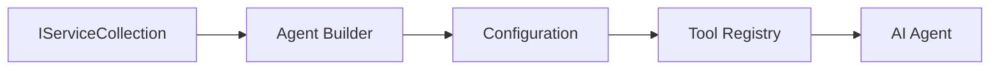

<!--
CO_OP_TRANSLATOR_METADATA:
{
  "original_hash": "bcc874e190347bd6a095aed56dc16de8",
  "translation_date": "2025-11-13T14:03:58+00:00",
  "source_file": "03-agentic-design-patterns/code_samples/03-dotnet-agent-framework.md",
  "language_code": "ro"
}
-->
# 🎨 Modele de Design Agentic cu GitHub Models (.NET)

## 📋 Obiective de Învățare

Acest exemplu demonstrează modele de design de nivel enterprise pentru construirea agenților inteligenți utilizând Microsoft Agent Framework în .NET cu integrarea GitHub Models. Vei învăța modele profesionale și abordări arhitecturale care fac agenții pregătiți pentru producție, ușor de întreținut și scalabili.

### Modele de Design Enterprise

- 🏭 **Factory Pattern**: Crearea standardizată a agenților cu injecție de dependențe
- 🔧 **Builder Pattern**: Configurare fluentă și configurare a agenților
- 🧵 **Thread-Safe Patterns**: Gestionarea conversațiilor concurente
- 📋 **Repository Pattern**: Management organizat al instrumentelor și capabilităților

## 🎯 Beneficii Arhitecturale Specifice .NET

### Funcționalități Enterprise

- **Tipare Puternice**: Validare la compilare și suport IntelliSense
- **Injecție de Dependențe**: Integrare cu containerul DI încorporat
- **Managementul Configurației**: Modele IConfiguration și Options
- **Async/Await**: Suport de primă clasă pentru programarea asincronă

### Modele Pregătite pentru Producție

- **Integrare Logging**: Suport ILogger și logging structurat
- **Verificări de Sănătate**: Monitorizare și diagnosticare încorporate
- **Validarea Configurației**: Tipare puternice cu adnotări de date
- **Gestionarea Erorilor**: Management structurat al excepțiilor

## 🔧 Arhitectura Tehnică

### Componentele de Bază .NET

- **Microsoft.Extensions.AI**: Abstracții unificate pentru servicii AI
- **Microsoft.Agents.AI**: Cadru de orchestrare pentru agenți enterprise
- **Integrarea GitHub Models**: Modele de client API de înaltă performanță
- **Sistem de Configurație**: Integrare appsettings.json și mediu

### Implementarea Modelului de Design



## 🏗️ Modele Enterprise Demonstrate

### 1. **Modele Creationale**

- **Agent Factory**: Crearea centralizată a agenților cu configurare consistentă
- **Builder Pattern**: API fluent pentru configurarea complexă a agenților
- **Singleton Pattern**: Managementul resurselor și configurației partajate
- **Injecție de Dependențe**: Cuplare slabă și testabilitate

### 2. **Modele Comportamentale**

- **Strategy Pattern**: Strategii interschimbabile de execuție a instrumentelor
- **Command Pattern**: Operațiuni ale agenților încapsulate cu funcționalități de undo/redo
- **Observer Pattern**: Managementul ciclului de viață al agenților bazat pe evenimente
- **Template Method**: Fluxuri de lucru standardizate pentru execuția agenților

### 3. **Modele Structurale**

- **Adapter Pattern**: Strat de integrare API GitHub Models
- **Decorator Pattern**: Îmbunătățirea capabilităților agenților
- **Facade Pattern**: Interfețe simplificate pentru interacțiunea cu agenții
- **Proxy Pattern**: Încărcare leneșă și caching pentru performanță

## 📚 Principii de Design .NET

### Principiile SOLID

- **Responsabilitate Unică**: Fiecare componentă are un scop clar
- **Deschis/Închis**: Extensibil fără modificare
- **Substituția Liskov**: Implementări de instrumente bazate pe interfețe
- **Segregarea Interfeței**: Interfețe concentrate și coezive
- **Inversiunea Dependenței**: Dependență de abstracții, nu de concretizări

### Arhitectura Curată

- **Stratul Domeniului**: Abstracții de bază pentru agenți și instrumente
- **Stratul Aplicației**: Orchestrarea agenților și fluxurile de lucru
- **Stratul Infrastructurii**: Integrarea GitHub Models și servicii externe
- **Stratul Prezentării**: Interacțiunea utilizatorului și formatarea răspunsurilor

## 🔒 Considerații Enterprise

### Securitate

- **Managementul Credențialelor**: Gestionarea sigură a cheilor API cu IConfiguration
- **Validarea Inputului**: Tipare puternice și validare cu adnotări de date
- **Sanitizarea Outputului**: Procesarea și filtrarea sigură a răspunsurilor
- **Audit Logging**: Urmărirea cuprinzătoare a operațiunilor

### Performanță

- **Modele Asincrone**: Operațiuni I/O non-blocante
- **Pooling de Conexiuni**: Management eficient al clientului HTTP
- **Caching**: Caching-ul răspunsurilor pentru performanță îmbunătățită
- **Managementul Resurselor**: Modele corecte de eliminare și curățare

### Scalabilitate

- **Siguranță la Fir**: Suport pentru execuția concurentă a agenților
- **Pooling de Resurse**: Utilizarea eficientă a resurselor
- **Managementul Sarcinii**: Limitarea ratei și gestionarea presiunii
- **Monitorizare**: Metrici de performanță și verificări de sănătate

## 🚀 Implementare în Producție

- **Managementul Configurației**: Setări specifice mediului
- **Strategia de Logging**: Logging structurat cu ID-uri de corelare
- **Gestionarea Erorilor**: Gestionarea globală a excepțiilor cu recuperare adecvată
- **Monitorizare**: Application Insights și contoare de performanță
- **Testare**: Teste unitare, teste de integrare și modele de testare a încărcării

Pregătit să construiești agenți inteligenți de nivel enterprise cu .NET? Hai să arhitectăm ceva robust! 🏢✨

## 🚀 Începe

### Cerințe Prealabile

- [.NET 10 SDK](https://dotnet.microsoft.com/download/dotnet/10.0) sau mai recent
- [Token de acces API GitHub Models](https://docs.github.com/github-models/github-models-at-scale/using-your-own-api-keys-in-github-models)

### Variabile de Mediu Necesare

```bash
# zsh/bash
export GH_TOKEN=<your_github_token>
export GH_ENDPOINT=https://models.github.ai/inference
export GH_MODEL_ID=openai/gpt-5-mini
```

```powershell
# PowerShell
$env:GH_TOKEN = "<your_github_token>"
$env:GH_ENDPOINT = "https://models.github.ai/inference"
$env:GH_MODEL_ID = "openai/gpt-5-mini"
```

### Cod Exemplu

Pentru a rula exemplul de cod,

```bash
# zsh/bash
chmod +x ./03-dotnet-agent-framework.cs
./03-dotnet-agent-framework.cs
```

Sau folosind CLI-ul dotnet:

```bash
dotnet run ./03-dotnet-agent-framework.cs
```

Vezi [`03-dotnet-agent-framework.cs`](../../../../03-agentic-design-patterns/code_samples/03-dotnet-agent-framework.cs) pentru codul complet.

```csharp
#!/usr/bin/dotnet run

#:package Microsoft.Extensions.AI@10.*
#:package Microsoft.Agents.AI.OpenAI@1.*-*

using System.ClientModel;
using System.ComponentModel;

using Microsoft.Agents.AI;
using Microsoft.Extensions.AI;

using OpenAI;

// Tool Function: Random Destination Generator
// This static method will be available to the agent as a callable tool
// The [Description] attribute helps the AI understand when to use this function
// This demonstrates how to create custom tools for AI agents
[Description("Provides a random vacation destination.")]
static string GetRandomDestination()
{
    // List of popular vacation destinations around the world
    // The agent will randomly select from these options
    var destinations = new List<string>
    {
        "Paris, France",
        "Tokyo, Japan",
        "New York City, USA",
        "Sydney, Australia",
        "Rome, Italy",
        "Barcelona, Spain",
        "Cape Town, South Africa",
        "Rio de Janeiro, Brazil",
        "Bangkok, Thailand",
        "Vancouver, Canada"
    };

    // Generate random index and return selected destination
    // Uses System.Random for simple random selection
    var random = new Random();
    int index = random.Next(destinations.Count);
    return destinations[index];
}

// Extract configuration from environment variables
// Retrieve the GitHub Models API endpoint, defaults to https://models.github.ai/inference if not specified
// Retrieve the model ID, defaults to openai/gpt-5-mini if not specified
// Retrieve the GitHub token for authentication, throws exception if not specified
var github_endpoint = Environment.GetEnvironmentVariable("GH_ENDPOINT") ?? "https://models.github.ai/inference";
var github_model_id = Environment.GetEnvironmentVariable("GH_MODEL_ID") ?? "openai/gpt-5-mini";
var github_token = Environment.GetEnvironmentVariable("GH_TOKEN") ?? throw new InvalidOperationException("GH_TOKEN is not set.");

// Configure OpenAI Client Options
// Create configuration options to point to GitHub Models endpoint
// This redirects OpenAI client calls to GitHub's model inference service
var openAIOptions = new OpenAIClientOptions()
{
    Endpoint = new Uri(github_endpoint)
};

// Initialize OpenAI Client with GitHub Models Configuration
// Create OpenAI client using GitHub token for authentication
// Configure it to use GitHub Models endpoint instead of OpenAI directly
var openAIClient = new OpenAIClient(new ApiKeyCredential(github_token), openAIOptions);

// Define Agent Identity and Comprehensive Instructions
// Agent name for identification and logging purposes
var AGENT_NAME = "TravelAgent";

// Detailed instructions that define the agent's personality, capabilities, and behavior
// This system prompt shapes how the agent responds and interacts with users
var AGENT_INSTRUCTIONS = """
You are a helpful AI Agent that can help plan vacations for customers.

Important: When users specify a destination, always plan for that location. Only suggest random destinations when the user hasn't specified a preference.

When the conversation begins, introduce yourself with this message:
"Hello! I'm your TravelAgent assistant. I can help plan vacations and suggest interesting destinations for you. Here are some things you can ask me:
1. Plan a day trip to a specific location
2. Suggest a random vacation destination
3. Find destinations with specific features (beaches, mountains, historical sites, etc.)
4. Plan an alternative trip if you don't like my first suggestion

What kind of trip would you like me to help you plan today?"

Always prioritize user preferences. If they mention a specific destination like "Bali" or "Paris," focus your planning on that location rather than suggesting alternatives.
""";

// Create AI Agent with Advanced Travel Planning Capabilities
// Initialize complete agent pipeline: OpenAI client → Chat client → AI agent
// Configure agent with name, detailed instructions, and available tools
// This demonstrates the .NET agent creation pattern with full configuration
AIAgent agent = openAIClient
    .GetChatClient(github_model_id)
    .CreateAIAgent(
        name: AGENT_NAME,
        instructions: AGENT_INSTRUCTIONS,
        tools: [AIFunctionFactory.Create(GetRandomDestination)]
    );

// Create New Conversation Thread for Context Management
// Initialize a new conversation thread to maintain context across multiple interactions
// Threads enable the agent to remember previous exchanges and maintain conversational state
// This is essential for multi-turn conversations and contextual understanding
AgentThread thread = agent.GetNewThread();

// Execute Agent: First Travel Planning Request
// Run the agent with an initial request that will likely trigger the random destination tool
// The agent will analyze the request, use the GetRandomDestination tool, and create an itinerary
// Using the thread parameter maintains conversation context for subsequent interactions
await foreach (var update in agent.RunStreamingAsync("Plan me a day trip", thread))
{
    await Task.Delay(10);
    Console.Write(update);
}

Console.WriteLine();

// Execute Agent: Follow-up Request with Context Awareness
// Demonstrate contextual conversation by referencing the previous response
// The agent remembers the previous destination suggestion and will provide an alternative
// This showcases the power of conversation threads and contextual understanding in .NET agents
await foreach (var update in agent.RunStreamingAsync("I don't like that destination. Plan me another vacation.", thread))
{
    await Task.Delay(10);
    Console.Write(update);
}
```

---

<!-- CO-OP TRANSLATOR DISCLAIMER START -->
**Declinare de responsabilitate**:  
Acest document a fost tradus folosind serviciul de traducere AI [Co-op Translator](https://github.com/Azure/co-op-translator). Deși ne străduim să asigurăm acuratețea, vă rugăm să fiți conștienți că traducerile automate pot conține erori sau inexactități. Documentul original în limba sa natală ar trebui considerat sursa autoritară. Pentru informații critice, se recomandă traducerea profesională realizată de oameni. Nu ne asumăm responsabilitatea pentru neînțelegerile sau interpretările greșite care pot apărea din utilizarea acestei traduceri.
<!-- CO-OP TRANSLATOR DISCLAIMER END -->