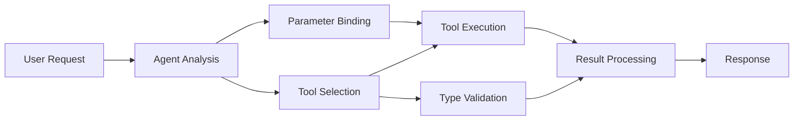

<!--
CO_OP_TRANSLATOR_METADATA:
{
  "original_hash": "91d6061e402489603f2ec8b528cae59b",
  "translation_date": "2025-11-18T18:17:22+00:00",
  "source_file": "04-tool-use/code_samples/04-dotnet-agent-framework.md",
  "language_code": "ro"
}
-->
# 🛠️ Utilizarea Avansată a Uneltelor cu Modelele GitHub (.NET)

## 📋 Obiective de Învățare

Acest notebook demonstrează modele de integrare a uneltelor la nivel enterprise folosind Microsoft Agent Framework în .NET cu Modelele GitHub. Vei învăța să construiești agenți sofisticați cu multiple unelte specializate, valorificând tipizarea puternică a C# și caracteristicile enterprise ale .NET.

### Capacități Avansate ale Uneltelor pe care le vei Stăpâni

- 🔧 **Arhitectură Multi-Unelte**: Construirea agenților cu multiple capabilități specializate
- 🎯 **Execuție Tip-Safe a Uneltelor**: Valorificarea validării la compilare a C#
- 📊 **Modele de Unelte Enterprise**: Design de unelte pregătit pentru producție și gestionarea erorilor
- 🔗 **Compoziția Uneltelor**: Combinarea uneltelor pentru fluxuri de lucru complexe de afaceri

## 🎯 Beneficiile Arhitecturii Uneltelor în .NET

### Caracteristici ale Uneltelor Enterprise

- **Validare la Compilare**: Tipizarea puternică asigură corectitudinea parametrilor uneltelor
- **Injecție de Dependențe**: Integrarea containerului IoC pentru gestionarea uneltelor
- **Modele Async/Await**: Execuție non-blocantă a uneltelor cu gestionarea corectă a resurselor
- **Logare Structurată**: Integrare de logare încorporată pentru monitorizarea execuției uneltelor

### Modele Pregătite pentru Producție

- **Gestionarea Excepțiilor**: Management complet al erorilor cu excepții tipizate
- **Gestionarea Resurselor**: Modele corecte de eliminare și gestionare a memoriei
- **Monitorizarea Performanței**: Metrici încorporate și contoare de performanță
- **Gestionarea Configurației**: Configurație tip-safe cu validare

## 🔧 Arhitectura Tehnică

### Componentele de Bază ale Uneltelor în .NET

- **Microsoft.Extensions.AI**: Strat de abstractizare unificat pentru unelte
- **Microsoft.Agents.AI**: Orchestrare de unelte la nivel enterprise
- **Integrarea Modelelor GitHub**: Client API de înaltă performanță cu pooling de conexiuni

### Pipeline-ul de Execuție al Uneltelor



## 🛠️ Categorii și Modele de Unelte

### 1. **Unelte de Procesare a Datelor**

- **Validarea Input-ului**: Tipizare puternică cu adnotări de date
- **Operațiuni de Transformare**: Conversie și formatare a datelor tip-safe
- **Logica de Afaceri**: Unelte de calcul și analiză specifice domeniului
- **Formatarea Output-ului**: Generarea de răspunsuri structurate

### 2. **Unelte de Integrare**

- **Conectori API**: Integrare cu servicii RESTful folosind HttpClient
- **Unelte pentru Baze de Date**: Integrare cu Entity Framework pentru accesul la date
- **Operațiuni pe Fișiere**: Operațiuni sigure pe sistemul de fișiere cu validare
- **Servicii Externe**: Modele de integrare cu servicii terțe

### 3. **Unelte Utilitare**

- **Procesarea Textului**: Utilitare pentru manipularea și formatarea șirurilor de caractere
- **Operațiuni cu Date/Timp**: Calculații de date/timp sensibile la cultură
- **Unelte Matematice**: Calculații de precizie și operațiuni statistice
- **Unelte de Validare**: Validarea regulilor de afaceri și verificarea datelor

Ești pregătit să construiești agenți la nivel enterprise cu capabilități puternice și tip-safe în .NET? Hai să arhitecturăm soluții profesionale! 🏢⚡

## 🚀 Începe

### Cerințe Prealabile

- [.NET 10 SDK](https://dotnet.microsoft.com/download/dotnet/10.0) sau o versiune mai recentă
- [Token de acces API pentru Modelele GitHub](https://docs.github.com/github-models/github-models-at-scale/using-your-own-api-keys-in-github-models)

### Variabile de Mediu Necesare

```bash
# zsh/bash
export GH_TOKEN=<your_github_token>
export GH_ENDPOINT=https://models.github.ai/inference
export GH_MODEL_ID=openai/gpt-5-mini
```

```powershell
# PowerShell
$env:GH_TOKEN = "<your_github_token>"
$env:GH_ENDPOINT = "https://models.github.ai/inference"
$env:GH_MODEL_ID = "openai/gpt-5-mini"
```

### Cod Exemplu

Pentru a rula exemplul de cod,

```bash
# zsh/bash
chmod +x ./04-dotnet-agent-framework.cs
./04-dotnet-agent-framework.cs
```

Sau folosind CLI-ul dotnet:

```bash
dotnet run ./04-dotnet-agent-framework.cs
```

Vezi [`04-dotnet-agent-framework.cs`](../../../../04-tool-use/code_samples/04-dotnet-agent-framework.cs) pentru codul complet.

```csharp
#!/usr/bin/dotnet run

#:package Microsoft.Extensions.AI@10.*
#:package Microsoft.Agents.AI.OpenAI@1.*-*

using System.ClientModel;
using System.ComponentModel;

using Microsoft.Agents.AI;
using Microsoft.Extensions.AI;

using OpenAI;

// Tool Function: Random Destination Generator
// This static method will be available to the agent as a callable tool
// The [Description] attribute helps the AI understand when to use this function
// This demonstrates how to create custom tools for AI agents
[Description("Provides a random vacation destination.")]
static string GetRandomDestination()
{
    // List of popular vacation destinations around the world
    // The agent will randomly select from these options
    var destinations = new List<string>
    {
        "Paris, France",
        "Tokyo, Japan",
        "New York City, USA",
        "Sydney, Australia",
        "Rome, Italy",
        "Barcelona, Spain",
        "Cape Town, South Africa",
        "Rio de Janeiro, Brazil",
        "Bangkok, Thailand",
        "Vancouver, Canada"
    };

    // Generate random index and return selected destination
    // Uses System.Random for simple random selection
    var random = new Random();
    int index = random.Next(destinations.Count);
    return destinations[index];
}

// Extract configuration from environment variables
// Retrieve the GitHub Models API endpoint, defaults to https://models.github.ai/inference if not specified
// Retrieve the model ID, defaults to openai/gpt-5-mini if not specified
// Retrieve the GitHub token for authentication, throws exception if not specified
var github_endpoint = Environment.GetEnvironmentVariable("GH_ENDPOINT") ?? "https://models.github.ai/inference";
var github_model_id = Environment.GetEnvironmentVariable("GH_MODEL_ID") ?? "openai/gpt-5-mini";
var github_token = Environment.GetEnvironmentVariable("GH_TOKEN") ?? throw new InvalidOperationException("GH_TOKEN is not set.");

// Configure OpenAI Client Options
// Create configuration options to point to GitHub Models endpoint
// This redirects OpenAI client calls to GitHub's model inference service
var openAIOptions = new OpenAIClientOptions()
{
    Endpoint = new Uri(github_endpoint)
};

// Initialize OpenAI Client with GitHub Models Configuration
// Create OpenAI client using GitHub token for authentication
// Configure it to use GitHub Models endpoint instead of OpenAI directly
var openAIClient = new OpenAIClient(new ApiKeyCredential(github_token), openAIOptions);

// Define Agent Identity and Comprehensive Instructions
// Agent name for identification and logging purposes
var AGENT_NAME = "TravelAgent";

// Detailed instructions that define the agent's personality, capabilities, and behavior
// This system prompt shapes how the agent responds and interacts with users
var AGENT_INSTRUCTIONS = """
You are a helpful AI Agent that can help plan vacations for customers.

Important: When users specify a destination, always plan for that location. Only suggest random destinations when the user hasn't specified a preference.

When the conversation begins, introduce yourself with this message:
"Hello! I'm your TravelAgent assistant. I can help plan vacations and suggest interesting destinations for you. Here are some things you can ask me:
1. Plan a day trip to a specific location
2. Suggest a random vacation destination
3. Find destinations with specific features (beaches, mountains, historical sites, etc.)
4. Plan an alternative trip if you don't like my first suggestion

What kind of trip would you like me to help you plan today?"

Always prioritize user preferences. If they mention a specific destination like "Bali" or "Paris," focus your planning on that location rather than suggesting alternatives.
""";

// Create AI Agent with Advanced Travel Planning Capabilities
// Initialize complete agent pipeline: OpenAI client → Chat client → AI agent
// Configure agent with name, detailed instructions, and available tools
// This demonstrates the .NET agent creation pattern with full configuration
AIAgent agent = openAIClient
    .GetChatClient(github_model_id)
    .CreateAIAgent(
        name: AGENT_NAME,
        instructions: AGENT_INSTRUCTIONS,
        tools: [AIFunctionFactory.Create(GetRandomDestination)]
    );

// Create New Conversation Thread for Context Management
// Initialize a new conversation thread to maintain context across multiple interactions
// Threads enable the agent to remember previous exchanges and maintain conversational state
// This is essential for multi-turn conversations and contextual understanding
AgentThread thread = agent.GetNewThread();

// Execute Agent: First Travel Planning Request
// Run the agent with an initial request that will likely trigger the random destination tool
// The agent will analyze the request, use the GetRandomDestination tool, and create an itinerary
// Using the thread parameter maintains conversation context for subsequent interactions
await foreach (var update in agent.RunStreamingAsync("Plan me a day trip", thread))
{
    await Task.Delay(10);
    Console.Write(update);
}

Console.WriteLine();

// Execute Agent: Follow-up Request with Context Awareness
// Demonstrate contextual conversation by referencing the previous response
// The agent remembers the previous destination suggestion and will provide an alternative
// This showcases the power of conversation threads and contextual understanding in .NET agents
await foreach (var update in agent.RunStreamingAsync("I don't like that destination. Plan me another vacation.", thread))
{
    await Task.Delay(10);
    Console.Write(update);
}
```

---

<!-- CO-OP TRANSLATOR DISCLAIMER START -->
**Declinare de responsabilitate**:  
Acest document a fost tradus folosind serviciul de traducere AI [Co-op Translator](https://github.com/Azure/co-op-translator). Deși ne străduim să asigurăm acuratețea, vă rugăm să fiți conștienți că traducerile automate pot conține erori sau inexactități. Documentul original în limba sa natală ar trebui considerat sursa autoritară. Pentru informații critice, se recomandă traducerea profesională realizată de oameni. Nu ne asumăm responsabilitatea pentru neînțelegerile sau interpretările greșite care pot apărea din utilizarea acestei traduceri.
<!-- CO-OP TRANSLATOR DISCLAIMER END -->