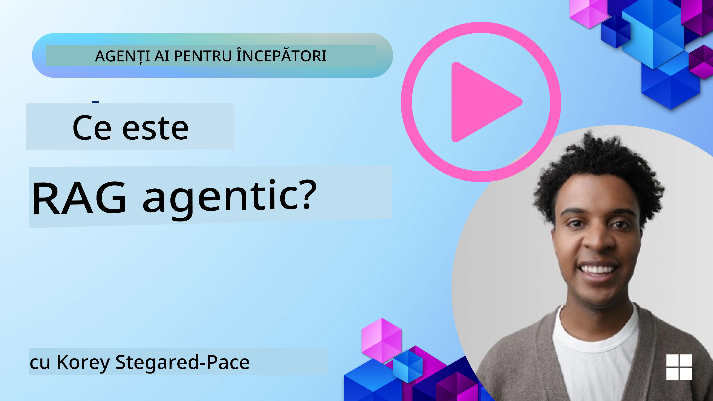
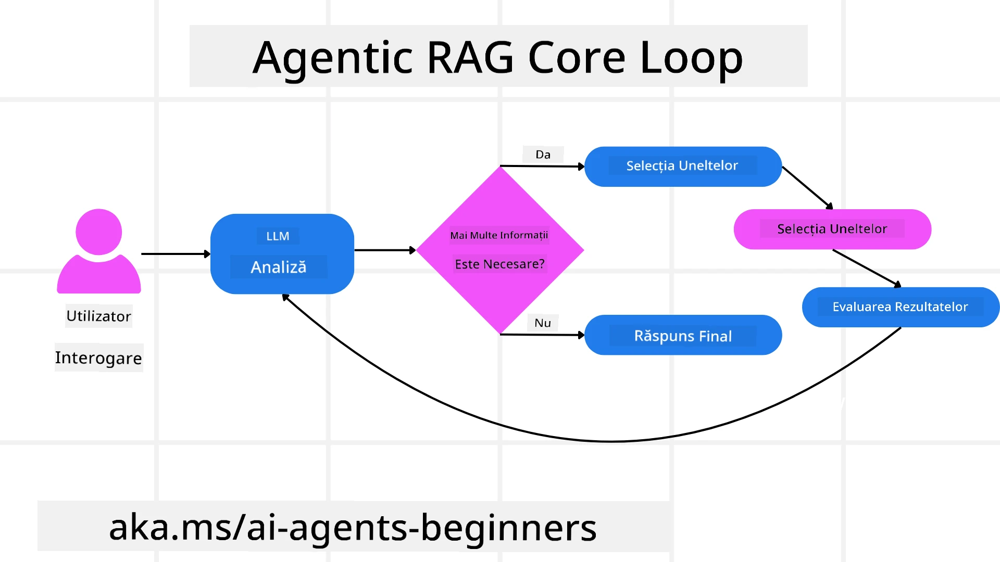
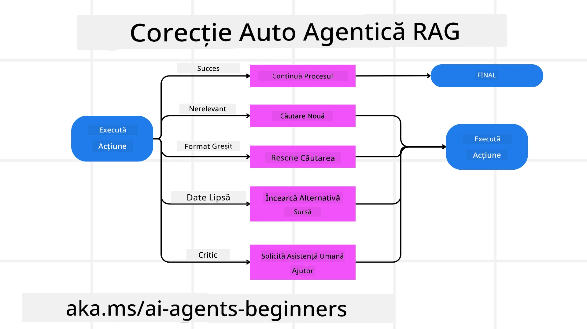
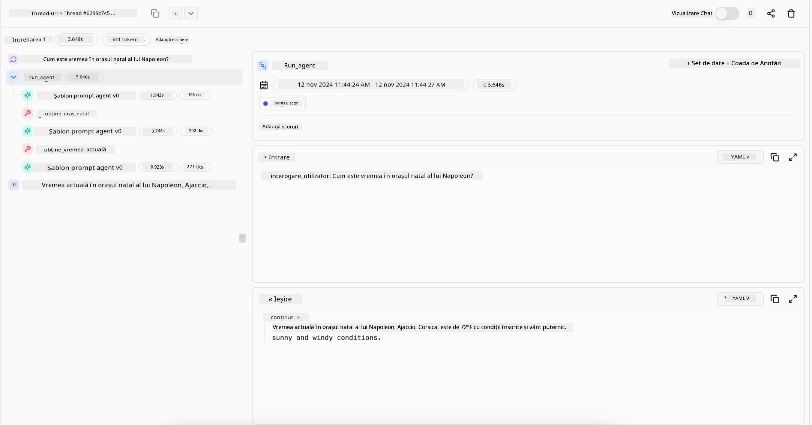

<!--
CO_OP_TRANSLATOR_METADATA:
{
  "original_hash": "0ebf6b2290db55dbf2d10cc49655523b",
  "translation_date": "2025-09-30T07:45:33+00:00",
  "source_file": "05-agentic-rag/README.md",
  "language_code": "ro"
}
-->

> _(Click pe imaginea de mai sus pentru a viziona videoclipul acestei lecții)_

# Agentic RAG

Această lecție oferă o prezentare cuprinzătoare a paradigmei emergente Agentic Retrieval-Augmented Generation (Agentic RAG), unde modelele lingvistice mari (LLMs) planifică autonom pașii următori în timp ce extrag informații din surse externe. Spre deosebire de modelele statice de tip „retrieval-then-read”, Agentic RAG implică apeluri iterative către LLM, intercalate cu utilizarea de instrumente sau funcții și producerea de rezultate structurate. Sistemul evaluează rezultatele, rafinează interogările, invocă instrumente suplimentare dacă este necesar și continuă acest ciclu până când se obține o soluție satisfăcătoare.

## Introducere

Această lecție va acoperi:

- **Înțelegerea Agentic RAG:** Descoperă paradigma emergentă în AI, unde modelele lingvistice mari (LLMs) planifică autonom pașii următori în timp ce extrag informații din surse de date externe.
- **Stil iterativ Maker-Checker:** Înțelege bucla apelurilor iterative către LLM, intercalate cu utilizarea de instrumente sau funcții și producerea de rezultate structurate, concepute pentru a îmbunătăți corectitudinea și a gestiona interogările defectuoase.
- **Explorarea aplicațiilor practice:** Identifică scenarii în care Agentic RAG excelează, cum ar fi medii orientate spre corectitudine, interacțiuni complexe cu baze de date și fluxuri de lucru extinse.

## Obiective de învățare

După finalizarea acestei lecții, vei ști cum să/vei înțelege:

- **Înțelegerea Agentic RAG:** Descoperă paradigma emergentă în AI, unde modelele lingvistice mari (LLMs) planifică autonom pașii următori în timp ce extrag informații din surse de date externe.
- **Stil iterativ Maker-Checker:** Înțelege conceptul unei bucle de apeluri iterative către LLM, intercalate cu utilizarea de instrumente sau funcții și producerea de rezultate structurate, concepute pentru a îmbunătăți corectitudinea și a gestiona interogările defectuoase.
- **Deținerea procesului de raționare:** Înțelege capacitatea sistemului de a deține procesul său de raționare, luând decizii despre cum să abordeze problemele fără a se baza pe căi predefinite.
- **Flux de lucru:** Înțelege cum un model agentic decide independent să extragă rapoarte despre tendințele pieței, să identifice date despre competitori, să coreleze metrici interne de vânzări, să sintetizeze concluziile și să evalueze strategia.
- **Bucle iterative, integrarea instrumentelor și memorie:** Descoperă dependența sistemului de un model de interacțiune în buclă, menținând starea și memoria între pași pentru a evita buclele repetitive și a lua decizii informate.
- **Gestionarea modurilor de eșec și autocorecția:** Explorează mecanismele robuste de autocorecție ale sistemului, inclusiv iterarea și reinterogarea, utilizarea instrumentelor de diagnostic și apelarea la supravegherea umană.
- **Limitele autonomiei:** Înțelege limitările Agentic RAG, concentrându-te pe autonomia specifică domeniului, dependența de infrastructură și respectarea măsurilor de siguranță.
- **Cazuri de utilizare practică și valoare:** Identifică scenarii în care Agentic RAG excelează, cum ar fi medii orientate spre corectitudine, interacțiuni complexe cu baze de date și fluxuri de lucru extinse.
- **Guvernanță, transparență și încredere:** Descoperă importanța guvernanței și transparenței, inclusiv raționamentul explicabil, controlul prejudecăților și supravegherea umană.

## Ce este Agentic RAG?

Agentic Retrieval-Augmented Generation (Agentic RAG) este o paradigmă emergentă în AI, unde modelele lingvistice mari (LLMs) planifică autonom pașii următori în timp ce extrag informații din surse externe. Spre deosebire de modelele statice de tip „retrieval-then-read”, Agentic RAG implică apeluri iterative către LLM, intercalate cu utilizarea de instrumente sau funcții și producerea de rezultate structurate. Sistemul evaluează rezultatele, rafinează interogările, invocă instrumente suplimentare dacă este necesar și continuă acest ciclu până când se obține o soluție satisfăcătoare. Acest stil iterativ „maker-checker” îmbunătățește corectitudinea, gestionează interogările defectuoase și asigură rezultate de înaltă calitate.

Sistemul își asumă activ procesul de raționare, rescriind interogările eșuate, alegând metode de extragere diferite și integrând multiple instrumente—cum ar fi căutarea vectorială în Azure AI Search, baze de date SQL sau API-uri personalizate—înainte de a finaliza răspunsul. Calitatea distinctivă a unui sistem agentic este capacitatea sa de a deține procesul de raționare. Implementările tradiționale RAG se bazează pe căi predefinite, dar un sistem agentic determină autonom secvența pașilor pe baza calității informațiilor pe care le găsește.

## Definirea Agentic Retrieval-Augmented Generation (Agentic RAG)

Agentic Retrieval-Augmented Generation (Agentic RAG) este o paradigmă emergentă în dezvoltarea AI, unde LLM-urile nu doar extrag informații din surse de date externe, ci și planifică autonom pașii următori. Spre deosebire de modelele statice de tip „retrieval-then-read” sau secvențele de prompturi atent scriptate, Agentic RAG implică o buclă de apeluri iterative către LLM, intercalate cu utilizarea de instrumente sau funcții și producerea de rezultate structurate. La fiecare pas, sistemul evaluează rezultatele obținute, decide dacă să rafineze interogările, invocă instrumente suplimentare dacă este necesar și continuă acest ciclu până când obține o soluție satisfăcătoare.

Acest stil iterativ „maker-checker” este conceput pentru a îmbunătăți corectitudinea, a gestiona interogările defectuoase către baze de date structurate (de exemplu, NL2SQL) și a asigura rezultate echilibrate și de înaltă calitate. În loc să se bazeze exclusiv pe lanțuri de prompturi atent proiectate, sistemul își asumă activ procesul de raționare. Poate rescrie interogările care eșuează, alege metode de extragere diferite și integrează multiple instrumente—cum ar fi căutarea vectorială în Azure AI Search, baze de date SQL sau API-uri personalizate—înainte de a finaliza răspunsul. Acest lucru elimină necesitatea unor cadre de orchestrare excesiv de complexe. În schimb, o buclă relativ simplă de „apel LLM → utilizare instrument → apel LLM → …” poate produce rezultate sofisticate și bine fundamentate.

## Deținerea procesului de raționare

Calitatea distinctivă care face un sistem „agentic” este capacitatea sa de a deține procesul de raționare. Implementările tradiționale RAG se bazează adesea pe oameni care predefinesc o cale pentru model: un lanț de gândire care indică ce să extragă și când. 
Dar când un sistem este cu adevărat agentic, decide intern cum să abordeze problema. Nu execută doar un script; determină autonom secvența pașilor pe baza calității informațiilor pe care le găsește. 
De exemplu, dacă i se cere să creeze o strategie de lansare a unui produs, nu se bazează doar pe un prompt care detaliază întregul flux de cercetare și luare de decizii. În schimb, modelul agentic decide independent să:

1. Extragă rapoarte despre tendințele actuale ale pieței folosind Bing Web Grounding.
2. Identifice date relevante despre competitori folosind Azure AI Search.
3. Coreleze metrici istorice interne de vânzări folosind Azure SQL Database.
4. Sintetizeze concluziile într-o strategie coerentă orchestrată prin Azure OpenAI Service.
5. Evalueze strategia pentru lacune sau inconsecvențe, inițiind o altă rundă de extragere dacă este necesar.

Toți acești pași—rafinarea interogărilor, alegerea surselor, iterarea până când este „mulțumit” de răspuns—sunt decise de model, nu pre-scriptate de un om.

## Bucle iterative, integrarea instrumentelor și memorie

Un sistem agentic se bazează pe un model de interacțiune în buclă:

- **Apel inițial:** Obiectivul utilizatorului (aka. promptul utilizatorului) este prezentat LLM-ului.
- **Invocarea instrumentelor:** Dacă modelul identifică informații lipsă sau instrucțiuni ambigue, selectează un instrument sau o metodă de extragere—cum ar fi o interogare a bazei de date vectoriale (de exemplu, Azure AI Search Hybrid search peste date private) sau un apel structurat SQL—pentru a aduna mai mult context.
- **Evaluare și rafinare:** După revizuirea datelor returnate, modelul decide dacă informațiile sunt suficiente. Dacă nu, rafinează interogarea, încearcă un instrument diferit sau își ajustează abordarea.
- **Repetare până la satisfacție:** Acest ciclu continuă până când modelul determină că are suficientă claritate și dovezi pentru a oferi un răspuns final bine fundamentat.
- **Memorie și stare:** Deoarece sistemul menține starea și memoria între pași, poate reaminti încercările anterioare și rezultatele acestora, evitând buclele repetitive și luând decizii mai informate pe măsură ce progresează.

În timp, acest lucru creează un sentiment de înțelegere evolutivă, permițând modelului să navigheze prin sarcini complexe, în mai mulți pași, fără a necesita intervenția constantă a unui om sau reformularea promptului.

## Gestionarea modurilor de eșec și autocorecția

Autonomia Agentic RAG implică, de asemenea, mecanisme robuste de autocorecție. Când sistemul întâmpină blocaje—cum ar fi extragerea de documente irelevante sau interogări defectuoase—poate:

- **Itera și reinteroga:** În loc să returneze răspunsuri de valoare scăzută, modelul încearcă noi strategii de căutare, rescrie interogări ale bazei de date sau analizează seturi de date alternative.
- **Utiliza instrumente de diagnostic:** Sistemul poate invoca funcții suplimentare concepute pentru a-l ajuta să depaneze pașii de raționare sau să confirme corectitudinea datelor extrase. Instrumente precum Azure AI Tracing vor fi importante pentru a permite observabilitate și monitorizare robuste.
- **Apela la supravegherea umană:** Pentru scenarii cu miză mare sau eșecuri repetate, modelul poate semnala incertitudinea și solicita îndrumare umană. Odată ce omul oferă feedback corectiv, modelul poate încorpora acea lecție pe viitor.

Această abordare iterativă și dinamică permite modelului să se îmbunătățească continuu, asigurând că nu este doar un sistem „one-shot”, ci unul care învață din greșelile sale în timpul unei sesiuni date.

## Limitele autonomiei

În ciuda autonomiei sale în cadrul unei sarcini, Agentic RAG nu este echivalent cu Inteligența Generală Artificială. Capacitățile sale „agentice” sunt limitate la instrumentele, sursele de date și politicile furnizate de dezvoltatorii umani. Nu poate inventa propriile instrumente sau depăși limitele domeniului stabilite. Mai degrabă, excelează în orchestrarea dinamică a resurselor disponibile.

Diferențele cheie față de formele mai avansate de AI includ:

1. **Autonomie specifică domeniului:** Sistemele Agentic RAG sunt concentrate pe atingerea obiectivelor definite de utilizator într-un domeniu cunoscut, utilizând strategii precum rescrierea interogărilor sau selectarea instrumentelor pentru a îmbunătăți rezultatele.
2. **Dependent de infrastructură:** Capacitățile sistemului depind de instrumentele și datele integrate de dezvoltatori. Nu poate depăși aceste limite fără intervenție umană.
3. **Respectarea măsurilor de siguranță:** Liniile directoare etice, regulile de conformitate și politicile de afaceri rămân foarte importante. Libertatea agentului este întotdeauna constrânsă de măsuri de siguranță și mecanisme de supraveghere (sperăm?).

## Cazuri de utilizare practică și valoare

Agentic RAG excelează în scenarii care necesită rafinare iterativă și precizie:

1. **Mediile orientate spre corectitudine:** În verificări de conformitate, analize de reglementare sau cercetare juridică, modelul agentic poate verifica repetat faptele, consulta surse multiple și rescrie interogările până când produce un răspuns temeinic verificat.
2. **Interacțiuni complexe cu baze de date:** Când se lucrează cu date structurate, unde interogările pot eșua frecvent sau necesita ajustări, sistemul poate rafina autonom interogările folosind Azure SQL sau Microsoft Fabric OneLake, asigurând că extragerea finală se aliniază cu intenția utilizatorului.
3. **Fluxuri de lucru extinse:** Sesiunile de lungă durată pot evolua pe măsură ce apar informații noi. Agentic RAG poate încorpora continuu date noi, schimbând strategiile pe măsură ce învață mai multe despre spațiul problemei.

## Guvernanță, transparență și încredere

Pe măsură ce aceste sisteme devin mai autonome în raționamentul lor, guvernanța și transparența sunt esențiale:

- **Raționament explicabil:** Modelul poate oferi o pistă de audit a interogărilor pe care le-a făcut, sursele pe care le-a consultat și pașii de raționare pe care i-a urmat pentru a ajunge la concluzia sa. Instrumente precum Azure AI Content Safety și Azure AI Tracing / GenAIOps pot ajuta la menținerea transparenței și la reducerea riscurilor.
- **Controlul prejudecăților și extragerea echilibrată:** Dezvoltatorii pot ajusta strategiile de extragere pentru a se asigura că sunt luate în considerare surse de date echilibrate și reprezentative și pot audita regulat rezultatele pentru a detecta prejudecăți sau modele distorsionate folosind modele personalizate pentru organizații avansate de știința datelor, utilizând Azure Machine Learning.
- **Supraveghere umană și conformitate:** Pentru sarcini sensibile, revizuirea umană rămâne esențială. Agentic RAG nu înlocuiește judecata umană în deciziile cu miză mare—o completează prin oferirea de opțiuni mai temeinic verificate.

A avea instrumente care oferă un record clar al acțiunilor este esențial. Fără ele, depanarea unui proces în mai mulți pași poate fi foarte dificilă. Vezi exemplul următor de la Literal AI (compania din spatele Chainlit) pentru un Agent run:

## Concluzie

Agentic RAG reprezintă o evoluție naturală în modul în care sistemele AI gestionează sarcini complexe, intensive în date. Prin adoptarea unui model de interacțiune în buclă, selectarea autonomă a instrumentelor și rafinarea interogărilor până la obținerea unui rezultat de înaltă calitate, sistemul depășește urmărirea statică a prompturilor, devenind un decident mai adaptiv și conștient de context. Deși încă limitate de infrastructurile definite de oameni și liniile directoare etice, aceste capacități agentice permit interacțiuni AI mai bogate, mai dinamice și, în cele din urmă, mai utile pentru întreprinderi și utilizatori finali.

### Ai mai multe întrebări despre Agentic RAG?

Alătură-te [Azure AI Foundry Discord](https://aka.ms/ai-agents/discord) pentru a întâlni alți cursanți, a participa la ore de consultanță și a obține răspunsuri la întrebările tale despre AI Agents.

## Resurse suplimentare

- <a href="https://learn.microsoft.com/training/modules/use-own-data-azure-openai" target
- <a href="https://ragaboutit.com/agentic-rag-a-complete-guide-to-agent-based-retrieval-augmented-generation/" target="_blank">Agentic RAG: Un ghid complet pentru generarea augmentată prin recuperare bazată pe agenți – Noutăți din generația RAG</a>
- <a href="https://huggingface.co/learn/cookbook/agent_rag" target="_blank">Agentic RAG: accelerează RAG-ul tău cu reformularea interogărilor și auto-interogare! Hugging Face Open-Source AI Cookbook</a>
- <a href="https://youtu.be/aQ4yQXeB1Ss?si=2HUqBzHoeB5tR04U" target="_blank">Adăugarea straturilor agentice la RAG</a>
- <a href="https://www.youtube.com/watch?v=zeAyuLc_f3Q&t=244s" target="_blank">Viitorul asistenților de cunoștințe: Jerry Liu</a>
- <a href="https://www.youtube.com/watch?v=AOSjiXP1jmQ" target="_blank">Cum să construiești sisteme Agentic RAG</a>
- <a href="https://ignite.microsoft.com/sessions/BRK102?source=sessions" target="_blank">Utilizarea serviciului Azure AI Foundry Agent pentru a scala agenții AI</a>

### Lucrări academice

- <a href="https://arxiv.org/abs/2303.17651" target="_blank">2303.17651 Self-Refine: Îmbunătățire iterativă cu auto-feedback</a>
- <a href="https://arxiv.org/abs/2303.11366" target="_blank">2303.11366 Reflexion: Agenți lingvistici cu învățare prin întărire verbală</a>
- <a href="https://arxiv.org/abs/2305.11738" target="_blank">2305.11738 CRITIC: Modelele lingvistice mari se pot auto-corecta prin criticare interactivă cu instrumente</a>
- <a href="https://arxiv.org/abs/2501.09136" target="_blank">2501.09136 Agentic Retrieval-Augmented Generation: O analiză a RAG-ului agentic</a>

## Lecția anterioară

[Modelul de utilizare a instrumentelor](../04-tool-use/README.md)

## Lecția următoare

[Construirea agenților AI de încredere](../06-building-trustworthy-agents/README.md)

---

**Declinare de responsabilitate**:  
Acest document a fost tradus folosind serviciul de traducere AI [Co-op Translator](https://github.com/Azure/co-op-translator). Deși ne străduim să asigurăm acuratețea, vă rugăm să fiți conștienți că traducerile automate pot conține erori sau inexactități. Documentul original în limba sa natală ar trebui considerat sursa autoritară. Pentru informații critice, se recomandă traducerea profesională realizată de un specialist. Nu ne asumăm responsabilitatea pentru eventualele neînțelegeri sau interpretări greșite care pot apărea din utilizarea acestei traduceri.