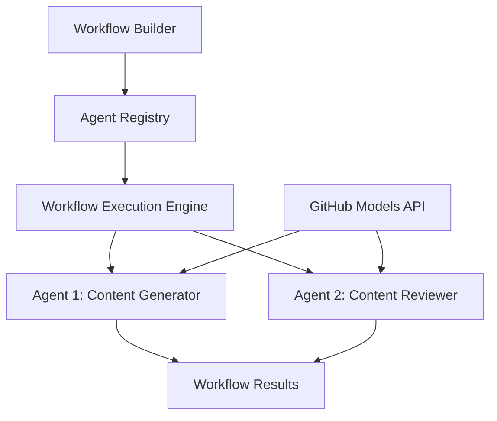

<!--
CO_OP_TRANSLATOR_METADATA:
{
  "original_hash": "034158688d0a45aae06dcbb21b0da5ae",
  "translation_date": "2025-11-11T12:58:10+00:00",
  "source_file": "08-multi-agent/code_samples/workflows-agent-framework/dotNET/01.dotnet-agent-framework-workflow-ghmodel-basic.md",
  "language_code": "ro"
}
-->
# 🔄 Fluxuri de lucru de bază cu modele GitHub (.NET)

## 📋 Tutorial de orchestrare a fluxurilor de lucru

Acest notebook demonstrează cum să construiești **fluxuri de lucru ale agenților** sofisticate utilizând Microsoft Agent Framework pentru .NET și modelele GitHub. Vei învăța să creezi procese de afaceri în mai mulți pași, unde agenții AI colaborează pentru a îndeplini sarcini complexe prin modele structurate de orchestrare.

## 🎯 Obiective de învățare

### 🏗️ **Fundamentele arhitecturii fluxurilor de lucru**
- **Workflow Builder**: Proiectează și orchestrează procese AI complexe în mai mulți pași
- **Coordonarea agenților**: Coordonează mai mulți agenți specializați în cadrul fluxurilor de lucru
- **Integrarea modelelor GitHub**: Utilizează serviciul de inferență AI al GitHub în fluxurile de lucru
- **Design vizual al fluxurilor de lucru**: Creează și vizualizează structuri de fluxuri de lucru pentru o mai bună înțelegere

### 🔄 **Modele de orchestrare a proceselor**
- **Procesare secvențială**: Leagă mai multe sarcini ale agenților într-o ordine logică
- **Gestionarea stării**: Menține contextul și fluxul de date între etapele fluxului de lucru
- **Gestionarea erorilor**: Implementează recuperarea robustă a erorilor și reziliența fluxului de lucru
- **Optimizarea performanței**: Proiectează fluxuri de lucru eficiente pentru operațiuni la scară enterprise

### 🏢 **Aplicații ale fluxurilor de lucru în mediul enterprise**
- **Automatizarea proceselor de afaceri**: Automatizează fluxuri de lucru organizaționale complexe
- **Pipeline de producție de conținut**: Fluxuri editoriale cu etape de revizuire și aprobare
- **Automatizarea serviciului pentru clienți**: Rezolvarea cererilor clienților în mai mulți pași
- **Fluxuri de lucru pentru procesarea datelor**: Fluxuri ETL cu transformare asistată de AI

## ⚙️ Cerințe preliminare și configurare

### 📦 **Pachete NuGet necesare**

Această demonstrație a fluxului de lucru utilizează mai multe pachete cheie .NET:

```xml
<!-- Core AI Framework -->
<PackageReference Include="Microsoft.Extensions.AI" Version="9.9.0" />

<!-- Agent Framework (Local Development) -->
<!-- Microsoft.Agents.AI.dll - Core agent abstractions -->
<!-- Microsoft.Agents.AI.OpenAI.dll - OpenAI/GitHub Models integration -->

<!-- Configuration and Environment -->
<PackageReference Include="DotNetEnv" Version="3.1.1" />
```

### 🔑 **Configurarea modelelor GitHub**

**Configurarea mediului (.env file):**
```env
GITHUB_TOKEN=your_github_personal_access_token
GITHUB_ENDPOINT=https://models.inference.ai.azure.com
GITHUB_MODEL_ID=gpt-4o-mini
```

**Acces la modelele GitHub:**
1. Înscrie-te pentru modelele GitHub (în prezent în preview)
2. Generează un token de acces personal cu permisiuni pentru accesul la modele
3. Configurează variabilele de mediu așa cum este prezentat mai sus

### 🏗️ **Prezentare generală a arhitecturii fluxului de lucru**



**Componente cheie:**
- **WorkflowBuilder**: Motorul principal de orchestrare pentru proiectarea fluxurilor de lucru
- **AIAgent**: Agenți specializați individuali cu capabilități specifice
- **GitHub Models Client**: Integrarea serviciului de inferență AI al modelelor GitHub
- **Execution Context**: Gestionează starea și fluxul de date între etapele fluxului de lucru

## 🎨 **Modele de design ale fluxurilor de lucru în mediul enterprise**

### 📝 **Flux de lucru pentru producția de conținut**
```
User Request → Content Generation → Quality Review → Final Output
```

### 🔍 **Pipeline de procesare a documentelor**
```
Document Input → Analysis → Extraction → Validation → Structured Output
```

### 💼 **Flux de lucru pentru business intelligence**
```
Data Collection → Processing → Analysis → Report Generation → Distribution
```

### 🤝 **Automatizarea serviciului pentru clienți**
```
Customer Inquiry → Classification → Processing → Response Generation → Follow-up
```

## 🏢 **Beneficii pentru mediul enterprise**

### 🎯 **Fiabilitate și scalabilitate**
- **Execuție deterministă**: Rezultate consistente și repetabile ale fluxurilor de lucru
- **Recuperarea erorilor**: Gestionarea grațioasă a eșecurilor în orice etapă a fluxului de lucru
- **Monitorizarea performanței**: Urmărirea metricilor de execuție și oportunităților de optimizare
- **Gestionarea resurselor**: Alocarea și utilizarea eficientă a resurselor modelului AI

### 🔒 **Securitate și conformitate**
- **Autentificare securizată**: Autentificare bazată pe token GitHub pentru acces API
- **Traiectorii de audit**: Logare completă a execuției fluxului de lucru și a punctelor de decizie
- **Controlul accesului**: Permisiuni granulare pentru execuția și monitorizarea fluxului de lucru
- **Confidențialitatea datelor**: Gestionarea securizată a informațiilor sensibile pe parcursul fluxurilor de lucru

### 📊 **Observabilitate și gestionare**
- **Design vizual al fluxurilor de lucru**: Reprezentare clară a fluxurilor de proces și a dependențelor
- **Monitorizarea execuției**: Urmărirea în timp real a progresului și performanței fluxului de lucru
- **Raportarea erorilor**: Analiză detaliată a erorilor și capabilități de depanare
- **Analiza performanței**: Metrici pentru optimizare și planificarea capacității

Hai să construim primul tău flux de lucru AI pregătit pentru mediul enterprise! 🚀

## 💻 Rularea codului

Implementarea completă este disponibilă în `01.dotnet-agent-framework-workflow-ghmodel-basic.cs`. Acest fișier demonstrează:

1. **Configurarea mediului** - Încărcarea acreditivelor modelelor GitHub din fișierul `.env`
2. **Configurarea clientului OpenAI** - Configurarea clientului pentru utilizarea endpoint-ului modelelor GitHub
3. **Crearea agenților** - Definirea agenților specializați (Front Desk și Concierge)
4. **Workflow Builder** - Crearea unui flux de lucru multi-agent cu procesare secvențială
5. **Execuția fluxului de lucru** - Rularea fluxului de lucru cu rezultate în streaming

### 🚀 Rularea exemplului

```bash
# Make the script executable (Unix/Linux/macOS)
chmod +x 01.dotnet-agent-framework-workflow-ghmodel-basic.cs

# Run the workflow
./01.dotnet-agent-framework-workflow-ghmodel-basic.cs
```

Sau pe Windows:
```powershell
dotnet run 01.dotnet-agent-framework-workflow-ghmodel-basic.cs
```

### 📝 Rezultatul așteptat

Fluxul de lucru va:
1. Accepta cererea ta pentru destinația de călătorie ("Aș dori să merg la Paris")
2. Agentul Front Desk oferă o recomandare inițială
3. Agentul Concierge revizuiește și rafinează recomandarea
4. Rezultatul final afișează fluxul complet al conversației

### 🔧 Personalizare

Poți personaliza fluxul de lucru prin:
- Modificarea instrucțiunilor agenților pentru a schimba comportamentul acestora
- Adăugarea mai multor agenți pentru a crea fluxuri de lucru complexe în mai mulți pași
- Schimbarea mesajului utilizatorului pentru a testa diferite scenarii
- Ajustarea conexiunilor fluxului de lucru pentru a crea modele diferite de execuție

---

<!-- CO-OP TRANSLATOR DISCLAIMER START -->
**Declinare de responsabilitate**:  
Acest document a fost tradus folosind serviciul de traducere AI [Co-op Translator](https://github.com/Azure/co-op-translator). Deși ne străduim să asigurăm acuratețea, vă rugăm să fiți conștienți că traducerile automate pot conține erori sau inexactități. Documentul original în limba sa maternă ar trebui considerat sursa autoritară. Pentru informații critice, se recomandă traducerea profesională realizată de un specialist uman. Nu ne asumăm responsabilitatea pentru eventualele neînțelegeri sau interpretări greșite care pot apărea din utilizarea acestei traduceri.
<!-- CO-OP TRANSLATOR DISCLAIMER END -->