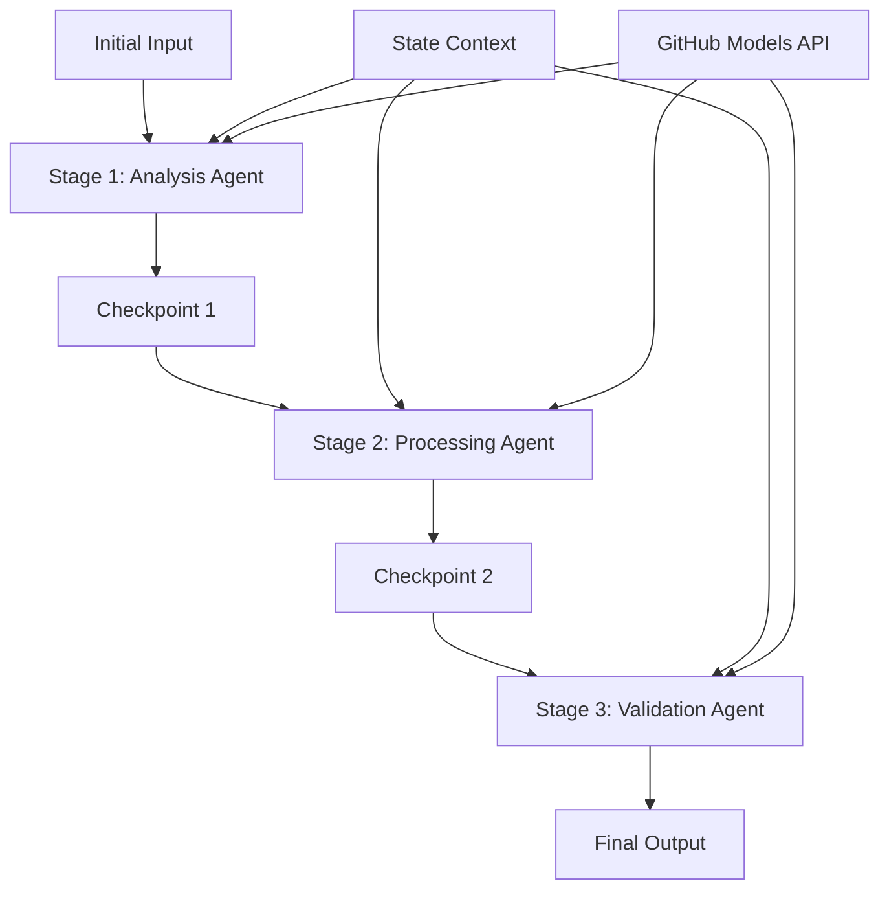

<!--
CO_OP_TRANSLATOR_METADATA:
{
  "original_hash": "1be9c8dcbd79a02d33d2c138684c1394",
  "translation_date": "2025-11-11T14:03:09+00:00",
  "source_file": "08-multi-agent/code_samples/workflows-agent-framework/dotNET/02.dotnet-agent-framework-workflow-ghmodel-sequential.md",
  "language_code": "ro"
}
-->
# ⏩ Fluxuri de lucru secvențiale cu modele GitHub (.NET)

## 📋 Tutorial avansat de procesare secvențială

Acest notebook demonstrează **modele de fluxuri de lucru secvențiale** utilizând Microsoft Agent Framework pentru .NET și modelele GitHub. Veți învăța cum să construiți conducte sofisticate de procesare pas cu pas, în care agenții execută într-o ordine specifică, fiecare etapă bazându-se pe rezultatele etapei anterioare.

## 🎯 Obiective de învățare

### 🔄 **Arhitectura procesării secvențiale**
- **Design de flux de lucru liniar**: Creați conducte de procesare pas cu pas cu dependențe clare
- **Gestionarea stării**: Mențineți contextul și fluxul de date între etapele fluxului de lucru secvențial
- **Integrarea modelelor GitHub**: Utilizați modelele AI ale GitHub în fluxuri de lucru multi-etapă .NET
- **Modele de conducte pentru întreprinderi**: Construiți sisteme de procesare secvențială pregătite pentru producție

### 🏗️ **Modele avansate de procesare secvențială**
- **Procesare etapă-gate**: Implementați puncte de validare între etapele fluxului de lucru
- **Păstrarea contextului**: Mențineți starea și cunoștințele acumulate pe parcursul tuturor etapelor
- **Propagarea erorilor**: Gestionați eșecurile cu grație în lanțurile de procesare secvențială
- **Optimizarea performanței**: Execuție secvențială eficientă cu costuri minime

### 🏢 **Aplicații secvențiale pentru întreprinderi**
- **Conductă de procesare a documentelor**: Analiză, transformare și validare multi-etapă a documentelor
- **Fluxuri de lucru pentru asigurarea calității**: Revizuire, validare și procese de aprobare secvențiale
- **Conductă de producție de conținut**: Cercetare → Scriere → Editare → Revizuire → Publicare
- **Automatizarea proceselor de afaceri**: Fluxuri de lucru multi-etapă cu dependențe clare între etape

## ⚙️ Cerințe preliminare și configurare

### 📦 **Pachete NuGet necesare**

Pachete esențiale pentru fluxuri de lucru secvențiale .NET:

```xml
<!-- Core AI Framework -->
<PackageReference Include="Microsoft.Extensions.AI" Version="9.9.0" />

<!-- Client Model Abstractions -->
<PackageReference Include="System.ClientModel" Version="1.6.1.0" />

<!-- Azure Identity and Async LINQ Support -->
<PackageReference Include="Azure.Identity" Version="1.15.0" />
<PackageReference Include="System.Linq.Async" Version="6.0.3" />

<!-- Local Agent Framework References -->
<!-- Microsoft.Agents.AI.dll - Core agent abstractions -->
<!-- Microsoft.Agents.AI.OpenAI.dll - GitHub Models integration -->
```

### 🔑 **Configurarea modelelor GitHub**

**Configurarea mediului (.env file):**
```env
GITHUB_TOKEN=your_github_personal_access_token
GITHUB_ENDPOINT=https://models.inference.ai.azure.com
GITHUB_MODEL_ID=gpt-4o-mini
```

**Gestionarea configurației:**
```csharp
// Load environment variables securely
Env.Load("../../../.env");
var githubToken = Environment.GetEnvironmentVariable("GITHUB_TOKEN");
var githubEndpoint = Environment.GetEnvironmentVariable("GITHUB_ENDPOINT");
var modelId = Environment.GetEnvironmentVariable("GITHUB_MODEL_ID");
```

### 🏗️ **Arhitectura fluxului de lucru secvențial**



**Componente cheie:**
- **Agenți secvențiali**: Agenți specializați pentru fiecare etapă de procesare
- **Contextul stării**: Menține datele acumulate și deciziile între etape
- **Puncte de control**: Puncte de validare între etape pentru a asigura calitatea și consistența
- **Clientul modelelor GitHub**: Acces consistent la modelele AI pe parcursul tuturor etapelor fluxului de lucru

## 🎨 **Modele de design pentru fluxuri de lucru secvențiale**

### 📝 **Conductă de procesare a documentelor**
```
Raw Document → Content Extraction → Analysis → Validation → Structured Output
```

### 🎯 **Flux de lucru pentru crearea de conținut**
```
Brief/Requirements → Research → Content Creation → Review → Final Polish
```

### 🔍 **Conductă de asigurare a calității**
```
Initial Review → Technical Validation → Compliance Check → Final Approval
```

### 💼 **Flux de lucru pentru inteligența de afaceri**
```
Data Collection → Processing → Analysis → Report Generation → Distribution
```

## 🏢 **Beneficii secvențiale pentru întreprinderi**

### 🎯 **Fiabilitate și calitate**
- **Procesare deterministă**: Rezultate consistente și repetabile prin etape structurate
- **Porți de calitate**: Puncte de validare asigură calitatea la fiecare etapă
- **Izolarea erorilor**: Problemele dintr-o etapă nu se propagă în etapele ulterioare
- **Urme de audit**: Urmărirea completă a deciziilor și transformărilor la fiecare etapă

### 📈 **Scalabilitate și performanță**
- **Design modular**: Fiecare etapă poate fi optimizată independent
- **Gestionarea resurselor**: Alocare eficientă a resurselor modelului AI între etape
- **Optimizarea stării**: Transfer minim de stare între etape pentru performanță optimă
- **Grupuri de etape paralele**: Mai multe fluxuri de lucru secvențiale pot rula în paralel

### 🔒 **Securitate și conformitate**
- **Securitate la nivel de etapă**: Politici de securitate diferite pentru etapele de procesare
- **Validarea datelor**: Asigurarea integrității și conformității datelor la fiecare punct de control
- **Controlul accesului**: Permisiuni granulare pentru diferite etape ale fluxului de lucru
- **Conformitate reglementară**: Respectarea cerințelor reglementare prin procesare structurată

### 📊 **Monitorizare și analiză**
- **Metrice la nivel de etapă**: Monitorizarea performanței pentru fiecare etapă a fluxului de lucru
- **Identificarea blocajelor**: Identificarea și optimizarea etapelor lente
- **Metrice de calitate**: Urmărirea calității și a ratelor de succes la fiecare etapă
- **Optimizarea procesului**: Îmbunătățire continuă bazată pe analize la nivel de etapă

Să construim conducte robuste de procesare AI secvențială! 🚀

## 💻 Rularea codului

Implementarea completă este disponibilă în `02.dotnet-agent-framework-workflow-ghmodel-sequential.cs`. Acest fișier demonstrează un **flux de lucru de analiză a mobilierului în trei etape**:

1. **Etapa 1 - Agent de vânzări**: Analizează imaginile mobilierului și oferă sugestii de achiziție
2. **Etapa 2 - Agent de prețuri**: Oferă detalii despre prețuri și opțiuni de buget
3. **Etapa 3 - Agent de ofertă**: Generează un document profesional de ofertă în format Markdown

### 🏗️ **Arhitectura fluxului de lucru**

```
Image Input → Sales Analysis → Price Estimation → Quote Generation → Final Output
```

Fiecare agent:
- Primește rezultatul etapei anterioare ca context
- Construiește pe baza analizei anterioare cu expertiză specializată
- Menține continuitatea fluxului de lucru prin gestionarea stării

### 🚀 Rularea exemplului

**Cerințe preliminare:**
- Plasați o imagine de mobilier la `../imgs/home.png` (sau actualizați variabila `imgPath`)
- Configurați fișierul `.env` cu acreditivele modelelor GitHub

```bash
# Make the script executable (Unix/Linux/macOS)
chmod +x 02.dotnet-agent-framework-workflow-ghmodel-sequential.cs

# Run the sequential workflow
./02.dotnet-agent-framework-workflow-ghmodel-sequential.cs
```

Sau pe Windows:
```powershell
dotnet run 02.dotnet-agent-framework-workflow-ghmodel-sequential.cs
```

### 📝 Rezultatul așteptat

Fluxul de lucru va:
1. **Agent de vânzări**: Identifica articolele de mobilier din imagine și va oferi recomandări
2. **Agent de prețuri**: Adăuga o analiză detaliată a prețurilor cu niveluri de buget și recomandări de cumpărături
3. **Agent de ofertă**: Genera un document de ofertă formatat cu toate informațiile sintetizate

Rezultatul final va fi o ofertă profesională completă pentru mobilier, bazată pe analiza imaginii.

### 🔧 Opțiuni de personalizare

**Modificați comportamentul agentului:**
```csharp
// Adjust agent instructions to change their focus
const string SalesAgentInstructions = "Your custom instructions...";
```

**Schimbați fluxul secvențial:**
```csharp
// Add or reorder workflow stages
var workflow = new WorkflowBuilder(salesagent)
    .AddEdge(salesagent, priceagent)
    .AddEdge(priceagent, quoteagent)
    .AddEdge(quoteagent, newAgent)  // Add another stage
    .Build();
```

**Utilizați un alt input:**
```csharp
// Process text instead of images
ChatMessage userMessage = new ChatMessage(ChatRole.User, [
    new TextContent("Analyze pricing for a modern living room set")
]);
```

### 🎯 Aplicații reale

Acest model secvențial este ideal pentru:
- **E-commerce**: Analiza produselor → Prețuri → Generarea ofertelor
- **Imobiliare**: Analiza proprietății → Evaluare → Crearea listării
- **Asigurări**: Analiza cererilor → Evaluare → Generarea ofertelor
- **Crearea de conținut**: Cercetare → Scriere → Editare → Publicare

### 🔍 Înțelegerea fluxului de stare

Fiecare agent din secvență primește:
- **Inputul original**: Mesajul inițial al utilizatorului (imagine + text)
- **Rezultatele agenților anteriori**: Toate răspunsurile agenților anteriori din istoricul conversației
- **Contextul acumulat**: Starea completă menținută pe parcursul fluxului de lucru

Acest lucru permite procesarea multi-etapă sofisticată, în care fiecare agent se bazează pe contextul cuprinzător de la toate etapele anterioare.

---

<!-- CO-OP TRANSLATOR DISCLAIMER START -->
**Declinare de responsabilitate**:  
Acest document a fost tradus folosind serviciul de traducere AI [Co-op Translator](https://github.com/Azure/co-op-translator). Deși ne străduim să asigurăm acuratețea, vă rugăm să fiți conștienți că traducerile automate pot conține erori sau inexactități. Documentul original în limba sa maternă ar trebui considerat sursa autoritară. Pentru informații critice, se recomandă traducerea profesională realizată de un specialist uman. Nu ne asumăm responsabilitatea pentru eventualele neînțelegeri sau interpretări greșite care pot apărea din utilizarea acestei traduceri.
<!-- CO-OP TRANSLATOR DISCLAIMER END -->