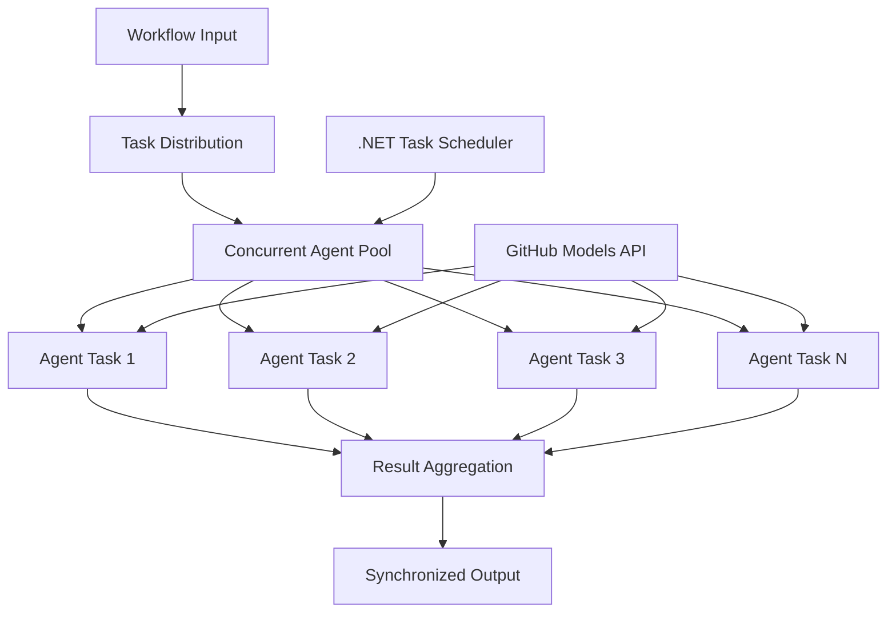

<!--
CO_OP_TRANSLATOR_METADATA:
{
  "original_hash": "b9c6e32c9b5f2fed20b6916984440d88",
  "translation_date": "2025-11-11T13:30:43+00:00",
  "source_file": "08-multi-agent/code_samples/workflows-agent-framework/dotNET/03.dotnet-agent-framework-workflow-ghmodel-concurrent.md",
  "language_code": "ro"
}
-->
# ⚡ Fluxuri de lucru concurente cu modele GitHub (.NET)

## 📋 Tutorial pentru procesare paralelă de înaltă performanță

Acest notebook demonstrează **modele de fluxuri de lucru concurente** utilizând Microsoft Agent Framework pentru .NET și modelele GitHub. Veți învăța cum să construiți fluxuri de lucru de procesare paralelă de înaltă performanță care maximizează capacitatea prin executarea simultană a mai multor agenți AI, menținând în același timp coordonarea și consistența datelor.

## 🎯 Obiective de învățare

### 🚀 **Fundamentele procesării concurente**
- **Executarea paralelă a agenților**: Rulați mai mulți agenți AI simultan pentru performanță maximă
- **Modele Async/Await**: Utilizați modelul de programare asincron al .NET pentru concurență eficientă
- **Integrarea modelelor GitHub**: Coordonați apelurile concurente către serviciul de inferență AI al GitHub
- **Gestionarea resurselor**: Administrați eficient resursele modelului AI în operațiuni concurente

### 🏗️ **Arhitectura avansată de concurență**
- **Paralelism bazat pe sarcini**: Utilizați Task Parallel Library din .NET pentru execuție concurentă optimă
- **Modele de sincronizare**: Coordonați agenții concurenți evitând condițiile de competiție
- **Echilibrarea sarcinilor**: Distribuiți eficient munca pe capacitatea disponibilă de procesare concurentă
- **Toleranță la erori**: Gestionați eșecurile individuale ale agenților fără a opri întregul flux de lucru

### 🏢 **Aplicații concurente pentru întreprinderi**
- **Procesarea documentelor de mare volum**: Procesați mai multe documente simultan
- **Analiza conținutului în timp real**: Analiza concurentă a fluxurilor de date primite
- **Optimizarea procesării în loturi**: Maximizați capacitatea pentru operațiuni de procesare a datelor la scară largă
- **Analiza multi-modală**: Procesarea paralelă a diferitelor tipuri și formate de conținut

## ⚙️ Cerințe preliminare și configurare

### 📦 **Pachete NuGet necesare**

Pachete esențiale pentru fluxuri de lucru concurente de înaltă performanță:

```xml
<!-- Core AI Framework with Async Support -->
<PackageReference Include="Microsoft.Extensions.AI" Version="9.9.0" />

<!-- Client Model Abstractions for API Communication -->
<PackageReference Include="System.ClientModel" Version="1.6.1.0" />

<!-- Azure Identity and Async LINQ for Advanced Operations -->
<PackageReference Include="Azure.Identity" Version="1.15.0" />
<PackageReference Include="System.Linq.Async" Version="6.0.3" />

<!-- Local Agent Framework References -->
<!-- Microsoft.Agents.AI.dll - Core agent abstractions with async support -->
<!-- Microsoft.Agents.AI.OpenAI.dll - GitHub Models integration with concurrency -->
```

### 🔑 **Configurarea modelelor GitHub**

**Configurarea mediului (.env file):**
```env
GITHUB_TOKEN=your_github_personal_access_token
GITHUB_ENDPOINT=https://models.inference.ai.azure.com
GITHUB_MODEL_ID=gpt-4o-mini
```

**Considerații pentru procesarea concurentă:**
```csharp
// Configure for concurrent operations
var clientOptions = new OpenAIClientOptions()
{
    Endpoint = new Uri(githubEndpoint),
    // Configure connection pooling for concurrent requests
    NetworkTimeout = TimeSpan.FromMinutes(5)
};
```

### 🏗️ **Arhitectura fluxului de lucru concurent**



**Componente cheie:**
- **Task Parallel Library**: Suportul încorporat al .NET pentru operațiuni concurente
- **Agent Pool**: Instanțe multiple de agenți pentru procesare paralelă
- **Agregarea rezultatelor**: Coordonarea și combinarea rezultatelor agenților concurenți
- **Puncte de sincronizare**: Asigurarea consistenței datelor în operațiuni concurente

## 🎨 **Modele de design pentru fluxuri de lucru concurente**

### 🔍 **Cercetare și analiză paralelă**
```
Research Topic → Concurrent Research Agents → Result Synthesis → Final Report
```

### 📊 **Procesarea datelor din surse multiple**
```
Data Sources → Parallel Processing Agents → Data Integration → Unified Output
```

### 🎭 **Pipeline de generare a conținutului**
```
Content Requirements → Concurrent Content Generators → Quality Review → Final Content
```

### 🔄 **Procesare Fan-Out/Fan-In**
```
Single Input → Multiple Concurrent Processors → Result Aggregation → Single Output
```

## 🏢 **Beneficii de performanță pentru întreprinderi**

### ⚡ **Capacitate și scalabilitate**
- **Scalare liniară a performanței**: Adăugați mai mulți agenți concurenți pentru a crește capacitatea
- **Utilizarea resurselor**: Eficiență maximă a capacității modelului AI disponibil
- **Reducerea timpului de procesare**: Reducere semnificativă a timpului prin execuție paralelă
- **Scalare elastică**: Ajustați dinamic numărul de agenți concurenți în funcție de volumul de muncă

### 🛡️ **Fiabilitate și reziliență**
- **Izolarea erorilor**: Eșecurile individuale ale agenților nu afectează alte operațiuni concurente
- **Degradare grațioasă**: Sistemul continuă să funcționeze cu capacitate redusă a agenților
- **Recuperarea erorilor**: Mecanisme automate de retry pentru operațiuni concurente eșuate
- **Distribuția sarcinilor**: Distribuție uniformă a muncii între agenții disponibili

### 📊 **Monitorizarea performanței**
- **Metrice de execuție concurentă**: Urmăriți performanța tuturor operațiunilor paralele
- **Analiza utilizării resurselor**: Monitorizați utilizarea CPU, memoriei și rețelei
- **Analiza capacității**: Măsurați câștigurile de eficiență din procesarea concurentă
- **Detectarea blocajelor**: Identificați și rezolvați constrângerile de performanță

### 🔧 **Dezvoltare și operațiuni**
- **Model de programare asincron**: Utilizați modelele mature async/await ale .NET
- **Coordonarea sarcinilor**: Capacități încorporate de gestionare și coordonare a sarcinilor
- **Gestionarea excepțiilor**: Gestionare cuprinzătoare a erorilor pentru operațiuni concurente
- **Suport pentru depanare**: Instrumente de depanare Visual Studio pentru fluxuri de lucru concurente

Să construim fluxuri de lucru AI concurente de înaltă performanță cu .NET! 🚀

## 💻 Rularea codului

Implementarea completă este disponibilă în `03.dotnet-agent-framework-workflow-ghmodel-concurrent.cs`. Acest fișier demonstrează un **flux de lucru concurent Fan-Out/Fan-In** pentru planificarea călătoriilor:

### 🏗️ **Arhitectura fluxului de lucru**

```
User Request → ConcurrentStartExecutor → [Researcher Agent || Planner Agent] → ConcurrentAggregationExecutor → Final Output
```

**Componente cheie:**

1. **ConcurrentStartExecutor**: Transmite cererea utilizatorului către toți agenții simultan
2. **Researcher Agent**: Analizează destinațiile și atracțiile în mod concurent
3. **Planner Agent**: Creează planuri detaliate de călătorie în mod concurent
4. **ConcurrentAggregationExecutor**: Colectează și combină rezultatele de la ambii agenți

### 🎯 **Modelul Fan-Out/Fan-In**

Acest flux de lucru demonstrează modelul clasic **Fan-Out/Fan-In**:
- **Fan-Out**: Un mesaj de intrare este transmis simultan către mai mulți agenți
- **Procesare concurentă**: Mai mulți agenți lucrează în paralel la aceeași sarcină
- **Fan-In**: Rezultatele de la toți agenții sunt colectate și agregate într-un singur rezultat

### 🚀 Rularea exemplului

```bash
# Make the script executable (Unix/Linux/macOS)
chmod +x 03.dotnet-agent-framework-workflow-ghmodel-concurrent.cs

# Run the concurrent workflow
./03.dotnet-agent-framework-workflow-ghmodel-concurrent.cs
```

Sau pe Windows:
```powershell
dotnet run 03.dotnet-agent-framework-workflow-ghmodel-concurrent.cs
```

### 📝 Rezultatul așteptat

Fluxul de lucru va:
1. **Transmite cererea**: Trimite "Planifică o călătorie la Seattle în decembrie" către ambii agenți
2. **Procesare concurentă**: Ambii agenți lucrează simultan:
   - Cercetătorul identifică atracțiile și detaliile
   - Planificatorul creează itinerariul și logistica
3. **Agregare**: Combină ambele răspunsuri într-un rezultat cuprinzător
4. **Afișează rezultatele**: Prezintă planul de călătorie combinat cu toate informațiile

### 🔧 Opțiuni de personalizare

**Adăugați mai mulți agenți concurenți:**
```csharp
// Create additional specialized agents
AIAgent budgetAgent = openAIClient.GetChatClient(github_model_id).CreateAIAgent(
    name: "Budget-Agent", instructions: "Calculate travel costs...");

// Add to fan-out
var workflow = new WorkflowBuilder(startExecutor)
    .AddFanOutEdge(startExecutor, targets: [researcherAgent, plannerAgent, budgetAgent])
    .AddFanInEdge(aggregationExecutor, sources: [researcherAgent, plannerAgent, budgetAgent])
    .WithOutputFrom(aggregationExecutor)
    .Build();

// Update aggregation count
if (this._messages.Count == 3) { ... }
```

**Modificați instrucțiunile agenților:**
```csharp
const string ResearcherAgentInstructions = "Your custom instructions for research...";
const string PlanAgentInstructions = "Your custom instructions for planning...";
```

**Schimbați sarcina:**
```csharp
StreamingRun run = await InProcessExecution.StreamAsync(
    workflow, 
    "Plan a European vacation for 2 weeks in summer"
);
```

### 🎯 Aplicații reale

Acest model concurent este ideal pentru:
- **Crearea de conținut**: Mai mulți autori creează secțiuni diferite simultan
- **Revizuirea codului**: Mai mulți recenzori analizează codul din perspective diferite
- **Cercetare de piață**: Analiza paralelă a diferitelor segmente de piață
- **Procesarea documentelor**: Extracție, analiză și validare concurentă
- **Analiza multi-perspectivă**: Obținerea de puncte de vedere diverse asupra aceleiași intrări

### 🔍 Înțelegerea executorilor personalizați

**ConcurrentStartExecutor:**
- Implementează `IMessageHandler<string>` pentru a accepta intrări de tip string
- Transmite mesaje către toți agenții conectați
- Trimite `TurnToken` pentru a declanșa procesarea concurentă

**ConcurrentAggregationExecutor:**
- Implementează `IMessageHandler<ChatMessage>` pentru a primi răspunsurile agenților
- Colectează mesaje într-un mod sigur pentru thread-uri
- Agregă atunci când toate răspunsurile așteptate sosesc
- Oferă rezultatul final utilizând `context.YieldOutputAsync()`

### ⚡ Beneficii de performanță

**Concurent vs Secvențial:**
- Secvențial: Agent1 (30s) → Agent2 (30s) = **60 secunde total**
- Concurent: Agent1 (30s) || Agent2 (30s) = **30 secunde total**

**Îmbunătățirea capacității**: De până la N× mai rapid pentru N agenți concurenți (în funcție de volumul de muncă și resurse)

### 🛡️ Gestionarea erorilor

Fluxul de lucru gestionează eșecurile individuale ale agenților grațios:
- Dacă un agent eșuează, ceilalți continuă procesarea
- Agregatorul poate implementa logica de timeout
- Rezultatele parțiale pot fi returnate dacă este necesar

### 📊 Funcționalități avansate

**Număr dinamic de agenți:**
Modificați logica de agregare pentru a suporta un număr variabil de agenți:

```csharp
private int _expectedAgentCount;
private readonly List<ChatMessage> _messages = [];

public async ValueTask HandleAsync(ChatMessage message, IWorkflowContext context)
{
    this._messages.Add(message);
    if (this._messages.Count == _expectedAgentCount)
    {
        // Process aggregation
    }
}
```

Acest model de flux de lucru concurent este esențial pentru construirea sistemelor AI de înaltă performanță și scalabile!

---

<!-- CO-OP TRANSLATOR DISCLAIMER START -->
**Declinare de responsabilitate**:  
Acest document a fost tradus folosind serviciul de traducere AI [Co-op Translator](https://github.com/Azure/co-op-translator). Deși ne străduim să asigurăm acuratețea, vă rugăm să fiți conștienți că traducerile automate pot conține erori sau inexactități. Documentul original în limba sa maternă ar trebui considerat sursa autoritară. Pentru informații critice, se recomandă traducerea profesională realizată de un specialist uman. Nu ne asumăm responsabilitatea pentru eventualele neînțelegeri sau interpretări greșite care pot apărea din utilizarea acestei traduceri.
<!-- CO-OP TRANSLATOR DISCLAIMER END -->