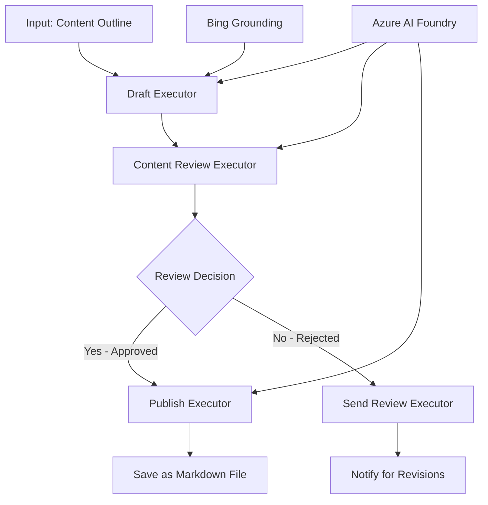

<!--
CO_OP_TRANSLATOR_METADATA:
{
  "original_hash": "8abd335151cee553293b637ee3d80d10",
  "translation_date": "2025-11-11T12:29:31+00:00",
  "source_file": "08-multi-agent/code_samples/workflows-agent-framework/dotNET/04.dotnet-agent-framework-workflow-aifoundry-condition.md",
  "language_code": "ro"
}
-->
# 🔀 Fluxuri de lucru condiționale cu Azure AI Foundry (.NET)

## 📋 Tutorial pentru fluxuri de lucru bazate pe decizii inteligente

Acest notebook demonstrează **modele de fluxuri de lucru condiționale** utilizând Azure AI Foundry și Microsoft Agent Framework pentru .NET. Veți învăța cum să construiți fluxuri de lucru sofisticate, bazate pe decizii, care direcționează inteligent procesarea pe baza analizei AI, regulilor de afaceri și condițiilor dinamice pentru automatizare la nivel de întreprindere.

## 🎯 Obiective de învățare

### 🧠 **Arhitectura deciziilor inteligente**
- **Implementarea logicii condiționale**: Construiți arbori de decizie complexi cu multiple puncte de ramificare
- **Direcționare bazată pe AI**: Utilizați modelele Azure AI Foundry pentru a lua decizii inteligente de direcționare
- **Adaptarea dinamică a fluxului de lucru**: Modificați comportamentul fluxului de lucru pe baza analizei și condițiilor în timp real
- **Integrarea regulilor de afaceri**: Încorporați logica de afaceri și cerințele de conformitate în fluxurile de lucru

### 🔀 **Modele avansate de condiționare**
- **Luarea deciziilor pe baza mai multor criterii**: Evaluați mai mulți factori pentru deciziile de direcționare
- **Procesare conștientă de context**: Luați decizii pe baza contextului acumulat și istoricului fluxului de lucru
- **Modificarea adaptivă a fluxului de lucru**: Ajustați dinamic căile de procesare pe baza condițiilor în timp real
- **Integrarea motorului de reguli**: Implementați motoare sofisticate de reguli de afaceri în fluxurile de lucru

### 🏢 **Aplicații condiționale pentru întreprinderi**
- **Clasificarea și direcționarea documentelor**: Clasificați și direcționați automat documentele către fluxurile de lucru corespunzătoare
- **Trierea serviciului pentru clienți**: Direcționarea inteligentă a solicitărilor clienților către echipe specializate
- **Procesarea conformității și riscurilor**: Aplicați diferite procese de validare și revizuire pe baza evaluării riscurilor
- **Fluxuri de lucru pentru asigurarea calității**: Direcționați conținutul prin procesele de revizuire corespunzătoare pe baza metricilor de calitate

## ⚙️ Cerințe preliminare și configurare

### 📦 **Pachete NuGet necesare**

Pachete avansate pentru procesarea fluxurilor de lucru condiționale:

```xml
<!-- Core AI Framework -->
<PackageReference Include="Microsoft.Extensions.AI" Version="9.9.0" />

<!-- Azure AI Agents with Persistent State -->
<PackageReference Include="Azure.AI.Agents.Persistent" Version="1.2.0-beta.5" />

<!-- Azure Identity and Utilities -->
<PackageReference Include="Azure.Identity" Version="1.15.0" />
<PackageReference Include="System.Linq.Async" Version="6.0.3" />
<PackageReference Include="DotNetEnv" Version="3.1.1" />

<!-- Local Workflow Framework References -->
<!-- Microsoft.Agents.Workflows.dll - Advanced workflow orchestration -->
<!-- Microsoft.Agents.AI.AzureAI.dll - Azure AI Foundry integration -->
<!-- Microsoft.Agents.AI.dll - Core agent abstractions -->
```

### 🔑 **Configurarea Azure AI Foundry**

**Resurse Azure necesare:**
- Spațiu de lucru Azure AI Foundry cu modele de procesare condițională
- Abonament Azure cu cote de calcul și permisiuni adecvate
- Modele AI implementate pentru luarea deciziilor și analiza conținutului
- (Opțional) Conexiune Bing Search API pentru capacități de fundamentare

**Configurarea mediului (.env file):**
```env
# Azure AI Foundry Configuration
AZURE_AI_PROJECT_ENDPOINT=https://your-project.cognitiveservices.azure.com/
BING_CONNECTION_ID=your-bing-connection-id
```

**Configurarea autentificării:**
```csharp
// Azure CLI or Managed Identity authentication
using Azure.Identity;
var credential = new AzureCliCredential();

// Load environment configuration
DotNetEnv.Env.Load("../../../.env");
```

### 🏗️ **Arhitectura fluxului de lucru condițional**



**Componente cheie:**
- **Draft Executor**: Agent AI care creează schițe inițiale de conținut din contururi
- **Content Review Executor**: Agent AI care evaluează calitatea și conformitatea schiței
- **Conditional Routing**: Logică de decizie care direcționează pe baza rezultatelor revizuirii
- **Căi de publicare/revizuire**: Căi de procesare separate pentru conținutul aprobat vs respins
- **Managementul stării**: Menține contextul conținutului și revizuirii pe parcursul fluxului de lucru

## 🎨 **Modele de design pentru fluxuri de lucru condiționale**

### 📋 **Producția de conținut cu porți de calitate**
```
Outline → Draft Creation → Quality Review → {Approve: Publish | Reject: Revise}
```

### 🎯 **Procesarea documentelor bazată pe risc**
```
Document → Risk Assessment → {Low: Standard | High: Enhanced Review}
```

### 🔍 **Direcționarea inteligentă a serviciului pentru clienți**
```
Customer Query → Analysis → {Simple: FAQ Bot | Complex: Human Agent}
```

### 💼 **Fluxuri de lucru bazate pe conformitate**
```
Content → Compliance Check → {Pass: Publish | Fail: Legal Review}
```

## 🏢 **Beneficii condiționale pentru întreprinderi**

### 🎯 **Automatizare inteligentă**
- **Luarea deciziilor inteligente**: Decizii de direcționare bazate pe analiza conținutului și context
- **Procesare adaptivă**: Fluxuri de lucru care se ajustează automat pe baza condițiilor în schimbare
- **Aplicarea regulilor de afaceri**: Aplicarea automată a logicii complexe de afaceri și a politicilor
- **Direcționare conștientă de context**: Decizii bazate pe istoricul complet al fluxului de lucru și contextul acumulat

### 📈 **Excelență operațională**
- **Alocarea optimizată a resurselor**: Direcționați munca către specialiștii și procesele cele mai potrivite
- **Reducerea intervenției manuale**: Luarea automată a deciziilor minimizează necesitatea direcționării umane
- **Timpuri de rezolvare mai rapide**: Direcționare directă către expertiza și capacitățile de procesare adecvate
- **Aplicare consistentă**: Aplicarea uniformă a regulilor de afaceri și a criteriilor de decizie

### 🛡️ **Managementul riscurilor și conformității**
- **Evaluarea automată a riscurilor**: Evaluare bazată pe AI a nivelurilor de risc ale conținutului și situației
- **Aplicarea conformității**: Direcționare automată prin procesele de reglementare necesare
- **Aplicarea protocoalelor de securitate**: Măsuri de securitate îmbunătățite aplicate pe baza evaluării riscurilor
- **Menținerea traseului de audit**: Documentație completă a deciziilor de direcționare și a raționamentului

### 📊 **Analiză și îmbunătățire continuă**
- **Analiza deciziilor**: Urmărirea eficienței și acurateței deciziilor de direcționare
- **Recunoașterea modelelor**: Identificarea tendințelor și modelelor în deciziile de direcționare de-a lungul timpului
- **Optimizarea performanței**: Îmbunătățirea continuă a criteriilor de decizie și a eficienței direcționării
- **Inteligența de afaceri**: Perspective asupra caracteristicilor conținutului și cerințelor de procesare

### 🔧 **Excelență tehnică**
- **Management persistent al stării**: Menținerea stării complexe pe parcursul execuției fluxului de lucru
- **Arhitectură scalabilă**: Gestionarea cerințelor de procesare condițională de volum mare
- **Capacități de integrare**: Integrare fără probleme cu sistemele și procesele existente de afaceri
- **Monitorizare și observabilitate**: Urmărire cuprinzătoare a performanței fluxului de lucru și a deciziilor

Să construim fluxuri de lucru inteligente, bazate pe decizii, pentru întreprinderi cu .NET! 🚀

## 💻 Rularea codului

Implementarea completă este disponibilă în `04.dotnet-agent-framework-workflow-aifoundry-condition.cs`. Aceasta demonstrează un **flux de lucru pentru producția de conținut cu porți de calitate**:

### 🏗️ **Arhitectura fluxului de lucru**

```
Content Outline → Draft Creation → Quality Review → Conditional Routing:
                                                      ├─ Approved (>200 words) → Publish
                                                      └─ Rejected (<200 words) → Review Notification
```

**Agenți în fluxul de lucru:**
1. **Evangelist Agent**: Creează schițe de tutoriale din contururi cu fundamentare Bing
2. **Content Reviewer Agent**: Evaluează calitatea schiței (număr de cuvinte, completitudine)
3. **Publisher Agent**: Salvează conținutul aprobat ca fișiere Markdown cu marcaj temporal

**Executori personalizați:**
1. **DraftExecutor**: Orchestrază crearea schiței
2. **ContentReviewExecutor**: Realizează evaluarea calității
3. **PublishExecutor**: Gestionează publicarea conținutului aprobat
4. **SendReviewExecutor**: Gestionează notificările pentru conținutul respins

### 🚀 Rularea exemplului

**Cerințe preliminare:**
- Spațiu de lucru Azure AI Foundry configurat
- Autentificare Azure CLI (`az login`)
- (Opțional) Conexiune Bing Search pentru fundamentare

```bash
# Make the script executable (Unix/Linux/macOS)
chmod +x 04.dotnet-agent-framework-workflow-aifoundry-condition.cs

# Run the conditional workflow
./04.dotnet-agent-framework-workflow-aifoundry-condition.cs
```

Sau pe Windows:
```powershell
dotnet run 04.dotnet-agent-framework-workflow-aifoundry-condition.cs
```

### 📝 Rezultatul așteptat

Fluxul de lucru va:
1. **Crea agenți**: Inițializa trei agenți specializați Azure AI Foundry
2. **Genera schița**: Agentul Evangelist creează schița tutorialului din contur
3. **Revizuirea conținutului**: Content Reviewer evaluează calitatea schiței
4. **Direcționare condițională**:
   - **Dacă este aprobat (>200 cuvinte)**: Executorul de publicare salvează ca fișier Markdown
   - **Dacă este respins (<200 cuvinte)**: Trimite notificare de revizuire
5. **Afișează rezultatele**: Arată rezultatul final al fluxului de lucru

### 🔧 Opțiuni de personalizare

**Modificați criteriile de revizuire:**
```csharp
const string ContentReviewerInstructions = @"
You are a content reviewer...
1. Check if content is more than 500 words (instead of 200)
2. Verify technical accuracy
3. Ensure proper formatting
...";
```

**Adăugați mai multe căi condiționale:**
```csharp
var workflow = new WorkflowBuilder(draftExecutor)
    .AddEdge(draftExecutor, contentReviewerExecutor)
    .AddEdge(contentReviewerExecutor, publishExecutor, condition: GetCondition("Excellent"))
    .AddEdge(contentReviewerExecutor, editExecutor, condition: GetCondition("Good"))
    .AddEdge(contentReviewerExecutor, sendReviewerExecutor, condition: GetCondition("Poor"))
    .Build();
```

**Schimbați cerințele de conținut:**
```csharp
string OUTLINE_Content = @"
# Your Custom Topic
## Section 1
https://your-reference-url
## Section 2
...
";
```

### 🎯 Aplicații reale

Acest model de flux de lucru condițional este ideal pentru:
- **Sisteme de gestionare a conținutului**: Fluxuri editoriale automate cu porți de calitate
- **Procesarea documentelor**: Direcționați documentele pe baza clasificării și conformității
- **Suport pentru clienți**: Direcționarea inteligentă a tichetelor pe baza complexității și urgenței
- **Revizuire legală**: Direcționați contractele pe baza evaluării riscurilor și valorii
- **Procese HR**: Direcționați aplicațiile prin fluxuri de screening corespunzătoare

### 🔍 Înțelegerea logicii condiționale

**Funcția de condiție:**
```csharp
public Func<object?, bool> GetCondition(string expectedResult) =>
    reviewResult => reviewResult is ReviewResult review && review.Result == expectedResult;
```

Această funcție creează un predicat care:
1. Verifică dacă rezultatul este de tip `ReviewResult`
2. Compară proprietatea `Result` cu valoarea așteptată
3. Returnează true/false pentru a determina direcționarea

**Margini ale fluxului de lucru cu condiții:**
```csharp
.AddEdge(contentReviewerExecutor, publishExecutor, condition: GetCondition("Yes"))
.AddEdge(contentReviewerExecutor, sendReviewerExecutor, condition: GetCondition("No"))
```

### 📊 Funcționalități avansate

**Validarea schemei JSON:**
Fluxul de lucru utilizează scheme JSON pentru a asigura răspunsuri structurate:

```csharp
// Define response structure
public class ReviewResult
{
    [JsonPropertyName("review_result")]
    public string Result { get; set; } = string.Empty;
    
    [JsonPropertyName("reason")]
    public string Reason { get; set; } = string.Empty;
    
    [JsonPropertyName("draft_content")]
    public string DraftContent { get; set; } = string.Empty;
}

// Apply to agent
ResponseFormat = ChatResponseFormat.ForJsonSchema(
    AIJsonUtilities.CreateJsonSchema(typeof(ReviewResult)), 
    "ReviewResult", 
    "Review Result From DraftContent"
)
```

**Integrarea fundamentării Bing:**
Agentul Evangelist utilizează fundamentarea Bing pentru a accesa informații în timp real:

```csharp
var bingGroundingConfig = new BingGroundingSearchConfiguration(bing_conn_id);
BingGroundingToolDefinition bingGroundingTool = new(
    new BingGroundingSearchToolParameters([bingGroundingConfig])
);
```

Aceasta permite agentului să urmeze URL-urile din contur și să extragă informații actuale.

### 🛡️ Gestionarea erorilor

Fluxul de lucru include gestionarea robustă a erorilor pentru conținutul respins:
- Eșecurile de revizuire declanșează calea alternativă
- Notificările oferă motive clare pentru respingere
- Conținutul este păstrat pentru revizuire

### 🔄 Extinderea fluxului de lucru

**Adăugați un ciclu de revizuire:**
Creați un ciclu de feedback care reface automat conținutul:

```csharp
.AddEdge(contentReviewerExecutor, publishExecutor, condition: GetCondition("Yes"))
.AddEdge(contentReviewerExecutor, draftExecutor, condition: GetCondition("No")) // Loop back
```

**Implementați revizuirea pe mai multe niveluri:**
Adăugați etape multiple de revizuire cu criterii diferite:

```csharp
.AddEdge(draftExecutor, technicalReviewer)
.AddEdge(technicalReviewer, editorialReviewer, condition: GetCondition("TechPass"))
.AddEdge(editorialReviewer, publishExecutor, condition: GetCondition("EditPass"))
```

Acest model de flux de lucru condițional oferă fundația pentru construirea sistemelor sofisticate de automatizare inteligentă pentru întreprinderi! 🚀

---

<!-- CO-OP TRANSLATOR DISCLAIMER START -->
**Declinare de responsabilitate**:  
Acest document a fost tradus folosind serviciul de traducere AI [Co-op Translator](https://github.com/Azure/co-op-translator). Deși ne străduim să asigurăm acuratețea, vă rugăm să fiți conștienți că traducerile automate pot conține erori sau inexactități. Documentul original în limba sa maternă ar trebui considerat sursa autoritară. Pentru informații critice, se recomandă traducerea profesională realizată de oameni. Nu ne asumăm responsabilitatea pentru neînțelegerile sau interpretările greșite care pot apărea din utilizarea acestei traduceri.
<!-- CO-OP TRANSLATOR DISCLAIMER END -->