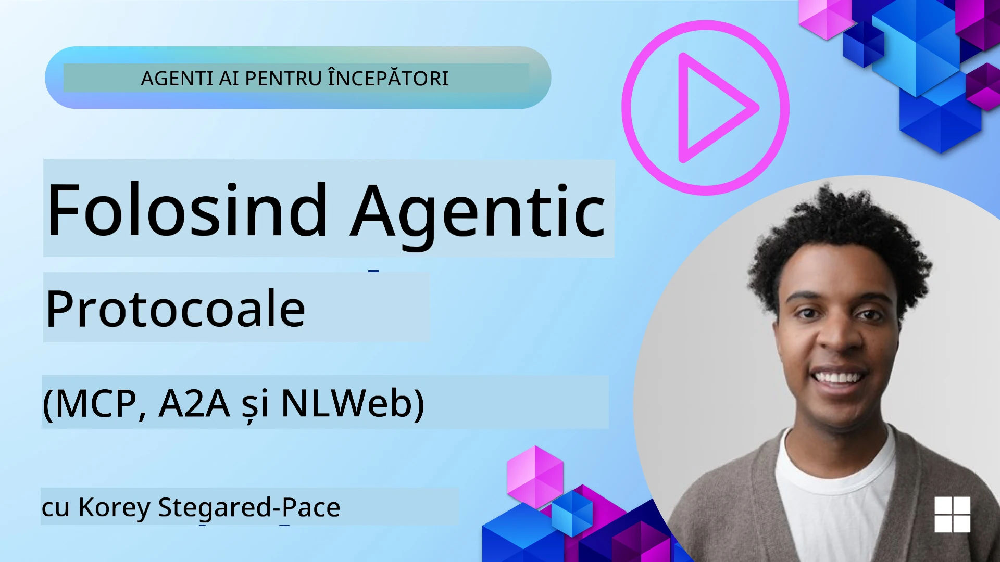
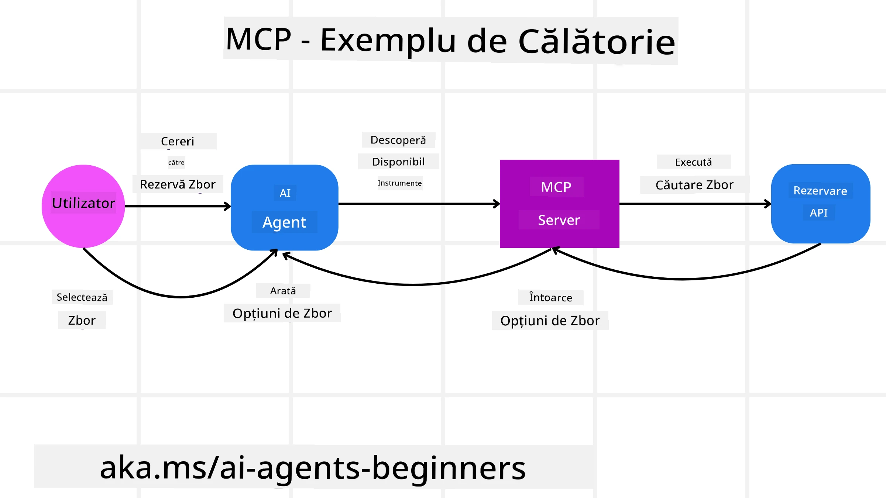
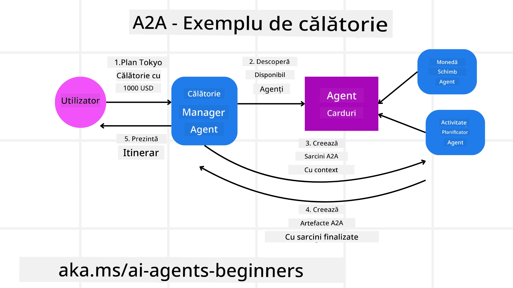
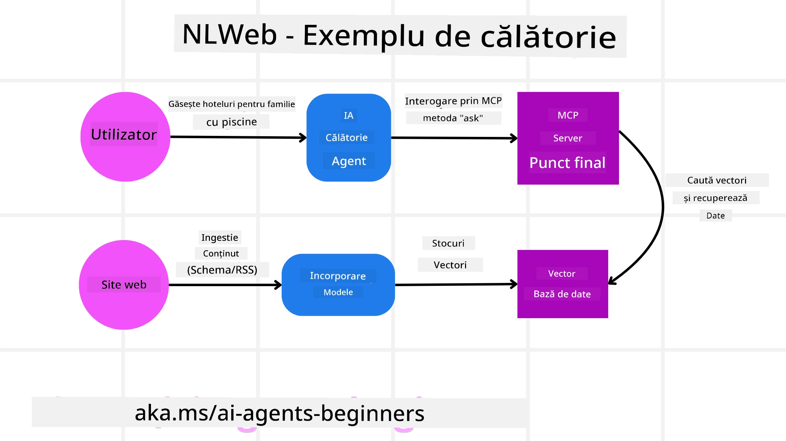

<!--
CO_OP_TRANSLATOR_METADATA:
{
  "original_hash": "aff92c6f019b4627ca9399c6e3882e17",
  "translation_date": "2025-09-18T15:35:18+00:00",
  "source_file": "11-agentic-protocols/README.md",
  "language_code": "ro"
}
-->
# Utilizarea Protocoalelor Agentice (MCP, A2A și NLWeb)

> _(Click pe imaginea de mai sus pentru a viziona videoclipul acestei lecții)_

Pe măsură ce utilizarea agenților AI crește, la fel crește și necesitatea unor protocoale care să asigure standardizarea, securitatea și să sprijine inovația deschisă. În această lecție, vom aborda 3 protocoale care încearcă să răspundă acestei nevoi - Model Context Protocol (MCP), Agent to Agent (A2A) și Natural Language Web (NLWeb).

## Introducere

În această lecție, vom acoperi:

• Cum **MCP** permite agenților AI să acceseze instrumente și date externe pentru a îndeplini sarcinile utilizatorului.

• Cum **A2A** facilitează comunicarea și colaborarea între diferiți agenți AI.

• Cum **NLWeb** aduce interfețe de limbaj natural pe orice site web, permițând agenților AI să descopere și să interacționeze cu conținutul.

## Obiective de Învățare

• **Identificarea** scopului principal și beneficiilor MCP, A2A și NLWeb în contextul agenților AI.

• **Explicarea** modului în care fiecare protocol facilitează comunicarea și interacțiunea între LLM-uri, instrumente și alți agenți.

• **Recunoașterea** rolurilor distincte pe care fiecare protocol le joacă în construirea sistemelor agentice complexe.

## Model Context Protocol

**Model Context Protocol (MCP)** este un standard deschis care oferă o modalitate standardizată pentru aplicații de a furniza context și instrumente către LLM-uri. Acest lucru permite un "adaptor universal" pentru diferite surse de date și instrumente la care agenții AI se pot conecta într-un mod consistent.

Să analizăm componentele MCP, beneficiile comparativ cu utilizarea directă a API-urilor și un exemplu despre cum agenții AI ar putea utiliza un server MCP.

### Componentele de Bază ale MCP

MCP funcționează pe o **arhitectură client-server**, iar componentele de bază sunt:

• **Hosts** sunt aplicații LLM (de exemplu, un editor de cod precum VSCode) care inițiază conexiunile către un server MCP.

• **Clients** sunt componente din cadrul aplicației gazdă care mențin conexiuni unu-la-unu cu serverele.

• **Servers** sunt programe ușoare care expun capabilități specifice.

Protocolul include trei primitive de bază, care sunt capabilitățile unui server MCP:

• **Tools**: Acestea sunt acțiuni sau funcții discrete pe care un agent AI le poate apela pentru a efectua o acțiune. De exemplu, un serviciu meteo ar putea expune un instrument "get weather", sau un server de e-commerce ar putea expune un instrument "purchase product". Serverele MCP promovează numele fiecărui instrument, descrierea și schema de intrare/ieșire în lista lor de capabilități.

• **Resources**: Acestea sunt elemente de date sau documente doar pentru citire pe care un server MCP le poate furniza, iar clienții le pot recupera la cerere. Exemple includ conținutul fișierelor, înregistrările din baze de date sau fișierele jurnal. Resursele pot fi text (cum ar fi cod sau JSON) sau binare (cum ar fi imagini sau PDF-uri).

• **Prompts**: Acestea sunt șabloane predefinite care oferă sugestii de prompturi, permițând fluxuri de lucru mai complexe.

### Beneficiile MCP

MCP oferă avantaje semnificative pentru agenții AI:

• **Descoperirea Dinamică a Instrumentelor**: Agenții pot primi dinamic o listă de instrumente disponibile de la un server, împreună cu descrieri ale funcțiilor acestora. Acest lucru contrastează cu API-urile tradiționale, care necesită adesea codificare statică pentru integrare, ceea ce înseamnă că orice modificare a API-ului necesită actualizări de cod. MCP oferă o abordare "integrează o dată", ducând la o adaptabilitate mai mare.

• **Interoperabilitate între LLM-uri**: MCP funcționează cu diferite LLM-uri, oferind flexibilitate pentru a schimba modelele de bază pentru evaluarea performanței.

• **Securitate Standardizată**: MCP include o metodă standard de autentificare, îmbunătățind scalabilitatea atunci când se adaugă acces la servere MCP suplimentare. Acest lucru este mai simplu decât gestionarea diferitelor chei și tipuri de autentificare pentru diverse API-uri tradiționale.

### Exemplu MCP

Imaginează-ți că un utilizator dorește să rezerve un zbor folosind un asistent AI alimentat de MCP.

1. **Conexiune**: Asistentul AI (clientul MCP) se conectează la un server MCP furnizat de o companie aeriană.

2. **Descoperirea Instrumentelor**: Clientul întreabă serverul MCP al companiei aeriene, "Ce instrumente aveți disponibile?" Serverul răspunde cu instrumente precum "search flights" și "book flights".

3. **Invocarea Instrumentului**: Apoi, utilizatorul îi cere asistentului AI, "Te rog să cauți un zbor de la Portland la Honolulu." Asistentul AI, folosindu-se de LLM-ul său, identifică că trebuie să apeleze instrumentul "search flights" și transmite parametrii relevanți (origine, destinație) către serverul MCP.

4. **Execuție și Răspuns**: Serverul MCP, acționând ca un wrapper, face apelul real către API-ul intern de rezervări al companiei aeriene. Apoi primește informațiile despre zbor (de exemplu, date JSON) și le trimite înapoi asistentului AI.

5. **Interacțiune Ulterioară**: Asistentul AI prezintă opțiunile de zbor. Odată ce selectezi un zbor, asistentul ar putea invoca instrumentul "book flight" pe același server MCP, finalizând rezervarea.

## Protocolul Agent-to-Agent (A2A)

În timp ce MCP se concentrează pe conectarea LLM-urilor la instrumente, **Agent-to-Agent (A2A)** duce lucrurile mai departe, permițând comunicarea și colaborarea între diferiți agenți AI. A2A conectează agenți AI din diferite organizații, medii și stive tehnologice pentru a îndeplini o sarcină comună.

Vom examina componentele și beneficiile A2A, împreună cu un exemplu despre cum ar putea fi aplicat în aplicația noastră de călătorie.

### Componentele de Bază ale A2A

A2A se concentrează pe facilitarea comunicării între agenți și pe colaborarea acestora pentru a îndeplini o sub-sarcină a utilizatorului. Fiecare componentă a protocolului contribuie la acest lucru:

#### Agent Card

Similar modului în care un server MCP împărtășește o listă de instrumente, un Agent Card conține:
- Numele agentului.
- O **descriere a sarcinilor generale** pe care le îndeplinește.
- O **listă de abilități specifice** cu descrieri pentru a ajuta alți agenți (sau chiar utilizatorii umani) să înțeleagă când și de ce ar dori să apeleze acel agent.
- **URL-ul endpoint-ului curent** al agentului.
- **Versiunea** și **capabilitățile** agentului, cum ar fi răspunsurile în streaming și notificările push.

#### Agent Executor

Agent Executor este responsabil pentru **transmiterea contextului conversației utilizatorului către agentul remote**, astfel încât agentul remote să înțeleagă sarcina care trebuie îndeplinită. Într-un server A2A, un agent folosește propriul său LLM pentru a analiza cererile primite și a executa sarcini folosind propriile instrumente interne.

#### Artifact

Odată ce un agent remote a finalizat sarcina solicitată, produsul său de lucru este creat sub forma unui artifact. Un artifact **conține rezultatul muncii agentului**, o **descriere a ceea ce a fost finalizat** și **contextul textului** care este transmis prin protocol. După ce artifactul este trimis, conexiunea cu agentul remote este închisă până când este necesară din nou.

#### Event Queue

Această componentă este utilizată pentru **gestionarea actualizărilor și transmiterea mesajelor**. Este deosebit de importantă în producție pentru sistemele agentice, pentru a preveni închiderea conexiunii între agenți înainte ca o sarcină să fie finalizată, mai ales când timpii de finalizare pot fi mai lungi.

### Beneficiile A2A

• **Colaborare Îmbunătățită**: Permite agenților din diferiți furnizori și platforme să interacționeze, să împărtășească context și să lucreze împreună, facilitând automatizarea fără probleme între sisteme tradițional deconectate.

• **Flexibilitate în Selectarea Modelului**: Fiecare agent A2A poate decide ce LLM folosește pentru a răspunde cererilor, permițând modele optimizate sau ajustate pentru fiecare agent, spre deosebire de o conexiune unică LLM în unele scenarii MCP.

• **Autentificare Integrată**: Autentificarea este integrată direct în protocolul A2A, oferind un cadru de securitate robust pentru interacțiunile între agenți.

### Exemplu A2A

Să extindem scenariul nostru de rezervare de călătorii, dar de această dată folosind A2A.

1. **Cererea Utilizatorului către Multi-Agent**: Un utilizator interacționează cu un "Agent de Călătorii" client/agent A2A, poate spunând: "Te rog să rezervi o întreagă excursie la Honolulu pentru săptămâna viitoare, inclusiv zboruri, un hotel și o mașină de închiriat".

2. **Orchestrarea de către Agentul de Călătorii**: Agentul de Călătorii primește această cerere complexă. Folosește LLM-ul său pentru a raționa despre sarcină și a determina că trebuie să interacționeze cu alți agenți specializați.

3. **Comunicare între Agenți**: Agentul de Călătorii folosește protocolul A2A pentru a se conecta la agenți downstream, cum ar fi un "Agent Aerian," un "Agent Hotelier" și un "Agent de Închirieri Auto" creați de diferite companii.

4. **Executarea Sarcinilor Delegată**: Agentul de Călătorii trimite sarcini specifice acestor agenți specializați (de exemplu, "Găsește zboruri către Honolulu," "Rezervă un hotel," "Închiriază o mașină"). Fiecare dintre acești agenți specializați, rulând propriile LLM-uri și utilizând propriile instrumente (care ar putea fi servere MCP în sine), își îndeplinește partea specifică a rezervării.

5. **Răspuns Consolidat**: Odată ce toți agenții downstream își finalizează sarcinile, Agentul de Călătorii compilează rezultatele (detalii despre zbor, confirmarea hotelului, rezervarea mașinii de închiriat) și trimite un răspuns cuprinzător, în stil chat, înapoi utilizatorului.

## Natural Language Web (NLWeb)

Site-urile web au fost mult timp modalitatea principală prin care utilizatorii accesează informații și date pe internet.

Să analizăm diferitele componente ale NLWeb, beneficiile NLWeb și un exemplu despre cum funcționează NLWeb, analizând aplicația noastră de călătorie.

### Componentele NLWeb

- **Aplicația NLWeb (Codul Serviciului de Bază)**: Sistemul care procesează întrebările în limbaj natural. Conectează diferitele părți ale platformei pentru a crea răspunsuri. Poți să-l consideri **motorul care alimentează funcțiile de limbaj natural** ale unui site web.

- **Protocolul NLWeb**: Acesta este un **set de reguli de bază pentru interacțiunea în limbaj natural** cu un site web. Trimite răspunsuri în format JSON (adesea folosind Schema.org). Scopul său este de a crea o fundație simplă pentru "AI Web," în același mod în care HTML a făcut posibilă partajarea documentelor online.

- **Server MCP (Endpoint Model Context Protocol)**: Fiecare configurare NLWeb funcționează și ca un **server MCP**. Acest lucru înseamnă că poate **partaja instrumente (cum ar fi metoda "ask") și date** cu alte sisteme AI. În practică, acest lucru face ca conținutul și abilitățile site-ului să fie utilizabile de agenții AI, permițând site-ului să devină parte a ecosistemului mai larg de agenți.

- **Modele de Embedding**: Aceste modele sunt utilizate pentru **convertirea conținutului site-ului web în reprezentări numerice numite vectori** (embedding-uri). Acești vectori capturează semnificația într-un mod pe care computerele îl pot compara și căuta. Sunt stocați într-o bază de date specială, iar utilizatorii pot alege ce model de embedding doresc să folosească.

- **Baza de Date Vectorială (Mecanism de Recuperare)**: Această bază de date **stochează embedding-urile conținutului site-ului web**. Când cineva pune o întrebare, NLWeb verifică baza de date vectorială pentru a găsi rapid cele mai relevante informații. Oferă o listă rapidă de răspunsuri posibile, clasificate după similaritate. NLWeb funcționează cu diferite sisteme de stocare vectorială, cum ar fi Qdrant, Snowflake, Milvus, Azure AI Search și Elasticsearch.

### NLWeb prin Exemplu

Să luăm în considerare din nou site-ul nostru de rezervări de călătorii, dar de această dată alimentat de NLWeb.

1. **Ingestia Datelor**: Cataloagele de produse existente ale site-ului de călătorii (de exemplu, listele de zboruri, descrierile hotelurilor, pachetele turistice) sunt formate folosind Schema.org sau încărcate prin feed-uri RSS. Instrumentele NLWeb preiau aceste date structurate, creează embedding-uri și le stochează într-o bază de date vectorială locală sau remote.

2. **Interogare în Limbaj Natural (Uman)**: Un utilizator vizitează site-ul și, în loc să navigheze prin meniuri, introduce într-o interfață de chat: "Găsește-mi un hotel prietenos cu familiile în Honolulu, cu piscină, pentru săptămâna viitoare".

3. **Procesarea NLWeb**: Aplicația NLWeb primește această interogare. Trimite interogarea către un LLM pentru înțelegere și, simultan, caută în baza sa de date vectorială pentru listele relevante de hoteluri.

4. **Rezultate Precise**: LLM-ul ajută la interpretarea rezultatelor căutării din baza de date, identifică cele mai bune potriviri pe baza criteriilor "prietenos cu familiile," "piscină" și "Honolulu," și apoi formatează un răspuns în limbaj natural. Esențial, răspunsul se referă la hoteluri reale din catalogul site-ului, evitând informațiile inventate.

5. **Interacțiunea cu Agenții AI**: Deoarece NLWeb servește ca un server MCP, un agent AI extern de călătorii ar putea, de asemenea, să se conecteze la instanța NLWeb a acestui site. Agentul AI ar putea apoi să folosească metoda `ask` MCP pentru a interoga direct site-ul: `ask("Există restaurante prietenoase cu veganii în zona Honolulu recomandate de hotel?")`. Instanța NLWeb ar procesa acest lucru, utilizând baza sa de date cu informații despre restaurante (dacă sunt încărcate), și ar returna un răspuns structurat JSON.

### Ai mai multe întrebări despre MCP/A2A/NLWeb?

Alătură-te [Azure AI Foundry Discord](https://aka.ms/ai-agents/discord) pentru a te întâlni cu alți cursanți, a participa la ore de consultanță și a obține răspunsuri la întrebările tale despre agenții AI.

## Resurse

- [MCP pentru Începători](https://aka.ms/mcp-for-beginners)  
- [Documentația MCP](https://github.com/microsoft/semantic-kernel/tree/main/python/semantic-kernel/semantic_kernel/connectors/mcp)
- [Repo NLWeb](https://github.com/nlweb-ai/NLWeb)
- [Ghiduri Semantic Kernel](https://learn.microsoft.com/semantic-kernel/)

---

**Declinare de responsabilitate**:  
Acest document a fost tradus folosind serviciul de traducere AI [Co-op Translator](https://github.com/Azure/co-op-translator). Deși ne străduim să asigurăm acuratețea, vă rugăm să rețineți că traducerile automate pot conține erori sau inexactități. Documentul original în limba sa natală ar trebui considerat sursa autoritară. Pentru informații critice, se recomandă traducerea profesională realizată de un specialist uman. Nu ne asumăm responsabilitatea pentru eventualele neînțelegeri sau interpretări greșite care pot apărea din utilizarea acestei traduceri.