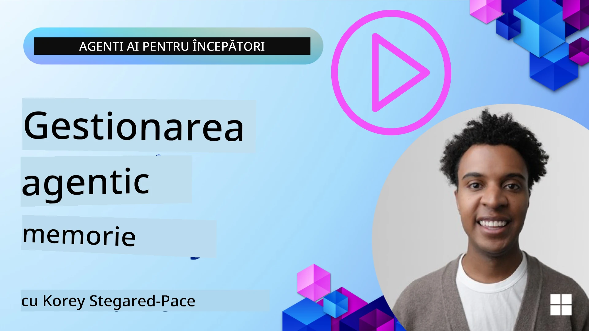

<!--
CO_OP_TRANSLATOR_METADATA:
{
  "original_hash": "a1d90991499ad697c4ad24decaf36968",
  "translation_date": "2025-12-09T12:46:18+00:00",
  "source_file": "13-agent-memory/README.md",
  "language_code": "ro"
}
-->
# Memorie pentru Agenți AI 

Când discutăm despre beneficiile unice ale creării Agenților AI, două lucruri sunt în principal menționate: abilitatea de a utiliza instrumente pentru a finaliza sarcini și capacitatea de a se îmbunătăți în timp. Memoria stă la baza creării unui agent auto-îmbunătățitor care poate oferi experiențe mai bune utilizatorilor noștri.

În această lecție, vom analiza ce înseamnă memoria pentru Agenții AI și cum o putem gestiona și utiliza în beneficiul aplicațiilor noastre.

## Introducere

Această lecție va acoperi:

• **Înțelegerea memoriei Agenților AI**: Ce este memoria și de ce este esențială pentru agenți.

• **Implementarea și stocarea memoriei**: Metode practice pentru adăugarea capacităților de memorie agenților AI, concentrându-ne pe memoria pe termen scurt și lung.

• **Crearea Agenților AI auto-îmbunătățitori**: Cum permite memoria agenților să învețe din interacțiunile anterioare și să se îmbunătățească în timp.

## Implementări disponibile

Această lecție include două tutoriale complete sub formă de notebook-uri:

• **[13-agent-memory.ipynb](./13-agent-memory.ipynb)**: Implementează memoria folosind Mem0 și Azure AI Search cu cadrul Semantic Kernel.

• **[13-agent-memory-cognee.ipynb](./13-agent-memory-cognee.ipynb)**: Implementează memoria structurată folosind Cognee, construind automat un grafic de cunoștințe bazat pe embeddings, vizualizând graficul și realizând recuperări inteligente.

## Obiective de învățare

După finalizarea acestei lecții, veți ști cum să:

• **Faceți diferența între diferite tipuri de memorie ale agenților AI**, inclusiv memoria de lucru, pe termen scurt și lung, precum și forme specializate precum memoria de personalitate și memoria episodică.

• **Implementați și gestionați memoria pe termen scurt și lung pentru agenții AI** folosind cadrul Semantic Kernel, utilizând instrumente precum Mem0, Cognee, memoria Whiteboard și integrarea cu Azure AI Search.

• **Înțelegeți principiile din spatele agenților AI auto-îmbunătățitori** și cum contribuie sistemele robuste de gestionare a memoriei la învățarea și adaptarea continuă.

## Înțelegerea memoriei Agenților AI

În esență, **memoria pentru agenții AI se referă la mecanismele care le permit să rețină și să recheme informații**. Aceste informații pot include detalii specifice despre o conversație, preferințele utilizatorului, acțiuni anterioare sau chiar tipare învățate.

Fără memorie, aplicațiile AI sunt adesea fără stare, ceea ce înseamnă că fiecare interacțiune începe de la zero. Acest lucru duce la o experiență repetitivă și frustrantă pentru utilizator, în care agentul "uită" contextul sau preferințele anterioare.

### De ce este importantă memoria?

Inteligența unui agent este profund legată de abilitatea sa de a rechema și utiliza informațiile din trecut. Memoria permite agenților să fie:

• **Reflexivi**: Să învețe din acțiunile și rezultatele anterioare.

• **Interactivi**: Să mențină contextul pe parcursul unei conversații continue.

• **Proactivi și Reactivi**: Să anticipeze nevoile sau să răspundă adecvat pe baza datelor istorice.

• **Autonomi**: Să funcționeze mai independent, bazându-se pe cunoștințele stocate.

Scopul implementării memoriei este de a face agenții mai **fiabili și capabili**.

### Tipuri de memorie

#### Memoria de lucru

Gândiți-vă la aceasta ca la o foaie de hârtie pe care un agent o folosește în timpul unei singure sarcini sau proces de gândire. Aceasta reține informațiile imediate necesare pentru a calcula pasul următor.

Pentru agenții AI, memoria de lucru captează adesea cele mai relevante informații dintr-o conversație, chiar dacă istoricul complet al chat-ului este lung sau trunchiat. Se concentrează pe extragerea elementelor cheie precum cerințe, propuneri, decizii și acțiuni.

**Exemplu de memorie de lucru**

În cazul unui agent de rezervare a călătoriilor, memoria de lucru ar putea capta cererea curentă a utilizatorului, cum ar fi "Vreau să rezerv o călătorie la Paris". Această cerință specifică este păstrată în contextul imediat al agentului pentru a ghida interacțiunea curentă.

#### Memoria pe termen scurt

Acest tip de memorie reține informațiile pe durata unei singure conversații sau sesiuni. Este contextul chat-ului curent, permițând agentului să facă referire la replicile anterioare din dialog.

**Exemplu de memorie pe termen scurt**

Dacă un utilizator întreabă, "Cât ar costa un zbor spre Paris?" și apoi continuă cu "Dar cazarea acolo?", memoria pe termen scurt asigură că agentul știe că "acolo" se referă la "Paris" în cadrul aceleiași conversații.

#### Memoria pe termen lung

Aceasta este informația care persistă pe parcursul mai multor conversații sau sesiuni. Permite agenților să-și amintească preferințele utilizatorului, interacțiunile anterioare sau cunoștințele generale pe perioade extinse. Este importantă pentru personalizare.

**Exemplu de memorie pe termen lung**

O memorie pe termen lung ar putea stoca faptul că "Ben se bucură de schi și activități în aer liber, îi place cafeaua cu vedere la munte și dorește să evite pârtiile avansate de schi din cauza unei accidentări anterioare". Aceste informații, învățate din interacțiuni anterioare, influențează recomandările în sesiunile viitoare de planificare a călătoriilor, făcându-le extrem de personalizate.

#### Memoria de personalitate

Acest tip de memorie specializată ajută un agent să dezvolte o "personalitate" sau un "rol" consistent. Permite agentului să-și amintească detalii despre sine sau despre rolul său intenționat, făcând interacțiunile mai fluide și mai concentrate.

**Exemplu de memorie de personalitate**

Dacă agentul de călătorii este conceput să fie un "expert în planificarea schiului", memoria de personalitate ar putea întări acest rol, influențând răspunsurile sale pentru a se alinia cu tonul și cunoștințele unui expert.

#### Memoria de flux/episodică

Această memorie stochează secvența de pași pe care un agent îi face în timpul unei sarcini complexe, inclusiv succesele și eșecurile. Este ca și cum ar "ține minte" episoade specifice sau experiențe trecute pentru a învăța din ele.

**Exemplu de memorie episodică**

Dacă agentul a încercat să rezerve un anumit zbor, dar a eșuat din cauza indisponibilității, memoria episodică ar putea înregistra acest eșec, permițând agentului să încerce zboruri alternative sau să informeze utilizatorul despre problemă într-un mod mai informat în timpul unei încercări ulterioare.

#### Memoria de entitate

Aceasta implică extragerea și reținerea entităților specifice (cum ar fi persoane, locuri sau lucruri) și evenimente din conversații. Permite agentului să construiască o înțelegere structurată a elementelor cheie discutate.

**Exemplu de memorie de entitate**

Dintr-o conversație despre o călătorie anterioară, agentul ar putea extrage "Paris", "Turnul Eiffel" și "cină la restaurantul Le Chat Noir" ca entități. Într-o interacțiune viitoare, agentul ar putea să-și amintească "Le Chat Noir" și să ofere să facă o nouă rezervare acolo.

#### RAG Structurat (Generare Augmentată prin Recuperare)

Deși RAG este o tehnică mai largă, "RAG Structurat" este evidențiat ca o tehnologie de memorie puternică. Extrage informații dense și structurate din diverse surse (conversații, e-mailuri, imagini) și le folosește pentru a îmbunătăți precizia, rechemarea și viteza răspunsurilor. Spre deosebire de RAG-ul clasic, care se bazează doar pe similaritatea semantică, RAG Structurat lucrează cu structura inerentă a informațiilor.

**Exemplu de RAG Structurat**

În loc să se bazeze doar pe potrivirea cuvintelor cheie, RAG Structurat ar putea analiza detaliile unui zbor (destinație, dată, oră, companie aeriană) dintr-un e-mail și să le stocheze într-un mod structurat. Acest lucru permite interogări precise, cum ar fi "Ce zbor am rezervat spre Paris marți?"

## Implementarea și stocarea memoriei

Implementarea memoriei pentru agenții AI implică un proces sistematic de **gestionare a memoriei**, care include generarea, stocarea, recuperarea, integrarea, actualizarea și chiar "uitarea" (sau ștergerea) informațiilor. Recuperarea este un aspect deosebit de crucial.

### Instrumente specializate pentru memorie

#### Mem0

O modalitate de a stoca și gestiona memoria agentului este utilizarea unor instrumente specializate precum Mem0. Mem0 funcționează ca un strat de memorie persistentă, permițând agenților să recheme interacțiuni relevante, să stocheze preferințele utilizatorului și contextul factual și să învețe din succese și eșecuri în timp. Ideea este că agenții fără stare devin agenți cu stare.

Funcționează printr-un **pipeline de memorie în două faze: extragere și actualizare**. Mai întâi, mesajele adăugate la firul unui agent sunt trimise la serviciul Mem0, care folosește un Model de Limbaj Mare (LLM) pentru a rezuma istoricul conversației și a extrage noi amintiri. Ulterior, o fază de actualizare condusă de LLM determină dacă să adauge, să modifice sau să șteargă aceste amintiri, stocându-le într-un depozit de date hibrid care poate include baze de date vectoriale, grafice și cheie-valoare. Acest sistem suportă, de asemenea, diverse tipuri de memorie și poate încorpora memoria grafică pentru gestionarea relațiilor dintre entități.

#### Cognee

O altă abordare puternică este utilizarea **Cognee**, o memorie semantică open-source pentru agenții AI care transformă datele structurate și nestructurate în grafice de cunoștințe interogabile, susținute de embeddings. Cognee oferă o **arhitectură cu dublu depozit** care combină căutarea prin similaritate vectorială cu relațiile grafice, permițând agenților să înțeleagă nu doar ce informații sunt similare, ci și cum se relaționează conceptele între ele.

Excellează în **recuperarea hibridă** care îmbină similaritatea vectorială, structura graficului și raționamentul LLM - de la căutarea brută a fragmentelor la răspunsuri conștiente de grafic. Sistemul menține o **memorie vie** care evoluează și crește, rămânând interogabilă ca un singur grafic conectat, susținând atât contextul sesiunii pe termen scurt, cât și memoria persistentă pe termen lung.

Tutorialul notebook Cognee ([13-agent-memory-cognee.ipynb](./13-agent-memory-cognee.ipynb)) demonstrează construirea acestui strat de memorie unificat, cu exemple practice de ingestie a surselor de date diverse, vizualizarea graficului de cunoștințe și interogarea cu strategii de căutare diferite, adaptate nevoilor specifice ale agentului.

### Stocarea memoriei cu RAG

Dincolo de instrumentele specializate de memorie precum Mem0, puteți utiliza servicii robuste de căutare precum **Azure AI Search ca backend pentru stocarea și recuperarea amintirilor**, în special pentru RAG structurat.

Acest lucru vă permite să fundamentați răspunsurile agentului cu propriile date, asigurând răspunsuri mai relevante și mai precise. Azure AI Search poate fi utilizat pentru a stoca amintiri specifice utilizatorului despre călătorii, cataloage de produse sau orice altă cunoaștere specifică domeniului.

Azure AI Search suportă capabilități precum **RAG Structurat**, care excelează în extragerea și recuperarea informațiilor dense și structurate din seturi mari de date, cum ar fi istoricul conversațiilor, e-mailurile sau chiar imaginile. Acest lucru oferă "precizie și rechemare supraomenească" comparativ cu abordările tradiționale de împărțire a textului și încorporare.

## Crearea Agenților AI auto-îmbunătățitori

Un model comun pentru agenții auto-îmbunătățitori implică introducerea unui **"agent de cunoaștere"**. Acest agent separat observă conversația principală dintre utilizator și agentul principal. Rolul său este să:

1. **Identifice informații valoroase**: Să determine dacă vreo parte a conversației merită salvată ca cunoaștere generală sau preferință specifică a utilizatorului.

2. **Extragă și rezumeze**: Să distileze esența învățării sau preferinței din conversație.

3. **Stocheze într-o bază de cunoștințe**: Să persisteze aceste informații extrase, adesea într-o bază de date vectorială, astfel încât să poată fi recuperate mai târziu.

4. **Augmenteze interogările viitoare**: Când utilizatorul inițiază o nouă interogare, agentul de cunoaștere recuperează informațiile stocate relevante și le adaugă la promptul utilizatorului, oferind context crucial agentului principal (similar cu RAG).

### Optimizări pentru memorie

• **Gestionarea latenței**: Pentru a evita încetinirea interacțiunilor utilizatorului, un model mai ieftin și mai rapid poate fi utilizat inițial pentru a verifica rapid dacă informațiile sunt valoroase pentru stocare sau recuperare, invocând doar procesul mai complex de extragere/recuperare atunci când este necesar.

• **Întreținerea bazei de cunoștințe**: Pentru o bază de cunoștințe în creștere, informațiile mai puțin utilizate frecvent pot fi mutate în "stocare rece" pentru a gestiona costurile.

## Aveți mai multe întrebări despre memoria agenților?

Alăturați-vă [Discordului Azure AI Foundry](https://aka.ms/ai-agents/discord) pentru a întâlni alți cursanți, a participa la ore de consultanță și a obține răspunsuri la întrebările despre Agenții AI.

---

<!-- CO-OP TRANSLATOR DISCLAIMER START -->
**Declinare de responsabilitate**:  
Acest document a fost tradus folosind serviciul de traducere AI [Co-op Translator](https://github.com/Azure/co-op-translator). Deși ne străduim să asigurăm acuratețea, vă rugăm să fiți conștienți că traducerile automate pot conține erori sau inexactități. Documentul original în limba sa maternă ar trebui considerat sursa autoritară. Pentru informații critice, se recomandă traducerea profesională realizată de oameni. Nu ne asumăm responsabilitatea pentru neînțelegeri sau interpretări greșite care pot apărea din utilizarea acestei traduceri.
<!-- CO-OP TRANSLATOR DISCLAIMER END -->