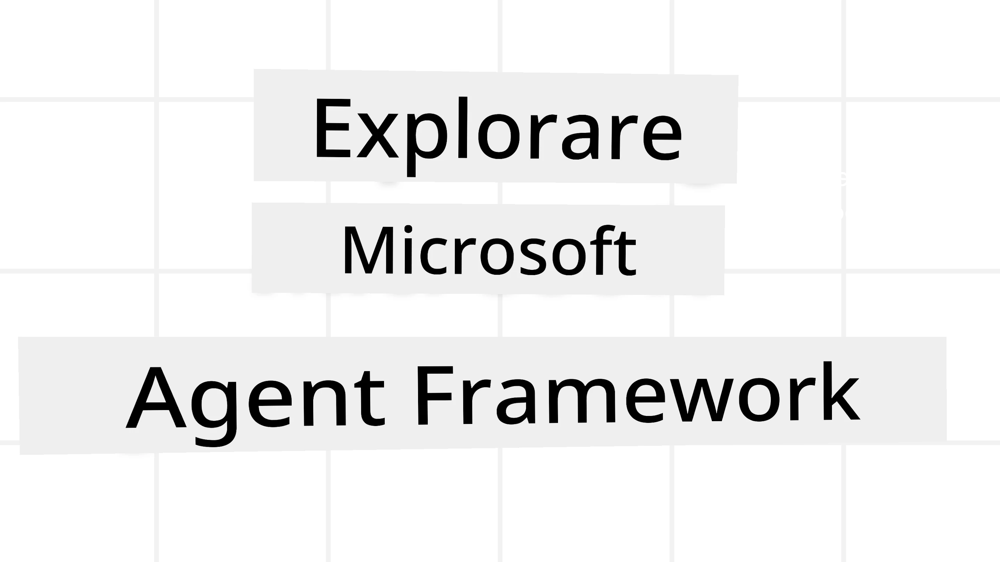
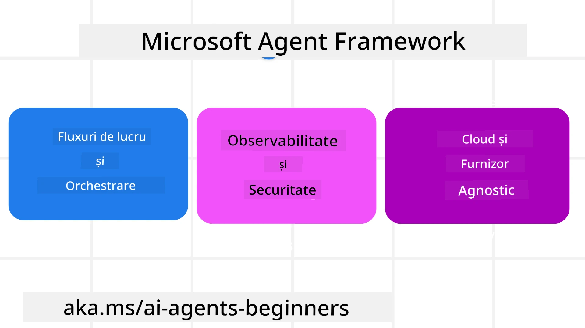
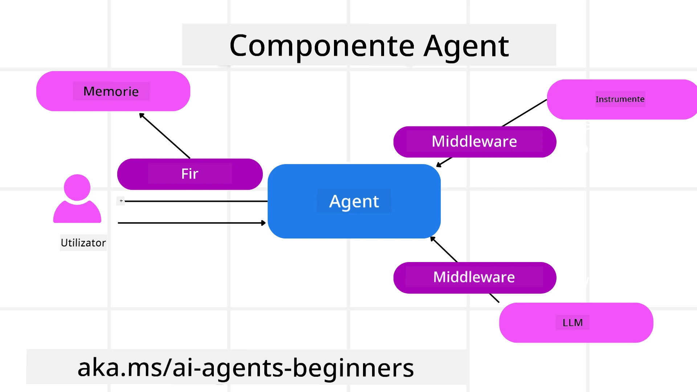

<!--
CO_OP_TRANSLATOR_METADATA:
{
  "original_hash": "19c4dab375acbc733855cc7f2f04edbc",
  "translation_date": "2025-10-02T08:12:35+00:00",
  "source_file": "14-microsoft-agent-framework/README.md",
  "language_code": "ro"
}
-->
# Explorarea Microsoft Agent Framework



### Introducere

Această lecție va acoperi:

- Înțelegerea Microsoft Agent Framework: Caracteristici cheie și valoare  
- Explorarea conceptelor cheie ale Microsoft Agent Framework
- Compararea MAF cu Semantic Kernel și AutoGen: Ghid de migrare

## Obiective de învățare

După finalizarea acestei lecții, vei ști cum să:

- Construiești agenți AI gata de producție folosind Microsoft Agent Framework
- Aplici caracteristicile de bază ale Microsoft Agent Framework la cazurile tale de utilizare agentică
- Migrezi și integrezi cadrele și instrumentele agentice existente  

## Exemple de cod 

Exemplele de cod pentru [Microsoft Agent Framework (MAF)](https://aka.ms/ai-agents-beginners/agent-framewrok) pot fi găsite în acest depozit sub fișierele `xx-python-agent-framework` și `xx-dotnet-agent-framework`.

## Înțelegerea Microsoft Agent Framework



[Microsoft Agent Framework (MAF)](https://aka.ms/ai-agents-beginners/agent-framewrok) se bazează pe experiența și învățăturile din Semantic Kernel și AutoGen. Acesta oferă flexibilitatea de a aborda o varietate largă de cazuri de utilizare agentică întâlnite atât în medii de producție, cât și în cercetare, inclusiv:

- **Orchestrare secvențială a agenților** în scenarii unde sunt necesare fluxuri de lucru pas cu pas.
- **Orchestrare concurentă** în scenarii unde agenții trebuie să finalizeze sarcini simultan.
- **Orchestrare de chat în grup** în scenarii unde agenții pot colabora împreună la o sarcină.
- **Orchestrare prin predare** în scenarii unde agenții își predau sarcinile unul altuia pe măsură ce subtascurile sunt finalizate.
- **Orchestrare magnetică** în scenarii unde un agent manager creează și modifică o listă de sarcini și gestionează coordonarea subagenților pentru a finaliza sarcina.

Pentru a livra agenți AI în producție, MAF include și caracteristici pentru:

- **Observabilitate** prin utilizarea OpenTelemetry, unde fiecare acțiune a agentului AI, inclusiv invocarea instrumentelor, pașii de orchestrare, fluxurile de raționament și monitorizarea performanței prin tablourile de bord Azure AI Foundry, este urmărită.
- **Securitate** prin găzduirea agenților nativ pe Azure AI Foundry, care include controale de securitate precum acces bazat pe roluri, gestionarea datelor private și siguranța conținutului încorporată.
- **Durabilitate** deoarece firele și fluxurile de lucru ale agenților pot fi puse pe pauză, reluate și recuperate din erori, ceea ce permite procese de lungă durată.
- **Control** prin suport pentru fluxuri de lucru cu implicarea umană, unde sarcinile sunt marcate ca necesitând aprobare umană.

Microsoft Agent Framework se concentrează, de asemenea, pe interoperabilitate prin:

- **Independență față de cloud** - Agenții pot rula în containere, on-premises și pe mai multe cloud-uri diferite.
- **Independență față de furnizor** - Agenții pot fi creați prin SDK-ul preferat, inclusiv Azure OpenAI și OpenAI.
- **Integrarea standardelor deschise** - Agenții pot utiliza protocoale precum Agent-to-Agent (A2A) și Model Context Protocol (MCP) pentru a descoperi și utiliza alți agenți și instrumente.
- **Plugin-uri și conectori** - Se pot face conexiuni la servicii de date și memorie precum Microsoft Fabric, SharePoint, Pinecone și Qdrant.

Să vedem cum sunt aplicate aceste caracteristici la unele dintre conceptele de bază ale Microsoft Agent Framework.

## Concepte cheie ale Microsoft Agent Framework

### Agenți



**Crearea agenților**

Crearea agenților se face prin definirea serviciului de inferență (furnizor LLM), a unui set de instrucțiuni pe care agentul AI trebuie să le urmeze și a unui `nume` atribuit:

```python
agent = AzureOpenAIChatClient(credential=AzureCliCredential()).create_agent( instructions="You are good at recommending trips to customers based on their preferences.", name="TripRecommender" )
```

Exemplul de mai sus folosește `Azure OpenAI`, dar agenții pot fi creați utilizând o varietate de servicii, inclusiv `Azure AI Foundry Agent Service`:

```python
AzureAIAgentClient(async_credential=credential).create_agent( name="HelperAgent", instructions="You are a helpful assistant." ) as agent
```

API-urile OpenAI `Responses`, `ChatCompletion`

```python
agent = OpenAIResponsesClient().create_agent( name="WeatherBot", instructions="You are a helpful weather assistant.", )
```

```python
agent = OpenAIChatClient().create_agent( name="HelpfulAssistant", instructions="You are a helpful assistant.", )
```

sau agenți la distanță folosind protocolul A2A:

```python
agent = A2AAgent( name=agent_card.name, description=agent_card.description, agent_card=agent_card, url="https://your-a2a-agent-host" )
```

**Rularea agenților**

Agenții sunt rulați folosind metodele `.run` sau `.run_stream` pentru răspunsuri non-streaming sau streaming.

```python
result = await agent.run("What are good places to visit in Amsterdam?")
print(result.text)
```

```python
async for update in agent.run_stream("What are the good places to visit in Amsterdam?"):
    if update.text:
        print(update.text, end="", flush=True)

```

Fiecare rulare a agentului poate avea opțiuni pentru personalizarea parametrilor, cum ar fi `max_tokens` utilizați de agent, `tools` pe care agentul le poate apela și chiar `modelul` folosit de agent.

Aceasta este utilă în cazurile în care sunt necesare modele sau instrumente specifice pentru a finaliza sarcina utilizatorului.

**Instrumente**

Instrumentele pot fi definite atât la definirea agentului:

```python
def get_attractions( location: Annotated[str, Field(description="The location to get the top tourist attractions for")], ) -> str: """Get the top tourist attractions for a given location.""" return f"The top attractions for {location} are." 


# When creating a ChatAgent directly 

agent = ChatAgent( chat_client=OpenAIChatClient(), instructions="You are a helpful assistant", tools=[get_attractions]

```

cât și la rularea agentului:

```python

result1 = await agent.run( "What's the best place to visit in Seattle?", tools=[get_attractions] # Tool provided for this run only )
```

**Firele agentului**

Firele agentului sunt utilizate pentru a gestiona conversațiile multi-turn. Firele pot fi create fie prin:

- Utilizarea `get_new_thread()`, care permite salvarea firului în timp
- Crearea automată a unui fir atunci când agentul este rulat, firul existând doar pe durata rulării curente.

Pentru a crea un fir, codul arată astfel:

```python
# Create a new thread. 
thread = agent.get_new_thread() # Run the agent with the thread. 
response = await agent.run("Hello, I am here to help you book travel. Where would you like to go?", thread=thread)

```

Poți apoi să serializezi firul pentru a fi stocat pentru utilizare ulterioară:

```python
# Create a new thread. 
thread = agent.get_new_thread() 

# Run the agent with the thread. 

response = await agent.run("Hello, how are you?", thread=thread) 

# Serialize the thread for storage. 

serialized_thread = await thread.serialize() 

# Deserialize the thread state after loading from storage. 

resumed_thread = await agent.deserialize_thread(serialized_thread)
```

**Middleware-ul agentului**

Agenții interacționează cu instrumentele și LLM-urile pentru a finaliza sarcinile utilizatorului. În anumite scenarii, dorim să executăm sau să urmărim acțiuni între aceste interacțiuni. Middleware-ul agentului ne permite să facem acest lucru prin:

*Middleware pentru funcții*

Acest middleware ne permite să executăm o acțiune între agent și o funcție/instrument pe care urmează să îl apeleze. Un exemplu de utilizare ar fi atunci când dorim să facem logarea apelului funcției.

În codul de mai jos, `next` definește dacă următorul middleware sau funcția propriu-zisă ar trebui să fie apelată.

```python
async def logging_function_middleware(
    context: FunctionInvocationContext,
    next: Callable[[FunctionInvocationContext], Awaitable[None]],
) -> None:
    """Function middleware that logs function execution."""
    # Pre-processing: Log before function execution
    print(f"[Function] Calling {context.function.name}")

    # Continue to next middleware or function execution
    await next(context)

    # Post-processing: Log after function execution
    print(f"[Function] {context.function.name} completed")
```

*Middleware pentru chat*

Acest middleware ne permite să executăm sau să logăm o acțiune între agent și cererile dintre LLM.

Acesta conține informații importante, cum ar fi `messages` care sunt trimise serviciului AI.

```python
async def logging_chat_middleware(
    context: ChatContext,
    next: Callable[[ChatContext], Awaitable[None]],
) -> None:
    """Chat middleware that logs AI interactions."""
    # Pre-processing: Log before AI call
    print(f"[Chat] Sending {len(context.messages)} messages to AI")

    # Continue to next middleware or AI service
    await next(context)

    # Post-processing: Log after AI response
    print("[Chat] AI response received")

```

**Memoria agentului**

Așa cum s-a discutat în lecția `Agentic Memory`, memoria este un element important pentru a permite agentului să opereze în contexte diferite. MAF oferă mai multe tipuri de memorii:

*Stocare în memorie*

Aceasta este memoria stocată în firele de execuție pe durata rulării aplicației.

```python
# Create a new thread. 
thread = agent.get_new_thread() # Run the agent with the thread. 
response = await agent.run("Hello, I am here to help you book travel. Where would you like to go?", thread=thread)
```

*Mesaje persistente*

Această memorie este utilizată pentru stocarea istoricului conversațiilor între sesiuni diferite. Este definită folosind `chat_message_store_factory`:

```python
from agent_framework import ChatMessageStore

# Create a custom message store
def create_message_store():
    return ChatMessageStore()

agent = ChatAgent(
    chat_client=OpenAIChatClient(),
    instructions="You are a Travel assistant.",
    chat_message_store_factory=create_message_store
)

```

*Memorie dinamică*

Această memorie este adăugată contextului înainte ca agenții să fie rulați. Aceste memorii pot fi stocate în servicii externe, cum ar fi mem0:

```python
from agent_framework.mem0 import Mem0Provider

# Using Mem0 for advanced memory capabilities
memory_provider = Mem0Provider(
    api_key="your-mem0-api-key",
    user_id="user_123",
    application_id="my_app"
)

agent = ChatAgent(
    chat_client=OpenAIChatClient(),
    instructions="You are a helpful assistant with memory.",
    context_providers=memory_provider
)

```

**Observabilitatea agentului**

Observabilitatea este importantă pentru construirea sistemelor agentice fiabile și ușor de întreținut. MAF se integrează cu OpenTelemetry pentru a oferi trasabilitate și măsurători pentru o mai bună observabilitate.

```python
from agent_framework.observability import get_tracer, get_meter

tracer = get_tracer()
meter = get_meter()
with tracer.start_as_current_span("my_custom_span"):
    # do something
    pass
counter = meter.create_counter("my_custom_counter")
counter.add(1, {"key": "value"})
```

### Fluxuri de lucru

MAF oferă fluxuri de lucru care sunt pași predefiniți pentru a finaliza o sarcină și includ agenți AI ca componente în acești pași.

Fluxurile de lucru sunt alcătuite din diferite componente care permit un control mai bun al fluxului. De asemenea, fluxurile de lucru permit **orchestrare multi-agent** și **checkpointing** pentru a salva stările fluxului de lucru.

Componentele de bază ale unui flux de lucru sunt:

**Executori**

Executorii primesc mesaje de intrare, își îndeplinesc sarcinile atribuite și apoi produc un mesaj de ieșire. Acest lucru avansează fluxul de lucru spre finalizarea sarcinii mai mari. Executorii pot fi fie agenți AI, fie logică personalizată.

**Margini**

Marginile sunt utilizate pentru a defini fluxul de mesaje într-un flux de lucru. Acestea pot fi:

*Margini directe* - Conexiuni simple unu-la-unu între executori:

```python
from agent_framework import WorkflowBuilder

builder = WorkflowBuilder()
builder.add_edge(source_executor, target_executor)
builder.set_start_executor(source_executor)
workflow = builder.build()
```

*Margini condiționale* - Activate după îndeplinirea unei anumite condiții. De exemplu, când camerele de hotel nu sunt disponibile, un executor poate sugera alte opțiuni.

*Margini switch-case* - Direcționează mesajele către executori diferiți pe baza condițiilor definite. De exemplu, dacă un client de călătorie are acces prioritar, sarcinile sale vor fi gestionate printr-un alt flux de lucru.

*Margini fan-out* - Trimit un mesaj către mai multe destinații.

*Margini fan-in* - Colectează mai multe mesaje de la executori diferiți și le trimit către o singură destinație.

**Evenimente**

Pentru a oferi o mai bună observabilitate în fluxurile de lucru, MAF oferă evenimente încorporate pentru execuție, inclusiv:

- `WorkflowStartedEvent`  - Execuția fluxului de lucru începe
- `WorkflowOutputEvent` - Fluxul de lucru produce o ieșire
- `WorkflowErrorEvent` - Fluxul de lucru întâmpină o eroare
- `ExecutorInvokeEvent`  - Executorul începe procesarea
- `ExecutorCompleteEvent`  - Executorul finalizează procesarea
- `RequestInfoEvent` - Este emisă o cerere

## Migrarea de la alte cadre (Semantic Kernel și AutoGen)

### Diferențe între MAF și Semantic Kernel

**Crearea simplificată a agenților**

Semantic Kernel se bazează pe crearea unei instanțe Kernel pentru fiecare agent. MAF folosește o abordare simplificată prin utilizarea extensiilor pentru principalii furnizori.

```python
agent = AzureOpenAIChatClient(credential=AzureCliCredential()).create_agent( instructions="You are good at reccomending trips to customers based on their preferences.", name="TripRecommender" )
```

**Crearea firelor agentului**

Semantic Kernel necesită crearea manuală a firelor. În MAF, agentului i se atribuie direct un fir.

```python
thread = agent.get_new_thread() # Run the agent with the thread. 
```

**Înregistrarea instrumentelor**

În Semantic Kernel, instrumentele sunt înregistrate în Kernel, iar Kernel-ul este apoi transmis agentului. În MAF, instrumentele sunt înregistrate direct în timpul procesului de creare a agentului.

```python
agent = ChatAgent( chat_client=OpenAIChatClient(), instructions="You are a helpful assistant", tools=[get_attractions]
```

### Diferențe între MAF și AutoGen

**Echipe vs Fluxuri de lucru**

`Echipele` sunt structura de evenimente pentru activități bazate pe evenimente cu agenți în AutoGen. MAF folosește `Fluxuri de lucru` care direcționează datele către executori printr-o arhitectură bazată pe grafuri.

**Crearea instrumentelor**

AutoGen folosește `FunctionTool` pentru a înveli funcții pe care agenții să le apeleze. MAF folosește @ai_function, care funcționează similar, dar deduce automat schemele pentru fiecare funcție.

**Comportamentul agenților**

Agenții sunt agenți single-turn în mod implicit în AutoGen, cu excepția cazului în care `max_tool_iterations` este setat la o valoare mai mare. În MAF, `ChatAgent` este multi-turn în mod implicit, ceea ce înseamnă că va continua să apeleze instrumente până când sarcina utilizatorului este completă.

## Exemple de cod 

Exemplele de cod pentru Microsoft Agent Framework pot fi găsite în acest depozit sub fișierele `xx-python-agent-framework` și `xx-dotnet-agent-framework`.

## Ai mai multe întrebări despre Microsoft Agent Framework?

Alătură-te [Discord-ului Azure AI Foundry](https://aka.ms/ai-agents/discord) pentru a întâlni alți cursanți, a participa la ore de consultanță și a primi răspunsuri la întrebările tale despre agenții AI.

---

**Declinarea responsabilității**:  
Acest document a fost tradus utilizând serviciul de traducere AI [Co-op Translator](https://github.com/Azure/co-op-translator). Deși depunem eforturi pentru acuratețe, vă rugăm să aveți în vedere că traducerile automate pot conține erori sau inexactități. Documentul original în limba sa nativă trebuie considerat sursa autoritară. Pentru informații critice, se recomandă traducerea realizată de un profesionist uman. Nu ne asumăm răspunderea pentru eventualele neînțelegeri sau interpretări greșite care pot apărea din utilizarea acestei traduceri.