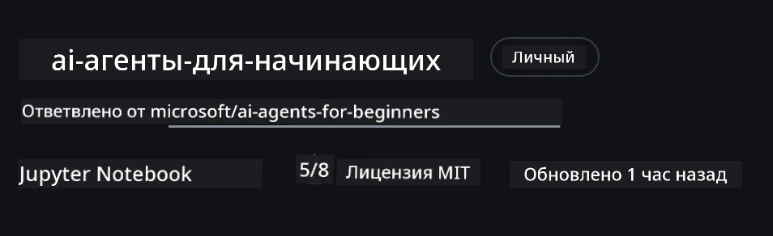
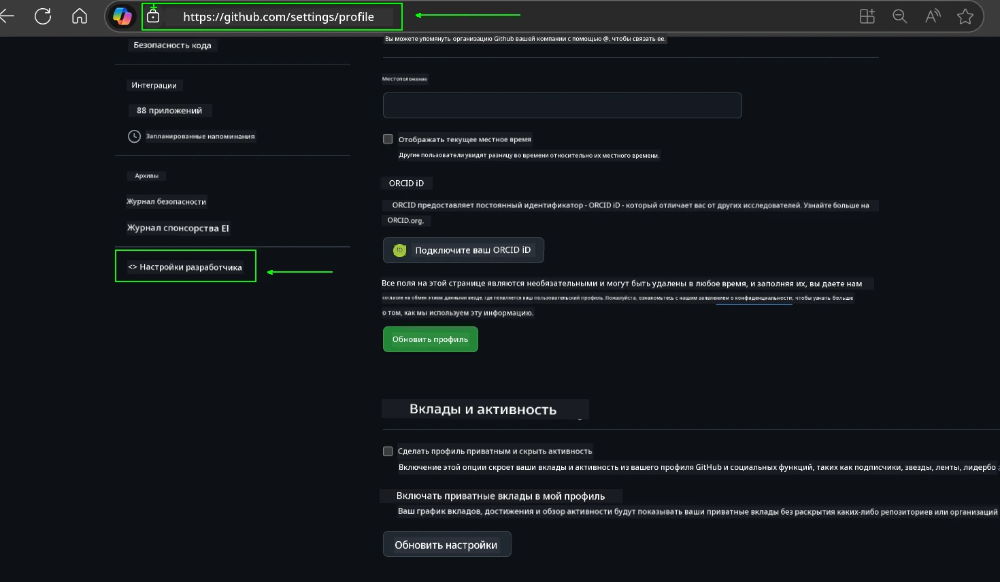
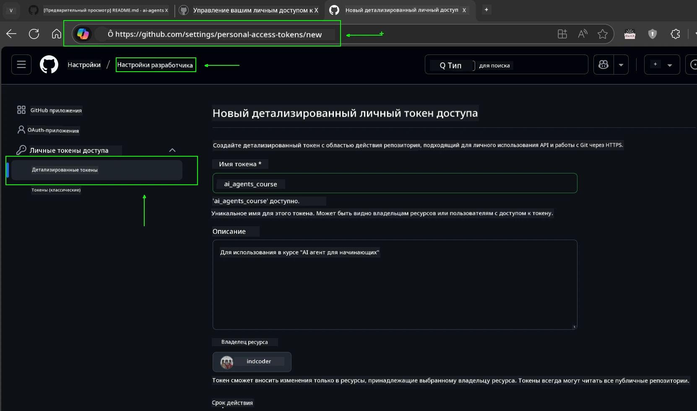
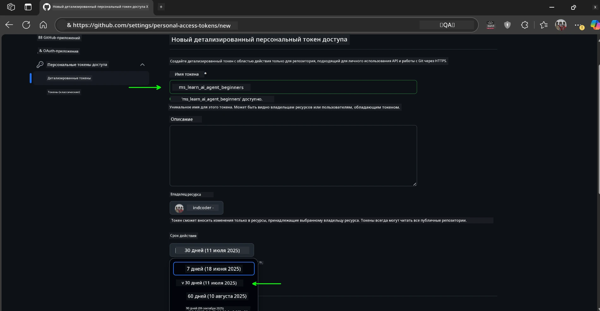
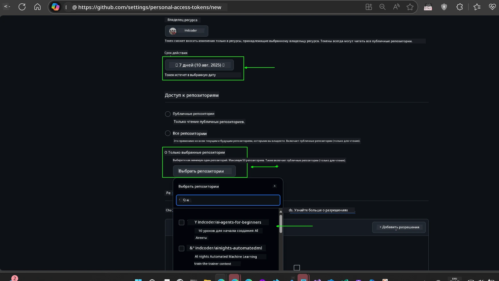
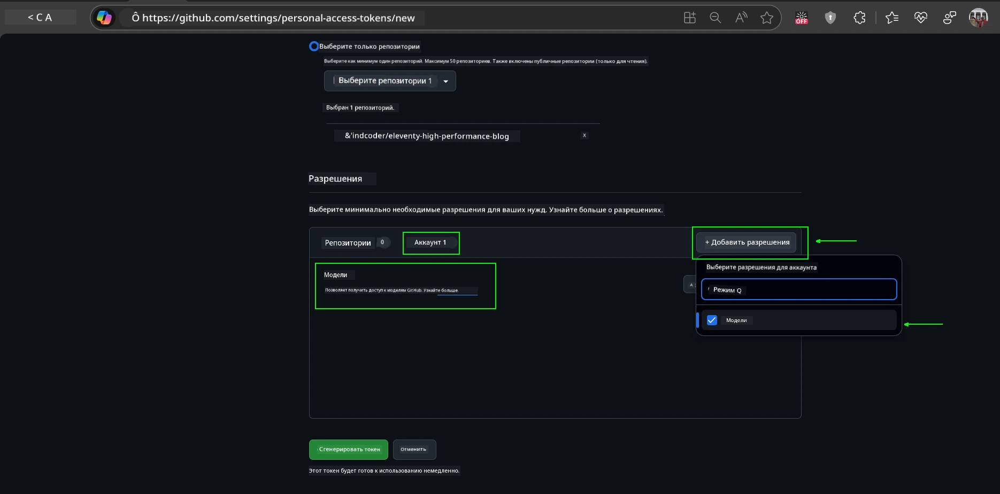
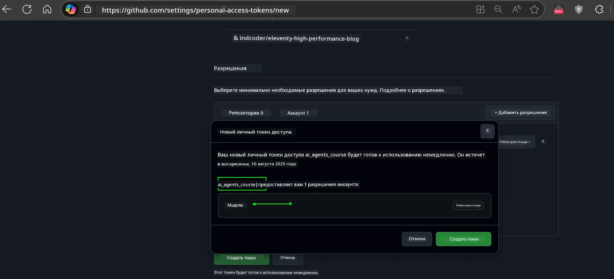
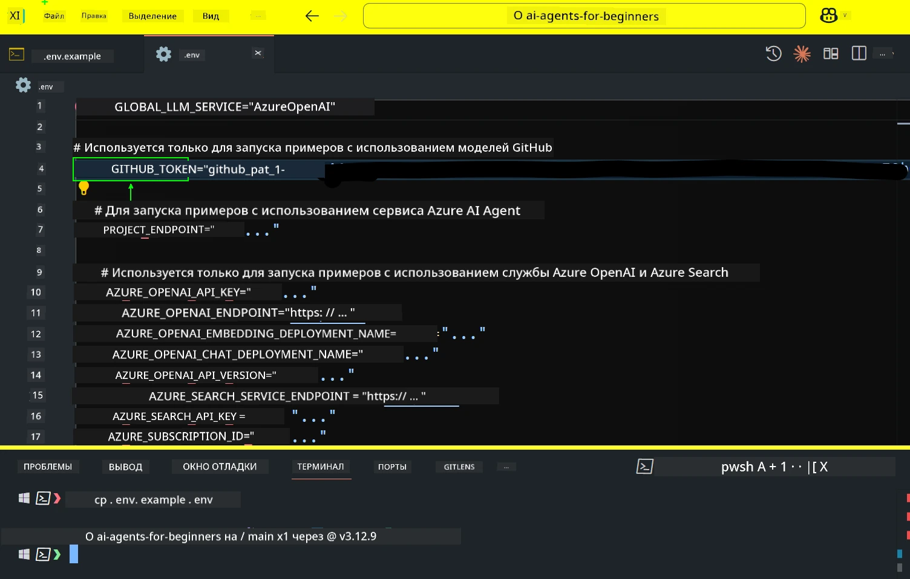
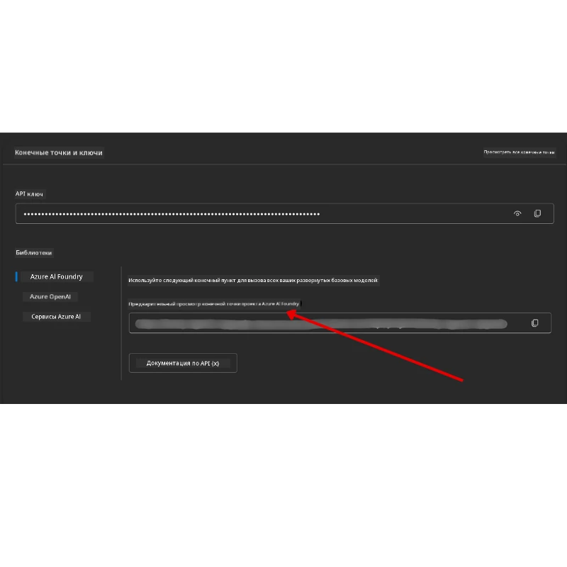

<!--
CO_OP_TRANSLATOR_METADATA:
{
  "original_hash": "63b1a8f6e840df15934935b728e569f0",
  "translation_date": "2025-12-03T13:46:13+00:00",
  "source_file": "00-course-setup/README.md",
  "language_code": "ru"
}
-->
# Настройка курса

## Введение

В этом уроке мы рассмотрим, как запускать примеры кода из данного курса.

## Присоединяйтесь к другим учащимся и получайте помощь

Прежде чем начать клонирование репозитория, присоединитесь к [каналу Discord для начинающих AI-агентов](https://aka.ms/ai-agents/discord), чтобы получить помощь с настройкой, задать вопросы о курсе или связаться с другими учащимися.

## Клонируйте или форкните этот репозиторий

Для начала клонируйте или форкните репозиторий GitHub. Это создаст вашу собственную версию материалов курса, чтобы вы могли запускать, тестировать и изменять код!

Это можно сделать, перейдя по ссылке <a href="https://github.com/microsoft/ai-agents-for-beginners/fork" target="_blank">форкнуть репозиторий</a>.

Теперь у вас должна быть ваша собственная форкнутая версия курса по следующей ссылке:



### Поверхностное клонирование (рекомендуется для воркшопов / Codespaces)

  >Полный репозиторий может быть большим (~3 ГБ), если вы загружаете всю историю и все файлы. Если вы участвуете только в воркшопе или вам нужны только несколько папок уроков, поверхностное клонирование (или выборочное клонирование) позволяет избежать большей части загрузки, сокращая историю и/или пропуская блобы.

#### Быстрое поверхностное клонирование — минимальная история, все файлы

Замените `<your-username>` в командах ниже на URL вашего форка (или URL исходного репозитория, если вы предпочитаете).

Чтобы клонировать только последнюю историю коммитов (небольшая загрузка):

```bash|powershell
git clone --depth 1 https://github.com/<your-username>/ai-agents-for-beginners.git
```

Чтобы клонировать определенную ветку:

```bash|powershell
git clone --depth 1 --branch <branch-name> https://github.com/<your-username>/ai-agents-for-beginners.git
```

#### Частичное (выборочное) клонирование — минимальные блобы + только выбранные папки

Это использует частичное клонирование и выборочную загрузку (требуется Git 2.25+ и рекомендуется современный Git с поддержкой частичного клонирования):

```bash|powershell
git clone --depth 1 --filter=blob:none --sparse https://github.com/<your-username>/ai-agents-for-beginners.git
```

Перейдите в папку репозитория:

```bash|powershell
cd ai-agents-for-beginners
```

Затем укажите, какие папки вам нужны (пример ниже показывает две папки):

```bash|powershell
git sparse-checkout set 00-course-setup 01-intro-to-ai-agents
```

После клонирования и проверки файлов, если вам нужны только файлы и вы хотите освободить место (без истории git), удалите метаданные репозитория (💀необратимо — вы потеряете всю функциональность Git: коммиты, pull, push или доступ к истории).

```bash
# zsh/bash
rm -rf .git
```

```powershell
# PowerShell
Remove-Item -Recurse -Force .git
```

#### Использование GitHub Codespaces (рекомендуется для избежания больших локальных загрузок)

- Создайте новый Codespace для этого репозитория через [интерфейс GitHub](https://github.com/codespaces).  

- В терминале нового Codespace выполните одну из команд поверхностного/выборочного клонирования выше, чтобы загрузить только нужные папки уроков в рабочую область Codespace.
- Опционально: после клонирования внутри Codespaces удалите .git, чтобы освободить дополнительное место (см. команды удаления выше).
- Примечание: Если вы предпочитаете открыть репозиторий напрямую в Codespaces (без дополнительного клонирования), учтите, что Codespaces создаст среду devcontainer и может все равно загрузить больше, чем вам нужно. Клонирование поверхностной копии внутри нового Codespace дает вам больше контроля над использованием дискового пространства.

#### Советы

- Всегда заменяйте URL клонирования на ваш форк, если вы хотите редактировать/коммитить.
- Если позже вам понадобится больше истории или файлов, вы можете их получить или настроить выборочную загрузку для включения дополнительных папок.

## Запуск кода

Этот курс предлагает серию Jupyter Notebooks, которые вы можете использовать для практического изучения создания AI-агентов.

Примеры кода используют:

**Требуется аккаунт GitHub - бесплатно**:

1) Semantic Kernel Agent Framework + GitHub Models Marketplace. Обозначено как (semantic-kernel.ipynb)
2) AutoGen Framework + GitHub Models Marketplace. Обозначено как (autogen.ipynb)

**Требуется подписка Azure**:

3) Azure AI Foundry + Azure AI Agent Service. Обозначено как (azureaiagent.ipynb)

Мы рекомендуем попробовать все три типа примеров, чтобы понять, какой из них лучше подходит для вас.

Какой бы вариант вы ни выбрали, он определит, какие шаги настройки вам нужно выполнить ниже:

## Требования

- Python 3.12+
  - **NOTE**: Если у вас не установлен Python 3.12, убедитесь, что вы его установили. Затем создайте виртуальную среду (venv) с использованием python3.12, чтобы гарантировать установку правильных версий из файла requirements.txt.
  
    >Пример

    Создайте директорию виртуальной среды Python:

    ```bash|powershell
    python -m venv venv
    ```

    Затем активируйте виртуальную среду для:

    ```bash
    # zsh/bash
    source venv/bin/activate
    ```
  
    ```dos
    # Command Prompt for Windows
    venv\Scripts\activate
    ```

- .NET 10+: Для примеров кода, использующих .NET, убедитесь, что вы установили [.NET 10 SDK](https://dotnet.microsoft.com/download/dotnet/10.0) или более позднюю версию. Затем проверьте установленную версию SDK .NET:

    ```bash|powershell
    dotnet --list-sdks
    ```

- Аккаунт GitHub - для доступа к GitHub Models Marketplace
- Подписка Azure - для доступа к Azure AI Foundry
- Аккаунт Azure AI Foundry - для доступа к Azure AI Agent Service

Мы включили файл `requirements.txt` в корневую директорию этого репозитория, который содержит все необходимые пакеты Python для запуска примеров кода.

Вы можете установить их, выполнив следующую команду в терминале в корневой директории репозитория:

```bash|powershell
pip install -r requirements.txt
```

Мы рекомендуем создать виртуальную среду Python, чтобы избежать конфликтов и проблем.

## Настройка VSCode

Убедитесь, что вы используете правильную версию Python в VSCode.


## Настройка для примеров с использованием моделей GitHub 

### Шаг 1: Получите ваш персональный токен доступа GitHub (PAT)

Этот курс использует GitHub Models Marketplace, предоставляя бесплатный доступ к большим языковым моделям (LLMs), которые вы будете использовать для создания AI-агентов.

Чтобы использовать модели GitHub, вам нужно создать [персональный токен доступа GitHub](https://docs.github.com/en/authentication/keeping-your-account-and-data-secure/managing-your-personal-access-tokens).

Это можно сделать, перейдя в <a href="https://github.com/settings/personal-access-tokens" target="_blank">настройки персональных токенов доступа</a> в вашем аккаунте GitHub.

Пожалуйста, следуйте [принципу минимальных привилегий](https://docs.github.com/en/get-started/learning-to-code/storing-your-secrets-safely) при создании токена. Это означает, что вы должны предоставить токену только те разрешения, которые необходимы для запуска примеров кода в этом курсе.

1. Выберите опцию `Fine-grained tokens` на левой стороне экрана, перейдя в **Developer settings**.

   

   Затем выберите `Generate new token`.

   

2. Введите описательное имя для вашего токена, которое отражает его назначение, чтобы его было легко идентифицировать позже.

    🔐 Рекомендация по сроку действия токена

    Рекомендуемый срок действия: 30 дней
    Для более безопасного подхода вы можете выбрать более короткий период — например, 7 дней 🛡️
    Это отличный способ установить личную цель и завершить курс, пока ваш учебный настрой высок 🚀.

    

3. Ограничьте область действия токена вашим форком этого репозитория.

    

4. Ограничьте разрешения токена: В разделе **Permissions** нажмите вкладку **Account** и кнопку "+ Add permissions". Появится выпадающее меню. Найдите **Models** и установите галочку.

    

5. Проверьте необходимые разрешения перед созданием токена. 

6. Перед созданием токена убедитесь, что вы готовы сохранить токен в безопасном месте, например, в хранилище паролей, так как он не будет показан снова после создания. 

Скопируйте ваш новый токен, который вы только что создали. Теперь вы добавите его в файл `.env`, включенный в этот курс.

### Шаг 2: Создайте ваш файл `.env`

Чтобы создать файл `.env`, выполните следующую команду в терминале.

```bash
# zsh/bash
cp .env.example .env
```

```powershell
# PowerShell
Copy-Item .env.example .env
```

Это скопирует пример файла и создаст `.env` в вашей директории, где вы заполните значения для переменных окружения.

Скопировав ваш токен, откройте файл `.env` в вашем любимом текстовом редакторе и вставьте ваш токен в поле `GITHUB_TOKEN`.



Теперь вы должны быть готовы к запуску примеров кода из этого курса.

## Настройка для примеров с использованием Azure AI Foundry и Azure AI Agent Service

### Шаг 1: Получите конечную точку вашего проекта Azure

Следуйте шагам по созданию хаба и проекта в Azure AI Foundry, описанным здесь: [Обзор ресурсов хаба](https://learn.microsoft.com/azure/ai-foundry/concepts/ai-resources)

После создания проекта вам нужно будет получить строку подключения для вашего проекта.

Это можно сделать, перейдя на страницу **Overview** вашего проекта в портале Azure AI Foundry.



### Шаг 2: Создайте ваш файл `.env`

Чтобы создать файл `.env`, выполните следующую команду в терминале.

```bash
# zsh/bash
cp .env.example .env
```

```powershell
# PowerShell
Copy-Item .env.example .env
```

Это скопирует пример файла и создаст `.env` в вашей директории, где вы заполните значения для переменных окружения.

Скопировав ваш токен, откройте файл `.env` в вашем любимом текстовом редакторе и вставьте ваш токен в поле `PROJECT_ENDPOINT`.

### Шаг 3: Войдите в Azure

В целях безопасности мы будем использовать [аутентификацию без ключей](https://learn.microsoft.com/azure/developer/ai/keyless-connections?tabs=csharp%2Cazure-cli?WT.mc_id=academic-105485-koreyst) для аутентификации в Azure OpenAI с помощью Microsoft Entra ID. 

Далее откройте терминал и выполните команду `az login --use-device-code`, чтобы войти в ваш аккаунт Azure.

После входа выберите вашу подписку в терминале.

## Дополнительные переменные окружения - Azure Search и Azure OpenAI 

Для урока Agentic RAG - Урок 5 - есть примеры, которые используют Azure Search и Azure OpenAI.

Если вы хотите запустить эти примеры, вам нужно будет добавить следующие переменные окружения в ваш файл `.env`:

### Страница обзора (Проект)

- `AZURE_SUBSCRIPTION_ID` - Проверьте **Project details** на странице **Overview** вашего проекта.

- `AZURE_AI_PROJECT_NAME` - Посмотрите в верхней части страницы **Overview** вашего проекта.

- `AZURE_OPENAI_SERVICE` - Найдите это на вкладке **Included capabilities** для **Azure OpenAI Service** на странице **Overview**.

### Центр управления

- `AZURE_OPENAI_RESOURCE_GROUP` - Перейдите в **Project properties** на странице **Overview** в **Management Center**.

- `GLOBAL_LLM_SERVICE` - В разделе **Connected resources** найдите имя подключения **Azure AI Services**. Если не указано, проверьте **Azure portal** в вашей группе ресурсов для имени ресурса AI Services.

### Страница моделей + конечных точек

- `AZURE_OPENAI_EMBEDDING_DEPLOYMENT_NAME` - Выберите вашу модель для встраивания (например, `text-embedding-ada-002`) и запишите **Deployment name** из деталей модели.

- `AZURE_OPENAI_CHAT_DEPLOYMENT_NAME` - Выберите вашу модель для чата (например, `gpt-4o-mini`) и запишите **Deployment name** из деталей модели.

### Портал Azure

- `AZURE_OPENAI_ENDPOINT` - Найдите **Azure AI services**, нажмите на него, затем перейдите в **Resource Management**, **Keys and Endpoint**, прокрутите вниз до "Azure OpenAI endpoints" и скопируйте тот, который называется "Language APIs".

- `AZURE_OPENAI_API_KEY` - На той же странице скопируйте KEY 1 или KEY 2.

- `AZURE_SEARCH_SERVICE_ENDPOINT` - Найдите ваш ресурс **Azure AI Search**, нажмите на него и посмотрите **Overview**.

- `AZURE_SEARCH_API_KEY` - Затем перейдите в **Settings**, затем **Keys**, чтобы скопировать основной или вторичный административный ключ.

### Внешняя веб-страница

- `AZURE_OPENAI_API_VERSION` - Посетите страницу [API version lifecycle](https://learn.microsoft.com/azure/ai-services/openai/api-version-deprecation#latest-ga-api-release) в разделе **Latest GA API release**.

### Настройка аутентификации без ключей

Вместо жесткого кодирования ваших учетных данных мы будем использовать подключение без ключей с Azure OpenAI. Для этого мы импортируем `DefaultAzureCredential`, а затем вызовем функцию `DefaultAzureCredential`, чтобы получить учетные данные.

```python
# Питон
from azure.identity import DefaultAzureCredential, InteractiveBrowserCredential
```

## Застряли где-то?
Если у вас возникли проблемы с запуском этой настройки, присоединяйтесь к нашему <a href="https://discord.gg/kzRShWzttr" target="_blank">Discord-сообществу Azure AI</a> или <a href="https://github.com/microsoft/ai-agents-for-beginners/issues?WT.mc_id=academic-105485-koreyst" target="_blank">создайте запрос</a>.

## Следующий урок

Теперь вы готовы запустить код для этого курса. Приятного изучения мира AI-агентов!

[Введение в AI-агентов и примеры их использования](../01-intro-to-ai-agents/README.md)

---

<!-- CO-OP TRANSLATOR DISCLAIMER START -->
**Отказ от ответственности**:  
Этот документ был переведен с помощью сервиса автоматического перевода [Co-op Translator](https://github.com/Azure/co-op-translator). Несмотря на наши усилия обеспечить точность, автоматический перевод может содержать ошибки или неточности. Оригинальный документ на его родном языке следует считать авторитетным источником. Для получения критически важной информации рекомендуется профессиональный перевод человеком. Мы не несем ответственности за любые недоразумения или неправильные интерпретации, возникшие в результате использования данного перевода.
<!-- CO-OP TRANSLATOR DISCLAIMER END -->