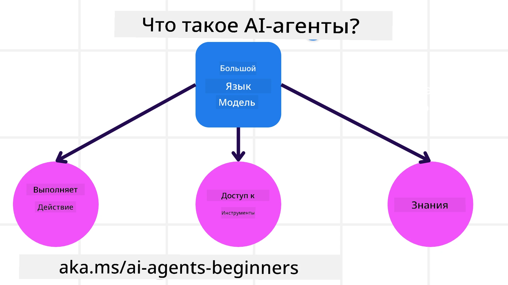
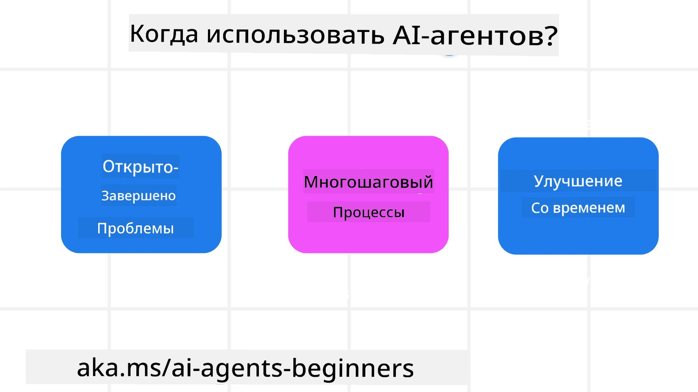

<!--
CO_OP_TRANSLATOR_METADATA:
{
  "original_hash": "cdd28bc00816d2773bb2b5968d782abc",
  "translation_date": "2025-11-11T10:50:07+00:00",
  "source_file": "01-intro-to-ai-agents/README.md",
  "language_code": "ru"
}
-->

> _(Нажмите на изображение выше, чтобы посмотреть видео этого урока)_

# Введение в AI-агентов и их применение

Добро пожаловать на курс "AI-агенты для начинающих"! Этот курс предоставляет базовые знания и примеры применения для создания AI-агентов.

Присоединяйтесь к <a href="https://discord.gg/kzRShWzttr" target="_blank">сообществу Azure AI в Discord</a>, чтобы познакомиться с другими учащимися и разработчиками AI-агентов, а также задать любые вопросы по курсу.

Начнем курс с изучения того, что такое AI-агенты и как их можно использовать в приложениях и рабочих процессах, которые мы создаем.

## Введение

Этот урок охватывает:

- Что такое AI-агенты и какие существуют их типы?
- Какие случаи применения лучше всего подходят для AI-агентов и как они могут нам помочь?
- Какие основные элементы нужно учитывать при проектировании решений с использованием агентов?

## Цели обучения
После завершения этого урока вы сможете:

- Понять концепцию AI-агентов и их отличие от других AI-решений.
- Эффективно применять AI-агентов.
- Продуктивно проектировать решения с использованием агентов для пользователей и клиентов.

## Определение AI-агентов и их типы

### Что такое AI-агенты?

AI-агенты — это **системы**, которые позволяют **моделям обработки естественного языка (LLMs)** **выполнять действия**, расширяя их возможности за счет предоставления **доступа к инструментам** и **знаниям**.

Разберем это определение на части:

- **Система** — важно рассматривать агентов не как отдельный компонент, а как систему из множества компонентов. На базовом уровне компоненты AI-агента включают:
  - **Среда** — определенное пространство, в котором работает AI-агент. Например, если у нас есть агент для бронирования путешествий, средой может быть система бронирования, которую агент использует для выполнения задач.
  - **Сенсоры** — среды содержат информацию и предоставляют обратную связь. AI-агенты используют сенсоры для сбора и интерпретации информации о текущем состоянии среды. В примере с агентом бронирования путешествий система бронирования может предоставлять информацию, такую как доступность отелей или цены на авиабилеты.
  - **Актуаторы** — после получения текущего состояния среды агент определяет, какое действие выполнить, чтобы изменить среду. Для агента бронирования путешествий это может быть бронирование доступного номера для пользователя.

**Модели обработки естественного языка** — концепция агентов существовала до появления LLMs. Преимущество создания AI-агентов с использованием LLMs заключается в их способности интерпретировать человеческий язык и данные. Эта способность позволяет LLMs интерпретировать информацию о среде и определять план действий для ее изменения.

**Выполнение действий** — вне систем AI-агентов LLMs ограничены ситуациями, где действие заключается в генерации контента или информации на основе запроса пользователя. Внутри систем AI-агентов LLMs могут выполнять задачи, интерпретируя запрос пользователя и используя доступные инструменты в своей среде.

**Доступ к инструментам** — доступные инструменты для LLMs определяются 1) средой, в которой они работают, и 2) разработчиком AI-агента. В примере с агентом бронирования путешествий инструменты агента ограничены операциями, доступными в системе бронирования, и/или разработчик может ограничить доступ агента к инструментам, связанным с авиаперелетами.

**Память+Знания** — память может быть краткосрочной в контексте разговора между пользователем и агентом. В долгосрочной перспективе, помимо информации, предоставляемой средой, AI-агенты могут также извлекать знания из других систем, сервисов, инструментов и даже других агентов. В примере с агентом путешествий такими знаниями может быть информация о предпочтениях пользователя, хранящаяся в базе данных клиентов.

### Различные типы агентов

Теперь, когда у нас есть общее определение AI-агентов, давайте рассмотрим конкретные типы агентов и их применение на примере агента бронирования путешествий.

| **Тип агента**                | **Описание**                                                                                                                       | **Пример**                                                                                                                                                                                                                   |
| ----------------------------- | ------------------------------------------------------------------------------------------------------------------------------------- | ----------------------------------------------------------------------------------------------------------------------------------------------------------------------------------------------------------------------------- |
| **Агенты простых рефлексов**  | Выполняют немедленные действия на основе заранее определенных правил.                                                                | Агент путешествий интерпретирует контекст письма и перенаправляет жалобы на путешествия в службу поддержки клиентов.                                                                                                          |
| **Агенты на основе моделей**  | Выполняют действия на основе модели мира и изменений в этой модели.                                                                  | Агент путешествий приоритизирует маршруты с существенными изменениями цен, используя доступ к историческим данным о ценах.                                                                                                   |
| **Агенты, ориентированные на цели** | Создают планы для достижения конкретных целей, интерпретируя цель и определяя действия для ее достижения.                              | Агент путешествий бронирует поездку, определяя необходимые транспортные средства (автомобиль, общественный транспорт, авиаперелеты) от текущего местоположения до пункта назначения.                                           |
| **Агенты, ориентированные на полезность** | Учитывают предпочтения и взвешивают компромиссы численно, чтобы определить, как достичь целей.                                      | Агент путешествий максимизирует полезность, взвешивая удобство против стоимости при бронировании путешествия.                                                                                                                |
| **Обучающиеся агенты**        | Улучшаются со временем, реагируя на обратную связь и корректируя действия.                                                            | Агент путешествий улучшает свои действия, используя отзывы клиентов из опросов после поездки для внесения изменений в будущие бронирования.                                                                                   |
| **Иерархические агенты**      | Включают несколько агентов в многоуровневой системе, где агенты более высокого уровня разбивают задачи на подзадачи для выполнения агентами более низкого уровня. | Агент путешествий отменяет поездку, разделяя задачу на подзадачи (например, отмена конкретных бронирований) и поручая их выполнение агентам более низкого уровня, которые отчитываются перед агентом более высокого уровня. |
| **Системы с несколькими агентами (MAS)** | Агенты выполняют задачи независимо, либо кооперативно, либо конкурентно.                                                          | Кооперативно: Несколько агентов бронируют конкретные услуги путешествий, такие как отели, авиабилеты и развлечения. Конкурентно: Несколько агентов управляют и конкурируют за общий календарь бронирования отеля, чтобы разместить клиентов в отеле. |

## Когда использовать AI-агентов

В предыдущем разделе мы использовали пример агента путешествий, чтобы объяснить, как разные типы агентов могут быть использованы в различных сценариях бронирования путешествий. Мы продолжим использовать это приложение на протяжении всего курса.

Давайте рассмотрим типы случаев применения, для которых AI-агенты подходят лучше всего:

- **Открытые задачи** — предоставление LLM возможности определить необходимые шаги для выполнения задачи, поскольку их не всегда можно жестко запрограммировать в рабочем процессе.
- **Многошаговые процессы** — задачи, требующие определенного уровня сложности, при котором AI-агенту необходимо использовать инструменты или информацию в течение нескольких шагов, а не за один запрос.
- **Улучшение со временем** — задачи, где агент может улучшаться со временем, получая обратную связь от своей среды или пользователей, чтобы предоставлять большую полезность.

Мы рассмотрим дополнительные аспекты использования AI-агентов в уроке "Создание надежных AI-агентов".

## Основы решений с использованием агентов

### Разработка агентов

Первый шаг в проектировании системы AI-агента — определить инструменты, действия и поведение. В этом курсе мы сосредоточимся на использовании **Azure AI Agent Service** для определения наших агентов. Он предлагает такие функции, как:

- Выбор открытых моделей, таких как OpenAI, Mistral и Llama
- Использование лицензированных данных через провайдеров, таких как Tripadvisor
- Использование стандартизированных инструментов OpenAPI 3.0

### Шаблоны взаимодействия с агентами

Общение с LLMs происходит через запросы. Учитывая полуавтономный характер AI-агентов, не всегда возможно или необходимо вручную повторно отправлять запрос LLM после изменения среды. Мы используем **шаблоны взаимодействия с агентами**, которые позволяют нам отправлять запросы LLM на протяжении нескольких шагов более масштабируемым способом.

Этот курс разделен на некоторые из популярных шаблонов взаимодействия с агентами.

### Фреймворки для агентов

Фреймворки для агентов позволяют разработчикам реализовывать шаблоны взаимодействия через код. Эти фреймворки предлагают шаблоны, плагины и инструменты для лучшего сотрудничества AI-агентов. Эти преимущества обеспечивают возможности для лучшей наблюдаемости и устранения неполадок в системах AI-агентов.

В этом курсе мы изучим исследовательский фреймворк AutoGen и готовый к производству фреймворк Agent от Semantic Kernel.

## Примеры кода

- Python: [Фреймворк для агентов](./code_samples/01-python-agent-framework.ipynb)
- .NET: [Фреймворк для агентов](./code_samples/01-dotnet-agent-framework.md)

## Остались вопросы о AI-агентах?

Присоединяйтесь к [Azure AI Foundry Discord](https://aka.ms/ai-agents/discord), чтобы встретиться с другими учащимися, посетить часы консультаций и получить ответы на свои вопросы о AI-агентах.

## Предыдущий урок

[Настройка курса](../00-course-setup/README.md)

## Следующий урок

[Изучение фреймворков для агентов](../02-explore-agentic-frameworks/README.md)

---

<!-- CO-OP TRANSLATOR DISCLAIMER START -->
**Отказ от ответственности**:  
Этот документ был переведен с использованием сервиса автоматического перевода [Co-op Translator](https://github.com/Azure/co-op-translator). Несмотря на наши усилия обеспечить точность, автоматические переводы могут содержать ошибки или неточности. Оригинальный документ на его родном языке следует считать авторитетным источником. Для получения критически важной информации рекомендуется профессиональный перевод человеком. Мы не несем ответственности за любые недоразумения или неправильные интерпретации, возникающие в результате использования данного перевода.
<!-- CO-OP TRANSLATOR DISCLAIMER END -->