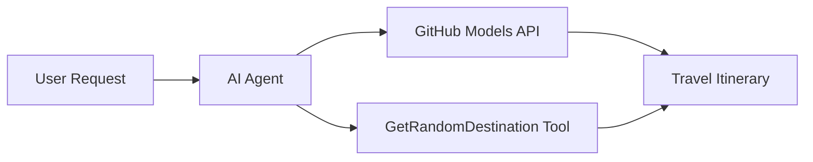

<!--
CO_OP_TRANSLATOR_METADATA:
{
  "original_hash": "5f351412e934f0833c8c821a0a60efaf",
  "translation_date": "2025-11-13T10:58:48+00:00",
  "source_file": "01-intro-to-ai-agents/code_samples/01-dotnet-agent-framework.md",
  "language_code": "ru"
}
-->
# 🌍 AI Туристический Агент с Microsoft Agent Framework (.NET)

## 📋 Обзор сценария

Этот пример демонстрирует, как создать интеллектуального агента для планирования путешествий с использованием Microsoft Agent Framework для .NET. Агента можно настроить на автоматическое создание персонализированных маршрутов для однодневных поездок в случайные места по всему миру.

### Основные возможности:

- 🎲 **Случайный выбор направления**: Использует пользовательский инструмент для выбора мест отдыха
- 🗺️ **Интеллектуальное планирование поездок**: Создает подробные маршруты по дням
- 🔄 **Потоковая передача в реальном времени**: Поддерживает как мгновенные, так и потоковые ответы
- 🛠️ **Интеграция пользовательских инструментов**: Демонстрирует, как расширить возможности агента

## 🔧 Техническая архитектура

### Основные технологии

- **Microsoft Agent Framework**: Последняя реализация .NET для разработки AI-агентов
- **Интеграция моделей GitHub**: Использует сервис инференса моделей GitHub
- **Совместимость с OpenAI API**: Использует клиентские библиотеки OpenAI с пользовательскими конечными точками
- **Безопасная конфигурация**: Управление API-ключами на основе окружения

### Основные компоненты

1. **AIAgent**: Основной оркестратор агента, управляющий потоком общения
2. **Пользовательские инструменты**: Функция `GetRandomDestination()` доступна агенту
3. **Клиент чата**: Интерфейс общения, поддерживаемый моделями GitHub
4. **Поддержка потоковой передачи**: Возможности генерации ответов в реальном времени

### Схема интеграции



## 🚀 Начало работы

### Предварительные требования

- [.NET 10 SDK](https://dotnet.microsoft.com/download/dotnet/10.0) или выше
- [Токен доступа к API моделей GitHub](https://docs.github.com/github-models/github-models-at-scale/using-your-own-api-keys-in-github-models)

### Необходимые переменные окружения

```bash
# zsh/bash
export GH_TOKEN=<your_github_token>
export GH_ENDPOINT=https://models.github.ai/inference
export GH_MODEL_ID=openai/gpt-5-mini
```

```powershell
# PowerShell
$env:GH_TOKEN = "<your_github_token>"
$env:GH_ENDPOINT = "https://models.github.ai/inference"
$env:GH_MODEL_ID = "openai/gpt-5-mini"
```

### Пример кода

Чтобы запустить пример кода,

```bash
# zsh/bash
chmod +x ./01-dotnet-agent-framework.cs
./01-dotnet-agent-framework.cs
```

Или используя CLI dotnet:

```bash
dotnet run ./01-dotnet-agent-framework.cs
```

См. [`01-dotnet-agent-framework.cs`](../../../../01-intro-to-ai-agents/code_samples/01-dotnet-agent-framework.cs) для полного кода.

```csharp
#!/usr/bin/dotnet run

#:package Microsoft.Extensions.AI@9.*
#:package Microsoft.Agents.AI.OpenAI@1.*-*

using System.ClientModel;
using System.ComponentModel;

using Microsoft.Agents.AI;
using Microsoft.Extensions.AI;

using OpenAI;

// Tool Function: Random Destination Generator
// This static method will be available to the agent as a callable tool
// The [Description] attribute helps the AI understand when to use this function
// This demonstrates how to create custom tools for AI agents
[Description("Provides a random vacation destination.")]
static string GetRandomDestination()
{
    // List of popular vacation destinations around the world
    // The agent will randomly select from these options
    var destinations = new List<string>
    {
        "Paris, France",
        "Tokyo, Japan",
        "New York City, USA",
        "Sydney, Australia",
        "Rome, Italy",
        "Barcelona, Spain",
        "Cape Town, South Africa",
        "Rio de Janeiro, Brazil",
        "Bangkok, Thailand",
        "Vancouver, Canada"
    };

    // Generate random index and return selected destination
    // Uses System.Random for simple random selection
    var random = new Random();
    int index = random.Next(destinations.Count);
    return destinations[index];
}

// Extract configuration from environment variables
// Retrieve the GitHub Models API endpoint, defaults to https://models.github.ai/inference if not specified
// Retrieve the model ID, defaults to openai/gpt-5-mini if not specified
// Retrieve the GitHub token for authentication, throws exception if not specified
var github_endpoint = Environment.GetEnvironmentVariable("GH_ENDPOINT") ?? "https://models.github.ai/inference";
var github_model_id = Environment.GetEnvironmentVariable("GH_MODEL_ID") ?? "openai/gpt-5-mini";
var github_token = Environment.GetEnvironmentVariable("GH_TOKEN") ?? throw new InvalidOperationException("GH_TOKEN is not set.");

// Configure OpenAI Client Options
// Create configuration options to point to GitHub Models endpoint
// This redirects OpenAI client calls to GitHub's model inference service
var openAIOptions = new OpenAIClientOptions()
{
    Endpoint = new Uri(github_endpoint)
};

// Initialize OpenAI Client with GitHub Models Configuration
// Create OpenAI client using GitHub token for authentication
// Configure it to use GitHub Models endpoint instead of OpenAI directly
var openAIClient = new OpenAIClient(new ApiKeyCredential(github_token), openAIOptions);

// Create AI Agent with Travel Planning Capabilities
// Initialize OpenAI client, get chat client for specified model, and create AI agent
// Configure agent with travel planning instructions and random destination tool
// The agent can now plan trips using the GetRandomDestination function
AIAgent agent = openAIClient
    .GetChatClient(github_model_id)
    .CreateAIAgent(
        instructions: "You are a helpful AI Agent that can help plan vacations for customers at random destinations",
        tools: [AIFunctionFactory.Create(GetRandomDestination)]
    );

// Execute Agent: Plan a Day Trip
// Run the agent with streaming enabled for real-time response display
// Shows the agent's thinking and response as it generates the content
// Provides better user experience with immediate feedback
await foreach (var update in agent.RunStreamingAsync("Plan me a day trip"))
{
    await Task.Delay(10);
    Console.Write(update);
}
```

## 🎓 Основные выводы

1. **Архитектура агента**: Microsoft Agent Framework предоставляет чистый, типобезопасный подход к созданию AI-агентов в .NET
2. **Интеграция инструментов**: Функции, украшенные атрибутами `[Description]`, становятся доступными инструментами для агента
3. **Управление конфигурацией**: Переменные окружения и безопасная обработка учетных данных соответствуют лучшим практикам .NET
4. **Совместимость с OpenAI**: Интеграция моделей GitHub работает без проблем через API, совместимые с OpenAI

## 🔗 Дополнительные ресурсы

- [Документация Microsoft Agent Framework](https://learn.microsoft.com/agent-framework)
- [Маркетплейс моделей GitHub](https://github.com/marketplace?type=models)
- [Microsoft.Extensions.AI](https://learn.microsoft.com/dotnet/ai/microsoft-extensions-ai)
- [.NET Single File Apps](https://devblogs.microsoft.com/dotnet/announcing-dotnet-run-app)

---

<!-- CO-OP TRANSLATOR DISCLAIMER START -->
**Отказ от ответственности**:  
Этот документ был переведен с использованием сервиса автоматического перевода [Co-op Translator](https://github.com/Azure/co-op-translator). Хотя мы стремимся к точности, пожалуйста, учитывайте, что автоматические переводы могут содержать ошибки или неточности. Оригинальный документ на его родном языке следует считать авторитетным источником. Для получения критически важной информации рекомендуется профессиональный перевод человеком. Мы не несем ответственности за любые недоразумения или неправильные интерпретации, возникшие в результате использования данного перевода.
<!-- CO-OP TRANSLATOR DISCLAIMER END -->