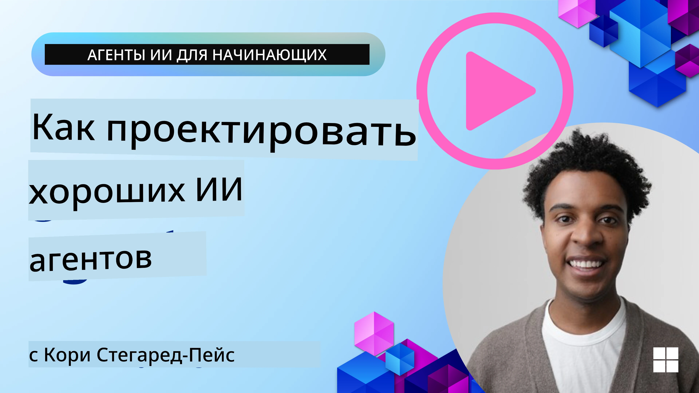
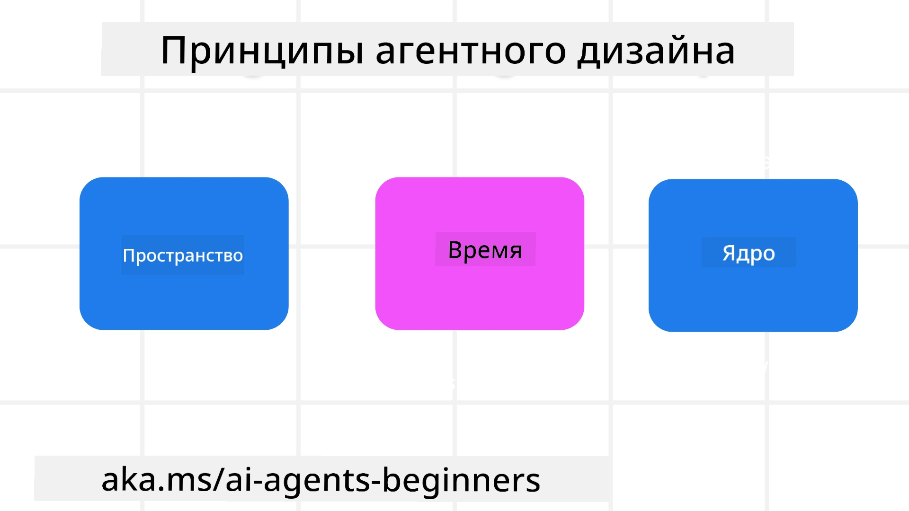

<!--
CO_OP_TRANSLATOR_METADATA:
{
  "original_hash": "d71524fe83a23829ae7a23b4031aaac8",
  "translation_date": "2025-11-13T11:00:30+00:00",
  "source_file": "03-agentic-design-patterns/README.md",
  "language_code": "ru"
}
-->

> _(Нажмите на изображение выше, чтобы посмотреть видео этого урока)_
# Принципы проектирования агентных систем AI

## Введение

Существует множество подходов к созданию агентных систем AI. Учитывая, что неоднозначность является особенностью, а не недостатком в дизайне генеративного AI, инженерам иногда сложно понять, с чего начать. Мы разработали набор принципов UX-дизайна, ориентированных на человека, чтобы помочь разработчикам создавать агентные системы, ориентированные на клиента, для решения их бизнес-задач. Эти принципы дизайна не являются предписывающей архитектурой, а скорее отправной точкой для команд, которые определяют и разрабатывают агентные интерфейсы.

В общем, агенты должны:

- Расширять и масштабировать человеческие возможности (мозговой штурм, решение проблем, автоматизация и т.д.)
- Заполнять пробелы в знаниях (помогать освоить новые области знаний, перевод и т.д.)
- Способствовать и поддерживать сотрудничество в тех формах, которые мы предпочитаем для работы с другими
- Делать нас лучшими версиями самих себя (например, коуч по жизни/организатор задач, помощь в освоении навыков эмоциональной регуляции и осознанности, развитие устойчивости и т.д.)

## В этом уроке мы рассмотрим

- Что такое принципы проектирования агентных систем
- Какие рекомендации следует учитывать при реализации этих принципов
- Примеры использования принципов проектирования

## Цели обучения

После завершения этого урока вы сможете:

1. Объяснить, что такое принципы проектирования агентных систем
2. Объяснить рекомендации по использованию принципов проектирования агентных систем
3. Понять, как создать агента, используя принципы проектирования агентных систем

## Принципы проектирования агентных систем

### Агент (Пространство)

Это среда, в которой действует агент. Эти принципы определяют, как мы проектируем агентов для взаимодействия в физических и цифровых мирах.

- **Соединять, а не разрушать** – помогать людям соединяться с другими людьми, событиями и полезной информацией для содействия сотрудничеству и взаимодействию.
- Агенты помогают соединять события, знания и людей.
- Агенты сближают людей. Они не предназначены для замены или умаления роли человека.
- **Легко доступный, но иногда невидимый** – агент в основном работает в фоновом режиме и вмешивается только тогда, когда это уместно и необходимо.
  - Агент легко обнаруживается и доступен для авторизованных пользователей на любом устройстве или платформе.
  - Агент поддерживает мультимодальные входы и выходы (звук, голос, текст и т.д.).
  - Агент может плавно переходить между передним и задним планом; между проактивным и реактивным режимами, в зависимости от потребностей пользователя.
  - Агент может работать в невидимой форме, но его процесс в фоновом режиме и взаимодействие с другими агентами прозрачны и контролируемы пользователем.

### Агент (Время)

Это то, как агент действует во времени. Эти принципы определяют, как мы проектируем агентов для взаимодействия с прошлым, настоящим и будущим.

- **Прошлое**: Анализ истории, включая состояние и контекст.
  - Агент предоставляет более релевантные результаты на основе анализа богатых исторических данных, а не только событий, людей или состояний.
  - Агент создает связи с прошлыми событиями и активно использует память для взаимодействия с текущими ситуациями.
- **Настоящее**: Подталкивать, а не просто уведомлять.
  - Агент предлагает комплексный подход к взаимодействию с людьми. Когда происходит событие, агент выходит за рамки статического уведомления или формальности. Агент может упрощать процессы или динамически генерировать подсказки, чтобы направить внимание пользователя в нужный момент.
  - Агент предоставляет информацию, учитывая контекст, социальные и культурные изменения, а также намерения пользователя.
  - Взаимодействие с агентом может быть постепенным, развивающимся/усложняющимся со временем, чтобы поддерживать пользователя в долгосрочной перспективе.
- **Будущее**: Адаптация и развитие.
  - Агент адаптируется к различным устройствам, платформам и модальностям.
  - Агент адаптируется к поведению пользователя, его потребностям в доступности и свободно настраивается.
  - Агент формируется и развивается через постоянное взаимодействие с пользователем.

### Агент (Суть)

Это ключевые элементы в основе дизайна агента.

- **Принятие неопределенности, но установление доверия**.
  - Определенный уровень неопределенности агента ожидаем. Неопределенность является ключевым элементом дизайна агента.
  - Доверие и прозрачность – фундаментальные слои дизайна агента.
  - Человек контролирует, когда агент включен/выключен, и статус агента всегда четко виден.

## Рекомендации по реализации этих принципов

При использовании вышеуказанных принципов проектирования придерживайтесь следующих рекомендаций:

1. **Прозрачность**: Информируйте пользователя о том, что используется AI, как он работает (включая прошлые действия), и как можно оставить отзыв или изменить систему.
2. **Контроль**: Позвольте пользователю настраивать, указывать предпочтения и персонализировать систему, а также контролировать ее атрибуты (включая возможность забыть данные).
3. **Последовательность**: Стремитесь к последовательным мультимодальным взаимодействиям на всех устройствах и точках доступа. Используйте знакомые элементы UI/UX, где это возможно (например, значок микрофона для голосового взаимодействия), и максимально снижайте когнитивную нагрузку пользователя (например, стремитесь к лаконичным ответам, визуальным подсказкам и контенту «Узнать больше»).

## Как разработать туристического агента, используя эти принципы и рекомендации

Представьте, что вы разрабатываете туристического агента. Вот как можно использовать принципы и рекомендации:

1. **Прозрачность** – Сообщите пользователю, что туристический агент является агентом с поддержкой AI. Предоставьте базовые инструкции о том, как начать (например, сообщение «Привет», примеры подсказок). Четко укажите это на странице продукта. Покажите список подсказок, которые пользователь задавал ранее. Сделайте понятным, как оставить отзыв (кнопки «палец вверх» и «палец вниз», кнопка «Отправить отзыв» и т.д.). Четко обозначьте, если у агента есть ограничения по использованию или темам.
2. **Контроль** – Убедитесь, что пользователю понятно, как можно изменить агента после его создания, например, с помощью системной подсказки. Позвольте пользователю выбрать, насколько подробным будет агент, его стиль письма и любые ограничения на темы, которые агент не должен обсуждать. Дайте возможность пользователю просматривать и удалять связанные файлы или данные, подсказки и прошлые разговоры.
3. **Последовательность** – Убедитесь, что значки для «Поделиться подсказкой», добавления файла или фото, а также для упоминания кого-либо или чего-либо являются стандартными и узнаваемыми. Используйте значок скрепки для обозначения загрузки/обмена файлами с агентом и значок изображения для загрузки графики.

## Примеры кода

- Python: [Agent Framework](./code_samples/03-python-agent-framework.ipynb)
- .NET: [Agent Framework](./code_samples/03-dotnet-agent-framework.md)

## Есть вопросы о шаблонах проектирования агентных систем AI?

Присоединяйтесь к [Azure AI Foundry Discord](https://aka.ms/ai-agents/discord), чтобы встретиться с другими учащимися, посетить часы консультаций и получить ответы на свои вопросы о агентных системах AI.

## Дополнительные ресурсы

- <a href="https://openai.com" target="_blank">Практики управления агентными системами AI | OpenAI</a>
- <a href="https://microsoft.com" target="_blank">Проект HAX Toolkit - Microsoft Research</a>
- <a href="https://responsibleaitoolbox.ai" target="_blank">Инструментарий ответственного AI</a>

## Предыдущий урок

[Изучение агентных фреймворков](../02-explore-agentic-frameworks/README.md)

## Следующий урок

[Шаблон проектирования использования инструментов](../04-tool-use/README.md)

---

<!-- CO-OP TRANSLATOR DISCLAIMER START -->
**Отказ от ответственности**:  
Этот документ был переведен с использованием сервиса автоматического перевода [Co-op Translator](https://github.com/Azure/co-op-translator). Несмотря на наши усилия обеспечить точность, автоматический перевод может содержать ошибки или неточности. Оригинальный документ на его родном языке следует считать авторитетным источником. Для получения критически важной информации рекомендуется профессиональный перевод человеком. Мы не несем ответственности за любые недоразумения или неправильные толкования, возникшие в результате использования данного перевода.
<!-- CO-OP TRANSLATOR DISCLAIMER END -->