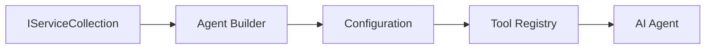

<!--
CO_OP_TRANSLATOR_METADATA:
{
  "original_hash": "bcc874e190347bd6a095aed56dc16de8",
  "translation_date": "2025-11-13T11:01:15+00:00",
  "source_file": "03-agentic-design-patterns/code_samples/03-dotnet-agent-framework.md",
  "language_code": "ru"
}
-->
# 🎨 Агентные шаблоны проектирования с моделями GitHub (.NET)

## 📋 Цели обучения

Этот пример демонстрирует шаблоны проектирования корпоративного уровня для создания интеллектуальных агентов с использованием Microsoft Agent Framework в .NET с интеграцией моделей GitHub. Вы узнаете профессиональные подходы и архитектурные решения, которые делают агентов готовыми к производству, удобными для сопровождения и масштабируемыми.

### Корпоративные шаблоны проектирования

- 🏭 **Шаблон фабрики**: Стандартизированное создание агентов с внедрением зависимостей
- 🔧 **Шаблон строителя**: Удобная конфигурация и настройка агентов
- 🧵 **Потокобезопасные шаблоны**: Управление параллельными диалогами
- 📋 **Шаблон репозитория**: Организованное управление инструментами и возможностями

## 🎯 Архитектурные преимущества .NET

### Корпоративные возможности

- **Строгая типизация**: Проверка на этапе компиляции и поддержка IntelliSense
- **Внедрение зависимостей**: Встроенная интеграция контейнера DI
- **Управление конфигурацией**: Шаблоны IConfiguration и Options
- **Async/Await**: Поддержка асинхронного программирования на высшем уровне

### Шаблоны, готовые к производству

- **Интеграция логирования**: Поддержка ILogger и структурированного логирования
- **Проверка состояния**: Встроенный мониторинг и диагностика
- **Проверка конфигурации**: Строгая типизация с аннотациями данных
- **Обработка ошибок**: Структурированное управление исключениями

## 🔧 Техническая архитектура

### Основные компоненты .NET

- **Microsoft.Extensions.AI**: Унифицированные абстракции AI-сервисов
- **Microsoft.Agents.AI**: Фреймворк для оркестрации корпоративных агентов
- **Интеграция моделей GitHub**: Высокопроизводительные шаблоны API-клиентов
- **Система конфигурации**: appsettings.json и интеграция с окружением

### Реализация шаблонов проектирования



## 🏗️ Демонстрация корпоративных шаблонов

### 1. **Шаблоны создания**

- **Фабрика агентов**: Централизованное создание агентов с согласованной конфигурацией
- **Шаблон строителя**: Удобный API для сложной конфигурации агентов
- **Шаблон одиночки**: Управление общими ресурсами и конфигурацией
- **Внедрение зависимостей**: Слабая связанность и тестируемость

### 2. **Поведенческие шаблоны**

- **Шаблон стратегии**: Взаимозаменяемые стратегии выполнения инструментов
- **Шаблон команды**: Инкапсуляция операций агентов с функциями отмены/повтора
- **Шаблон наблюдателя**: Управление жизненным циклом агентов на основе событий
- **Шаблон метода шаблона**: Стандартизированные рабочие процессы выполнения агентов

### 3. **Структурные шаблоны**

- **Шаблон адаптера**: Слой интеграции API моделей GitHub
- **Шаблон декоратора**: Расширение возможностей агентов
- **Шаблон фасада**: Упрощенные интерфейсы взаимодействия с агентами
- **Шаблон прокси**: Ленивое выполнение и кэширование для повышения производительности

## 📚 Принципы проектирования в .NET

### Принципы SOLID

- **Единая ответственность**: Каждый компонент имеет одну четкую цель
- **Открытость/закрытость**: Расширяемость без модификации
- **Замещение Лисков**: Реализация инструментов на основе интерфейсов
- **Разделение интерфейсов**: Сфокусированные, согласованные интерфейсы
- **Инверсия зависимостей**: Зависимость от абстракций, а не от конкретных реализаций

### Чистая архитектура

- **Слой домена**: Основные абстракции агентов и инструментов
- **Слой приложения**: Оркестрация агентов и рабочие процессы
- **Слой инфраструктуры**: Интеграция моделей GitHub и внешних сервисов
- **Слой представления**: Взаимодействие с пользователем и форматирование ответов

## 🔒 Корпоративные аспекты

### Безопасность

- **Управление учетными данными**: Безопасное обращение с API-ключами через IConfiguration
- **Проверка ввода**: Строгая типизация и проверка с аннотациями данных
- **Очистка вывода**: Безопасная обработка и фильтрация ответов
- **Логирование аудита**: Полное отслеживание операций

### Производительность

- **Асинхронные шаблоны**: Неблокирующие операции ввода-вывода
- **Пул соединений**: Эффективное управление HTTP-клиентами
- **Кэширование**: Кэширование ответов для повышения производительности
- **Управление ресурсами**: Правильное освобождение и очистка ресурсов

### Масштабируемость

- **Потокобезопасность**: Поддержка параллельного выполнения агентов
- **Пул ресурсов**: Эффективное использование ресурсов
- **Управление нагрузкой**: Ограничение скорости и обработка обратного давления
- **Мониторинг**: Метрики производительности и проверки состояния

## 🚀 Развертывание в производстве

- **Управление конфигурацией**: Настройки, специфичные для окружения
- **Стратегия логирования**: Структурированное логирование с идентификаторами корреляции
- **Обработка ошибок**: Глобальная обработка исключений с правильным восстановлением
- **Мониторинг**: Application Insights и счетчики производительности
- **Тестирование**: Шаблоны модульного, интеграционного и нагрузочного тестирования

Готовы создавать интеллектуальных агентов корпоративного уровня с .NET? Давайте спроектируем что-то надежное! 🏢✨

## 🚀 Начало работы

### Предварительные требования

- [.NET 10 SDK](https://dotnet.microsoft.com/download/dotnet/10.0) или выше
- [Токен доступа к API моделей GitHub](https://docs.github.com/github-models/github-models-at-scale/using-your-own-api-keys-in-github-models)

### Необходимые переменные окружения

```bash
# zsh/bash
export GH_TOKEN=<your_github_token>
export GH_ENDPOINT=https://models.github.ai/inference
export GH_MODEL_ID=openai/gpt-5-mini
```

```powershell
# PowerShell
$env:GH_TOKEN = "<your_github_token>"
$env:GH_ENDPOINT = "https://models.github.ai/inference"
$env:GH_MODEL_ID = "openai/gpt-5-mini"
```

### Пример кода

Чтобы запустить пример кода,

```bash
# zsh/bash
chmod +x ./03-dotnet-agent-framework.cs
./03-dotnet-agent-framework.cs
```

Или используя CLI dotnet:

```bash
dotnet run ./03-dotnet-agent-framework.cs
```

Смотрите [`03-dotnet-agent-framework.cs`](../../../../03-agentic-design-patterns/code_samples/03-dotnet-agent-framework.cs) для полного кода.

```csharp
#!/usr/bin/dotnet run

#:package Microsoft.Extensions.AI@10.*
#:package Microsoft.Agents.AI.OpenAI@1.*-*

using System.ClientModel;
using System.ComponentModel;

using Microsoft.Agents.AI;
using Microsoft.Extensions.AI;

using OpenAI;

// Tool Function: Random Destination Generator
// This static method will be available to the agent as a callable tool
// The [Description] attribute helps the AI understand when to use this function
// This demonstrates how to create custom tools for AI agents
[Description("Provides a random vacation destination.")]
static string GetRandomDestination()
{
    // List of popular vacation destinations around the world
    // The agent will randomly select from these options
    var destinations = new List<string>
    {
        "Paris, France",
        "Tokyo, Japan",
        "New York City, USA",
        "Sydney, Australia",
        "Rome, Italy",
        "Barcelona, Spain",
        "Cape Town, South Africa",
        "Rio de Janeiro, Brazil",
        "Bangkok, Thailand",
        "Vancouver, Canada"
    };

    // Generate random index and return selected destination
    // Uses System.Random for simple random selection
    var random = new Random();
    int index = random.Next(destinations.Count);
    return destinations[index];
}

// Extract configuration from environment variables
// Retrieve the GitHub Models API endpoint, defaults to https://models.github.ai/inference if not specified
// Retrieve the model ID, defaults to openai/gpt-5-mini if not specified
// Retrieve the GitHub token for authentication, throws exception if not specified
var github_endpoint = Environment.GetEnvironmentVariable("GH_ENDPOINT") ?? "https://models.github.ai/inference";
var github_model_id = Environment.GetEnvironmentVariable("GH_MODEL_ID") ?? "openai/gpt-5-mini";
var github_token = Environment.GetEnvironmentVariable("GH_TOKEN") ?? throw new InvalidOperationException("GH_TOKEN is not set.");

// Configure OpenAI Client Options
// Create configuration options to point to GitHub Models endpoint
// This redirects OpenAI client calls to GitHub's model inference service
var openAIOptions = new OpenAIClientOptions()
{
    Endpoint = new Uri(github_endpoint)
};

// Initialize OpenAI Client with GitHub Models Configuration
// Create OpenAI client using GitHub token for authentication
// Configure it to use GitHub Models endpoint instead of OpenAI directly
var openAIClient = new OpenAIClient(new ApiKeyCredential(github_token), openAIOptions);

// Define Agent Identity and Comprehensive Instructions
// Agent name for identification and logging purposes
var AGENT_NAME = "TravelAgent";

// Detailed instructions that define the agent's personality, capabilities, and behavior
// This system prompt shapes how the agent responds and interacts with users
var AGENT_INSTRUCTIONS = """
You are a helpful AI Agent that can help plan vacations for customers.

Important: When users specify a destination, always plan for that location. Only suggest random destinations when the user hasn't specified a preference.

When the conversation begins, introduce yourself with this message:
"Hello! I'm your TravelAgent assistant. I can help plan vacations and suggest interesting destinations for you. Here are some things you can ask me:
1. Plan a day trip to a specific location
2. Suggest a random vacation destination
3. Find destinations with specific features (beaches, mountains, historical sites, etc.)
4. Plan an alternative trip if you don't like my first suggestion

What kind of trip would you like me to help you plan today?"

Always prioritize user preferences. If they mention a specific destination like "Bali" or "Paris," focus your planning on that location rather than suggesting alternatives.
""";

// Create AI Agent with Advanced Travel Planning Capabilities
// Initialize complete agent pipeline: OpenAI client → Chat client → AI agent
// Configure agent with name, detailed instructions, and available tools
// This demonstrates the .NET agent creation pattern with full configuration
AIAgent agent = openAIClient
    .GetChatClient(github_model_id)
    .CreateAIAgent(
        name: AGENT_NAME,
        instructions: AGENT_INSTRUCTIONS,
        tools: [AIFunctionFactory.Create(GetRandomDestination)]
    );

// Create New Conversation Thread for Context Management
// Initialize a new conversation thread to maintain context across multiple interactions
// Threads enable the agent to remember previous exchanges and maintain conversational state
// This is essential for multi-turn conversations and contextual understanding
AgentThread thread = agent.GetNewThread();

// Execute Agent: First Travel Planning Request
// Run the agent with an initial request that will likely trigger the random destination tool
// The agent will analyze the request, use the GetRandomDestination tool, and create an itinerary
// Using the thread parameter maintains conversation context for subsequent interactions
await foreach (var update in agent.RunStreamingAsync("Plan me a day trip", thread))
{
    await Task.Delay(10);
    Console.Write(update);
}

Console.WriteLine();

// Execute Agent: Follow-up Request with Context Awareness
// Demonstrate contextual conversation by referencing the previous response
// The agent remembers the previous destination suggestion and will provide an alternative
// This showcases the power of conversation threads and contextual understanding in .NET agents
await foreach (var update in agent.RunStreamingAsync("I don't like that destination. Plan me another vacation.", thread))
{
    await Task.Delay(10);
    Console.Write(update);
}
```

---

<!-- CO-OP TRANSLATOR DISCLAIMER START -->
**Отказ от ответственности**:  
Этот документ был переведен с помощью сервиса автоматического перевода [Co-op Translator](https://github.com/Azure/co-op-translator). Хотя мы стремимся к точности, пожалуйста, учитывайте, что автоматические переводы могут содержать ошибки или неточности. Оригинальный документ на его родном языке следует считать авторитетным источником. Для получения критически важной информации рекомендуется профессиональный перевод человеком. Мы не несем ответственности за любые недоразумения или неправильные интерпретации, возникшие в результате использования этого перевода.
<!-- CO-OP TRANSLATOR DISCLAIMER END -->