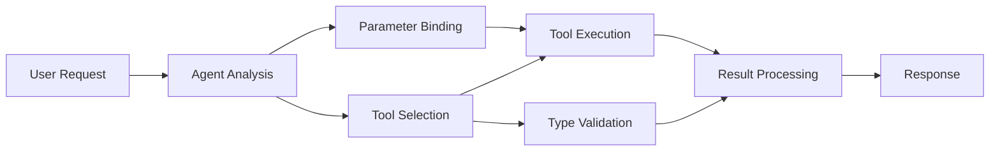

<!--
CO_OP_TRANSLATOR_METADATA:
{
  "original_hash": "91d6061e402489603f2ec8b528cae59b",
  "translation_date": "2025-11-18T16:36:19+00:00",
  "source_file": "04-tool-use/code_samples/04-dotnet-agent-framework.md",
  "language_code": "ru"
}
-->
# 🛠️ Расширенное использование инструментов с моделями GitHub (.NET)

## 📋 Цели обучения

Этот ноутбук демонстрирует интеграцию инструментов корпоративного уровня с использованием Microsoft Agent Framework в .NET и моделями GitHub. Вы научитесь создавать сложных агентов с множеством специализированных инструментов, используя строгую типизацию C# и возможности .NET для корпоративных приложений.

### Расширенные возможности инструментов, которые вы освоите

- 🔧 **Архитектура с несколькими инструментами**: Создание агентов с множеством специализированных функций
- 🎯 **Безопасное выполнение инструментов**: Использование проверки на этапе компиляции в C#
- 📊 **Корпоративные шаблоны инструментов**: Дизайн инструментов для продакшена и обработка ошибок
- 🔗 **Композиция инструментов**: Сочетание инструментов для сложных бизнес-процессов

## 🎯 Преимущества архитектуры инструментов в .NET

### Особенности корпоративных инструментов

- **Проверка на этапе компиляции**: Строгая типизация обеспечивает корректность параметров инструментов
- **Внедрение зависимостей**: Интеграция IoC-контейнера для управления инструментами
- **Асинхронные шаблоны**: Неблокирующее выполнение инструментов с правильным управлением ресурсами
- **Структурированное логирование**: Встроенная интеграция логирования для мониторинга выполнения инструментов

### Шаблоны для продакшена

- **Обработка исключений**: Полное управление ошибками с типизированными исключениями
- **Управление ресурсами**: Правильные шаблоны освобождения ресурсов и управления памятью
- **Мониторинг производительности**: Встроенные метрики и счетчики производительности
- **Управление конфигурацией**: Типизированная конфигурация с проверкой

## 🔧 Техническая архитектура

### Основные компоненты инструментов .NET

- **Microsoft.Extensions.AI**: Унифицированный слой абстракции инструментов
- **Microsoft.Agents.AI**: Оркестрация инструментов корпоративного уровня
- **Интеграция моделей GitHub**: Высокопроизводительный API-клиент с пулом подключений

### Конвейер выполнения инструментов



## 🛠️ Категории инструментов и шаблоны

### 1. **Инструменты обработки данных**

- **Проверка ввода**: Строгая типизация с аннотациями данных
- **Операции преобразования**: Типизированное преобразование и форматирование данных
- **Бизнес-логика**: Инструменты для расчета и анализа, специфичные для домена
- **Форматирование вывода**: Генерация структурированных ответов

### 2. **Интеграционные инструменты**

- **API-коннекторы**: Интеграция RESTful-сервисов с HttpClient
- **Инструменты работы с базами данных**: Интеграция Entity Framework для доступа к данным
- **Операции с файлами**: Безопасные операции с файловой системой с проверкой
- **Внешние сервисы**: Шаблоны интеграции сторонних сервисов

### 3. **Утилитарные инструменты**

- **Обработка текста**: Утилиты для манипуляции строками и форматирования
- **Операции с датой/временем**: Культурно-осведомленные вычисления даты/времени
- **Математические инструменты**: Точные вычисления и статистические операции
- **Инструменты проверки**: Проверка бизнес-правил и верификация данных

Готовы создавать корпоративных агентов с мощными, безопасными инструментами в .NET? Давайте спроектируем профессиональные решения! 🏢⚡

## 🚀 Начало работы

### Предварительные требования

- [.NET 10 SDK](https://dotnet.microsoft.com/download/dotnet/10.0) или выше
- [Токен доступа к API моделей GitHub](https://docs.github.com/github-models/github-models-at-scale/using-your-own-api-keys-in-github-models)

### Необходимые переменные окружения

```bash
# zsh/bash
export GH_TOKEN=<your_github_token>
export GH_ENDPOINT=https://models.github.ai/inference
export GH_MODEL_ID=openai/gpt-5-mini
```

```powershell
# PowerShell
$env:GH_TOKEN = "<your_github_token>"
$env:GH_ENDPOINT = "https://models.github.ai/inference"
$env:GH_MODEL_ID = "openai/gpt-5-mini"
```

### Пример кода

Чтобы запустить пример кода,

```bash
# zsh/bash
chmod +x ./04-dotnet-agent-framework.cs
./04-dotnet-agent-framework.cs
```

Или используя CLI dotnet:

```bash
dotnet run ./04-dotnet-agent-framework.cs
```

Смотрите [`04-dotnet-agent-framework.cs`](../../../../04-tool-use/code_samples/04-dotnet-agent-framework.cs) для полного кода.

```csharp
#!/usr/bin/dotnet run

#:package Microsoft.Extensions.AI@10.*
#:package Microsoft.Agents.AI.OpenAI@1.*-*

using System.ClientModel;
using System.ComponentModel;

using Microsoft.Agents.AI;
using Microsoft.Extensions.AI;

using OpenAI;

// Tool Function: Random Destination Generator
// This static method will be available to the agent as a callable tool
// The [Description] attribute helps the AI understand when to use this function
// This demonstrates how to create custom tools for AI agents
[Description("Provides a random vacation destination.")]
static string GetRandomDestination()
{
    // List of popular vacation destinations around the world
    // The agent will randomly select from these options
    var destinations = new List<string>
    {
        "Paris, France",
        "Tokyo, Japan",
        "New York City, USA",
        "Sydney, Australia",
        "Rome, Italy",
        "Barcelona, Spain",
        "Cape Town, South Africa",
        "Rio de Janeiro, Brazil",
        "Bangkok, Thailand",
        "Vancouver, Canada"
    };

    // Generate random index and return selected destination
    // Uses System.Random for simple random selection
    var random = new Random();
    int index = random.Next(destinations.Count);
    return destinations[index];
}

// Extract configuration from environment variables
// Retrieve the GitHub Models API endpoint, defaults to https://models.github.ai/inference if not specified
// Retrieve the model ID, defaults to openai/gpt-5-mini if not specified
// Retrieve the GitHub token for authentication, throws exception if not specified
var github_endpoint = Environment.GetEnvironmentVariable("GH_ENDPOINT") ?? "https://models.github.ai/inference";
var github_model_id = Environment.GetEnvironmentVariable("GH_MODEL_ID") ?? "openai/gpt-5-mini";
var github_token = Environment.GetEnvironmentVariable("GH_TOKEN") ?? throw new InvalidOperationException("GH_TOKEN is not set.");

// Configure OpenAI Client Options
// Create configuration options to point to GitHub Models endpoint
// This redirects OpenAI client calls to GitHub's model inference service
var openAIOptions = new OpenAIClientOptions()
{
    Endpoint = new Uri(github_endpoint)
};

// Initialize OpenAI Client with GitHub Models Configuration
// Create OpenAI client using GitHub token for authentication
// Configure it to use GitHub Models endpoint instead of OpenAI directly
var openAIClient = new OpenAIClient(new ApiKeyCredential(github_token), openAIOptions);

// Define Agent Identity and Comprehensive Instructions
// Agent name for identification and logging purposes
var AGENT_NAME = "TravelAgent";

// Detailed instructions that define the agent's personality, capabilities, and behavior
// This system prompt shapes how the agent responds and interacts with users
var AGENT_INSTRUCTIONS = """
You are a helpful AI Agent that can help plan vacations for customers.

Important: When users specify a destination, always plan for that location. Only suggest random destinations when the user hasn't specified a preference.

When the conversation begins, introduce yourself with this message:
"Hello! I'm your TravelAgent assistant. I can help plan vacations and suggest interesting destinations for you. Here are some things you can ask me:
1. Plan a day trip to a specific location
2. Suggest a random vacation destination
3. Find destinations with specific features (beaches, mountains, historical sites, etc.)
4. Plan an alternative trip if you don't like my first suggestion

What kind of trip would you like me to help you plan today?"

Always prioritize user preferences. If they mention a specific destination like "Bali" or "Paris," focus your planning on that location rather than suggesting alternatives.
""";

// Create AI Agent with Advanced Travel Planning Capabilities
// Initialize complete agent pipeline: OpenAI client → Chat client → AI agent
// Configure agent with name, detailed instructions, and available tools
// This demonstrates the .NET agent creation pattern with full configuration
AIAgent agent = openAIClient
    .GetChatClient(github_model_id)
    .CreateAIAgent(
        name: AGENT_NAME,
        instructions: AGENT_INSTRUCTIONS,
        tools: [AIFunctionFactory.Create(GetRandomDestination)]
    );

// Create New Conversation Thread for Context Management
// Initialize a new conversation thread to maintain context across multiple interactions
// Threads enable the agent to remember previous exchanges and maintain conversational state
// This is essential for multi-turn conversations and contextual understanding
AgentThread thread = agent.GetNewThread();

// Execute Agent: First Travel Planning Request
// Run the agent with an initial request that will likely trigger the random destination tool
// The agent will analyze the request, use the GetRandomDestination tool, and create an itinerary
// Using the thread parameter maintains conversation context for subsequent interactions
await foreach (var update in agent.RunStreamingAsync("Plan me a day trip", thread))
{
    await Task.Delay(10);
    Console.Write(update);
}

Console.WriteLine();

// Execute Agent: Follow-up Request with Context Awareness
// Demonstrate contextual conversation by referencing the previous response
// The agent remembers the previous destination suggestion and will provide an alternative
// This showcases the power of conversation threads and contextual understanding in .NET agents
await foreach (var update in agent.RunStreamingAsync("I don't like that destination. Plan me another vacation.", thread))
{
    await Task.Delay(10);
    Console.Write(update);
}
```

---

<!-- CO-OP TRANSLATOR DISCLAIMER START -->
**Отказ от ответственности**:  
Этот документ был переведен с использованием сервиса автоматического перевода [Co-op Translator](https://github.com/Azure/co-op-translator). Несмотря на наши усилия обеспечить точность, автоматические переводы могут содержать ошибки или неточности. Оригинальный документ на его родном языке следует считать авторитетным источником. Для получения критически важной информации рекомендуется профессиональный перевод человеком. Мы не несем ответственности за любые недоразумения или неправильные интерпретации, возникшие в результате использования данного перевода.
<!-- CO-OP TRANSLATOR DISCLAIMER END -->