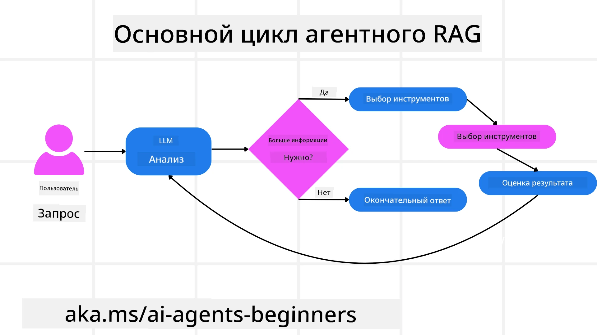
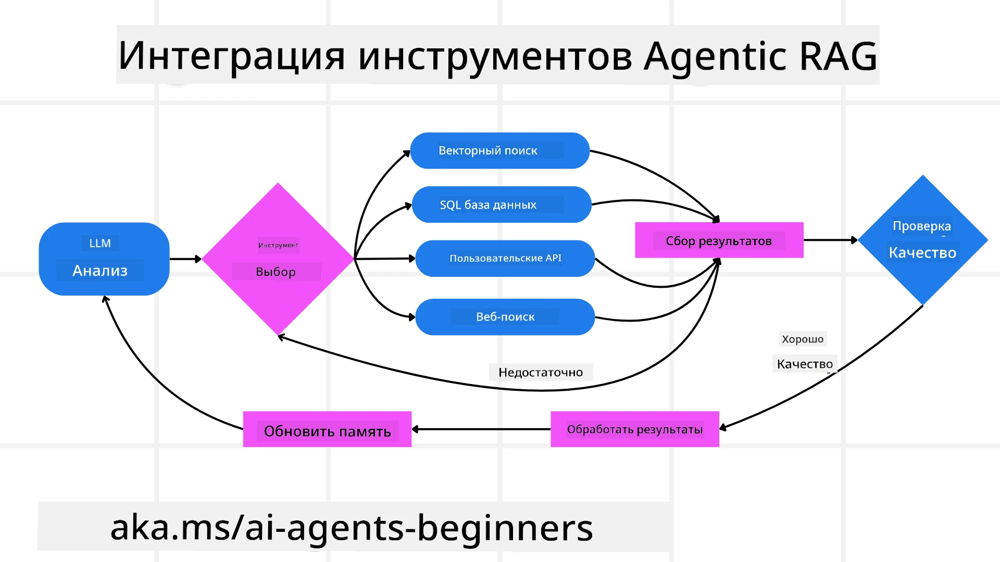
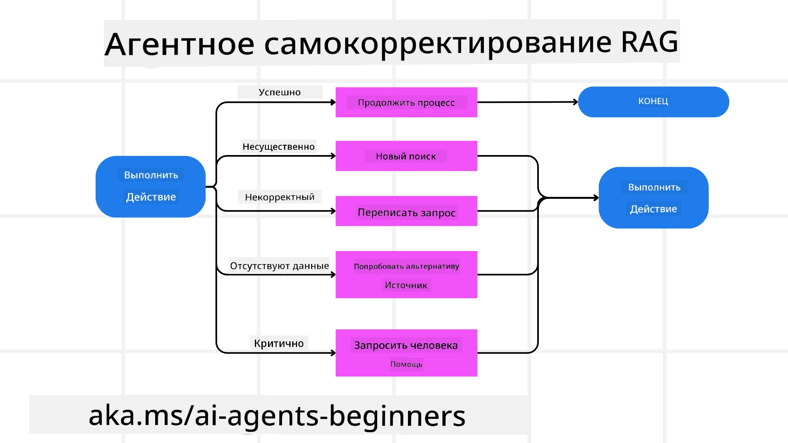
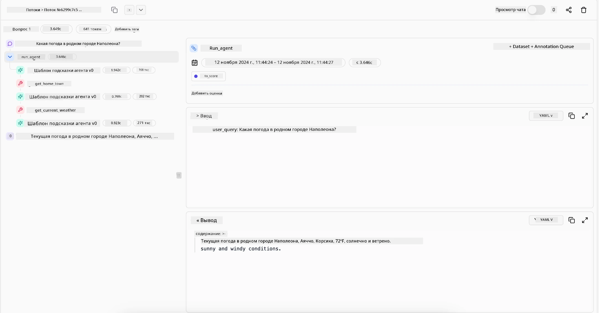

<!--
CO_OP_TRANSLATOR_METADATA:
{
  "original_hash": "0ebf6b2290db55dbf2d10cc49655523b",
  "translation_date": "2025-09-30T06:17:04+00:00",
  "source_file": "05-agentic-rag/README.md",
  "language_code": "ru"
}
-->

> _(Нажмите на изображение выше, чтобы посмотреть видео этого урока)_

# Agentic RAG

Этот урок предоставляет подробный обзор Agentic Retrieval-Augmented Generation (Agentic RAG) — нового подхода в области искусственного интеллекта, где крупные языковые модели (LLMs) самостоятельно планируют свои действия, извлекая информацию из внешних источников. В отличие от статических схем «извлечение-обработка», Agentic RAG предполагает итеративные вызовы LLM, чередующиеся с использованием инструментов или функций и структурированными выводами. Система оценивает результаты, уточняет запросы, при необходимости вызывает дополнительные инструменты и продолжает этот цикл до достижения удовлетворительного решения.

## Введение

В этом уроке вы узнаете:

- **Понять Agentic RAG:** Узнайте о новом подходе в ИИ, где крупные языковые модели (LLMs) самостоятельно планируют свои действия, извлекая информацию из внешних источников данных.
- **Освоить итеративный стиль Maker-Checker:** Поймите цикл итеративных вызовов LLM, чередующихся с использованием инструментов или функций и структурированными выводами, направленный на повышение точности и обработку некорректных запросов.
- **Изучить практические применения:** Определите сценарии, где Agentic RAG особенно эффективен, например, в средах с приоритетом на точность, сложных взаимодействиях с базами данных и расширенных рабочих процессах.

## Цели обучения

После завершения этого урока вы сможете:

- **Понять Agentic RAG:** Узнать о новом подходе в ИИ, где крупные языковые модели (LLMs) самостоятельно планируют свои действия, извлекая информацию из внешних источников данных.
- **Итеративный стиль Maker-Checker:** Освоить концепцию цикла итеративных вызовов LLM, чередующихся с использованием инструментов или функций и структурированными выводами, направленного на повышение точности и обработку некорректных запросов.
- **Владение процессом рассуждения:** Понять способность системы самостоятельно принимать решения о подходе к решению задач без опоры на заранее определенные пути.
- **Рабочий процесс:** Узнать, как агентная модель самостоятельно решает извлечь отчеты о рыночных тенденциях, определить данные о конкурентах, сопоставить внутренние метрики продаж, синтезировать выводы и оценить стратегию.
- **Итеративные циклы, интеграция инструментов и память:** Узнать о зависимости системы от циклического взаимодействия, поддержания состояния и памяти на протяжении шагов, чтобы избежать повторяющихся циклов и принимать обоснованные решения.
- **Обработка режимов отказа и самокоррекция:** Изучить надежные механизмы самокоррекции системы, включая итерацию и повторные запросы, использование диагностических инструментов и обращение к человеческому контролю.
- **Границы агентности:** Понять ограничения Agentic RAG, сосредоточив внимание на автономии в рамках конкретной области, зависимости от инфраструктуры и соблюдении ограничений.
- **Практические случаи использования и ценность:** Определить сценарии, где Agentic RAG особенно эффективен, например, в средах с приоритетом на точность, сложных взаимодействиях с базами данных и расширенных рабочих процессах.
- **Управление, прозрачность и доверие:** Узнать о важности управления и прозрачности, включая объяснимые рассуждения, контроль предвзятости и человеческий контроль.

## Что такое Agentic RAG?

Agentic Retrieval-Augmented Generation (Agentic RAG) — это новый подход в области искусственного интеллекта, где крупные языковые модели (LLMs) самостоятельно планируют свои действия, извлекая информацию из внешних источников. В отличие от статических схем «извлечение-обработка», Agentic RAG предполагает итеративные вызовы LLM, чередующиеся с использованием инструментов или функций и структурированными выводами. Система оценивает результаты, уточняет запросы, при необходимости вызывает дополнительные инструменты и продолжает этот цикл до достижения удовлетворительного решения. Этот итеративный стиль «maker-checker» повышает точность, обрабатывает некорректные запросы и обеспечивает высокое качество результатов.

Система активно управляет процессом рассуждения, переписывает неудачные запросы, выбирает различные методы извлечения и интегрирует несколько инструментов — таких как векторный поиск в Azure AI Search, базы данных SQL или пользовательские API — перед финализацией ответа. Отличительная черта агентной системы — это способность самостоятельно управлять процессом рассуждения. Традиционные реализации RAG опираются на заранее определенные пути, но агентная система автономно определяет последовательность шагов на основе качества найденной информации.

## Определение Agentic Retrieval-Augmented Generation (Agentic RAG)

Agentic Retrieval-Augmented Generation (Agentic RAG) — это новый подход в разработке ИИ, где LLMs не только извлекают информацию из внешних источников данных, но и самостоятельно планируют свои действия. В отличие от статических схем «извлечение-обработка» или тщательно прописанных последовательностей запросов, Agentic RAG предполагает цикл итеративных вызовов LLM, чередующихся с использованием инструментов или функций и структурированными выводами. На каждом этапе система оценивает полученные результаты, решает, нужно ли уточнить запросы, вызывает дополнительные инструменты при необходимости и продолжает этот цикл до достижения удовлетворительного решения.

Этот итеративный стиль «maker-checker» направлен на повышение точности, обработку некорректных запросов к структурированным базам данных (например, NL2SQL) и обеспечение сбалансированных, качественных результатов. Вместо того чтобы полагаться исключительно на тщательно разработанные цепочки запросов, система активно управляет процессом рассуждения. Она может переписывать неудачные запросы, выбирать различные методы извлечения и интегрировать несколько инструментов — таких как векторный поиск в Azure AI Search, базы данных SQL или пользовательские API — перед финализацией ответа. Это устраняет необходимость в чрезмерно сложных оркестрационных фреймворках. Вместо этого относительно простой цикл «вызов LLM → использование инструмента → вызов LLM → …» может привести к сложным и обоснованным выводам.

## Владение процессом рассуждения

Отличительная черта, которая делает систему «агентной», — это ее способность самостоятельно управлять процессом рассуждения. Традиционные реализации RAG часто зависят от заранее определенного человеком пути для модели: цепочки рассуждений, которая определяет, что извлекать и когда.  
Но когда система действительно агентная, она сама решает, как подойти к задаче. Она не просто выполняет сценарий; она автономно определяет последовательность шагов на основе качества найденной информации.  
Например, если ее просят создать стратегию запуска продукта, она не полагается исключительно на запрос, который полностью описывает весь процесс исследования и принятия решений. Вместо этого агентная модель самостоятельно решает:

1. Извлечь текущие отчеты о рыночных тенденциях с помощью Bing Web Grounding.
2. Определить соответствующие данные о конкурентах с помощью Azure AI Search.
3. Сопоставить исторические внутренние метрики продаж с помощью Azure SQL Database.
4. Синтезировать выводы в единую стратегию, организованную через Azure OpenAI Service.
5. Оценить стратегию на наличие пробелов или несоответствий, инициируя еще один раунд извлечения при необходимости.

Все эти шаги — уточнение запросов, выбор источников, итерация до достижения «удовлетворительного» ответа — решаются моделью, а не заранее прописываются человеком.

## Итеративные циклы, интеграция инструментов и память

Агентная система опирается на циклический паттерн взаимодействия:

- **Первоначальный вызов:** Цель пользователя (т.е. запрос пользователя) представляется LLM.
- **Использование инструментов:** Если модель обнаруживает недостающую информацию или неоднозначные инструкции, она выбирает инструмент или метод извлечения — например, запрос к векторной базе данных (например, Azure AI Search Hybrid search по частным данным) или структурированный SQL-запрос — чтобы собрать больше контекста.
- **Оценка и уточнение:** После анализа полученных данных модель решает, достаточно ли информации. Если нет, она уточняет запрос, пробует другой инструмент или корректирует подход.
- **Повторение до удовлетворения:** Этот цикл продолжается до тех пор, пока модель не решит, что у нее достаточно ясности и доказательств для предоставления окончательного, хорошо обоснованного ответа.
- **Память и состояние:** Поскольку система сохраняет состояние и память на протяжении шагов, она может вспоминать предыдущие попытки и их результаты, избегая повторяющихся циклов и принимая более обоснованные решения по мере продвижения.

Со временем это создает ощущение развивающегося понимания, позволяя модели справляться с сложными многоэтапными задачами без необходимости постоянного вмешательства человека или изменения запроса.

## Обработка режимов отказа и самокоррекция

Автономность Agentic RAG также включает надежные механизмы самокоррекции. Когда система сталкивается с тупиками — например, извлекает нерелевантные документы или сталкивается с некорректными запросами — она может:

- **Итерация и повторный запрос:** Вместо того чтобы возвращать малоценные ответы, модель пробует новые стратегии поиска, переписывает запросы к базе данных или обращается к альтернативным наборам данных.
- **Использование диагностических инструментов:** Система может вызывать дополнительные функции, предназначенные для помощи в отладке шагов рассуждения или подтверждения корректности извлеченных данных. Инструменты, такие как Azure AI Tracing, будут важны для обеспечения надежной наблюдаемости и мониторинга.
- **Обращение к человеческому контролю:** В сценариях с высокой степенью риска или при повторяющихся сбоях модель может сигнализировать о неопределенности и запрашивать руководство человека. После того как человек предоставляет корректирующую обратную связь, модель может использовать этот урок в будущем.

Этот итеративный и динамичный подход позволяет модели постоянно улучшаться, гарантируя, что она не просто одноразовая система, а система, которая учится на своих ошибках в рамках текущей сессии.

## Границы агентности

Несмотря на свою автономность в рамках задачи, Agentic RAG не является аналогом искусственного общего интеллекта. Ее «агентные» возможности ограничиваются инструментами, источниками данных и политиками, предоставленными разработчиками. Она не может изобретать собственные инструменты или выходить за пределы установленных границ. Вместо этого она превосходно справляется с динамической оркестрацией доступных ресурсов.  
Ключевые отличия от более продвинутых форм ИИ включают:

1. **Автономия в рамках конкретной области:** Системы Agentic RAG сосредоточены на достижении целей, определенных пользователем, в известной области, используя стратегии, такие как переписывание запросов или выбор инструментов, для улучшения результатов.
2. **Зависимость от инфраструктуры:** Возможности системы зависят от инструментов и данных, интегрированных разработчиками. Она не может превзойти эти границы без вмешательства человека.
3. **Соблюдение ограничений:** Этические принципы, правила соответствия и бизнес-политики остаются очень важными. Свобода агента всегда ограничивается мерами безопасности и механизмами контроля (надеемся?).

## Практические случаи использования и ценность

Agentic RAG особенно эффективен в сценариях, требующих итеративного уточнения и точности:

1. **Среды с приоритетом на точность:** В проверке соответствия, анализе нормативных актов или юридических исследованиях агентная модель может многократно проверять факты, консультироваться с несколькими источниками и переписывать запросы до тех пор, пока не будет получен тщательно проверенный ответ.
2. **Сложные взаимодействия с базами данных:** При работе со структурированными данными, где запросы часто могут терпеть неудачу или требовать корректировки, система может самостоятельно уточнять запросы, используя Azure SQL или Microsoft Fabric OneLake, гарантируя, что окончательное извлечение соответствует намерениям пользователя.
3. **Расширенные рабочие процессы:** Длительные сессии могут развиваться по мере появления новой информации. Agentic RAG может постоянно интегрировать новые данные, изменяя стратегии по мере того, как она узнает больше о проблемной области.

## Управление, прозрачность и доверие

По мере того как эти системы становятся более автономными в своих рассуждениях, управление и прозрачность становятся критически важными:

- **Объяснимые рассуждения:** Модель может предоставить журнал запросов, которые она сделала, источников, которые она использовала, и шагов рассуждения, которые она предприняла для достижения своего вывода. Инструменты, такие как Azure AI Content Safety и Azure AI Tracing / GenAIOps, могут помочь поддерживать прозрачность и снижать риски.
- **Контроль предвзятости и сбалансированное извлечение:** Разработчики могут настраивать стратегии извлечения, чтобы гарантировать учет сбалансированных, репрезентативных источников данных, и регулярно проверять результаты, чтобы выявить предвзятость или искаженные шаблоны, используя пользовательские модели для продвинутых организаций в области анализа данных с использованием Azure Machine Learning.
- **Человеческий контроль и соответствие:** Для чувствительных задач человеческий контроль остается необходимым. Agentic RAG не заменяет человеческое суждение в решениях с высокой степенью риска — она дополняет его, предоставляя более тщательно проверенные варианты.

Наличие инструментов, которые предоставляют четкий отчет о действиях, является важным. Без них отладка многоэтапного процесса может быть очень сложной. См. следующий пример от Literal AI (компания, стоящая за Chainlit) для выполнения агентом:

## Заключение

Agentic RAG представляет собой естественную эволюцию в том, как системы ИИ справляются со сложными задачами, требующими интенсивной работы с данными. Применяя циклический паттерн взаимодействия, автономно выбирая инструменты и уточняя запросы до достижения качественного результата, система выходит за рамки статического следования запросам, становясь более адаптивной и осведомленной в контексте принятия решений. Хотя она все еще ограничена инфраструктурой и этическими принципами, определенными человеком, эти агентные возможности позволяют создавать более богатые, динамичные и, в конечном итоге, более полезные взаимодействия с ИИ как для предприятий, так и для конечных пользователей.

### Остались вопросы о Agentic RAG?

Присоединяйтесь к [Azure AI Foundry Discord](https://aka.ms/ai-agents/discord), чтобы встретиться с другими учащимися, посетить часы консультаций и получить ответы на свои вопросы о AI Agents.

## Дополнительные ресурсы

- <a href="https://learn.microsoft.com/training/modules/use-own-data-azure-openai" target="_blank">Реализация Retrieval Augmented Generation (RAG) с Azure OpenAI Service: Узнайте, как использовать собственные данные с Azure OpenAI Service. Этот модуль Microsoft Learn предоставляет подробное руководство по реализации RAG</a>
- <a href="https://learn.microsoft.com/azure/ai-studio/concepts/evaluation-approach-gen-ai" target="_blank">Оценка приложений генеративного ИИ с Azure AI Foundry: Эта статья охватывает оценку и сравнение моделей на общедоступных наборах данных, включая приложения Agentic AI и архитектуры RAG</a>
- <a href="https://weaviate.io/blog/what-is-agentic-rag" target="_blank">Что такое Agentic RAG | Weaviate</a>
- <a href="https://ragaboutit.com/agentic-rag-a-complete-guide-to-agent-based-retrieval-augmented-generation/" target="_blank">Agentic RAG: Полное руководство по агентно-ориентированному извлечению и дополненной генерации – Новости от generation RAG</a>
- <a href="https://huggingface.co/learn/cookbook/agent_rag" target="_blank">Agentic RAG: ускорьте ваш RAG с помощью реформулирования запросов и самозапросов! Hugging Face Open-Source AI Cookbook</a>
- <a href="https://youtu.be/aQ4yQXeB1Ss?si=2HUqBzHoeB5tR04U" target="_blank">Добавление агентных слоев в RAG</a>
- <a href="https://www.youtube.com/watch?v=zeAyuLc_f3Q&t=244s" target="_blank">Будущее помощников знаний: Джерри Лю</a>
- <a href="https://www.youtube.com/watch?v=AOSjiXP1jmQ" target="_blank">Как создавать системы Agentic RAG</a>
- <a href="https://ignite.microsoft.com/sessions/BRK102?source=sessions" target="_blank">Использование Azure AI Foundry Agent Service для масштабирования ваших AI-агентов</a>

### Научные статьи

- <a href="https://arxiv.org/abs/2303.17651" target="_blank">2303.17651 Self-Refine: Итеративное уточнение с самокоррекцией</a>
- <a href="https://arxiv.org/abs/2303.11366" target="_blank">2303.11366 Reflexion: Языковые агенты с вербальным обучением с подкреплением</a>
- <a href="https://arxiv.org/abs/2305.11738" target="_blank">2305.11738 CRITIC: Большие языковые модели могут самокорректироваться с помощью интерактивной критики</a>
- <a href="https://arxiv.org/abs/2501.09136" target="_blank">2501.09136 Agentic Retrieval-Augmented Generation: Обзор агентно-ориентированного RAG</a>

## Предыдущий урок

[Шаблон проектирования использования инструментов](../04-tool-use/README.md)

## Следующий урок

[Создание надежных AI-агентов](../06-building-trustworthy-agents/README.md)

---

**Отказ от ответственности**:  
Этот документ был переведен с помощью сервиса автоматического перевода [Co-op Translator](https://github.com/Azure/co-op-translator). Несмотря на наши усилия обеспечить точность перевода, автоматические переводы могут содержать ошибки или неточности. Оригинальный документ на его родном языке следует считать авторитетным источником. Для получения критически важной информации рекомендуется профессиональный перевод человеком. Мы не несем ответственности за любые недоразумения или неправильные интерпретации, возникшие в результате использования данного перевода.