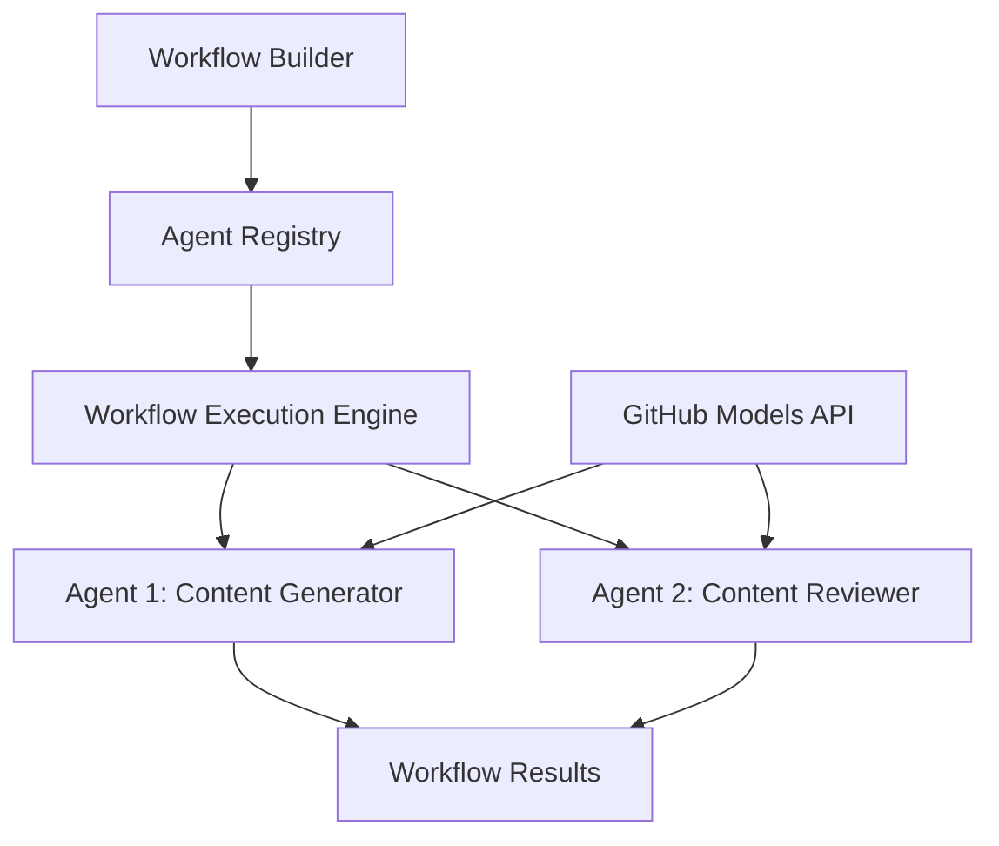

<!--
CO_OP_TRANSLATOR_METADATA:
{
  "original_hash": "034158688d0a45aae06dcbb21b0da5ae",
  "translation_date": "2025-11-11T12:39:57+00:00",
  "source_file": "08-multi-agent/code_samples/workflows-agent-framework/dotNET/01.dotnet-agent-framework-workflow-ghmodel-basic.md",
  "language_code": "ru"
}
-->
# 🔄 Основные рабочие процессы агентов с моделями GitHub (.NET)

## 📋 Учебное пособие по оркестрации рабочих процессов

Этот блокнот демонстрирует, как создавать сложные **рабочие процессы агентов** с использованием Microsoft Agent Framework для .NET и моделей GitHub. Вы научитесь создавать многоэтапные бизнес-процессы, где AI-агенты взаимодействуют для выполнения сложных задач через структурированные шаблоны оркестрации.

## 🎯 Цели обучения

### 🏗️ **Основы архитектуры рабочих процессов**
- **Конструктор рабочих процессов**: Проектирование и оркестрация сложных многоэтапных AI-процессов
- **Координация агентов**: Управление несколькими специализированными агентами в рамках рабочих процессов
- **Интеграция моделей GitHub**: Использование сервиса вывода моделей GitHub в рабочих процессах
- **Визуальный дизайн рабочих процессов**: Создание и визуализация структур рабочих процессов для лучшего понимания

### 🔄 **Шаблоны оркестрации процессов**
- **Последовательная обработка**: Связывание задач агентов в логическом порядке
- **Управление состоянием**: Поддержание контекста и потока данных между этапами рабочего процесса
- **Обработка ошибок**: Реализация надежного восстановления после ошибок и устойчивости рабочих процессов
- **Оптимизация производительности**: Проектирование эффективных рабочих процессов для операций корпоративного масштаба

### 🏢 **Применение рабочих процессов в бизнесе**
- **Автоматизация бизнес-процессов**: Автоматизация сложных организационных рабочих процессов
- **Производственный контент-пайплайн**: Редакционные рабочие процессы с этапами проверки и утверждения
- **Автоматизация обслуживания клиентов**: Многоэтапное решение запросов клиентов
- **Рабочие процессы обработки данных**: ETL-процессы с AI-управляемой трансформацией

## ⚙️ Предварительные требования и настройка

### 📦 **Необходимые пакеты NuGet**

Для демонстрации рабочего процесса используются несколько ключевых пакетов .NET:

```xml
<!-- Core AI Framework -->
<PackageReference Include="Microsoft.Extensions.AI" Version="9.9.0" />

<!-- Agent Framework (Local Development) -->
<!-- Microsoft.Agents.AI.dll - Core agent abstractions -->
<!-- Microsoft.Agents.AI.OpenAI.dll - OpenAI/GitHub Models integration -->

<!-- Configuration and Environment -->
<PackageReference Include="DotNetEnv" Version="3.1.1" />
```

### 🔑 **Настройка моделей GitHub**

**Настройка окружения (.env файл):**
```env
GITHUB_TOKEN=your_github_personal_access_token
GITHUB_ENDPOINT=https://models.inference.ai.azure.com
GITHUB_MODEL_ID=gpt-4o-mini
```

**Доступ к моделям GitHub:**
1. Зарегистрируйтесь для использования моделей GitHub (в настоящее время в предварительном просмотре)
2. Сгенерируйте персональный токен доступа с разрешениями на доступ к моделям
3. Настройте переменные окружения, как показано выше

### 🏗️ **Обзор архитектуры рабочего процесса**



**Ключевые компоненты:**
- **WorkflowBuilder**: Основной механизм оркестрации для проектирования рабочих процессов
- **AIAgent**: Индивидуальные специализированные агенты с определенными возможностями
- **GitHub Models Client**: Интеграция сервиса вывода моделей AI
- **Execution Context**: Управляет состоянием и потоком данных между этапами рабочего процесса

## 🎨 **Шаблоны проектирования рабочих процессов для бизнеса**

### 📝 **Рабочий процесс создания контента**
```
User Request → Content Generation → Quality Review → Final Output
```

### 🔍 **Пайплайн обработки документов**
```
Document Input → Analysis → Extraction → Validation → Structured Output
```

### 💼 **Рабочий процесс бизнес-аналитики**
```
Data Collection → Processing → Analysis → Report Generation → Distribution
```

### 🤝 **Автоматизация обслуживания клиентов**
```
Customer Inquiry → Classification → Processing → Response Generation → Follow-up
```

## 🏢 **Преимущества для бизнеса**

### 🎯 **Надежность и масштабируемость**
- **Детерминированное выполнение**: Последовательные, повторяемые результаты рабочих процессов
- **Восстановление после ошибок**: Плавная обработка сбоев на любом этапе рабочего процесса
- **Мониторинг производительности**: Отслеживание метрик выполнения и возможностей оптимизации
- **Управление ресурсами**: Эффективное распределение и использование ресурсов моделей AI

### 🔒 **Безопасность и соответствие требованиям**
- **Безопасная аутентификация**: Аутентификация на основе токенов GitHub для доступа к API
- **Журналы аудита**: Полное логирование выполнения рабочих процессов и точек принятия решений
- **Контроль доступа**: Гранулированные разрешения для выполнения и мониторинга рабочих процессов
- **Конфиденциальность данных**: Безопасная обработка конфиденциальной информации в рамках рабочих процессов

### 📊 **Наблюдаемость и управление**
- **Визуальный дизайн рабочих процессов**: Четкое представление потоков процессов и зависимостей
- **Мониторинг выполнения**: Отслеживание прогресса и производительности рабочих процессов в реальном времени
- **Отчет об ошибках**: Детальный анализ ошибок и возможности отладки
- **Аналитика производительности**: Метрики для оптимизации и планирования емкости

Давайте создадим ваш первый готовый к корпоративному использованию AI-рабочий процесс! 🚀

## 💻 Запуск кода

Полная реализация доступна в `01.dotnet-agent-framework-workflow-ghmodel-basic.cs`. Этот файл демонстрирует:

1. **Настройка окружения** - Загрузка учетных данных моделей GitHub из `.env` файла
2. **Настройка клиента OpenAI** - Конфигурация клиента для использования конечной точки моделей GitHub
3. **Создание агентов** - Определение специализированных агентов (Front Desk и Concierge)
4. **Конструктор рабочих процессов** - Создание многоагентного рабочего процесса с последовательной обработкой
5. **Выполнение рабочего процесса** - Запуск рабочего процесса с потоковыми результатами

### 🚀 Запуск примера

```bash
# Make the script executable (Unix/Linux/macOS)
chmod +x 01.dotnet-agent-framework-workflow-ghmodel-basic.cs

# Run the workflow
./01.dotnet-agent-framework-workflow-ghmodel-basic.cs
```

Или на Windows:
```powershell
dotnet run 01.dotnet-agent-framework-workflow-ghmodel-basic.cs
```

### 📝 Ожидаемый результат

Рабочий процесс выполнит:
1. Прием вашего запроса на путешествие ("Я хотел бы поехать в Париж")
2. Агент Front Desk предоставит первоначальную рекомендацию
3. Агент Concierge проверит и уточнит рекомендацию
4. Итоговый результат покажет полный поток разговора

### 🔧 Настройка

Вы можете настроить рабочий процесс, изменив:
- Инструкции для агентов, чтобы изменить их поведение
- Добавление большего количества агентов для создания сложных многоэтапных рабочих процессов
- Сообщение пользователя для тестирования различных сценариев
- Параметры рабочих процессов для создания различных шаблонов выполнения

---

<!-- CO-OP TRANSLATOR DISCLAIMER START -->
**Отказ от ответственности**:  
Этот документ был переведен с использованием сервиса автоматического перевода [Co-op Translator](https://github.com/Azure/co-op-translator). Несмотря на наши усилия обеспечить точность, автоматические переводы могут содержать ошибки или неточности. Оригинальный документ на его родном языке следует считать авторитетным источником. Для получения критически важной информации рекомендуется профессиональный перевод человеком. Мы не несем ответственности за любые недоразумения или неправильные интерпретации, возникшие в результате использования данного перевода.
<!-- CO-OP TRANSLATOR DISCLAIMER END -->