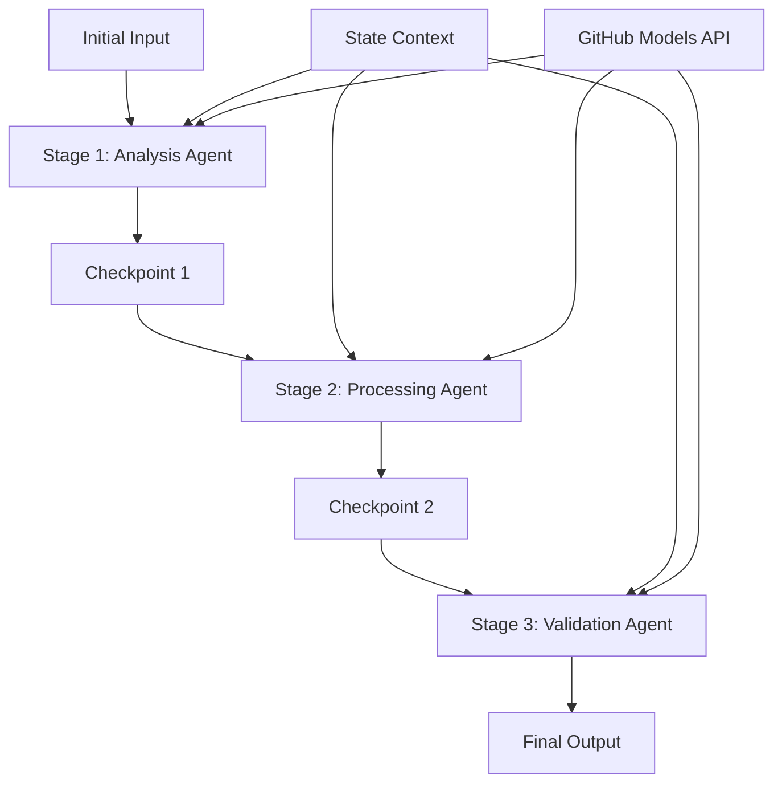

<!--
CO_OP_TRANSLATOR_METADATA:
{
  "original_hash": "1be9c8dcbd79a02d33d2c138684c1394",
  "translation_date": "2025-11-11T13:40:41+00:00",
  "source_file": "08-multi-agent/code_samples/workflows-agent-framework/dotNET/02.dotnet-agent-framework-workflow-ghmodel-sequential.md",
  "language_code": "ru"
}
-->
# ⏩ Последовательные рабочие процессы агентов с моделями GitHub (.NET)

## 📋 Руководство по продвинутой последовательной обработке

Этот ноутбук демонстрирует **шаблоны последовательных рабочих процессов** с использованием Microsoft Agent Framework для .NET и моделей GitHub. Вы узнаете, как создавать сложные пошаговые конвейеры обработки, где агенты выполняются в определенном порядке, а каждый этап основывается на результатах предыдущего.

## 🎯 Цели обучения

### 🔄 **Архитектура последовательной обработки**
- **Дизайн линейного рабочего процесса**: Создание пошаговых конвейеров обработки с четкими зависимостями
- **Управление состоянием**: Поддержание контекста и потока данных между этапами последовательного рабочего процесса
- **Интеграция моделей GitHub**: Использование AI моделей GitHub в многоэтапных рабочих процессах .NET
- **Шаблоны корпоративных конвейеров**: Создание готовых к производству систем последовательной обработки

### 🏗️ **Продвинутые последовательные шаблоны**
- **Обработка с этапами проверки**: Реализация контрольных точек между этапами рабочего процесса
- **Сохранение контекста**: Поддержание состояния и накопленных знаний на всех этапах
- **Распространение ошибок**: Эффективное управление сбоями в цепочках последовательной обработки
- **Оптимизация производительности**: Эффективное последовательное выполнение с минимальными затратами

### 🏢 **Корпоративные последовательные приложения**
- **Конвейер обработки документов**: Многоэтапный анализ, преобразование и проверка документов
- **Рабочие процессы контроля качества**: Последовательный обзор, проверка и утверждение
- **Конвейер создания контента**: Исследование → Написание → Редактирование → Обзор → Публикация
- **Автоматизация бизнес-процессов**: Многоэтапные бизнес-процессы с четкими зависимостями этапов

## ⚙️ Предварительные требования и настройка

### 📦 **Необходимые пакеты NuGet**

Основные пакеты для последовательных рабочих процессов .NET:

```xml
<!-- Core AI Framework -->
<PackageReference Include="Microsoft.Extensions.AI" Version="9.9.0" />

<!-- Client Model Abstractions -->
<PackageReference Include="System.ClientModel" Version="1.6.1.0" />

<!-- Azure Identity and Async LINQ Support -->
<PackageReference Include="Azure.Identity" Version="1.15.0" />
<PackageReference Include="System.Linq.Async" Version="6.0.3" />

<!-- Local Agent Framework References -->
<!-- Microsoft.Agents.AI.dll - Core agent abstractions -->
<!-- Microsoft.Agents.AI.OpenAI.dll - GitHub Models integration -->
```

### 🔑 **Настройка моделей GitHub**

**Настройка окружения (.env файл):**
```env
GITHUB_TOKEN=your_github_personal_access_token
GITHUB_ENDPOINT=https://models.inference.ai.azure.com
GITHUB_MODEL_ID=gpt-4o-mini
```

**Управление конфигурацией:**
```csharp
// Load environment variables securely
Env.Load("../../../.env");
var githubToken = Environment.GetEnvironmentVariable("GITHUB_TOKEN");
var githubEndpoint = Environment.GetEnvironmentVariable("GITHUB_ENDPOINT");
var modelId = Environment.GetEnvironmentVariable("GITHUB_MODEL_ID");
```

### 🏗️ **Архитектура последовательного рабочего процесса**



**Ключевые компоненты:**
- **Последовательные агенты**: Специализированные агенты для каждого этапа обработки
- **Контекст состояния**: Поддерживает накопленные данные и решения между этапами
- **Контрольные точки**: Точки проверки между этапами для обеспечения качества и согласованности
- **Клиент моделей GitHub**: Единый доступ к AI моделям на всех этапах рабочего процесса

## 🎨 **Шаблоны дизайна последовательных рабочих процессов**

### 📝 **Конвейер обработки документов**
```
Raw Document → Content Extraction → Analysis → Validation → Structured Output
```

### 🎯 **Рабочий процесс создания контента**
```
Brief/Requirements → Research → Content Creation → Review → Final Polish
```

### 🔍 **Конвейер контроля качества**
```
Initial Review → Technical Validation → Compliance Check → Final Approval
```

### 💼 **Рабочий процесс бизнес-аналитики**
```
Data Collection → Processing → Analysis → Report Generation → Distribution
```

## 🏢 **Преимущества корпоративных последовательных процессов**

### 🎯 **Надежность и качество**
- **Детерминированная обработка**: Последовательные, повторяемые результаты благодаря структурированным этапам
- **Контроль качества**: Контрольные точки проверки обеспечивают качество на каждом этапе
- **Изоляция ошибок**: Проблемы на одном этапе не распространяются на последующие
- **Аудит**: Полное отслеживание решений и преобразований на каждом этапе

### 📈 **Масштабируемость и производительность**
- **Модульный дизайн**: Каждый этап можно оптимизировать независимо
- **Управление ресурсами**: Эффективное распределение ресурсов AI моделей между этапами
- **Оптимизация состояния**: Минимальная передача состояния между этапами для оптимальной производительности
- **Параллельные группы этапов**: Несколько последовательных рабочих процессов могут выполняться параллельно

### 🔒 **Безопасность и соответствие требованиям**
- **Безопасность на уровне этапов**: Разные политики безопасности для разных этапов обработки
- **Проверка данных**: Обеспечение целостности данных и соответствия требованиям на каждом этапе
- **Контроль доступа**: Гранулярные разрешения для разных этапов рабочего процесса
- **Соответствие нормативным требованиям**: Выполнение требований законодательства через структурированную обработку

### 📊 **Мониторинг и аналитика**
- **Метрики на уровне этапов**: Мониторинг производительности для каждого этапа рабочего процесса
- **Идентификация узких мест**: Выявление и оптимизация медленных этапов
- **Метрики качества**: Отслеживание качества и уровня успеха на каждом этапе
- **Оптимизация процессов**: Постоянное улучшение на основе аналитики этапов

Давайте создадим надежные последовательные конвейеры обработки AI! 🚀

## 💻 Запуск кода

Полная реализация доступна в `02.dotnet-agent-framework-workflow-ghmodel-sequential.cs`. Этот файл демонстрирует **трехэтапный рабочий процесс анализа мебели**:

1. **Этап 1 - Агент продаж**: Анализирует изображения мебели и предлагает варианты покупки
2. **Этап 2 - Агент цен**: Предоставляет детальный анализ цен и варианты бюджета
3. **Этап 3 - Агент предложений**: Генерирует профессиональный документ с предложением в формате Markdown

### 🏗️ **Архитектура рабочего процесса**

```
Image Input → Sales Analysis → Price Estimation → Quote Generation → Final Output
```

Каждый агент:
- Получает вывод предыдущего этапа как контекст
- Основывается на предыдущем анализе, используя специализированные знания
- Поддерживает непрерывность рабочего процесса через управление состоянием

### 🚀 Запуск примера

**Предварительные требования:**
- Разместите изображение мебели в `../imgs/home.png` (или обновите переменную `imgPath`)
- Настройте ваш `.env` файл с учетными данными моделей GitHub

```bash
# Make the script executable (Unix/Linux/macOS)
chmod +x 02.dotnet-agent-framework-workflow-ghmodel-sequential.cs

# Run the sequential workflow
./02.dotnet-agent-framework-workflow-ghmodel-sequential.cs
```

Или на Windows:
```powershell
dotnet run 02.dotnet-agent-framework-workflow-ghmodel-sequential.cs
```

### 📝 Ожидаемый результат

Рабочий процесс выполнит:
1. **Агент продаж**: Определит предметы мебели на изображении и предоставит рекомендации
2. **Агент цен**: Добавит детальный анализ цен с уровнями бюджета и рекомендациями по покупкам
3. **Агент предложений**: Сгенерирует форматированный документ с предложением, синтезируя всю информацию

Окончательный результат будет представлять собой комплексное профессиональное предложение по мебели, основанное на анализе изображения.

### 🔧 Варианты настройки

**Изменение поведения агента:**
```csharp
// Adjust agent instructions to change their focus
const string SalesAgentInstructions = "Your custom instructions...";
```

**Изменение последовательного потока:**
```csharp
// Add or reorder workflow stages
var workflow = new WorkflowBuilder(salesagent)
    .AddEdge(salesagent, priceagent)
    .AddEdge(priceagent, quoteagent)
    .AddEdge(quoteagent, newAgent)  // Add another stage
    .Build();
```

**Использование другого ввода:**
```csharp
// Process text instead of images
ChatMessage userMessage = new ChatMessage(ChatRole.User, [
    new TextContent("Analyze pricing for a modern living room set")
]);
```

### 🎯 Применение в реальном мире

Этот последовательный шаблон идеально подходит для:
- **Электронной коммерции**: Анализ продукта → Ценообразование → Генерация предложений
- **Недвижимости**: Анализ объекта → Оценка → Создание объявления
- **Страхования**: Анализ претензий → Оценка → Генерация предложений
- **Создания контента**: Исследование → Написание → Редактирование → Публикация

### 🔍 Понимание потока состояния

Каждый агент в последовательности получает:
- **Оригинальный ввод**: Исходное сообщение пользователя (изображение + текст)
- **Выводы предыдущих агентов**: Все ответы предыдущих агентов в истории разговора
- **Накопленный контекст**: Полное состояние, поддерживаемое на протяжении всего рабочего процесса

Это позволяет реализовать сложную многоэтапную обработку, где каждый агент основывается на полном контексте всех предыдущих этапов.

---

<!-- CO-OP TRANSLATOR DISCLAIMER START -->
**Отказ от ответственности**:  
Этот документ был переведен с использованием сервиса автоматического перевода [Co-op Translator](https://github.com/Azure/co-op-translator). Несмотря на наши усилия обеспечить точность, автоматические переводы могут содержать ошибки или неточности. Оригинальный документ на его родном языке следует считать авторитетным источником. Для получения критически важной информации рекомендуется профессиональный перевод человеком. Мы не несем ответственности за любые недоразумения или неправильные интерпретации, возникающие в результате использования данного перевода.
<!-- CO-OP TRANSLATOR DISCLAIMER END -->