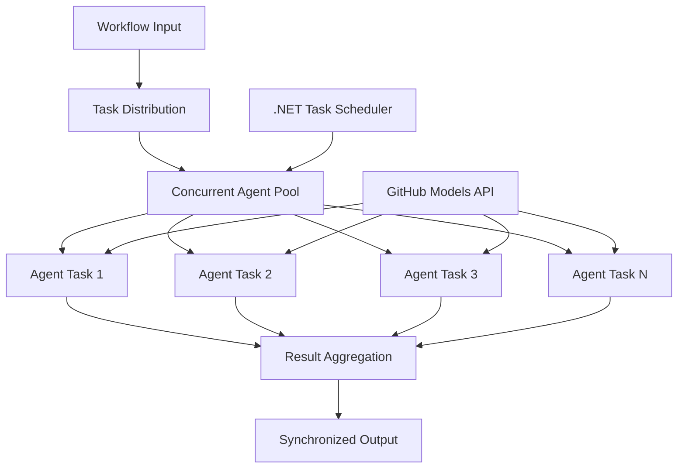

<!--
CO_OP_TRANSLATOR_METADATA:
{
  "original_hash": "b9c6e32c9b5f2fed20b6916984440d88",
  "translation_date": "2025-11-11T13:06:23+00:00",
  "source_file": "08-multi-agent/code_samples/workflows-agent-framework/dotNET/03.dotnet-agent-framework-workflow-ghmodel-concurrent.md",
  "language_code": "ru"
}
-->
# ⚡ Параллельные рабочие процессы агентов с моделями GitHub (.NET)

## 📋 Руководство по высокопроизводительной параллельной обработке

Этот блокнот демонстрирует **шаблоны параллельных рабочих процессов** с использованием Microsoft Agent Framework для .NET и моделей GitHub. Вы узнаете, как создавать высокопроизводительные рабочие процессы параллельной обработки, которые максимизируют пропускную способность, выполняя несколько AI-агентов одновременно, сохраняя при этом координацию и согласованность данных.

## 🎯 Цели обучения

### 🚀 **Основы параллельной обработки**
- **Параллельное выполнение агентов**: Запуск нескольких AI-агентов одновременно для максимальной производительности
- **Шаблоны Async/Await**: Использование асинхронной модели программирования .NET для эффективной параллельной обработки
- **Интеграция моделей GitHub**: Координация нескольких параллельных вызовов сервиса вывода моделей GitHub
- **Управление ресурсами**: Эффективное управление ресурсами моделей AI в рамках параллельных операций

### 🏗️ **Продвинутая архитектура параллельной обработки**
- **Параллелизм на основе задач**: Использование библиотеки Task Parallel Library .NET для оптимального выполнения параллельных операций
- **Шаблоны синхронизации**: Координация параллельных агентов с предотвращением состояния гонки
- **Балансировка нагрузки**: Эффективное распределение работы между доступными мощностями параллельной обработки
- **Устойчивость к сбоям**: Обработка отказов отдельных агентов без остановки всего рабочего процесса

### 🏢 **Корпоративные приложения параллельной обработки**
- **Обработка большого объема документов**: Одновременная обработка нескольких документов
- **Анализ контента в реальном времени**: Параллельный анализ входящих потоков данных
- **Оптимизация пакетной обработки**: Максимизация пропускной способности для операций обработки данных в крупном масштабе
- **Мультимодальный анализ**: Параллельная обработка различных типов и форматов контента

## ⚙️ Предварительные требования и настройка

### 📦 **Необходимые пакеты NuGet**

Основные пакеты для высокопроизводительных параллельных рабочих процессов:

```xml
<!-- Core AI Framework with Async Support -->
<PackageReference Include="Microsoft.Extensions.AI" Version="9.9.0" />

<!-- Client Model Abstractions for API Communication -->
<PackageReference Include="System.ClientModel" Version="1.6.1.0" />

<!-- Azure Identity and Async LINQ for Advanced Operations -->
<PackageReference Include="Azure.Identity" Version="1.15.0" />
<PackageReference Include="System.Linq.Async" Version="6.0.3" />

<!-- Local Agent Framework References -->
<!-- Microsoft.Agents.AI.dll - Core agent abstractions with async support -->
<!-- Microsoft.Agents.AI.OpenAI.dll - GitHub Models integration with concurrency -->
```

### 🔑 **Настройка моделей GitHub**

**Настройка окружения (.env файл):**
```env
GITHUB_TOKEN=your_github_personal_access_token
GITHUB_ENDPOINT=https://models.inference.ai.azure.com
GITHUB_MODEL_ID=gpt-4o-mini
```

**Особенности параллельной обработки:**
```csharp
// Configure for concurrent operations
var clientOptions = new OpenAIClientOptions()
{
    Endpoint = new Uri(githubEndpoint),
    // Configure connection pooling for concurrent requests
    NetworkTimeout = TimeSpan.FromMinutes(5)
};
```

### 🏗️ **Архитектура параллельного рабочего процесса**



**Ключевые компоненты:**
- **Task Parallel Library**: Встроенная поддержка параллельных операций в .NET
- **Пул агентов**: Несколько экземпляров агентов для параллельной обработки
- **Агрегация результатов**: Координация и объединение результатов параллельных агентов
- **Точки синхронизации**: Обеспечение согласованности данных в рамках параллельных операций

## 🎨 **Шаблоны проектирования параллельных рабочих процессов**

### 🔍 **Параллельные исследования и анализ**
```
Research Topic → Concurrent Research Agents → Result Synthesis → Final Report
```

### 📊 **Обработка данных из нескольких источников**
```
Data Sources → Parallel Processing Agents → Data Integration → Unified Output
```

### 🎭 **Конвейер генерации контента**
```
Content Requirements → Concurrent Content Generators → Quality Review → Final Content
```

### 🔄 **Обработка Fan-Out/Fan-In**
```
Single Input → Multiple Concurrent Processors → Result Aggregation → Single Output
```

## 🏢 **Преимущества корпоративной производительности**

### ⚡ **Пропускная способность и масштабируемость**
- **Линейное масштабирование производительности**: Добавление большего количества параллельных агентов для увеличения пропускной способности
- **Использование ресурсов**: Максимальная эффективность доступной мощности моделей AI
- **Сокращение времени обработки**: Значительное сокращение времени благодаря параллельному выполнению
- **Эластичное масштабирование**: Динамическая настройка количества параллельных агентов в зависимости от рабочей нагрузки

### 🛡️ **Надежность и устойчивость**
- **Изоляция отказов**: Отказы отдельных агентов не влияют на другие параллельные операции
- **Постепенная деградация**: Система продолжает работать с уменьшенной мощностью агентов
- **Восстановление после ошибок**: Автоматические механизмы повторных попыток для неудачных параллельных операций
- **Распределение нагрузки**: Равномерное распределение работы между доступными агентами

### 📊 **Мониторинг производительности**
- **Метрики параллельного выполнения**: Отслеживание производительности всех параллельных операций
- **Аналитика использования ресурсов**: Мониторинг использования CPU, памяти и сети
- **Анализ пропускной способности**: Оценка эффективности, достигнутой благодаря параллельной обработке
- **Обнаружение узких мест**: Выявление и устранение ограничений производительности

### 🔧 **Разработка и эксплуатация**
- **Асинхронная модель программирования**: Использование зрелых шаблонов async/await в .NET
- **Координация задач**: Встроенные возможности управления и координации задач
- **Обработка исключений**: Комплексная обработка ошибок для параллельных операций
- **Поддержка отладки**: Инструменты отладки Visual Studio для параллельных рабочих процессов

Давайте создадим высокопроизводительные параллельные AI-рабочие процессы с .NET! 🚀

## 💻 Запуск кода

Полная реализация доступна в `03.dotnet-agent-framework-workflow-ghmodel-concurrent.cs`. Этот файл демонстрирует **Fan-Out/Fan-In параллельный рабочий процесс** для планирования путешествий:

### 🏗️ **Архитектура рабочего процесса**

```
User Request → ConcurrentStartExecutor → [Researcher Agent || Planner Agent] → ConcurrentAggregationExecutor → Final Output
```

**Ключевые компоненты:**

1. **ConcurrentStartExecutor**: Одновременно отправляет запрос пользователя всем агентам
2. **Researcher Agent**: Анализирует направления и достопримечательности параллельно
3. **Planner Agent**: Создает подробные планы путешествий параллельно
4. **ConcurrentAggregationExecutor**: Собирает и объединяет результаты от обоих агентов

### 🎯 **Шаблон Fan-Out/Fan-In**

Этот рабочий процесс демонстрирует классический шаблон **Fan-Out/Fan-In**:
- **Fan-Out**: Один входной запрос транслируется нескольким агентам одновременно
- **Параллельная обработка**: Несколько агентов работают параллельно над одной задачей
- **Fan-In**: Результаты от всех агентов собираются и объединяются в один выходной результат

### 🚀 Запуск примера

```bash
# Make the script executable (Unix/Linux/macOS)
chmod +x 03.dotnet-agent-framework-workflow-ghmodel-concurrent.cs

# Run the concurrent workflow
./03.dotnet-agent-framework-workflow-ghmodel-concurrent.cs
```

Или на Windows:
```powershell
dotnet run 03.dotnet-agent-framework-workflow-ghmodel-concurrent.cs
```

### 📝 Ожидаемый результат

Рабочий процесс выполнит:
1. **Трансляция запроса**: Отправка "Спланируйте поездку в Сиэтл в декабре" обоим агентам
2. **Параллельная обработка**: Оба агента работают одновременно:
   - Исследователь определяет достопримечательности и детали
   - Планировщик создает маршрут и логистику
3. **Агрегация**: Объединение обоих ответов в комплексный результат
4. **Отображение результатов**: Показ объединенного плана путешествия с полной информацией

### 🔧 Варианты настройки

**Добавление большего количества параллельных агентов:**
```csharp
// Create additional specialized agents
AIAgent budgetAgent = openAIClient.GetChatClient(github_model_id).CreateAIAgent(
    name: "Budget-Agent", instructions: "Calculate travel costs...");

// Add to fan-out
var workflow = new WorkflowBuilder(startExecutor)
    .AddFanOutEdge(startExecutor, targets: [researcherAgent, plannerAgent, budgetAgent])
    .AddFanInEdge(aggregationExecutor, sources: [researcherAgent, plannerAgent, budgetAgent])
    .WithOutputFrom(aggregationExecutor)
    .Build();

// Update aggregation count
if (this._messages.Count == 3) { ... }
```

**Изменение инструкций для агентов:**
```csharp
const string ResearcherAgentInstructions = "Your custom instructions for research...";
const string PlanAgentInstructions = "Your custom instructions for planning...";
```

**Изменение задачи:**
```csharp
StreamingRun run = await InProcessExecution.StreamAsync(
    workflow, 
    "Plan a European vacation for 2 weeks in summer"
);
```

### 🎯 Применение в реальном мире

Этот шаблон параллельной обработки идеально подходит для:
- **Создание контента**: Несколько авторов создают разные разделы одновременно
- **Код-ревью**: Несколько рецензентов анализируют код с разных точек зрения
- **Маркетинговые исследования**: Параллельный анализ различных сегментов рынка
- **Обработка документов**: Параллельное извлечение, анализ и проверка
- **Многоперспективный анализ**: Получение разнообразных точек зрения на один и тот же ввод

### 🔍 Понимание пользовательских исполнителей

**ConcurrentStartExecutor:**
- Реализует `IMessageHandler<string>` для приема строкового ввода
- Транслирует сообщения всем подключенным агентам
- Отправляет `TurnToken` для запуска параллельной обработки

**ConcurrentAggregationExecutor:**
- Реализует `IMessageHandler<ChatMessage>` для получения ответов агентов
- Собирает сообщения в потокобезопасном режиме
- Выполняет агрегацию, когда все ожидаемые ответы получены
- Возвращает окончательный результат с помощью `context.YieldOutputAsync()`

### ⚡ Преимущества производительности

**Параллельное vs последовательное выполнение:**
- Последовательное: Agent1 (30с) → Agent2 (30с) = **60 секунд всего**
- Параллельное: Agent1 (30с) || Agent2 (30с) = **30 секунд всего**

**Улучшение пропускной способности**: До N× быстрее для N параллельных агентов (в зависимости от рабочей нагрузки и ресурсов)

### 🛡️ Обработка ошибок

Рабочий процесс обрабатывает отказы отдельных агентов без проблем:
- Если один агент выходит из строя, другие продолжают обработку
- Агрегатор может реализовать логику тайм-аута
- Частичные результаты могут быть возвращены при необходимости

### 📊 Расширенные функции

**Динамическое количество агентов:**
Измените логику агрегации для поддержки переменного количества агентов:

```csharp
private int _expectedAgentCount;
private readonly List<ChatMessage> _messages = [];

public async ValueTask HandleAsync(ChatMessage message, IWorkflowContext context)
{
    this._messages.Add(message);
    if (this._messages.Count == _expectedAgentCount)
    {
        // Process aggregation
    }
}
```

Этот шаблон параллельного рабочего процесса необходим для создания высокопроизводительных, масштабируемых систем AI-агентов!

---

<!-- CO-OP TRANSLATOR DISCLAIMER START -->
**Отказ от ответственности**:  
Этот документ был переведен с использованием сервиса автоматического перевода [Co-op Translator](https://github.com/Azure/co-op-translator). Хотя мы стремимся к точности, пожалуйста, учитывайте, что автоматические переводы могут содержать ошибки или неточности. Оригинальный документ на его родном языке следует считать авторитетным источником. Для получения критически важной информации рекомендуется профессиональный перевод человеком. Мы не несем ответственности за любые недоразумения или неправильные интерпретации, возникающие в результате использования данного перевода.
<!-- CO-OP TRANSLATOR DISCLAIMER END -->