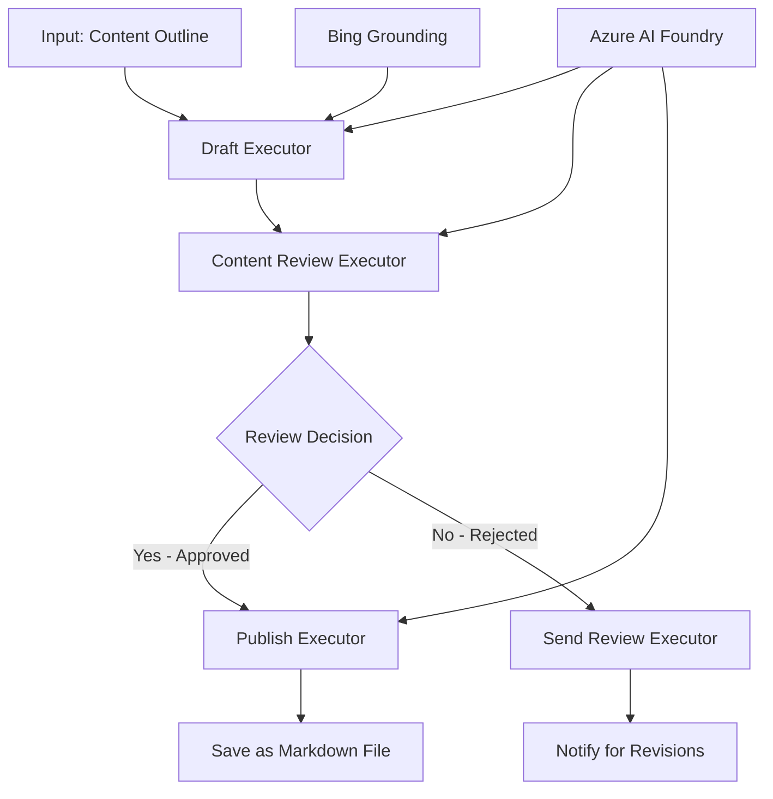

<!--
CO_OP_TRANSLATOR_METADATA:
{
  "original_hash": "8abd335151cee553293b637ee3d80d10",
  "translation_date": "2025-11-11T12:01:51+00:00",
  "source_file": "08-multi-agent/code_samples/workflows-agent-framework/dotNET/04.dotnet-agent-framework-workflow-aifoundry-condition.md",
  "language_code": "ru"
}
-->
# 🔀 Условные рабочие процессы с Azure AI Foundry (.NET)

## 📋 Учебное пособие по интеллектуальным рабочим процессам на основе решений

Этот ноутбук демонстрирует **условные шаблоны рабочих процессов** с использованием Azure AI Foundry и Microsoft Agent Framework для .NET. Вы узнаете, как создавать сложные рабочие процессы, основанные на принятии решений, которые интеллектуально направляют обработку на основе анализа ИИ, бизнес-правил и динамических условий для автоматизации корпоративного уровня.

## 🎯 Цели обучения

### 🧠 **Архитектура интеллектуальных решений**
- **Реализация условной логики**: Создание сложных деревьев решений с множеством точек ветвления
- **Маршрутизация на основе ИИ**: Использование моделей Azure AI Foundry для принятия интеллектуальных решений о маршрутизации
- **Динамическая адаптация рабочих процессов**: Изменение поведения рабочих процессов на основе анализа и условий во время выполнения
- **Интеграция бизнес-правил**: Включение бизнес-логики и требований к соблюдению норм в рабочие процессы

### 🔀 **Продвинутые условные шаблоны**
- **Принятие решений на основе множества критериев**: Оценка множества факторов для принятия решений о маршрутизации
- **Контекстно-ориентированная обработка**: Принятие решений на основе накопленного контекста и истории рабочего процесса
- **Адаптивное изменение рабочих процессов**: Динамическая корректировка путей обработки на основе условий в реальном времени
- **Интеграция с движком правил**: Реализация сложных движков бизнес-правил в рабочих процессах

### 🏢 **Корпоративные приложения с условной логикой**
- **Классификация и маршрутизация документов**: Автоматическая классификация и маршрутизация документов в соответствующие рабочие процессы
- **Триаж клиентского обслуживания**: Интеллектуальная маршрутизация запросов клиентов в специализированные команды
- **Обработка соответствия и рисков**: Применение различных процессов проверки и анализа на основе оценки рисков
- **Рабочие процессы контроля качества**: Направление контента через соответствующие процессы проверки на основе метрик качества

## ⚙️ Предварительные требования и настройка

### 📦 **Необходимые пакеты NuGet**

Продвинутые пакеты для обработки условных рабочих процессов:

```xml
<!-- Core AI Framework -->
<PackageReference Include="Microsoft.Extensions.AI" Version="9.9.0" />

<!-- Azure AI Agents with Persistent State -->
<PackageReference Include="Azure.AI.Agents.Persistent" Version="1.2.0-beta.5" />

<!-- Azure Identity and Utilities -->
<PackageReference Include="Azure.Identity" Version="1.15.0" />
<PackageReference Include="System.Linq.Async" Version="6.0.3" />
<PackageReference Include="DotNetEnv" Version="3.1.1" />

<!-- Local Workflow Framework References -->
<!-- Microsoft.Agents.Workflows.dll - Advanced workflow orchestration -->
<!-- Microsoft.Agents.AI.AzureAI.dll - Azure AI Foundry integration -->
<!-- Microsoft.Agents.AI.dll - Core agent abstractions -->
```

### 🔑 **Конфигурация Azure AI Foundry**

**Необходимые ресурсы Azure:**
- Рабочая область Azure AI Foundry с моделями для условной обработки
- Подписка Azure с соответствующими квотами вычислений и разрешениями
- Развернутые модели ИИ для принятия решений и анализа контента
- (Опционально) Подключение Bing Search API для возможностей поиска

**Конфигурация среды (.env файл):**
```env
# Azure AI Foundry Configuration
AZURE_AI_PROJECT_ENDPOINT=https://your-project.cognitiveservices.azure.com/
BING_CONNECTION_ID=your-bing-connection-id
```

**Настройка аутентификации:**
```csharp
// Azure CLI or Managed Identity authentication
using Azure.Identity;
var credential = new AzureCliCredential();

// Load environment configuration
DotNetEnv.Env.Load("../../../.env");
```

### 🏗️ **Архитектура условного рабочего процесса**



**Ключевые компоненты:**
- **Draft Executor**: Агент ИИ, создающий первоначальные черновики контента из набросков
- **Content Review Executor**: Агент ИИ, оценивающий качество и соответствие черновика
- **Условная маршрутизация**: Логика принятия решений, направляющая на основе результатов проверки
- **Пути публикации/проверки**: Отдельные пути обработки для утвержденного и отклоненного контента
- **Управление состоянием**: Поддерживает контекст контента и проверки на протяжении всего рабочего процесса

## 🎨 **Шаблоны проектирования условных рабочих процессов**

### 📋 **Производство контента с контрольными точками качества**
```
Outline → Draft Creation → Quality Review → {Approve: Publish | Reject: Revise}
```

### 🎯 **Обработка документов на основе рисков**
```
Document → Risk Assessment → {Low: Standard | High: Enhanced Review}
```

### 🔍 **Интеллектуальная маршрутизация клиентского обслуживания**
```
Customer Query → Analysis → {Simple: FAQ Bot | Complex: Human Agent}
```

### 💼 **Рабочие процессы, ориентированные на соблюдение норм**
```
Content → Compliance Check → {Pass: Publish | Fail: Legal Review}
```

## 🏢 **Преимущества корпоративных условных рабочих процессов**

### 🎯 **Интеллектуальная автоматизация**
- **Умное принятие решений**: Решения о маршрутизации на основе анализа контента и контекста с помощью ИИ
- **Адаптивная обработка**: Рабочие процессы, которые автоматически корректируются в зависимости от изменяющихся условий
- **Применение бизнес-правил**: Автоматическое применение сложной бизнес-логики и политик
- **Контекстно-ориентированная маршрутизация**: Решения на основе полной истории рабочего процесса и накопленного контекста

### 📈 **Операционная эффективность**
- **Оптимизация распределения ресурсов**: Направление работы к наиболее подходящим специалистам и процессам
- **Снижение ручного вмешательства**: Автоматизация принятия решений минимизирует необходимость ручной маршрутизации
- **Ускорение времени разрешения**: Прямая маршрутизация к соответствующим экспертам и возможностям обработки
- **Единообразное применение**: Унифицированное применение бизнес-правил и критериев принятия решений

### 🛡️ **Управление рисками и соблюдение норм**
- **Автоматическая оценка рисков**: Оценка уровня риска контента и ситуации с помощью ИИ
- **Применение норм**: Автоматическая маршрутизация через необходимые регуляторные процессы
- **Применение протоколов безопасности**: Усиленные меры безопасности, применяемые на основе оценки рисков
- **Поддержание аудиторского следа**: Полная документация решений о маршрутизации и их обоснования

### 📊 **Аналитика и постоянное улучшение**
- **Аналитика решений**: Отслеживание эффективности и точности решений о маршрутизации
- **Распознавание шаблонов**: Выявление тенденций и шаблонов в решениях о маршрутизации со временем
- **Оптимизация производительности**: Постоянное улучшение критериев принятия решений и эффективности маршрутизации
- **Бизнес-аналитика**: Информация о характеристиках контента и требованиях к обработке

### 🔧 **Техническое совершенство**
- **Управление сложным состоянием**: Поддержание сложного состояния на протяжении выполнения рабочего процесса
- **Масштабируемая архитектура**: Обработка высоких объемов условной обработки
- **Возможности интеграции**: Бесшовная интеграция с существующими бизнес-системами и процессами
- **Мониторинг и наблюдаемость**: Комплексное отслеживание производительности рабочих процессов и решений

Давайте создадим интеллектуальные, основанные на решениях корпоративные рабочие процессы с .NET! 🚀

## 💻 Запуск кода

Полная реализация доступна в `04.dotnet-agent-framework-workflow-aifoundry-condition.cs`. Она демонстрирует **рабочий процесс производства контента с контрольными точками качества**:

### 🏗️ **Архитектура рабочего процесса**

```
Content Outline → Draft Creation → Quality Review → Conditional Routing:
                                                      ├─ Approved (>200 words) → Publish
                                                      └─ Rejected (<200 words) → Review Notification
```

**Агенты в рабочем процессе:**
1. **Evangelist Agent**: Создает черновики учебных пособий из набросков с использованием Bing
2. **Content Reviewer Agent**: Оценивает качество черновика (количество слов, полнота)
3. **Publisher Agent**: Сохраняет утвержденный контент в виде Markdown-файлов с отметкой времени

**Пользовательские исполнители:**
1. **DraftExecutor**: Организует создание черновиков
2. **ContentReviewExecutor**: Проводит оценку качества
3. **PublishExecutor**: Обрабатывает публикацию утвержденного контента
4. **SendReviewExecutor**: Управляет уведомлениями об отклоненном контенте

### 🚀 Запуск примера

**Предварительные требования:**
- Настроенная рабочая область Azure AI Foundry
- Аутентификация через Azure CLI (`az login`)
- (Опционально) Подключение Bing Search для поиска

```bash
# Make the script executable (Unix/Linux/macOS)
chmod +x 04.dotnet-agent-framework-workflow-aifoundry-condition.cs

# Run the conditional workflow
./04.dotnet-agent-framework-workflow-aifoundry-condition.cs
```

Или на Windows:
```powershell
dotnet run 04.dotnet-agent-framework-workflow-aifoundry-condition.cs
```

### 📝 Ожидаемый результат

Рабочий процесс выполнит:
1. **Создание агентов**: Инициализация трех специализированных агентов Azure AI Foundry
2. **Создание черновика**: Агент Evangelist создает черновик учебного пособия из наброска
3. **Проверка контента**: Content Reviewer оценивает качество черновика
4. **Условная маршрутизация**:
   - **Если утвержден (>200 слов)**: Publish Executor сохраняет как Markdown-файл
   - **Если отклонен (<200 слов)**: Send Review Executor отправляет уведомление
5. **Отображение результатов**: Показать итоговый результат рабочего процесса

### 🔧 Варианты настройки

**Изменение критериев проверки:**
```csharp
const string ContentReviewerInstructions = @"
You are a content reviewer...
1. Check if content is more than 500 words (instead of 200)
2. Verify technical accuracy
3. Ensure proper formatting
...";
```

**Добавление дополнительных условных путей:**
```csharp
var workflow = new WorkflowBuilder(draftExecutor)
    .AddEdge(draftExecutor, contentReviewerExecutor)
    .AddEdge(contentReviewerExecutor, publishExecutor, condition: GetCondition("Excellent"))
    .AddEdge(contentReviewerExecutor, editExecutor, condition: GetCondition("Good"))
    .AddEdge(contentReviewerExecutor, sendReviewerExecutor, condition: GetCondition("Poor"))
    .Build();
```

**Изменение требований к контенту:**
```csharp
string OUTLINE_Content = @"
# Your Custom Topic
## Section 1
https://your-reference-url
## Section 2
...
";
```

### 🎯 Применение в реальном мире

Этот шаблон условного рабочего процесса идеально подходит для:
- **Систем управления контентом**: Автоматизированные редакционные рабочие процессы с контрольными точками качества
- **Обработка документов**: Маршрутизация документов на основе классификации и соответствия нормам
- **Поддержка клиентов**: Интеллектуальная маршрутизация заявок на основе сложности и срочности
- **Юридическая проверка**: Маршрутизация контрактов на основе оценки рисков и стоимости
- **HR-процессы**: Маршрутизация заявлений через соответствующие процессы отбора

### 🔍 Понимание условной логики

**Функция условия:**
```csharp
public Func<object?, bool> GetCondition(string expectedResult) =>
    reviewResult => reviewResult is ReviewResult review && review.Result == expectedResult;
```

Эта функция создает предикат, который:
1. Проверяет, является ли результат типом `ReviewResult`
2. Сравнивает свойство `Result` с ожидаемым значением
3. Возвращает true/false для определения маршрутизации

**Ребра рабочего процесса с условиями:**
```csharp
.AddEdge(contentReviewerExecutor, publishExecutor, condition: GetCondition("Yes"))
.AddEdge(contentReviewerExecutor, sendReviewerExecutor, condition: GetCondition("No"))
```

### 📊 Продвинутые функции

**Проверка схемы JSON:**
Рабочий процесс использует схемы JSON для обеспечения структурированных ответов:

```csharp
// Define response structure
public class ReviewResult
{
    [JsonPropertyName("review_result")]
    public string Result { get; set; } = string.Empty;
    
    [JsonPropertyName("reason")]
    public string Reason { get; set; } = string.Empty;
    
    [JsonPropertyName("draft_content")]
    public string DraftContent { get; set; } = string.Empty;
}

// Apply to agent
ResponseFormat = ChatResponseFormat.ForJsonSchema(
    AIJsonUtilities.CreateJsonSchema(typeof(ReviewResult)), 
    "ReviewResult", 
    "Review Result From DraftContent"
)
```

**Интеграция Bing Grounding:**
Агент Evangelist использует Bing для доступа к актуальной информации:

```csharp
var bingGroundingConfig = new BingGroundingSearchConfiguration(bing_conn_id);
BingGroundingToolDefinition bingGroundingTool = new(
    new BingGroundingSearchToolParameters([bingGroundingConfig])
);
```

Это позволяет агенту следовать URL-адресам в наброске и извлекать текущую информацию.

### 🛡️ Обработка ошибок

Рабочий процесс включает надежную обработку ошибок для отклоненного контента:
- Ошибки проверки запускают альтернативный путь
- Уведомления предоставляют четкие причины отклонения
- Контент сохраняется для доработки

### 🔄 Расширение рабочего процесса

**Добавление цикла доработки:**
Создайте цикл обратной связи, который автоматически перерабатывает контент:

```csharp
.AddEdge(contentReviewerExecutor, publishExecutor, condition: GetCondition("Yes"))
.AddEdge(contentReviewerExecutor, draftExecutor, condition: GetCondition("No")) // Loop back
```

**Реализация многоуровневой проверки:**
Добавьте несколько этапов проверки с различными критериями:

```csharp
.AddEdge(draftExecutor, technicalReviewer)
.AddEdge(technicalReviewer, editorialReviewer, condition: GetCondition("TechPass"))
.AddEdge(editorialReviewer, publishExecutor, condition: GetCondition("EditPass"))
```

Этот шаблон условного рабочего процесса предоставляет основу для создания сложных, интеллектуальных систем автоматизации корпоративного уровня! 🚀

---

<!-- CO-OP TRANSLATOR DISCLAIMER START -->
**Отказ от ответственности**:  
Этот документ был переведен с использованием сервиса автоматического перевода [Co-op Translator](https://github.com/Azure/co-op-translator). Несмотря на наши усилия обеспечить точность, автоматические переводы могут содержать ошибки или неточности. Оригинальный документ на его родном языке следует считать авторитетным источником. Для получения критически важной информации рекомендуется профессиональный перевод человеком. Мы не несем ответственности за любые недоразумения или неправильные интерпретации, возникающие в результате использования данного перевода.
<!-- CO-OP TRANSLATOR DISCLAIMER END -->