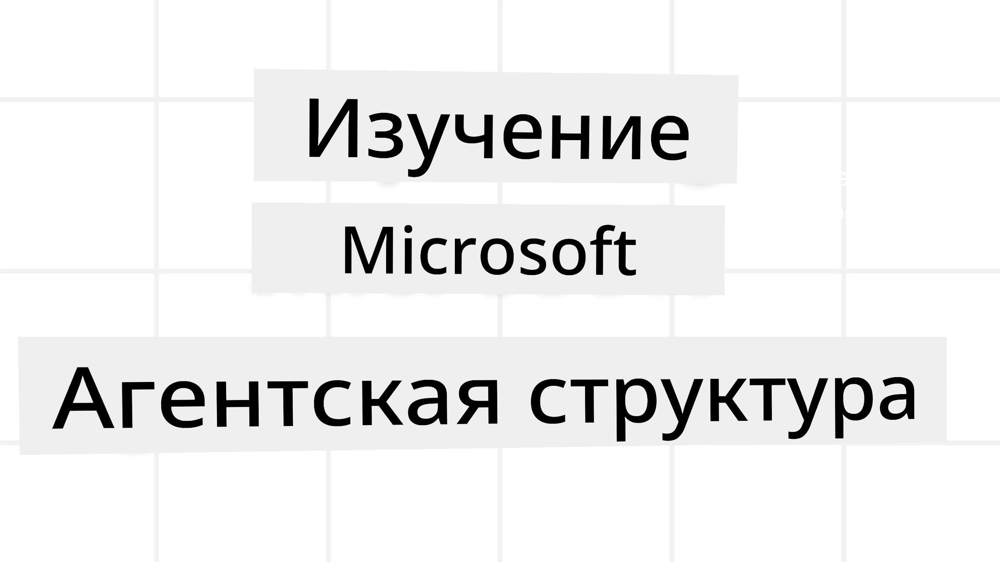
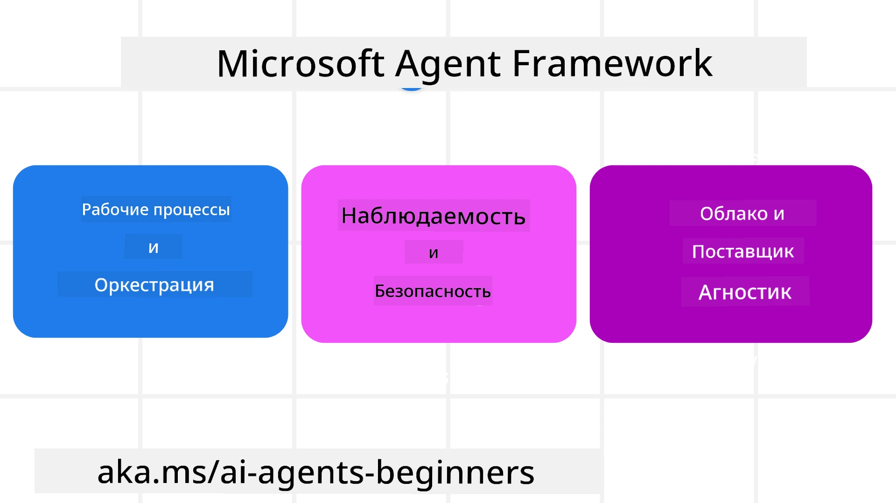
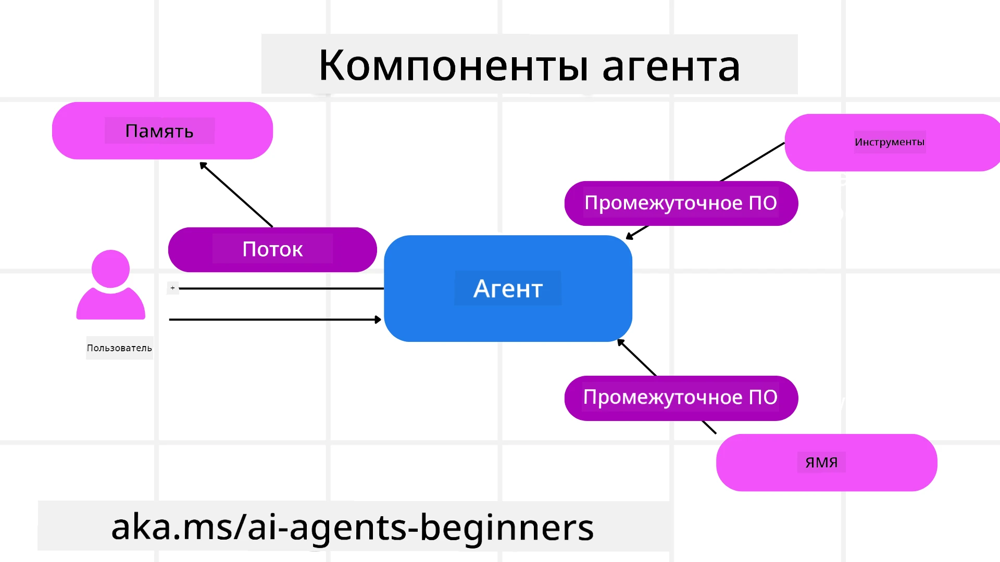

<!--
CO_OP_TRANSLATOR_METADATA:
{
  "original_hash": "19c4dab375acbc733855cc7f2f04edbc",
  "translation_date": "2025-10-02T14:03:35+00:00",
  "source_file": "14-microsoft-agent-framework/README.md",
  "language_code": "ru"
}
-->
# Изучение Microsoft Agent Framework



### Введение

В этом уроке мы рассмотрим:

- Понимание Microsoft Agent Framework: ключевые особенности и ценность  
- Изучение основных концепций Microsoft Agent Framework
- Сравнение MAF с Semantic Kernel и AutoGen: руководство по миграции

## Цели обучения

После завершения урока вы сможете:

- Создавать готовых к производству AI-агентов с использованием Microsoft Agent Framework
- Применять основные функции Microsoft Agent Framework к вашим агентным сценариям
- Мигрировать и интегрировать существующие агентные фреймворки и инструменты  

## Примеры кода 

Примеры кода для [Microsoft Agent Framework (MAF)](https://aka.ms/ai-agents-beginners/agent-framewrok) можно найти в этом репозитории в файлах `xx-python-agent-framework` и `xx-dotnet-agent-framework`.

## Понимание Microsoft Agent Framework



[Microsoft Agent Framework (MAF)](https://aka.ms/ai-agents-beginners/agent-framewrok) основан на опыте и знаниях, полученных от Semantic Kernel и AutoGen. Он предлагает гибкость для решения широкого спектра агентных сценариев, встречающихся как в производственных, так и в исследовательских средах, включая:

- **Последовательная оркестрация агентов** в сценариях, где требуется пошаговый рабочий процесс.
- **Параллельная оркестрация** в сценариях, где агенты должны выполнять задачи одновременно.
- **Оркестрация группового чата** в сценариях, где агенты могут совместно работать над одной задачей.
- **Оркестрация передачи** в сценариях, где агенты передают задачу друг другу по мере выполнения подзадач.
- **Магнитная оркестрация** в сценариях, где управляющий агент создает и изменяет список задач и координирует выполнение подзадач.

Для внедрения AI-агентов в производство MAF также включает функции:

- **Наблюдаемость** с использованием OpenTelemetry, где каждое действие AI-агента, включая вызов инструментов, шаги оркестрации, потоки рассуждений и мониторинг производительности, отображается через панели Azure AI Foundry.
- **Безопасность** благодаря размещению агентов непосредственно на Azure AI Foundry, что включает такие меры безопасности, как управление доступом на основе ролей, обработка конфиденциальных данных и встроенная защита контента.
- **Устойчивость** благодаря возможности паузы, возобновления и восстановления потоков агентов и рабочих процессов, что позволяет выполнять длительные процессы.
- **Контроль** благодаря поддержке рабочих процессов с участием человека, где задачи помечаются как требующие одобрения человека.

Microsoft Agent Framework также ориентирован на совместимость:

- **Независимость от облака** - Агенты могут работать в контейнерах, локально и в различных облачных средах.
- **Независимость от провайдера** - Агенты могут быть созданы через предпочитаемый SDK, включая Azure OpenAI и OpenAI.
- **Интеграция открытых стандартов** - Агенты могут использовать протоколы, такие как Agent-to-Agent (A2A) и Model Context Protocol (MCP), для обнаружения и использования других агентов и инструментов.
- **Плагины и коннекторы** - Возможность подключения к сервисам данных и памяти, таким как Microsoft Fabric, SharePoint, Pinecone и Qdrant.

Давайте рассмотрим, как эти функции применяются к основным концепциям Microsoft Agent Framework.

## Основные концепции Microsoft Agent Framework

### Агенты



**Создание агентов**

Создание агента осуществляется путем определения сервиса вывода (провайдера LLM), набора инструкций для выполнения AI-агентом и присвоения имени `name`:

```python
agent = AzureOpenAIChatClient(credential=AzureCliCredential()).create_agent( instructions="You are good at recommending trips to customers based on their preferences.", name="TripRecommender" )
```

В приведенном выше примере используется `Azure OpenAI`, но агенты могут быть созданы с использованием различных сервисов, включая `Azure AI Foundry Agent Service`:

```python
AzureAIAgentClient(async_credential=credential).create_agent( name="HelperAgent", instructions="You are a helpful assistant." ) as agent
```

API OpenAI `Responses`, `ChatCompletion`

```python
agent = OpenAIResponsesClient().create_agent( name="WeatherBot", instructions="You are a helpful weather assistant.", )
```

```python
agent = OpenAIChatClient().create_agent( name="HelpfulAssistant", instructions="You are a helpful assistant.", )
```

или удаленные агенты с использованием протокола A2A:

```python
agent = A2AAgent( name=agent_card.name, description=agent_card.description, agent_card=agent_card, url="https://your-a2a-agent-host" )
```

**Запуск агентов**

Агенты запускаются с помощью методов `.run` или `.run_stream` для получения либо нестриминговых, либо стриминговых ответов.

```python
result = await agent.run("What are good places to visit in Amsterdam?")
print(result.text)
```

```python
async for update in agent.run_stream("What are the good places to visit in Amsterdam?"):
    if update.text:
        print(update.text, end="", flush=True)

```

Каждый запуск агента также может быть настроен с помощью параметров, таких как `max_tokens`, используемые агентом, `tools`, которые агент может вызывать, и даже `model`, используемая агентом.

Это полезно в случаях, когда для выполнения задачи пользователя требуются определенные модели или инструменты.

**Инструменты**

Инструменты могут быть определены как при создании агента:

```python
def get_attractions( location: Annotated[str, Field(description="The location to get the top tourist attractions for")], ) -> str: """Get the top tourist attractions for a given location.""" return f"The top attractions for {location} are." 


# When creating a ChatAgent directly 

agent = ChatAgent( chat_client=OpenAIChatClient(), instructions="You are a helpful assistant", tools=[get_attractions]

```

так и при запуске агента:

```python

result1 = await agent.run( "What's the best place to visit in Seattle?", tools=[get_attractions] # Tool provided for this run only )
```

**Потоки агентов**

Потоки агентов используются для обработки многократных разговоров. Потоки могут быть созданы либо с помощью:

- Использования `get_new_thread()`, что позволяет сохранять поток со временем.
- Автоматического создания потока при запуске агента, при этом поток существует только во время текущего запуска.

Для создания потока код выглядит следующим образом:

```python
# Create a new thread. 
thread = agent.get_new_thread() # Run the agent with the thread. 
response = await agent.run("Hello, I am here to help you book travel. Where would you like to go?", thread=thread)

```

Затем вы можете сериализовать поток для его сохранения и использования позже:

```python
# Create a new thread. 
thread = agent.get_new_thread() 

# Run the agent with the thread. 

response = await agent.run("Hello, how are you?", thread=thread) 

# Serialize the thread for storage. 

serialized_thread = await thread.serialize() 

# Deserialize the thread state after loading from storage. 

resumed_thread = await agent.deserialize_thread(serialized_thread)
```

**Промежуточное ПО для агентов**

Агенты взаимодействуют с инструментами и LLM для выполнения задач пользователя. В определенных сценариях мы хотим выполнить или отслеживать действия между этими взаимодействиями. Промежуточное ПО для агентов позволяет нам это делать через:

*Function Middleware*

Это промежуточное ПО позволяет выполнять действие между агентом и функцией/инструментом, который он будет вызывать. Примером использования может быть логирование вызова функции.

В приведенном ниже коде `next` определяет, следует ли вызывать следующее промежуточное ПО или саму функцию.

```python
async def logging_function_middleware(
    context: FunctionInvocationContext,
    next: Callable[[FunctionInvocationContext], Awaitable[None]],
) -> None:
    """Function middleware that logs function execution."""
    # Pre-processing: Log before function execution
    print(f"[Function] Calling {context.function.name}")

    # Continue to next middleware or function execution
    await next(context)

    # Post-processing: Log after function execution
    print(f"[Function] {context.function.name} completed")
```

*Chat Middleware*

Это промежуточное ПО позволяет выполнять или логировать действие между агентом и запросами между LLM.

Оно содержит важную информацию, такую как `messages`, отправляемые в AI-сервис.

```python
async def logging_chat_middleware(
    context: ChatContext,
    next: Callable[[ChatContext], Awaitable[None]],
) -> None:
    """Chat middleware that logs AI interactions."""
    # Pre-processing: Log before AI call
    print(f"[Chat] Sending {len(context.messages)} messages to AI")

    # Continue to next middleware or AI service
    await next(context)

    # Post-processing: Log after AI response
    print("[Chat] AI response received")

```

**Память агента**

Как было рассмотрено в уроке `Agentic Memory`, память является важным элементом, позволяющим агенту работать в различных контекстах. MAF предлагает несколько различных типов памяти:

*Хранение в памяти*

Это память, хранящаяся в потоках во время выполнения приложения.

```python
# Create a new thread. 
thread = agent.get_new_thread() # Run the agent with the thread. 
response = await agent.run("Hello, I am here to help you book travel. Where would you like to go?", thread=thread)
```

*Сохранение сообщений*

Эта память используется для хранения истории разговоров между различными сессиями. Она определяется с использованием `chat_message_store_factory`:

```python
from agent_framework import ChatMessageStore

# Create a custom message store
def create_message_store():
    return ChatMessageStore()

agent = ChatAgent(
    chat_client=OpenAIChatClient(),
    instructions="You are a Travel assistant.",
    chat_message_store_factory=create_message_store
)

```

*Динамическая память*

Эта память добавляется в контекст перед запуском агентов. Эти данные могут быть сохранены во внешних сервисах, таких как mem0:

```python
from agent_framework.mem0 import Mem0Provider

# Using Mem0 for advanced memory capabilities
memory_provider = Mem0Provider(
    api_key="your-mem0-api-key",
    user_id="user_123",
    application_id="my_app"
)

agent = ChatAgent(
    chat_client=OpenAIChatClient(),
    instructions="You are a helpful assistant with memory.",
    context_providers=memory_provider
)

```

**Наблюдаемость агента**

Наблюдаемость важна для создания надежных и поддерживаемых агентных систем. MAF интегрируется с OpenTelemetry для предоставления трассировки и метрик для улучшенной наблюдаемости.

```python
from agent_framework.observability import get_tracer, get_meter

tracer = get_tracer()
meter = get_meter()
with tracer.start_as_current_span("my_custom_span"):
    # do something
    pass
counter = meter.create_counter("my_custom_counter")
counter.add(1, {"key": "value"})
```

### Рабочие процессы

MAF предлагает рабочие процессы, которые представляют собой заранее определенные шаги для выполнения задачи и включают AI-агентов как компоненты этих шагов.

Рабочие процессы состоят из различных компонентов, которые позволяют лучше управлять потоком данных. Рабочие процессы также поддерживают **оркестрацию нескольких агентов** и **контрольные точки** для сохранения состояния рабочего процесса.

Основные компоненты рабочего процесса:

**Исполнители**

Исполнители получают входные сообщения, выполняют назначенные задачи и затем создают выходное сообщение. Это продвигает рабочий процесс к выполнению более крупной задачи. Исполнители могут быть как AI-агентами, так и пользовательской логикой.

**Ребра**

Ребра используются для определения потока сообщений в рабочем процессе. Они могут быть:

*Прямые ребра* - Простые соединения один-к-одному между исполнителями:

```python
from agent_framework import WorkflowBuilder

builder = WorkflowBuilder()
builder.add_edge(source_executor, target_executor)
builder.set_start_executor(source_executor)
workflow = builder.build()
```

*Условные ребра* - Активируются после выполнения определенного условия. Например, когда номера в отелях недоступны, исполнитель может предложить другие варианты.

*Ребра switch-case* - Направляют сообщения к различным исполнителям на основе определенных условий. Например, если у клиента есть приоритетный доступ, его задачи будут обработаны через другой рабочий процесс.

*Ребра fan-out* - Отправляют одно сообщение нескольким целям.

*Ребра fan-in* - Собирают несколько сообщений от разных исполнителей и отправляют одной цели.

**События**

Для улучшения наблюдаемости рабочих процессов MAF предлагает встроенные события выполнения, включая:

- `WorkflowStartedEvent`  - Начало выполнения рабочего процесса
- `WorkflowOutputEvent` - Рабочий процесс создает выходные данные
- `WorkflowErrorEvent` - Рабочий процесс сталкивается с ошибкой
- `ExecutorInvokeEvent`  - Исполнитель начинает обработку
- `ExecutorCompleteEvent`  - Исполнитель завершает обработку
- `RequestInfoEvent` - Запрос выполнен

## Миграция с других фреймворков (Semantic Kernel и AutoGen)

### Отличия между MAF и Semantic Kernel

**Упрощенное создание агентов**

Semantic Kernel требует создания экземпляра Kernel для каждого агента. MAF использует упрощенный подход с использованием расширений для основных провайдеров.

```python
agent = AzureOpenAIChatClient(credential=AzureCliCredential()).create_agent( instructions="You are good at reccomending trips to customers based on their preferences.", name="TripRecommender" )
```

**Создание потоков агентов**

Semantic Kernel требует ручного создания потоков. В MAF агенту напрямую назначается поток.

```python
thread = agent.get_new_thread() # Run the agent with the thread. 
```

**Регистрация инструментов**

В Semantic Kernel инструменты регистрируются в Kernel, который затем передается агенту. В MAF инструменты регистрируются непосредственно при создании агента.

```python
agent = ChatAgent( chat_client=OpenAIChatClient(), instructions="You are a helpful assistant", tools=[get_attractions]
```

### Отличия между MAF и AutoGen

**Команды vs Рабочие процессы**

`Команды` представляют собой структуру событий для событийной активности с агентами в AutoGen. MAF использует `Рабочие процессы`, которые направляют данные к исполнителям через архитектуру графов.

**Создание инструментов**

AutoGen использует `FunctionTool` для обертки функций, которые агенты могут вызывать. MAF использует @ai_function, который работает аналогично, но также автоматически определяет схемы для каждой функции.

**Поведение агентов**

Агенты по умолчанию являются одноразовыми в AutoGen, если `max_tool_iterations` не установлен на более высокое значение. В MAF `ChatAgent` является многоразовым по умолчанию, что означает, что он будет продолжать вызывать инструменты до тех пор, пока задача пользователя не будет выполнена.

## Примеры кода 

Примеры кода для Microsoft Agent Framework можно найти в этом репозитории в файлах `xx-python-agent-framework` и `xx-dotnet-agent-framework`.

## Остались вопросы о Microsoft Agent Framework?

Присоединяйтесь к [Azure AI Foundry Discord](https://aka.ms/ai-agents/discord), чтобы встретиться с другими учащимися, посетить офисные часы и получить ответы на ваши вопросы о AI-агентах.

---

**Отказ от ответственности**:  
Этот документ был переведен с помощью сервиса автоматического перевода [Co-op Translator](https://github.com/Azure/co-op-translator). Несмотря на наши усилия обеспечить точность, автоматические переводы могут содержать ошибки или неточности. Оригинальный документ на его родном языке следует считать авторитетным источником. Для получения критически важной информации рекомендуется профессиональный перевод человеком. Мы не несем ответственности за любые недоразумения или неправильные интерпретации, возникшие в результате использования данного перевода.